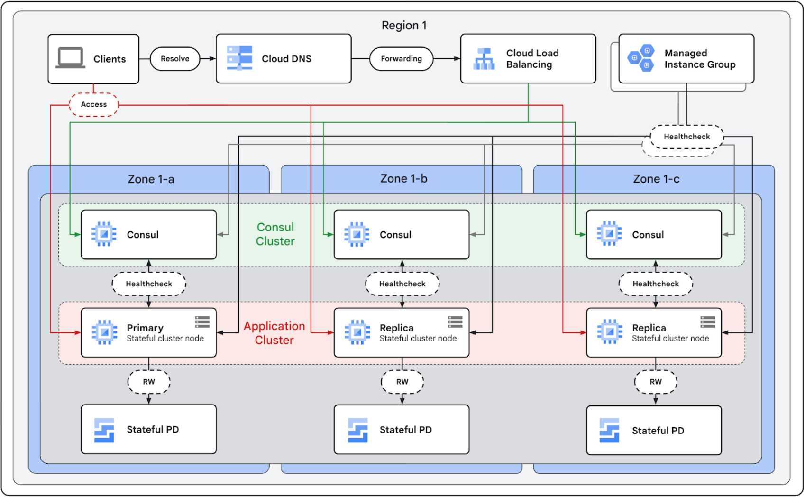

# Deploy high availability Redis clusters on Compute Engine

This example is to deploy high availability Redis clusters on Compute engine. It assumes that you're familiar with the reference architecture in High availability stateful clusters on Compute Engine.

## Architecture
There are several patterns for configuring Redis for high availability (HA). Redis Sentinel and Redis Cluster are the most common. This design focuses only on Redis Cluster. For Redis Sentinel use cases it is recommended to use Memorystore for Redis. If you need zone awareness in cluster management for better operability or other capabilities like auto-tiering, consider Memorystore for Redis Cluster or Redis Enterprise by Redis Inc.



- At minimum, 1 set of 3 nodes consisting of a master node and its replicas is deployed to ensure high availability. If multiple sets representing shards are deployed, each master in sets should reside in distinct zones. This provides resilience against single VM failures and zonal failures.
- Each Redis cluster node exposes 2 ports: tcp/6379 for normal Redis data access, and tcp/16379 for cluster bus (gossip).
- Redis configuration files and RDB/AOF are stored in the persistent disks attached to the cluster nodes.
- A Consul agent on each node keeps the service definition registered in the Consul cluster up-to-date.
- A MIG will make sure the cluster is self-healing and easy to scale-out.
- A spread placement policy increases availability because VMs in the same zone will be spread out from each other to reduce the impact of host system failures. 

## Before you begin
You perform most of the steps for this deployment in Cloud Shell.

1. In the Google Cloud console, activate Cloud Shell.
At the bottom of the Google Cloud console, a Cloud Shell session starts and displays a command-line prompt. Cloud Shell is a shell environment with the Google Cloud CLI already installed and with values already set for your current project. It can take a few seconds for the session to initialize.

2. In Cloud Shell, check the amount of free space that you have:

```
df -h
```

3. Change the working directory to the ${HOME} directory:

```
cd "${HOME}"
```

4. Clone the Git repository, which contains the scripts and the manifest files to deploy and configure the example workload:

```
git clone https://github.com/GoogleCloudPlatform/XXX
```

5. Authenticate with Application Default Credentials (ADC):

```
gcloud auth application-default login
```


## Deployment steps

### Build Consul image

1. Change directory

```
cd consul
```

2. Enable APIs required for Packer build

```
gcloud services enable sourcerepo.googleapis.com compute.googleapis.com servicemanagement.googleapis.com storage-api.googleapis.com cloudbuild.googleapis.com artifactregistry.googleapis.com
```

3. Set up IAM permissions

```
PROJECT="your-project-id"

CLOUD_BUILD_ACCOUNT=$(gcloud projects get-iam-policy $PROJECT --filter="(bindings.role:roles/cloudbuild.builds.builder)"  --flatten="bindings[].members" --format="value(bindings.members[])")

gcloud projects add-iam-policy-binding $PROJECT \
  --member $CLOUD_BUILD_ACCOUNT \
  --role roles/compute.instanceAdmin.v1

gcloud projects add-iam-policy-binding $PROJECT \
  --member $CLOUD_BUILD_ACCOUNT \
  --role roles/iam.serviceAccountUser
```

4. Create a Packer builder image

```
PROJECT="your-project-id"
REGION="us-central1"

git clone https://github.com/GoogleCloudPlatform/cloud-builders-community.git

gcloud builds submit --region=$REGION --config=cloud-builders-community/packer/cloudbuild.yaml --project $PROJECT cloud-builders-community/packer
```

5. Create a Consul image using Packer and deploy the cluster

```
PROJECT="your-project-id"
REGION="us-central1"

gcloud builds submit --region=$REGION --config=consul/cloudbuild.yaml --substitutions=_PROJECT="$PROJECT" --project $PROJECT consul
```

6. Deploy Consul cluster
Update `consul-cluster/terraform.tfvars` with your project ID, region, and consul source image you've created above. To check the image name, run:

```
gcloud compute images list --project $PROJECT --filter="(family:consul)" --format="value(name)"
```

To deploy a consul cluster, run:

```
cd consul-cluster
terraform init
terraform plan
terraform apply
```

### Redis Cluster

1. Change directory to root.

```
cd ../..
```

2. Deploy load balancer, DNS forwarding and Redis cluster
Create terraform.tfvars referring to the template file and run:

```
terraform init
terraform planr
terraform apply 
```

### Verify the setup

1. Create a VM in the same VPC network and SSH into it.

```
PROJECT="your-project-id"
ZONE="us-central1-a"
gcloud compute create instance instance-1 --zone ${ZONE} --project ${PROJECT}
gcloud compute ssh instance-1 --zone ${ZONE} --project ${PROJECT}
```

2. Install dig utility

```
apt-get install dnsutils
```


3. Verify the setup by executing the below command and expect similar output.

```
dig service1-redis-master.service.asia-south1.consul
; <<>> DIG 9.16.48-Debin <<>> service1-redis-master.service.us-central1.consul
;; global options: +cmd
;; Got answer:
;; ->>HEADER<<- opcode: QUERY, status: NOERROR, id: 41136
;; flags: qr rd ra; QUERY: 1, ANSWER: 3, AUTHORITY: 0, ADDITIONAL: 1

;; OPT PSEUDOSECTION:
; ENDS: version: 0, flags:; udp: 512
;; QUESTIONS SECTION:
; service1-redis-master.service.us-central1.consul. IN A

;; ANSWER SECTION:
service-redis-master.service.us-central1.consul. 0 IN A 10.160.0.37
service-redis-master.service.us-central1.consul. 0 IN A 10.160.0.36
service-redis-master.service.us-central1.consul. 0 IN A 10.160.0.38

;; Query time: 8 msec
;; SERVER: 169.254.169.254#53(169.254.169.254)
;; WHEN: Mon Apr 15 08:56:56 UTC 2024
;; MSG SIZE rcvd: 125
```

```
dig service1-redis-slave.service.asia-south1.consul
; <<>> DIG 9.16.48-Debin <<>> service1-redis-slave.service.us-central1.consul
;; global options: +cmd
;; Got answer:
;; ->>HEADER<<- opcode: QUERY, status: NOERROR, id: 41136
;; flags: qr rd ra; QUERY: 1, ANSWER: 3, AUTHORITY: 0, ADDITIONAL: 1

;; OPT PSEUDOSECTION:
; ENDS: version: 0, flags:; udp: 512
;; QUESTIONS SECTION:
; service1-redis-slave.service.us-central1.consul. IN A

;; ANSWER SECTION:
service-redis-slave.service.us-central1.consul. 0 IN A 10.160.0.39
service-redis-slave.service.us-central1.consul. 0 IN A 10.160.0.41
service-redis-slave.service.us-central1.consul. 0 IN A 10.160.0.40

;; Query time: 12 msec
;; SERVER: 169.254.169.254#53(169.254.169.254)
;; WHEN: Mon Apr 15 08:58:11 UTC 2024
;; MSG SIZE rcvd: 124

```

## Clean up

Run the terraform destroy command to clean up.
