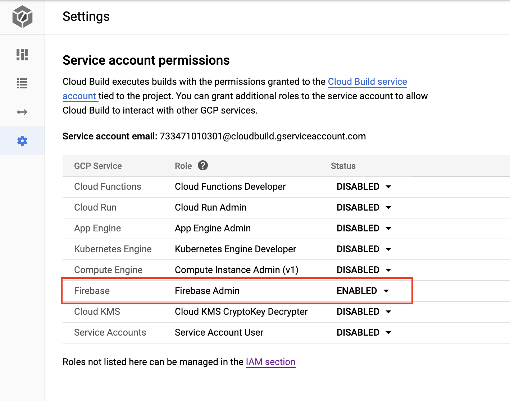

# firebase

## Official "Deploying to Firebase" Docs

This build step invokes `firebase` commands that can be used in [Google Cloud Build](https://cloud.google.com/cloud-build/).

You can find the official Google Cloud guide for this build processor [here](https://cloud.google.com/cloud-build/docs/deploying-builds/deploy-firebase).

Arguments passed to this builder will be passed to `firebase` directly,
allowing callers to run [any firebase
command](https://firebase.google.com/docs/cli/#command_reference).

## Usage

The Firebase CLI can be authenticated in Cloud Build by one of two methods:

1. **IAM Roles (preferred)** - grant Firebase IAM roles to the Cloud Build service account.
1. **Firebase CLI Token** - use a CI token to authorize the Firebase CLI to act as an admin user.

### With IAM roles

Ensure you have the following APIs enabled

1. [Cloud Resource Manager API](https://console.developers.google.com/apis/api/cloudresourcemanager.googleapis.com)
2. [Firebase Management API](https://console.developers.google.com/apis/api/firebase.googleapis.com)

**Add permission to the cloudbuilder**

- Open Cloud Build service account settings
- Give the Cloud Build service account the **Firebase Admin** role:




### With Token

Ensure you have the following APIs enabled

1. [Cloud Resource Manager API](https://console.developers.google.com/apis/api/cloudresourcemanager.googleapis.com)
2. [Firebase Management API](https://console.developers.google.com/apis/api/firebase.googleapis.com)
3. [Firebase Hosting API](https://console.developers.google.com/apis/api/firebasehosting.googleapis.com)
4. [Cloud Key Management Service (KMS) API](https://console.cloud.google.com/security/kms) (Click "setup" or "enable API")

**Get the firebase token**

This command will generate a new CI token that will be encrypted by the KMS to be used within the CLI

```
firebase login:ci
```
This will print your token on screen after login. Once done use the below command to set it to $TOKEN variable, which is used by the commands below to encrypt it.

```
TOKEN=<GENERATED_TOKEN>
```

**Create the secret on GCP**

This step will encrypt the token via KMS. Remember to replace `GENERATED_TOKEN` in the text

```bash
#### create a keyring for cloudbuilder-related keys
gcloud kms keyrings create cloudbuilder --location global

#### create a key for the firebase token
gcloud kms keys create firebase-token --location global --keyring cloudbuilder --purpose encryption

#### create the encrypted token
echo -n $TOKEN | gcloud kms encrypt \
  --plaintext-file=- \
  --ciphertext-file=- \
  --location=global \
  --keyring=cloudbuilder \
  --key=firebase-token | base64
```

**Use the encrypted key**

The encrypted key (output from previous command) can now simply be used within the cloudbuilder configuration file like so:

> Note that you need to specify `[PROJECT_ID]` directly instead of using `$PROJECT_ID` within secrets

```yaml
secrets:
- kmsKeyName: 'projects/[PROJECT_ID]/locations/global/keyRings/cloudbuilder/cryptoKeys/firebase-token'
  secretEnv:
    FIREBASE_TOKEN: '<YOUR_ENCRYPTED_TOKEN>'
```

## Examples

See examples in the `examples` subdirectory.
