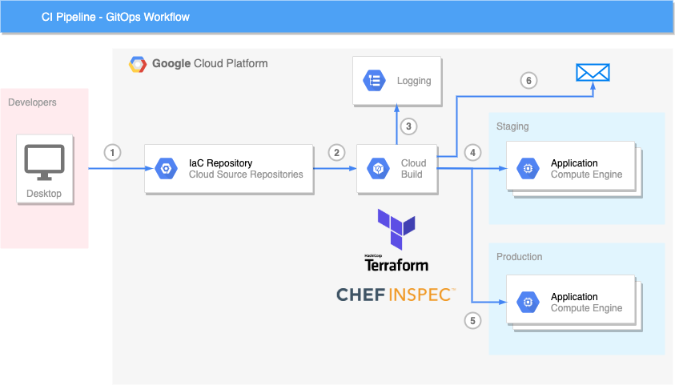

# Security-Policy-As-Code

This repository contains the security-policy-as-code framework in GCP. A Terraform reference architecture
is deployed as part of an automated CI pipeline and validated against [PCI-DSS](https://github.com/GoogleCloudPlatform/inspec-gcp-pci-profile)
and [CIS](https://github.com/GoogleCloudPlatform/inspec-gcp-cis-benchmark) compliance benchmarks for GCP.
The developer workflow (diagram below) consists of the following steps:

1. A developer commits code into a central repository (e.g. hosted on Cloud Source Repositories)
2. Each commit to a specified branch (e.g. master) triggers the execution of a CI pipeline on Cloud Build
3. Standard output of Cloud Build is logged into Stackdriver Logging
4. The Terraform configurations are depoloyed inside a staging project with the help of Kitchen-Terraform. In addition, 
CIS and PCI-DSS compliance checks are validated against the deployed infrastructure. 
5. In case of no compliance violation in the previous step, the infrastructure is deployed in the target project 
(e.g. Production)
6. In case of compliance violations in step 4. or 5., an eMail notification is sent to a list of users (email notifications are only enabled if you specifically carry out the optional steps detailed below.)



## Table of Contents
* [Prerequisites](#prerequisites)
* [Getting Started](#getting-started)
* [Environment Setup](#environment-setup)
* [Workstation Configuration](#workstation-configuration)
* [Reference Architecture](#reference-architecture)
* [Attributes](#attributes)
* [Cloud Build Trigger](#cloud-build-trigger)
* [Troubleshooting](#troubleshooting)

# Prerequisites

### Installation Dependencies
- [Terraform](https://www.terraform.io/downloads.html)
- [gcloud](https://cloud.google.com/sdk/gcloud/)

# Getting started:
To get started with the content, copy the root folder security-policy-as-code into a new location outside of the professional-services repository,
since the code will be committed into ins own designated repository and should be regarded as a separate code base.

In a terminal, navigate to the directory security-policy-as-code.

Create a new git repository:
```
$ git init
$ git add .
$ git commit -m 'Initial commit'
```

# Environment Setup

Create two GCP projects (one for running integration tests and the other one for hosting
the target infrastructure) and enable Billing for each one.

Examples used here are: `YOUR_MAIN_PROJECT` for the target infrastructure and `YOUR_STAGING_PROJECT` for the integration tests.

Set environment variables for your projects in the shell:

```
$ export YOUR_MAIN_PROJECT=<replace with main project ID>
$ export YOUR_STAGING_PROJECT=<replace with staging project ID>
```

Configure gcloud to use that main project:
```
$ gcloud auth login
$ gcloud config set project $YOUR_MAIN_PROJECT
```

Enable the Cloud Source Repositories API in your project
```
$ gcloud services enable sourcerepo.googleapis.com
```

In the project YOUR_MAIN_PROJECT, create a new Cloud Source Repository called security-policy-as-code 
```
$ gcloud beta source repos create security-policy-as-code
```
Initialize the Cloud Source Repository credential helper (if not already done in the previous steps):
```
$ git config --global credential.https://source.developers.google.com.helper gcloud.sh
```
Add the remote repository and push:
```
$ git remote add google https://source.developers.google.com/p/$YOUR_MAIN_PROJECT/r/security-policy-as-code
$ git push --all google
```

The projects need to be prepared for the content to run. The script `env_setup.sh` in the root directory of the project
can be used to prepare the environment. Before you run the script consider the following optional steps:

## Optional steps: eMail notifcations

If you would like to implement eMail notifcations for non-compliant builds as part of this pipeline, you can configure that here. These email notifications alert specified recipients of compliance failures with a detailed InSpec security report.
If you do not take any action here, eMail notifications will not be setup. The CI/CD pipeline at large will not be affected. Feel free to skip these steps.

1. Create a free Mailgun account using the Mailgun documentation here: https://documentation.mailgun.com/en/latest/quickstart.html
2. Update the config.json placeholder values in `env_setup.sh` with the Mailgun API keys, Mailgun domain, Mailgun to/from, and the bucket where you will store Mailgun configuration data. This should be the same bucket you are using for Terraform admin.
3. Navigate to `terraform/components/in-scope/main.tf` and "uncomment" out the call of the notifcations Terraform module at the bottom of the file (detailed comments are in this file with directions)

#### END OF OPTIONAL STEPS

Run the setup script
```
$ sh env_setup.sh
```


# Workstation Configuration

Before starting the demo creation, create a file called `workstation.env`. Optionally, fill in values to match your environment. This project comes with a `workstation.env.example` file you can copy to get
started.

YOUR_MAIN_PROJECT should already be set as an environment variable from the first step.

You can find the values for `YOUR_ORG_ID` and `YOUR_BILLING_ACCOUNT_ID` using the following commands:
```
gcloud organizations list
gcloud beta billing accounts list
```
To create a folder follow these [instructions](https://cloud.google.com/resource-manager/docs/creating-managing-folders).


Remember to always `source` this file before executing any of the steps in this demo!

```
source workstation.env
```


# Reference Architecture
Now we will build a GCP reference architecture using Terraform. This includes a VPC, Subnet, Firewall Rules, GCE Instances in a two-node Managed Instance Group behind a Load Balancer, and a GKE Cluster with a sample application deployed and exposed behind a separate Load Balancer.

1. Create the Shared VPC, Subnets, Alias Ranges, Firewall Rules, Cloud Router, Cloud NAT, and custom Firewall IAM Role:
```
$ cd terraform/projects/network_vpc_setup
$ cp backend.tf.example backend.tf
$ terraform init -backend-config="bucket=$TF_ADMIN_BUCKET"
$ terraform validate
$ terraform plan
$ terraform apply -auto-approve
$ cd ../..
```
2. Create the KMS keyring, Global IP, GKE Cluster and Node Pool, GCE Instance Group, Load Balancer, Firewall Rules, Custom Log metrics and log sinks, InSpec Report GCS Bucket, and InSpec Notification Cloud Function (if configuring eMail notifications).
```
$ cd components/in-scope
$ cp backend.tf.example backend.tf
$ terraform init -backend-config="bucket=$TF_ADMIN_BUCKET"
$ terraform validate
$ terraform plan
$ terraform apply -auto-approve
$ cd ../../..
```
# Attributes 

1. To setup attributes for InSpec, copy `test/attributes/attrs.yml.example` to `test/attributes/$YOUR_MAIN_PROJECT-attrs.yml` and edit the variables as needed.  Typically, this is the gcp_project_id, gcp_gke_locations, gce_zones, and the *_list variables:
```
gcp_project_id: "REPLACE WITH MAIN PROJECT ID"
gcp_gke_locations:
  - "us-central1"
  - "us-central1-a"
gce_zones:
  - "us-central1-a"
  - "us-central1-b"
  - "us-central1-c"
  - "us-central1-d"
  - "us-central1-e"
  - "us-central1-f"
sa_key_older_than_seconds: 7776000
kms_rotation_period_seconds: 31536000
bucket_logging_ignore_regex: "-logging"
fw_change_control_id_regex: 'CID:'
fw_override_control_id_regex: 'CID:'
cai_inventory_bucket_name: ""
cai_inventory_file_path: ""
gcs_pii_buckets:
  - ""
kms_admins_list:
  - "serviceAccount:terraform@"REPLACE WITH MAIN PROJECT ID".iam.gserviceaccount.com"
kms_encrypters_list:
  - ""
kms_decrypters_list:
  - ""
kms_encrypterdecrypters_list:
  - ""
kms_regions_list:
  - "global"
gcs_logging_buckets:
  - ""
logging_viewer_list:
  - ""
logging_admin_list:
  - "serviceAccount:terraform@"REPLACE WITH MAIN PROJECT ID".iam.gserviceaccount.com"
project_owners_list:
  - "user:myuser@mydomain.com"
cloudsql_admins_list:
  - ""
cloudsql_clients_list:
  - ""
memorystore_admins_list:
  - ""
bq_admins_list:
  - ""
spanner_admins_list:
  - ""
```

2. Copy `test/attributes/attrs.yml.example` to `test/attributes/$YOUR_STAGING_PROJECT-attrs.yml` and edit the variables as needed.  Typically, this is the gcp_project_id, gcp_gke_locations, gce_zones, and the *_list variables
```
gcp_project_id: "REPLACE WITH STAGING PROJECT ID"
gcp_gke_locations:
  - "us-central1"
  - "us-central1-a"
gce_zones:
  - "us-central1-a"
  - "us-central1-b"
  - "us-central1-c"
  - "us-central1-d"
  - "us-central1-e"
  - "us-central1-f"
sa_key_older_than_seconds: 7776000
kms_rotation_period_seconds: 31536000
bucket_logging_ignore_regex: "-logging"
fw_change_control_id_regex: 'CID:'
fw_override_control_id_regex: 'CID:'
cai_inventory_bucket_name: ""
cai_inventory_file_path: ""
gcs_pii_buckets:
  - ""
kms_admins_list:
  - "serviceAccount:terraform@$"REPLACE WITH MAIN PROJECT ID".iam.gserviceaccount.com"
kms_encrypters_list:
  - ""
kms_decrypters_list:
  - ""
kms_encrypterdecrypters_list:
  - ""
kms_regions_list:
  - "us-central1"
gcs_logging_buckets:
  - ""
logging_viewer_list:
  - ""
logging_admin_list:
  - "serviceAccount:terraform@"REPLACE WITH MAIN PROJECT ID".iam.gserviceaccount.com"
project_owners_list:
  - "user:myuser@mydomain.com"
cloudsql_admins_list:
  - ""
cloudsql_clients_list:
  - ""
memorystore_admins_list:
  - ""
bq_admins_list:
  - ""
spanner_admins_list:
  - ""
```
```
cd ../..
```

# Cloud Build Trigger

Create a Cloud Build trigger to automatically start a build upon new commits to the Cloud Source Repository. Be sure tu update values to be specific to your project and bucket names:
```
gcloud beta builds triggers create cloud-source-repositories \
--repo=security-policy-as-code --description 'Push to ^master$ branch' \
--branch-pattern='^master$' --build-config=cicd/cloudbuild.yaml \
--substitutions _ALWAYS_REPORT=true,_ENABLE_HELLOWORLD=true,_ENABLE_HIPSTERSTORE=true,\
_INSCOPE_PROJECT_ID=$YOUR_MAIN_PROJECT,_INSCOPE_SA_EMAIL=project-service-account@$YOUR_MAIN_PROJECT.iam.gserviceaccount.com,\
_INTEGRATION_TEST_PROJECT=$YOUR_STAGING_PROJECT,_IS_SHARED_VPC_HOST=false,\
_KEY_NAME=terraform-cicd,_KEYRING=cicd,\
_NETWORK_PROJECT_ID=$YOUR_MAIN_PROJECT,_PCI_PROFILE_GCR_PROJECT=$YOUR_MAIN_PROJECT,\
_PROJECT_PREFIX="",_REPORT_BUCKET=$YOUR_MAIN_PROJECT-terraform-admin,\
_RUN_APPLY=true,_SECRETS_BUCKET=$YOUR_MAIN_PROJECT-terraform-admin,\
_TERRAFORM_ADMIN_BUCKET=$YOUR_MAIN_PROJECT-terraform-admin
```
Then run the following to save changes:
```
$ git add .
$ git commit -m 'First test'
$ git push --all google
```
Navigate to https://console.cloud.google.com/cloud-build?project=YOUR_MAIN_PROJECT and monitor the output.


# Troubleshooting

### KMS Quota Issues

When running your Chef InSpec tests, you may come across error messages regarding KMS API read request quotas being hit. This will manifest as a failed control due to a 'Control Source Code Error' in the InSpec output. There are additional steps you can take to address this error if you face it.

1. Request a KMS API Quota increase directly in the Quota section of the Cloud Console
2. Add sleeps inside the inspec profile control loops to space out the KMS API request calls. 5 seconds between each call may be sufficient, but it might need to be higher if timing requires it.
3. Disable KMS controls in the staging project scan, but leave them on for the main project scan

# Contributors

* Brad Geesaman (bgeesaman)
* Chris Proto (chroto)
* Josh Davis (jdav-goog)
* Konrad Schieban (KonradSchieban)