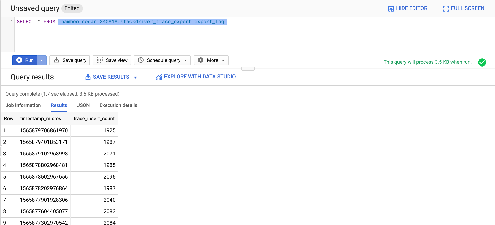
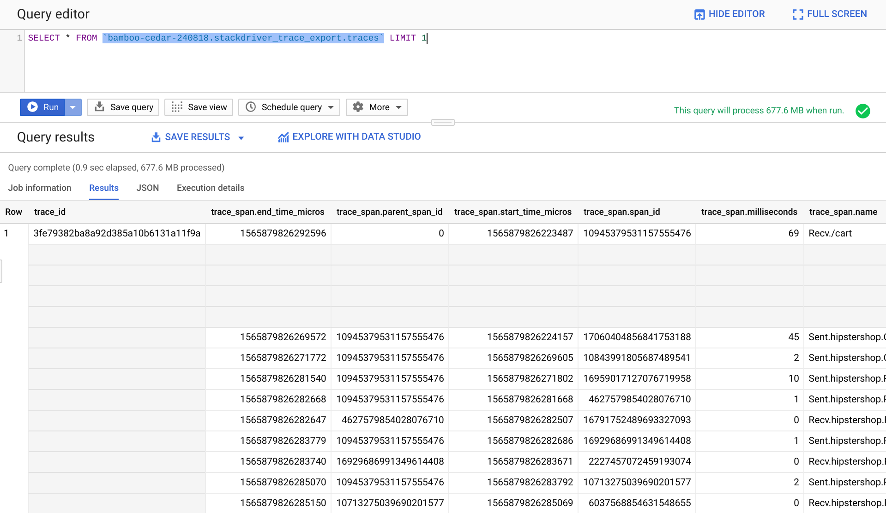

# Exporting Stackdriver Traces to BigQuery
  
This example illustrates how to use a Cloud Function to copy Trace data from Stackdriver Trace to BigQuery for
further analysis and retention.

## Getting Started

These instructions will walk you through setting up your environment to do the
following:

* Create the required destination dataset/table in BigQuery.
* Create the Pub/Sub Topic used to trigger the Cloud Function.
* Deploy a Cloud Function to export the data.
* Utilize Cloud Scheduler to trigger the Cloud Function.

### Prerequisites

Ensure that you have the [Google Cloud SDK](https://cloud.google.com/sdk/install) installed and authenticated to the project you want
to deploy the example to.

### Enable Required APIs

The Cloud Functions, Pub/Sub, Cloud Scheduler, Stackdriver Trace, and BigQuery APIs will all need to be enabled for this example to work properly.

```
gcloud services enable \
  cloudfunctions \
  pubsub \
  cloudtrace \
  bigquery-json.googleapis.com \
  cloudscheduler.googleapis.com 
```

### Clone the Repo

Clone the professional services repo.
```
git clone https://github.com/GoogleCloudPlatform/professional-services.git
```

Navigate to the example code location
```
cd professional-services/examples/stackdriver-trace-bq-exporter
```

### BigQuery

Create the BigQuery dataset and tables that will be used to store the traces.

```
bq mk -d --data_location=US stackdriver_trace_export
bq mk -t --time_partitioning_type=DAY \
  stackdriver_trace_export.traces ./schema/traces_table.json
```

An additional table is needed to store the ingestion logs. This table is required as it is used to keep track of the
last read timestamp used by the cloud function to filter subsequent trace api calls.

```
bq mk -t --time_partitioning_type=DAY \
  stackdriver_trace_export.export_log ./schema/log_table.json
```

### Pub/Sub

Pub/Sub will be used by Cloud Scheduler to call the Cloud Function on a set interval.

Define the Pub/Sub topic and subscription names
```
export EXPORT_TOPIC_NAME=stackdriver-trace-exporter
```

Create the Pub/Sub topic
```
gcloud pubsub topics create $EXPORT_TOPIC_NAME
```


### Cloud Function

Cloud Functions will be used to fetch trace data from the Stackdriver Trace API and write that data to BigQuery.


Deploy the Cloud Function.
```
gcloud functions deploy stackdriver-trace-exporter \
  --runtime python37 \
  --trigger-topic $EXPORT_TOPIC_NAME \
  --entry-point load_trace_data \
  --source cloud_function/.
```

Wait a few minutes for the Cloud Function to deploy.


### Cloud Scheduler

Create the Cloud Scheduler entry to trigger the Cloud Function. The schedule argument can be adjusted to change the frequency.

By default, the example trigger payload does not include any filter parameters. This means that all traces will be exported to BigQuery. If you would like to filter what traces get exported, you can modify the filter value using the syntax listed in the [filter documentation](https://cloud.google.com/trace/docs/trace-filters).
```
gcloud scheduler jobs create pubsub stackdriver-trace-export-trigger \
  --schedule="*/5 * * * *" \
  --topic=$EXPORT_TOPIC_NAME \
  --message-body-from-file=trigger_payload.json
```

### Verify Data Load

The default Cloud Scheduler cron is every 5 minutes. The first run will load 0 traces as it will use the current timestamp as the filter for the minimum start_time for the trace fetch. Assuming traces are being written to Stackdriver Trace, the next run should load data into the BigQuery table.

To verify the run was success, you can look at the export_log table
```
SELECT * FROM `{PROJECT_ID}.stackdriver_trace_export.export_log`

```



Once you see data populating in BigQuery, you can begin querying trace data in the traces table.
```
SELECT * FROM `{PROJECT_ID}.stackdriver_trace_export.traces`

```
