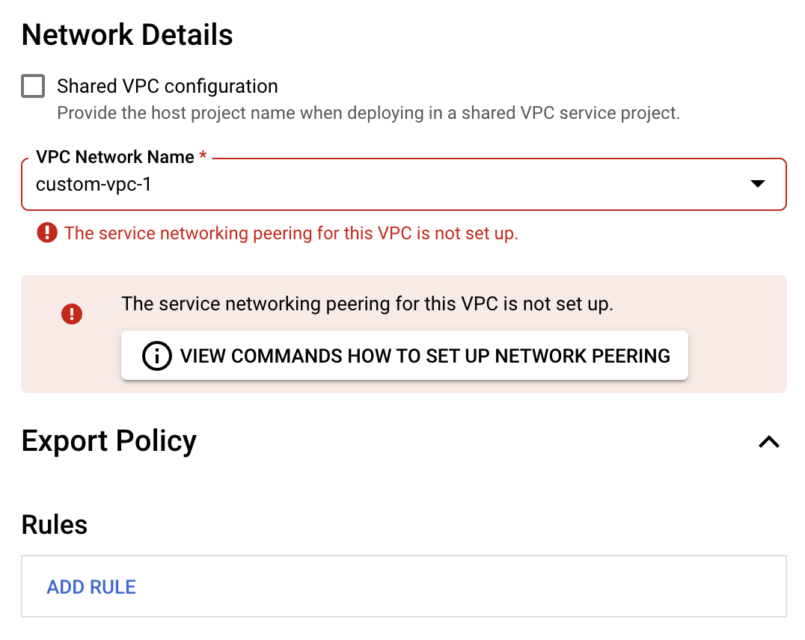

# NetApp Cloud Volumes Service (CVS) Terraform Example
This example shows how to deploy NetApp CVS volumes using terraform (i.e. without using any external modules).
This code also enables replication between volumes if *replication* variable is set as *true*.

## Prerequisites
1. You must have a recent version of Terraform installed (1.1.6+).
1. A working GCP project with billing enabled and the below APIs enabled:
    1. NetApp Cloud Volumes API
    1. Service Management API
    1. Service Networking API
    1. Service Usage API
    1. Compute Engine API
1. Make sure you have followed this Quickstart before using this Terraform example <https://cloud.google.com/architecture/partners/netapp-cloud-volumes/quickstart>. This will make sure that all the below prerequisites are met.
    1. Enable Peering between NetApp and your GCP project. The steps to do this are mentioned in below section.

## Enable Network Peering
Run the below commands to establish Network Peering between your project and NetApp Project. You will also get a prompt to run these commands manually when you try to create a volume from the Qwikstart.

```
export PROJECT_ID=<PROJECT_ID>
```
```
export NETWORK=<VPC_NETWORK_NAME>
```
```
gcloud --project=$PROJECT_ID compute addresses create \
      netapp-addresses-custom-vpc-1 \
      --global \
      --purpose=VPC_PEERING \
      --prefix-length=24 \
      --network=$NETWORK \
      --no-user-output-enabled
```
```
gcloud --project=$PROJECT services vpc-peerings connect \
    --service=cloudvolumesgcp-api-network.netapp.com \
    --ranges=netapp-addresses-custom-vpc-1 \
    --network=$NETWORK \
    --no-user-output-enabled
```
```
gcloud --project=$PROJECT compute networks peerings update netapp-cv-nw-customer-peer \
    --network=$NETWORK \
    --import-custom-routes \
    --export-custom-routes
```

## Deploy
Before you deploy, make sure that you modify the below parameters in  provider.tf
1. bucket - bucket name which stores the terraform state
1. project - project number in which you want to deploy the volumes
```
terraform init
```
```
terraform plan
```
```
terraform apply
```


<!-- BEGIN TFDOC -->
## Variables

| name | description | type | required | default |
|---|---|:---: |:---:|:---:|
| project_id | Project where resources will be created | <code title="">string</code> | ✓ |  |
| allowed_clients | CIDR ranges that can access the NFS volume | <code title="">string</code> | ✓ |  |
| *region* | Default region for resources | <code title="">string</code> |  | <code title="">us-west2</code> |
| *service_level* | The performance level for your workloads | <code title="">string</code> |  | <code title="">premium</code> |
| network_name | Default VPC Network name | <code title="">string</code> | ✓ |  |

<!-- END TFDOC -->