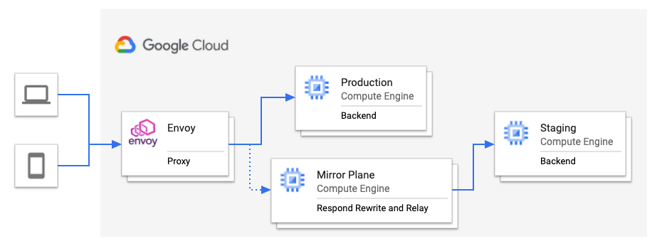

Mirrorplane: Respond, process and relay
---------------------------------------


Transparently mirroring real-time production traffic to a staging environment with minimal impact to the production environment allows for several use cases such as:

- Load, performance and regression testing of new architectures or potentially disruptive features.
- Hot-warm disaster recovery scenarios.
- Intrussion detection and prevention systems such as deep packet inspection using near-realtime traffic.
- Application performance monitoring and troubleshooting.
- Compliance/Auditing as well as network forensics.

A robust traffic mirroring framework should consider two key components:

- Traffic forwarding component: The incoming traffic to the production servers should be forwarded to a secondary environment with minimal impact on the performance and stability of the production environment
- Traffic re-writing component: Some use cases such as functional testing will encounter issues due to statefull disparities between the two environments, eg. when an ID is created as part of a response.

This repository describes a L7 framework consisting of:

- A fire-and-forget capable mirroring proxy (in this case Envoy).
- A response-and-relay layer that decouples the production and staging environments. This is important to avoid coupling between a buggy/slow staging environment and the production environment.
- A business-dependent traffic-rewriting component that provides translation rules for incoming traffic to match the mirrored environment.

In practice, one can combine the two last components into a single component termed here 'MirrorPlane'. The resulting architecture is:




Here, two separate implementations of such MirrorPlane are provided (Python and Golang).

Quick start
------------

To provide a usage example, a docker-compose file is provided. You can execute

```
> docker-compose up
```

This will spin up a mirroring proxy (envoy), a sample backend, the mirrorplane and a sample staging environment


MirrorPlane overview
--------------------

The MirrorPlane is the receiving end of a mirror proxy. Its main goal is to
take the incoming request from the mirror proxy and relay it to the mirror (staging)
backend without blocking. In this way, the mirrorplane can apply custom
business logic to the incoming requests while at the same time relieving
pressure on the production machines.

```
PROXY   MIRRORPLANE   STAGING
     >>>                      # MirrorProxy forwards a request to the mirrorplane
     <<<                      # MirrorPlane immediately responds 200, OK
        @@@@@@@@@@@           # MirrorPlane applies (potentially costly) transformation logic
                   >>>        # MirrorPlane relays the transformed request to the backend
                      @@@@@@@ # MirrorBackend processes the transformed request
        @@@@@@@@@@@<<<        # MirrorPlane captures the MirrorBackend response for further processing
```


The default configuration of mirrorplane is to respond "200,OK" to the incoming
request, and then relay it to the backend. However, you can use it to add
custom processing of the incoming request, for example adding custom headers or
serializing the request and responses.

The capability of applying custom logic to the request and responses allows for several use cases, for example:

- apply translations to the incoming request to match a different topology in the mirror environment (eg, url re-writing).
- apply mappings to the incoming request to match custom IDs from the production environment to the mirror environment.
- serialize annotated level 7 traffic for future processing, performance testing or forensic analysis.

In `mirrorplane` the custom logic is introduced by modifying the `pre` and `post` methods. These methods are called during the relaying of the request and handling of teh response from the mirror backend.

The `pre` callback allows to modify the incoming request. For example, to inject a header (using the golang version), one could do:

```
func pre(r *http.Request) {
	log.Printf("incoming request: %+v", r)

	r.Header.Add("injected-header", "I injected this header!")
	r.URL.Scheme = "http"
	r.URL.Host = backend.Host

	log.Printf("transformed request: %+v", r)
}
```

similarly, the `post` callback allows to inspec the response from the mirror backend. For example, to log the response to `stdout`, one could use:

```
func post(r *http.Response) {
	log.Printf("mirror backend response: %+v", r)
}

```
