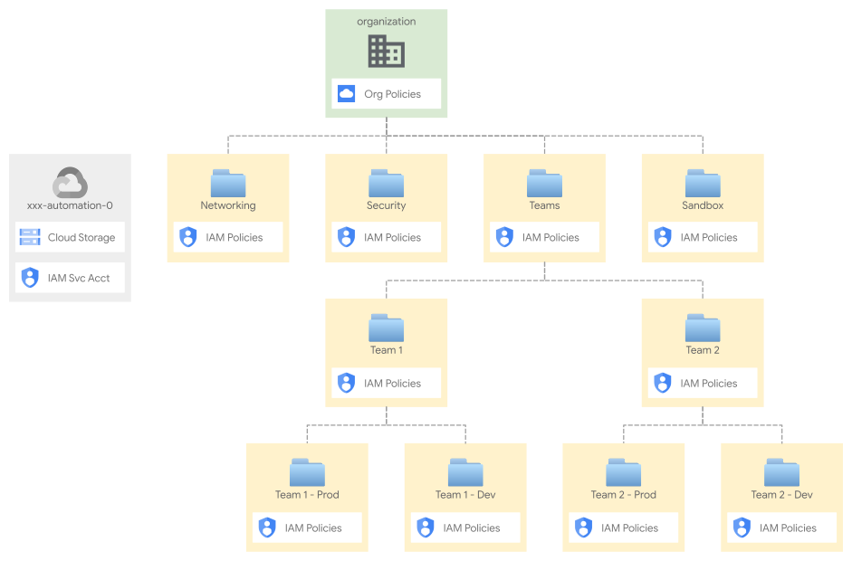

# Resource hierarchy

This stage performs two important tasks:

- create the top-level hierarchy of folders, and the associated resources used later on to automate each part of the hierarchy (eg. Networking)
- set organization policies on the organization, and any exception required on specific folders

The code is intentionally simple, as it's intended to provide a generic initial setup (Networking, Security, etc.), and then allow easy customizations to complete the implementation of the intended hierarchy design.

The following diagram is a high level reference of the resources created and managed here:

<p align="center">
  
</p>

## Design overview and choices

Despite its simplicity, this stage implements the basics of a design that we've seen working well for a variety of customers, where the hierarchy is laid out following two conceptually different approaches:

- core or shared resources are grouped in hierarchy branches that map to their type or purpose (e.g. Networking)
- team or application resources are grouped in lower level hierarchy branches that map to management or operational considerations (e.g. which team manages a set of applications, or owns a subset of company data, etc.)

This split approach usually represents well functional and operational patterns, where core resources are centrally managed by individual teams (e.g. networking, security, fleets of similar VMS, etc.), while teams need more granularity to access managed services used by the applications they maintain.

The approach also adapts to different high level requirements:

- it can be used either for single organizations containing multiple environments, or with multiple organizations dedicated to specific environments (e.g. prod/nonprod), as the environment split is implemented at the project or lower folder level
- it adapts to complex scenarios, with different countries or corporate entities using the same GCP organization, as core services are typically shared, and/or an extra layer on top can be used as a drop-in to implement the country/entity separation

Additionally, a few critical benefits are directly provided by this design:

- core services are clearly separated, with very few touchpoints where IAM and security policies need to be applied (typically their top-level folder)
- adding a new set of core services (e.g. shared GKE clusters) is a trivial operation that does not break the existing design
- grouping application resources and services using teams or business logic is a flexible approach, which maps well to typical operational or budget requirements
- automation stages (e.g. Networking) can be segregated in a simple and effective way, by creating the required service accounts and buckets for each stage here, and applying a handful of IAM roles to the relevant folder

For a discussion on naming, please refer to the [Bootstrap stage documentation](../00-bootstrap/README.md#naming), as the same approach is shared by all stages.

### Workload Identity Federation and CI/CD

This stage also implements optional support for CI/CD, much in the same way as the bootstrap stage. The only difference is on Workload Identity Federation, which is only configured in bootstrap and made available here via stage interface variables (the automatically generated `.tfvars` files).

For details on how to configure CI/CD please refer to the [relevant section in the bootstrap stage documentation](../00-bootstrap/README.md#cicd-repositories).

## How to run this stage

This stage is meant to be executed after the [bootstrap](../00-bootstrap) stage has run, as it leverages the automation service account and bucket created there. The relevant user groups must also exist, but that's one of the requirements for the previous stage too, so if you ran that successfully, you're good to go.

It's of course possible to run this stage in isolation, but that's outside the scope of this document, and you would need to refer to the code for the bootstrap stage for the actual roles needed.

Before running this stage, you need to make sure you have the correct credentials and permissions, and localize variables by assigning values that match your configuration.

### Providers configuration

The default way of making sure you have the right permissions, is to use the identity of the service account pre-created for this stage during bootstrap, and that you are a member of the group that can impersonate it via provider-level configuration (`gcp-devops` or `organization-admins`).

To simplify setup, the previous stage pre-configures a valid providers file in its output, and optionally writes it to a local file if the `outputs_location` variable is set to a valid path.

If you have set a valid value for `outputs_location` in the bootstrap stage (see the [bootstrap stage README](../00-bootstrap/#output-files-and-cross-stage-variables) for more details), simply link the relevant `providers.tf` file from this stage's folder in the path you specified:

```bash
# `outputs_location` is set to `~/fast-config`
ln -s ~/fast-config/providers/01-resman-providers.tf .
```

If you have not configured `outputs_location` in bootstrap, you can derive the providers file from that stage's outputs:

```bash
cd ../00-bootstrap
terraform output -json providers | jq -r '.["01-resman"]' \
  > ../01-resman/providers.tf
```

If you want to continue to rely on `outputs_location` logic, create a `terraform.tfvars` file and configure it as described [here](../00-bootstrap/#output-files-and-cross-stage-variables).

### Variable configuration

There are two broad sets of variables you will need to fill in:

- variables shared by other stages (org id, billing account id, etc.), or derived from a resource managed by a different stage (folder id, automation project id, etc.)
- variables specific to resources managed by this stage

To avoid the tedious job of filling in the first group of variable with values derived from other stages' outputs, the same mechanism used above for the provider configuration can be used to leverage pre-configured `.tfvars` files.

If you configured a valid path for `outputs_location` in the bootstrap stage, simply link the relevant `*.auto.tfvars.json` files from the outputs folder. For this stage, you need the `globals.auto.tfvars.json` file containing global values compiled manually for the bootstrap stage, and `00-bootstrap.auto.tfvars.json` containing values derived from resources managed by the bootstrap stage:

```bash
# `outputs_location` is set to `~/fast-config`
ln -s ~/fast-config/tfvars/globals.auto.tfvars.json .
ln -s ~/fast-config/tfvars/00-bootstrap.auto.tfvars.json .
```

A second set of variables is specific to this stage, they are all optional so if you need to customize them, create an extra `terraform.tfvars` file.

Refer to the [Variables](#variables) table at the bottom of this document, for a full list of variables, their origin (e.g. a stage or specific to this one), and descriptions explaining their meaning. The sections below also describe some of the possible customizations. For billing configurations, refer to the [Bootstrap documentation on billing](../00-bootstrap/README.md#billing-account) as the `billing_account` variable is identical across all stages.

Once done, you can run this stage:

```bash
terraform init
terraform apply
```

## Customizations

### Team folders

This stage provides a single built-in customization that offers a minimal (but usable) implementation of the "application" or "business" grouping for resources discussed above. The `team_folders` variable allows you to specify a map of team name and groups, that will result in folders, automation service accounts, and IAM policies applied.

Consider the following example in a `tfvars` file:

```hcl
team_folders = {
  team-a = {
    descriptive_name = "Team A"
    group_iam = {
      "team-a@gcp-pso-italy.net" = [
        "roles/viewer"
      ]
    }
    impersonation_groups = ["team-a-admins@gcp-pso-italy.net"]
  }
}
```

This will result in

- a "Team A" folder under the "Teams" folder
- one GCS bucket in the automation project
- one service account in the automation project with the correct IAM policies on the folder and bucket
- a IAM policy on the folder that assigns `roles/viewer` to the `team-a` group
- a IAM policy on the service account that allows `team-a` to impersonate it

This allows to centralize the minimum set of resources to delegate control of each team's folder to a pipeline, and/or to the team group. This can be used as a starting point for scenarios that implement more complex requirements (e.g. environment folders per team, etc.).

### Organization policies

Organization policies are laid out in an explicit manner in the `organization.tf` file, so it's fairly easy to add or remove specific policies.

For policies where additional data is needed, a root-level `organization_policy_configs` variable allows passing in specific data. Its built-in use to add additional organizations to the [Domain Restricted Sharing](https://cloud.google.com/resource-manager/docs/organization-policy/restricting-domains) policy, can be taken as an example on how to leverage it for additional customizations.

### IAM

IAM roles can be easily edited in the relevant `branch-xxx.tf` file, following the best practice outlined in the [bootstrap stage](../00-bootstrap#customizations) documentation of separating user-level and service-account level IAM policies in modules' `iam_groups`, `iam`, and `iam_additive` variables.

A full reference of IAM roles managed by this stage [is available here](./IAM.md).

### Additional folders

Due to its simplicity, this stage lends itself easily to customizations: adding a new top-level branch (e.g. for shared GKE clusters) is as easy as cloning one of the `branch-xxx.tf` files, and changing names.

<!-- TFDOC OPTS files:1 show_extra:1 -->
<!-- BEGIN TFDOC -->

## Files

| name | description | modules | resources |
|---|---|---|---|
| [billing.tf](./billing.tf) | Billing resources for external billing use cases. | <code>organization</code> | <code>google_billing_account_iam_member</code> |
| [branch-data-platform.tf](./branch-data-platform.tf) | Data Platform stages resources. | <code>folder</code> · <code>gcs</code> · <code>iam-service-account</code> |  |
| [branch-gke.tf](./branch-gke.tf) | GKE multitenant stage resources. | <code>folder</code> · <code>gcs</code> · <code>iam-service-account</code> |  |
| [branch-networking.tf](./branch-networking.tf) | Networking stage resources. | <code>folder</code> · <code>gcs</code> · <code>iam-service-account</code> |  |
| [branch-project-factory.tf](./branch-project-factory.tf) | Project factory stage resources. | <code>gcs</code> · <code>iam-service-account</code> |  |
| [branch-sandbox.tf](./branch-sandbox.tf) | Sandbox stage resources. | <code>folder</code> · <code>gcs</code> · <code>iam-service-account</code> |  |
| [branch-security.tf](./branch-security.tf) | Security stage resources. | <code>folder</code> · <code>gcs</code> · <code>iam-service-account</code> |  |
| [branch-teams.tf](./branch-teams.tf) | Team stage resources. | <code>folder</code> · <code>gcs</code> · <code>iam-service-account</code> |  |
| [cicd-data-platform.tf](./cicd-data-platform.tf) | CI/CD resources for the data platform branch. | <code>iam-service-account</code> · <code>source-repository</code> |  |
| [cicd-gke.tf](./cicd-gke.tf) | CI/CD resources for the data platform branch. | <code>iam-service-account</code> · <code>source-repository</code> |  |
| [cicd-networking.tf](./cicd-networking.tf) | CI/CD resources for the networking branch. | <code>iam-service-account</code> · <code>source-repository</code> |  |
| [cicd-project-factory.tf](./cicd-project-factory.tf) | CI/CD resources for the teams branch. | <code>iam-service-account</code> · <code>source-repository</code> |  |
| [cicd-security.tf](./cicd-security.tf) | CI/CD resources for the security branch. | <code>iam-service-account</code> · <code>source-repository</code> |  |
| [main.tf](./main.tf) | Module-level locals and resources. |  |  |
| [organization.tf](./organization.tf) | Organization policies. | <code>organization</code> | <code>google_organization_iam_member</code> |
| [outputs-files.tf](./outputs-files.tf) | Output files persistence to local filesystem. |  | <code>local_file</code> |
| [outputs-gcs.tf](./outputs-gcs.tf) | Output files persistence to automation GCS bucket. |  | <code>google_storage_bucket_object</code> |
| [outputs.tf](./outputs.tf) | Module outputs. |  |  |
| [variables.tf](./variables.tf) | Module variables. |  |  |

## Variables

| name | description | type | required | default | producer |
|---|---|:---:|:---:|:---:|:---:|
| [automation](variables.tf#L20) | Automation resources created by the bootstrap stage. | <code title="object&#40;&#123;&#10;  outputs_bucket          &#61; string&#10;  project_id              &#61; string&#10;  project_number          &#61; string&#10;  federated_identity_pool &#61; string&#10;  federated_identity_providers &#61; map&#40;object&#40;&#123;&#10;    issuer           &#61; string&#10;    issuer_uri       &#61; string&#10;    name             &#61; string&#10;    principal_tpl    &#61; string&#10;    principalset_tpl &#61; string&#10;  &#125;&#41;&#41;&#10;&#125;&#41;">object&#40;&#123;&#8230;&#125;&#41;</code> | ✓ |  | <code>00-bootstrap</code> |
| [billing_account](variables.tf#L38) | Billing account id and organization id ('nnnnnnnn' or null). | <code title="object&#40;&#123;&#10;  id              &#61; string&#10;  organization_id &#61; number&#10;&#125;&#41;">object&#40;&#123;&#8230;&#125;&#41;</code> | ✓ |  | <code>00-bootstrap</code> |
| [organization](variables.tf#L197) | Organization details. | <code title="object&#40;&#123;&#10;  domain      &#61; string&#10;  id          &#61; number&#10;  customer_id &#61; string&#10;&#125;&#41;">object&#40;&#123;&#8230;&#125;&#41;</code> | ✓ |  | <code>00-bootstrap</code> |
| [prefix](variables.tf#L221) | Prefix used for resources that need unique names. Use 9 characters or less. | <code>string</code> | ✓ |  | <code>00-bootstrap</code> |
| [cicd_repositories](variables.tf#L47) | CI/CD repository configuration. Identity providers reference keys in the `automation.federated_identity_providers` variable. Set to null to disable, or set individual repositories to null if not needed. | <code title="object&#40;&#123;&#10;  data_platform_dev &#61; object&#40;&#123;&#10;    branch            &#61; string&#10;    identity_provider &#61; string&#10;    name              &#61; string&#10;    type              &#61; string&#10;  &#125;&#41;&#10;  data_platform_prod &#61; object&#40;&#123;&#10;    branch            &#61; string&#10;    identity_provider &#61; string&#10;    name              &#61; string&#10;    type              &#61; string&#10;  &#125;&#41;&#10;  gke_dev &#61; object&#40;&#123;&#10;    branch            &#61; string&#10;    identity_provider &#61; string&#10;    name              &#61; string&#10;    type              &#61; string&#10;  &#125;&#41;&#10;  gke_prod &#61; object&#40;&#123;&#10;    branch            &#61; string&#10;    identity_provider &#61; string&#10;    name              &#61; string&#10;    type              &#61; string&#10;  &#125;&#41;&#10;  networking &#61; object&#40;&#123;&#10;    branch            &#61; string&#10;    identity_provider &#61; string&#10;    name              &#61; string&#10;    type              &#61; string&#10;  &#125;&#41;&#10;  project_factory_dev &#61; object&#40;&#123;&#10;    branch            &#61; string&#10;    identity_provider &#61; string&#10;    name              &#61; string&#10;    type              &#61; string&#10;  &#125;&#41;&#10;  project_factory_prod &#61; object&#40;&#123;&#10;    branch            &#61; string&#10;    identity_provider &#61; string&#10;    name              &#61; string&#10;    type              &#61; string&#10;  &#125;&#41;&#10;  security &#61; object&#40;&#123;&#10;    branch            &#61; string&#10;    identity_provider &#61; string&#10;    name              &#61; string&#10;    type              &#61; string&#10;  &#125;&#41;&#10;&#125;&#41;">object&#40;&#123;&#8230;&#125;&#41;</code> |  | <code>null</code> |  |
| [custom_roles](variables.tf#L129) | Custom roles defined at the org level, in key => id format. | <code title="object&#40;&#123;&#10;  service_project_network_admin &#61; string&#10;&#125;&#41;">object&#40;&#123;&#8230;&#125;&#41;</code> |  | <code>null</code> | <code>00-bootstrap</code> |
| [data_dir](variables.tf#L138) | Relative path for the folder storing configuration data. | <code>string</code> |  | <code>&#34;data&#34;</code> |  |
| [fast_features](variables.tf#L144) | Selective control for top-level FAST features. | <code title="object&#40;&#123;&#10;  data_platform   &#61; bool&#10;  gke             &#61; bool&#10;  project_factory &#61; bool&#10;  sandbox         &#61; bool&#10;  teams           &#61; bool&#10;&#125;&#41;">object&#40;&#123;&#8230;&#125;&#41;</code> |  | <code title="&#123;&#10;  data_platform   &#61; true&#10;  gke             &#61; true&#10;  project_factory &#61; true&#10;  sandbox         &#61; true&#10;  teams           &#61; true&#10;&#125;">&#123;&#8230;&#125;</code> | <code>00-bootstrap</code> |
| [groups](variables.tf#L164) | Group names to grant organization-level permissions. | <code>map&#40;string&#41;</code> |  | <code title="&#123;&#10;  gcp-billing-admins      &#61; &#34;gcp-billing-admins&#34;,&#10;  gcp-devops              &#61; &#34;gcp-devops&#34;,&#10;  gcp-network-admins      &#61; &#34;gcp-network-admins&#34;&#10;  gcp-organization-admins &#61; &#34;gcp-organization-admins&#34;&#10;  gcp-security-admins     &#61; &#34;gcp-security-admins&#34;&#10;  gcp-support             &#61; &#34;gcp-support&#34;&#10;&#125;">&#123;&#8230;&#125;</code> | <code>00-bootstrap</code> |
| [locations](variables.tf#L179) | Optional locations for GCS, BigQuery, and logging buckets created here. | <code title="object&#40;&#123;&#10;  bq      &#61; string&#10;  gcs     &#61; string&#10;  logging &#61; string&#10;  pubsub  &#61; list&#40;string&#41;&#10;&#125;&#41;">object&#40;&#123;&#8230;&#125;&#41;</code> |  | <code title="&#123;&#10;  bq      &#61; &#34;EU&#34;&#10;  gcs     &#61; &#34;EU&#34;&#10;  logging &#61; &#34;global&#34;&#10;  pubsub  &#61; &#91;&#93;&#10;&#125;">&#123;&#8230;&#125;</code> | <code>00-bootstrap</code> |
| [organization_policy_configs](variables.tf#L207) | Organization policies customization. | <code title="object&#40;&#123;&#10;  allowed_policy_member_domains &#61; list&#40;string&#41;&#10;&#125;&#41;">object&#40;&#123;&#8230;&#125;&#41;</code> |  | <code>null</code> |  |
| [outputs_location](variables.tf#L215) | Enable writing provider, tfvars and CI/CD workflow files to local filesystem. Leave null to disable | <code>string</code> |  | <code>null</code> |  |
| [tag_names](variables.tf#L232) | Customized names for resource management tags. | <code title="object&#40;&#123;&#10;  context     &#61; string&#10;  environment &#61; string&#10;&#125;&#41;">object&#40;&#123;&#8230;&#125;&#41;</code> |  | <code title="&#123;&#10;  context     &#61; &#34;context&#34;&#10;  environment &#61; &#34;environment&#34;&#10;&#125;">&#123;&#8230;&#125;</code> |  |
| [team_folders](variables.tf#L249) | Team folders to be created. Format is described in a code comment. | <code title="map&#40;object&#40;&#123;&#10;  descriptive_name     &#61; string&#10;  group_iam            &#61; map&#40;list&#40;string&#41;&#41;&#10;  impersonation_groups &#61; list&#40;string&#41;&#10;&#125;&#41;&#41;">map&#40;object&#40;&#123;&#8230;&#125;&#41;&#41;</code> |  | <code>null</code> |  |

## Outputs

| name | description | sensitive | consumers |
|---|---|:---:|---|
| [cicd_repositories](outputs.tf#L197) | WIF configuration for CI/CD repositories. |  |  |
| [dataplatform](outputs.tf#L211) | Data for the Data Platform stage. |  |  |
| [gke_multitenant](outputs.tf#L283) | Data for the GKE multitenant stage. |  | <code>03-gke-multitenant</code> |
| [networking](outputs.tf#L227) | Data for the networking stage. |  |  |
| [project_factories](outputs.tf#L236) | Data for the project factories stage. |  |  |
| [providers](outputs.tf#L252) | Terraform provider files for this stage and dependent stages. | ✓ | <code>02-networking</code> · <code>02-security</code> · <code>03-dataplatform</code> · <code>xx-sandbox</code> · <code>xx-teams</code> |
| [sandbox](outputs.tf#L259) | Data for the sandbox stage. |  | <code>xx-sandbox</code> |
| [security](outputs.tf#L273) | Data for the networking stage. |  | <code>02-security</code> |
| [teams](outputs.tf#L304) | Data for the teams stage. |  |  |
| [tfvars](outputs.tf#L317) | Terraform variable files for the following stages. | ✓ |  |

<!-- END TFDOC -->
