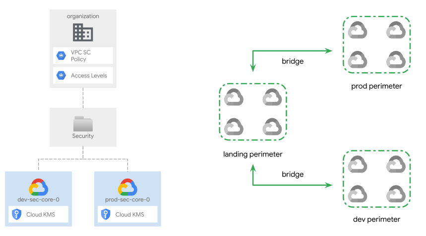

# Shared security resources

This stage sets up security resources and configurations which impact the whole organization, or are shared across the hierarchy to other projects and teams.

The design of this stage is fairly general, and provides a reference example for [Cloud KMS](https://cloud.google.com/security-key-management) and a [VPC Service Controls](https://cloud.google.com/vpc-service-controls) configuration that sets up three perimeters (landing, development, production), their related bridge perimeters, and provides variables to configure their resources, access levels, and directional policies.

Expanding this stage to include other security-related services like Secret Manager, is fairly simple by using the provided implementation for Cloud KMS, and leveraging the broad permissions on the top-level Security folder of the automation service account used.

The following diagram illustrates the high-level design of created resources and a schema of the VPC SC design, which can be adapted to specific requirements via variables:

<p align="center">
  
</p>

## Design overview and choices

Project-level security resources are grouped into two separate projects, one per environment. This setup matches requirements we frequently observe in real life and provides enough separation without needlessly complicating operations.

Cloud KMS is configured and designed mainly to encrypt GCP resources with a [Customer-managed encryption key](https://cloud.google.com/kms/docs/cmek) but it may be used to create cryptokeys used to [encrypt application data](https://cloud.google.com/kms/docs/encrypting-application-data) too.

IAM for management-related operations is already assigned at the folder level to the security team by the previous stage, but more granularity can be added here at the project level, to grant control of separate services across environments to different actors.

### Cloud KMS

A reference Cloud KMS implementation is part of this stage, to provide a simple way of managing centralized keys, that are then shared and consumed widely across the organization to enable customer-managed encryption. The implementation is also easy to clone and modify to support other services like Secret Manager.

The Cloud KMS configuration allows defining keys by name (typically matching the downstream service that uses them) in different locations, either based on a common default or a per-key setting. It then takes care internally of provisioning the relevant keyrings and creating keys in the appropriate location.

IAM roles on keys can be configured at the logical level for all locations where a logical key is created. Their management can also be delegated via [delegated role grants](https://cloud.google.com/iam/docs/setting-limits-on-granting-roles) exposed through a simple variable, to allow other identities to set IAM policies on keys. This is particularly useful in setups like project factories, making it possible to configure IAM bindings during project creation for team groups or service agent accounts (compute, storage, etc.).

### VPC Service Controls

This stage also provisions the VPC Service Controls configuration on demand for the whole organization, implementing the straightforward design illustrated above:

- one perimeter for each environment
- one perimeter for centralized services and the landing VPC
- bridge perimeters to connect the landing perimeter to each environment

The VPC SC configuration is set to dry-run mode, but switching to enforced mode is a simple operation involving modifying a few lines of code highlighted by ad-hoc comments. Variables are designed to enable easy centralized management of VPC Service Controls, including access levels and [ingress/egress rules](https://cloud.google.com/vpc-service-controls/docs/ingress-egress-rules) as described below.

Some care needs to be taken with project membership in perimeters, which can only be implemented here instead of being delegated (all or partially) to different stages, until the [Google Provider feature request](https://github.com/hashicorp/terraform-provider-google/issues/7270) allowing using project-level association for both enforced and dry-run modes is implemented.

## How to run this stage

This stage is meant to be executed after the [resource management](../01-resman) stage has run, as it leverages the folder and automation resources created there. The relevant user groups must also exist, but that's one of the requirements for the previous stages too, so if you ran those successfully, you're good to go.

It's possible to run this stage in isolation, but that's outside the scope of this document, and you would need to refer to the code for the bootstrap stage for the required roles.

Before running this stage, you need to ensure you have the correct credentials and permissions, and customize variables by assigning values that match your configuration.

### Providers configuration

The default way of making sure you have the correct permissions is to use the identity of the service account pre-created for this stage during bootstrap, and that you are a member of the group that can impersonate it via provider-level configuration (`gcp-devops` or `organization-admins`).

To simplify setup, the previous stage pre-configures a valid providers file in its output, and optionally writes it to a local file if the `outputs_location` variable is set to a valid path.

If you have set a valid value for `outputs_location` in the resource management stage, simply link the relevant `providers.tf` file from this stage's folder in the path you specified:

```bash
# `outputs_location` is set to `~/fast-config`
ln -s ~/fast-config/providers/02-security-providers.tf .
```

If you have not configured `outputs_location` in resource management, you can derive the providers file from that stage's outputs:

```bash
cd ../01-resman
terraform output -json providers | jq -r '.["02-security"]' \
  > ../02-security/providers.tf
```

### Variable configuration

There are two broad sets of variables you will need to fill in:

- variables shared by other stages (organization id, billing account id, etc.), or derived from a resource managed by a different stage (folder id, automation project id, etc.)
- variables specific to resources managed by this stage

To avoid the tedious job of filling in the first group of variables with values derived from other stages' outputs, the same mechanism used above for the provider configuration can be used to leverage pre-configured `.tfvars` files.

If you configured a valid path for `outputs_location` in the previous stages, simply link the relevant `terraform-*.auto.tfvars.json` files from this stage's output folder (under the path you specified), where the `*` above is set to the name of the stage that produced it. For this stage, two `.tfvars` files are available:

```bash
# `outputs_location` is set to `~/fast-config`
ln -s ~/fast-config/tfvars/00-bootstrap.auto.tfvars.json .
ln -s ~/fast-config/tfvars/01-resman.auto.tfvars.json .
# also copy the tfvars file used for the bootstrap stage
cp ../00-bootstrap/terraform.tfvars .
```

A second set of optional variables is specific to this stage. If you need to customize them add them to the file copied from bootstrap.

Refer to the [Variables](#variables) table at the bottom of this document, for a full list of variables, their origin (e.g., a stage or specific to this one), and descriptions explaining their meaning. The sections below also describe some of the possible customizations.

Once done, you can run this stage:

```bash
terraform init
terraform apply
```

## Customizations

### KMS keys

Cloud KMS configuration is split in two variables:

- `kms_defaults` configures the locations and rotation period, used for keys that don't specifically configure them
- `kms_keys` configures the actual keys to create, and also allows configuring their IAM bindings and labels, and overriding locations and rotation period. When configuring locations for a key, please consider the limitations each cloud product may have.

The additional `kms_restricted_admins` variable allows granting `roles/cloudkms.admin` to specified principals, restricted via [delegated role grants](https://cloud.google.com/iam/docs/setting-limits-on-granting-roles) so that it only allows granting the roles needed for encryption/decryption on keys. This allows safe delegation of key management to subsequent Terraform stages like the Project Factory, for example to grant usage access on relevant keys to the service agent accounts for compute, storage, etc.

To support these scenarios, key IAM bindings are configured by default to be additive, to enable other stages or Terraform configuration to safely co-manage bindings on the same keys. If this is not desired, follow the comments in the `core-dev.tf` and `core-prod.tf` files to switch to authoritative bindings on keys.

An example of how to configure keys:

```hcl
# terraform.tfvars

kms_defaults = {
  locations       = ["europe-west1", "europe-west3", "global"]
  rotation_period = "7776000s"
}
kms_keys = {
  compute = {
    iam = {
      "roles/cloudkms.cryptoKeyEncrypterDecrypter" = [
        "user:user1@example.com"
      ]
    }
    labels = { service = "compute" }
    locations = null
    rotation_period = null
  }
  storage = {
    iam = null
    labels = { service = "compute" }
    locations = ["europe"]
    rotation_period = null
  }
}
```

The script will create one keyring for each specified location and keys on each keyring.

### VPC Service Controls configuration

A set of variables allows configuring the VPC SC perimeters described above:

- `vpc_sc_perimeter_projects` configures project membership in the three regular perimeters
- `vpc_sc_access_levels` configures access levels, which can then be associated to perimeters by key using the `vpc_sc_perimeter_access_levels`
- `vpc_sc_egress_policies` configures directional egress policies, which can then be associated to perimeters by key using the `vpc_sc_perimeter_egress_policies`
- `vpc_sc_ingress_policies` configures directional ingress policies, which can then be associated to perimeters by key using the `vpc_sc_perimeter_ingress_policies`

This allows configuring VPC SC in a fairly flexible and concise way, without repeating similar definitions. Bridges perimeters configuration will be computed automatically to allow communication between regular perimeters: `landing <-> prod` and `landing <-> dev`.

#### Dry-run vs. enforced

The VPC SC configuration is set up by default in dry-run mode to allow easy experimentation, and detecting violations before enforcement. Once everything is set up correctly, switching to enforced mode needs to be done in code, by swapping the contents of the `spec` and `status` attributes for perimeters in the `vpc-sc.tf` file. The effort involved is minimal (2 lines of code per perimeter), and comments help identify the correct lines.

#### Perimeter resources

Projects are added to perimeters via the `vpc_sc_perimeter_projects`, and that's currently the only way of doing it without generating permadiffs or conflicts, because of the way the Terraform provider is implemented.

Once the Google Terraform Provider [implements support for dry-run mode in the additive resource](https://github.com/hashicorp/terraform-provider-google/issues/7270), it will be possible to concurrently manage perimeter resources both here and in subsequent Terraform configurations, for example to allow the Project Factory to add a project to a perimeter during the creation process.

Bridge perimeters are auto-populated with all projects configured for the connected regular perimeters.

An example of adding projects to perimeters using project numbers:

```hcl
# terraform.tfvars

vpc_sc_perimeter_projects = {
  dev     = ["projects/12345678", "projects/12345679"]
  landing = ["projects/12345670"]
  prod    = ["projects/12345674", "projects/12345675"]
}
```

#### Access levels

Below an example for an access level that allows unconditional ingress from a set of IP CIDR ranges can be configured once, and enabled on selected perimeters:

```hcl
# terraform.tfvars

vpc_sc_access_levels = {
  onprem = {
    combining_function = null,
    conditions = [{
      ip_subnetworks = ["101.101.101.0/24"],
      members = null, negate = null,
      regions = null, required_access_levels = null
    }]
  }
}
vpc_sc_perimeter_access_levels = {
  dev     = null
  landing = ["onprem"]
  prod    = ["onprem"]
}
```

#### Ingress and Egress policies

The same applies to Ingress and Egress policies, as shown in the examples below referencing the automation service account for this stage.

Below you can find an ingress policy configuration that allows applying Terraform from outside the perimeter, useful when bringing up this stage to avoid generating violations:

```hcl
# terraform.tfvars

vpc_sc_ingress_policies = {
  iac = {
    ingress_from = {
      identities = [
        "serviceAccount:xxx-prod-resman-security-0@xxx-prod-iac-core-0.iam.gserviceaccount.com"
      ]
      source_access_levels = ["*"]
      identity_type = null
      source_resources = null
    }
    ingress_to = {
      operations = [{ method_selectors = [], service_name = "*" }]
      resources  = ["*"]
    }
  }
}
vpc_sc_perimeter_ingress_policies = {
  dev     = ["iac"]
  landing = ["iac"]
  prod    = ["iac"]
}
```

Below you can find an egress policy that allows writing Terraform state to the automation bucket, useful once Terraform starts running inside the perimeter in a pipeline:

```hcl
# terraform.tfvars

vpc_sc_egress_policies = {
  iac-gcs = {
    egress_from = {
      identity_type = null
      identities = [
        "serviceAccount:xxx-prod-resman-security-0@xxx-prod-iac-core-0.iam.gserviceaccount.com"
      ]
    }
    egress_to = {
      operations = [{
        method_selectors = ["*"], service_name = "storage.googleapis.com"
      }]
      resources = ["projects/123456782"]
    }
  }
}
vpc_sc_perimeter_ingress_policies = {
  dev     = ["iac-gcs"]
  landing = ["iac-gcs"]
  prod    = ["iac-gcs"]
}
```

## Notes

Some references that might be useful in setting up this stage:

- [VPC SC CSCC requirements](https://cloud.google.com/security-command-center/docs/troubleshooting).

<!-- TFDOC OPTS files:1 show_extra:1 -->
<!-- BEGIN TFDOC -->

## Files

| name | description | modules | resources |
|---|---|---|---|
| [core-dev.tf](./core-dev.tf) | None | <code>kms</code> · <code>project</code> | <code>google_project_iam_member</code> |
| [core-prod.tf](./core-prod.tf) | None | <code>kms</code> · <code>project</code> | <code>google_project_iam_member</code> |
| [main.tf](./main.tf) | Module-level locals and resources. |  |  |
| [outputs.tf](./outputs.tf) | Module outputs. |  | <code>google_storage_bucket_object</code> · <code>local_file</code> |
| [variables.tf](./variables.tf) | Module variables. |  |  |
| [vpc-sc.tf](./vpc-sc.tf) | None | <code>vpc-sc</code> |  |

## Variables

| name | description | type | required | default | producer |
|---|---|:---:|:---:|:---:|:---:|
| [automation](variables.tf#L17) | Automation resources created by the bootstrap stage. | <code title="object&#40;&#123;&#10;  outputs_bucket &#61; string&#10;&#125;&#41;">object&#40;&#123;&#8230;&#125;&#41;</code> | ✓ |  | <code>00-bootstrap</code> |
| [billing_account](variables.tf#L25) | Billing account id and organization id ('nnnnnnnn' or null). | <code title="object&#40;&#123;&#10;  id              &#61; string&#10;  organization_id &#61; number&#10;&#125;&#41;">object&#40;&#123;&#8230;&#125;&#41;</code> | ✓ |  | <code>00-bootstrap</code> |
| [folder_ids](variables.tf#L34) | Folder name => id mappings, the 'security' folder name must exist. | <code title="object&#40;&#123;&#10;  security &#61; string&#10;&#125;&#41;">object&#40;&#123;&#8230;&#125;&#41;</code> | ✓ |  | <code>01-resman</code> |
| [organization](variables.tf#L91) | Organization details. | <code title="object&#40;&#123;&#10;  domain      &#61; string&#10;  id          &#61; number&#10;  customer_id &#61; string&#10;&#125;&#41;">object&#40;&#123;&#8230;&#125;&#41;</code> | ✓ |  | <code>00-bootstrap</code> |
| [prefix](variables.tf#L107) | Prefix used for resources that need unique names. Use 9 characters or less. | <code>string</code> | ✓ |  | <code>00-bootstrap</code> |
| [service_accounts](variables.tf#L80) | Automation service accounts that can assign the encrypt/decrypt roles on keys. | <code title="object&#40;&#123;&#10;  data-platform-dev    &#61; string&#10;  data-platform-prod   &#61; string&#10;  project-factory-dev  &#61; string&#10;  project-factory-prod &#61; string&#10;&#125;&#41;">object&#40;&#123;&#8230;&#125;&#41;</code> | ✓ |  | <code>01-resman</code> |
| [groups](variables.tf#L42) | Group names to grant organization-level permissions. | <code>map&#40;string&#41;</code> |  | <code title="&#123;&#10;  gcp-billing-admins      &#61; &#34;gcp-billing-admins&#34;,&#10;  gcp-devops              &#61; &#34;gcp-devops&#34;,&#10;  gcp-network-admins      &#61; &#34;gcp-network-admins&#34;&#10;  gcp-organization-admins &#61; &#34;gcp-organization-admins&#34;&#10;  gcp-security-admins     &#61; &#34;gcp-security-admins&#34;&#10;  gcp-support             &#61; &#34;gcp-support&#34;&#10;&#125;">&#123;&#8230;&#125;</code> | <code>00-bootstrap</code> |
| [kms_defaults](variables.tf#L57) | Defaults used for KMS keys. | <code title="object&#40;&#123;&#10;  locations       &#61; list&#40;string&#41;&#10;  rotation_period &#61; string&#10;&#125;&#41;">object&#40;&#123;&#8230;&#125;&#41;</code> |  | <code title="&#123;&#10;  locations       &#61; &#91;&#34;europe&#34;, &#34;europe-west1&#34;, &#34;europe-west3&#34;, &#34;global&#34;&#93;&#10;  rotation_period &#61; &#34;7776000s&#34;&#10;&#125;">&#123;&#8230;&#125;</code> |  |
| [kms_keys](variables.tf#L69) | KMS keys to create, keyed by name. Null attributes will be interpolated with defaults. | <code title="map&#40;object&#40;&#123;&#10;  iam             &#61; map&#40;list&#40;string&#41;&#41;&#10;  labels          &#61; map&#40;string&#41;&#10;  locations       &#61; list&#40;string&#41;&#10;  rotation_period &#61; string&#10;&#125;&#41;&#41;">map&#40;object&#40;&#123;&#8230;&#125;&#41;&#41;</code> |  | <code>&#123;&#125;</code> |  |
| [outputs_location](variables.tf#L101) | Path where providers, tfvars files, and lists for the following stages are written. Leave empty to disable. | <code>string</code> |  | <code>null</code> |  |
| [vpc_sc_access_levels](variables.tf#L118) | VPC SC access level definitions. | <code title="map&#40;object&#40;&#123;&#10;  combining_function &#61; string&#10;  conditions &#61; list&#40;object&#40;&#123;&#10;    ip_subnetworks         &#61; list&#40;string&#41;&#10;    members                &#61; list&#40;string&#41;&#10;    negate                 &#61; bool&#10;    regions                &#61; list&#40;string&#41;&#10;    required_access_levels &#61; list&#40;string&#41;&#10;  &#125;&#41;&#41;&#10;&#125;&#41;&#41;">map&#40;object&#40;&#123;&#8230;&#125;&#41;&#41;</code> |  | <code>&#123;&#125;</code> |  |
| [vpc_sc_egress_policies](variables.tf#L133) | VPC SC egress policy defnitions. | <code title="map&#40;object&#40;&#123;&#10;  egress_from &#61; object&#40;&#123;&#10;    identity_type &#61; string&#10;    identities    &#61; list&#40;string&#41;&#10;  &#125;&#41;&#10;  egress_to &#61; object&#40;&#123;&#10;    operations &#61; list&#40;object&#40;&#123;&#10;      method_selectors &#61; list&#40;string&#41;&#10;      service_name     &#61; string&#10;    &#125;&#41;&#41;&#10;    resources &#61; list&#40;string&#41;&#10;  &#125;&#41;&#10;&#125;&#41;&#41;">map&#40;object&#40;&#123;&#8230;&#125;&#41;&#41;</code> |  | <code>&#123;&#125;</code> |  |
| [vpc_sc_ingress_policies](variables.tf#L151) | VPC SC ingress policy defnitions. | <code title="map&#40;object&#40;&#123;&#10;  ingress_from &#61; object&#40;&#123;&#10;    identity_type        &#61; string&#10;    identities           &#61; list&#40;string&#41;&#10;    source_access_levels &#61; list&#40;string&#41;&#10;    source_resources     &#61; list&#40;string&#41;&#10;  &#125;&#41;&#10;  ingress_to &#61; object&#40;&#123;&#10;    operations &#61; list&#40;object&#40;&#123;&#10;      method_selectors &#61; list&#40;string&#41;&#10;      service_name     &#61; string&#10;    &#125;&#41;&#41;&#10;    resources &#61; list&#40;string&#41;&#10;  &#125;&#41;&#10;&#125;&#41;&#41;">map&#40;object&#40;&#123;&#8230;&#125;&#41;&#41;</code> |  | <code>&#123;&#125;</code> |  |
| [vpc_sc_perimeter_access_levels](variables.tf#L171) | VPC SC perimeter access_levels. | <code title="object&#40;&#123;&#10;  dev     &#61; list&#40;string&#41;&#10;  landing &#61; list&#40;string&#41;&#10;  prod    &#61; list&#40;string&#41;&#10;&#125;&#41;">object&#40;&#123;&#8230;&#125;&#41;</code> |  | <code>null</code> |  |
| [vpc_sc_perimeter_egress_policies](variables.tf#L181) | VPC SC egress policies per perimeter, values reference keys defined in the `vpc_sc_ingress_policies` variable. | <code title="object&#40;&#123;&#10;  dev     &#61; list&#40;string&#41;&#10;  landing &#61; list&#40;string&#41;&#10;  prod    &#61; list&#40;string&#41;&#10;&#125;&#41;">object&#40;&#123;&#8230;&#125;&#41;</code> |  | <code>null</code> |  |
| [vpc_sc_perimeter_ingress_policies](variables.tf#L191) | VPC SC ingress policies per perimeter, values reference keys defined in the `vpc_sc_ingress_policies` variable. | <code title="object&#40;&#123;&#10;  dev     &#61; list&#40;string&#41;&#10;  landing &#61; list&#40;string&#41;&#10;  prod    &#61; list&#40;string&#41;&#10;&#125;&#41;">object&#40;&#123;&#8230;&#125;&#41;</code> |  | <code>null</code> |  |
| [vpc_sc_perimeter_projects](variables.tf#L201) | VPC SC perimeter resources. | <code title="object&#40;&#123;&#10;  dev     &#61; list&#40;string&#41;&#10;  landing &#61; list&#40;string&#41;&#10;  prod    &#61; list&#40;string&#41;&#10;&#125;&#41;">object&#40;&#123;&#8230;&#125;&#41;</code> |  | <code>null</code> |  |

## Outputs

| name | description | sensitive | consumers |
|---|---|:---:|---|
| [kms_keys](outputs.tf#L59) | KMS key ids. |  |  |
| [stage_perimeter_projects](outputs.tf#L64) | Security project numbers. They can be added to perimeter resources. |  |  |
| [tfvars](outputs.tf#L74) | Terraform variable files for the following stages. | ✓ |  |

<!-- END TFDOC -->
