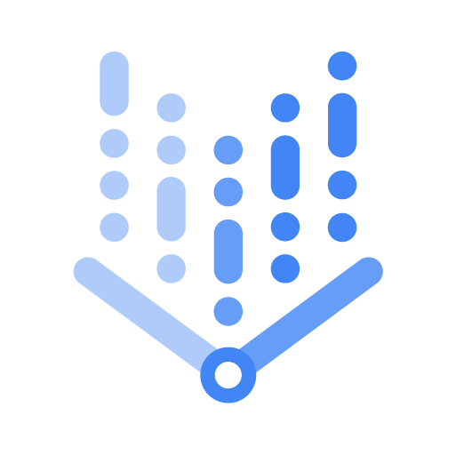

<a name="readme-top"></a>


<!-- PROJECT SHIELDS -->
<!--
*** using markdown "reference style" links for readability.
*** Reference links are enclosed in brackets [ ] instead of parentheses ( ).
*** See the bottom of this document for the declaration of the reference variables
*** for contributors-url, forks-url, etc. This is an optional, concise syntax you may use.

-->

<!--
*** [![Contributors][contributors-shield]][contributors-url]
*** [![Forks][forks-shield]][forks-url]
***[![Stargazers][stars-shield]][stars-url]
***[![Issues][issues-shield]][issues-url]
*** [![MIT License][license-shield]][license-url]
*** [![LinkedIn][linkedin-shield]][linkedin-url]

-->


<!-- PROJECT LOGO -->
<br />
<div align="center">
  <a href="https://github.com/othneildrew/Best-README-Template">
    
  </a>

  <h3 align="center">Vertex AI Foundations</h3>

  <p align="center">
    An awesome repo to jumpstart your Vertex AI projects!
    <br />
    <a href="https://github.com/othneildrew/Best-README-Template"><strong>Explore the docs »</strong></a>
    <br />
    <br />
    <a href="https://github.com/othneildrew/Best-README-Template">View Demo</a>
    ·
    <a href="https://github.com/othneildrew/Best-README-Template/issues">Report Bug</a>
    ·
    <a href="https://github.com/othneildrew/Best-README-Template/issues">Request Feature</a>
  </p>
</div>


<!-- TABLE OF CONTENTS -->
<details>
  <summary>Table of Contents</summary>
  <ol>
    <li>
      <a href="#about-the-project">About The Project</a>
      <ul>
        <li><a href="#built-with">Built With</a></li>
      </ul>
    </li>
    <li>
      <a href="#getting-started">Getting Started</a>
      <ul>
        <li><a href="#prerequisites">Prerequisites</a></li>
        <li><a href="#installation">Installation</a></li>
      </ul>
    </li>
    <li><a href="#usage">Usage</a></li>
    <li><a href="#roadmap">Roadmap</a></li>
    <li><a href="#contributing">Contributing</a></li>
    <li><a href="#license">License</a></li>
    <li><a href="#contact">Contact</a></li>
    <li><a href="#acknowledgments">Acknowledgments</a></li>
  </ol>
</details>


<!-- ABOUT THE PROJECT -->
## About The Project

[![Product Name Screen Shot][product-screenshot]](https://example.com)

There are many great foundation templates available on GitHub; however, we wanted to provide Google's opinionated version that met our customers needs so we built this one. We want to make Vertex AI easy and simple to use in our effort to democratize ML/AI. ever need -- I think this is it.

Here's why:
* Your time should be focused on creating something amazing with ML/AI. A project that solves a problem and helps others
* You shouldn't be doing the same tasks over and over like creating projects, service accounts, google cloud services manually.


We are sure this will not serve all of your needs and projects since each customer is different but this can be the baseline for your experimentation with Vertex AI. We'll be adding more features and content in the future but welcome the community of ML/AI practicioners to contribute and by forking this repo and creating a pull request for any features or issues for any bugs.


<p align="right">(<a href="#readme-top">back to top</a>)</p>


<!-- GETTING STARTED -->
## Getting Started

To set up your project locally feel free to clone this repo into your local environment to adjust any of your environment variables

### Prerequisites

This is an example of how to list things you need to use the software and how to install them.
* npm
  ```sh
  npm install npm@latest -g
  ```

### Installation

_Below is an example of how you can instruct your audience on installing and setting up your app. This template doesn't rely on any external dependencies or services._

1. Get a free API Key at [https://example.com](https://example.com)
2. Clone the repo
   ```sh
   git clone https://github.com/your_username_/Project-Name.git
   ```
3. Install NPM packages
   ```sh
   npm install
   ```
4. Enter your API in `config.js`
   ```js
   const API_KEY = 'ENTER YOUR API';
   ```

<p align="right">(<a href="#readme-top">back to top</a>)</p>


<!-- USAGE EXAMPLES -->
## Usage

Use this space to show useful examples of how a project can be used. Additional screenshots, code examples and demos work well in this space. You may also link to more resources.

_For more examples, please refer to the [Documentation](https://example.com)_

<p align="right">(<a href="#readme-top">back to top</a>)</p>


<!-- ROADMAP -->
## Roadmap

- [x] Add Vertex AI PGA
- [x] Add Vertex AI Vision
- [ ] Add code samples with networking
- [ ] Add "components" document to easily copy & paste sections of the readme


See the [open issues](https://github.com/othneildrew/Best-README-Template/issues) for a full list of proposed features (and known issues).

<p align="right">(<a href="#readme-top">back to top</a>)</p>


<!-- CONTRIBUTING -->
## Contributing

Contributions are what make the open source community such an amazing place to learn, inspire, and create. Any contributions you make are **greatly appreciated**.

If you have a suggestion that would make this better, please fork the repo and create a pull request. You can also simply open an issue with the tag "enhancement".
Don't forget to give the project a star! Thanks again!

1. Fork the Project
2. Create your Feature Branch (`git checkout -b feature/AmazingFeature`)
3. Commit your Changes (`git commit -m 'Add some AmazingFeature'`)
4. Push to the Branch (`git push origin feature/AmazingFeature`)
5. Open a Pull Request

<p align="right">(<a href="#readme-top">back to top</a>)</p>


## License

All solutions within this repository are provided under the
[Apache 2.0](https://www.apache.org/licenses/LICENSE-2.0) license. Please see
the [LICENSE](/LICENSE) file for more detailed terms and conditions.

## Disclaimer

This repository and its contents are not an official Google Product.

## Contact

Questions, issues, and comments should be directed to
[professional-services-oss@google.com](mailto:professional-services-oss@google.com).

[gcf]: https://cloud.google.com/functions/
[gcf-bg]: https://cloud.google.com/functions/docs/writing/background
[logs-export]: https://cloud.google.com/logging/docs/export/

<p align="right">(<a href="#readme-top">back to top</a>)</p>
