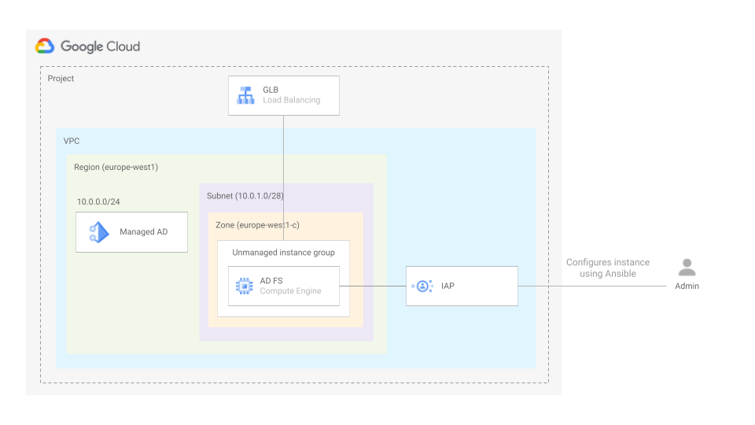
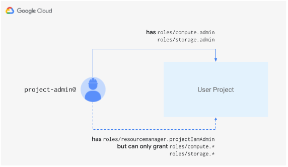
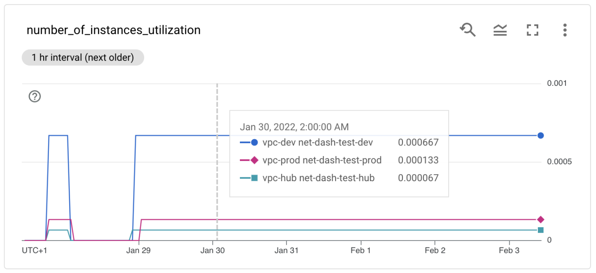
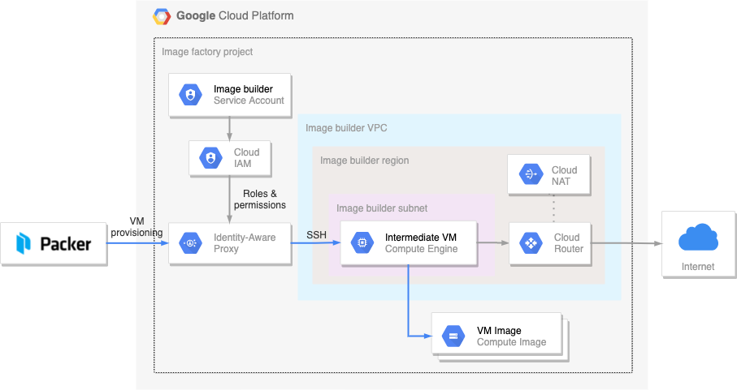
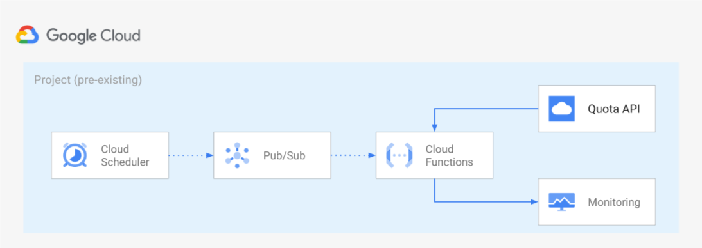
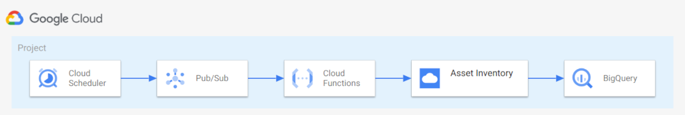

# Operations blueprints

The blueprints in this folder show how to wire together different Google Cloud services to simplify operations, and are meant for testing, or as minimal but sufficiently complete starting points for actual use.

## Active Directory Federation Services

 This [blueprint](./adfs/) Sets up managed AD, creates a server where AD FS will be installed which will also act as admin workstation for AD, and exposes ADFS using GLB. It can also optionally set up a GCP project and VPC if needed

 

## Resource tracking and remediation via Cloud Asset feeds

 This [blueprint](./asset-inventory-feed-remediation) shows how to leverage [Cloud Asset Inventory feeds](https://cloud.google.com/asset-inventory/docs/monitoring-asset-changes) to stream resource changes in real time, and how to programmatically use the feed change notifications for alerting or remediation, via a Cloud Function wired to the feed PubSub queue.

The blueprint's feed tracks changes to Google Compute instances, and the Cloud Function enforces policy compliance on each change so that tags match a set of simple rules. The obvious use case is when instance tags are used to scope firewall rules, but the blueprint can easily be adapted to suit different use cases.

 

## Granular Cloud DNS IAM via Service Directory

 This [blueprint](./dns-fine-grained-iam) shows how to leverage [Service Directory](https://cloud.google.com/blog/products/networking/introducing-service-directory) and Cloud DNS Service Directory private zones, to implement fine-grained IAM controls on DNS. The blueprint creates a Service Directory namespace, a Cloud DNS private zone that uses it as its authoritative source, service accounts with different levels of permissions, and VMs to test them.

 

## Granular Cloud DNS IAM for Shared VPC

 This [blueprint](./dns-shared-vpc) shows how to create reusable and modular Cloud DNS architectures, by provisioning dedicated Cloud DNS instances for application teams that want to manage their own DNS records, and configuring DNS peering to ensure name resolution works in a common Shared VPC.

 

## Delegated Role Grants

 This [blueprint](./iam-delegated-role-grants) shows how to use delegated role grants to restrict service usage.

 

## Network Dashboard

 This [blueprint](./network-dashboard/) provides an end-to-end solution to gather some GCP Networking quotas and limits (that cannot be seen in the GCP console today) and display them in a dashboard. The goal is to allow for better visibility of these limits, facilitating capacity planning and avoiding hitting these limits..

 

## On-prem Service Account key management

This [blueprint](./onprem-sa-key-management) shows how to manage IAM Service Account Keys by manually generating a key pair and uploading the public part of the key to GCP.

 

## Packer image builder

 This [blueprint](./packer-image-builder) shows how to deploy infrastructure for a Compute Engine image builder based on [Hashicorp's Packer tool](https://www.packer.io).

 

## Compute Engine quota monitoring

 This [blueprint](./quota-monitoring) shows a practical way of collecting and monitoring [Compute Engine resource quotas](https://cloud.google.com/compute/quotas) via Cloud Monitoring metrics as an alternative to the recently released [built-in quota metrics](https://cloud.google.com/monitoring/alerts/using-quota-metrics). A simple alert on quota thresholds is also part of the blueprint.

 

## Scheduled Cloud Asset Inventory Export to Bigquery

 This [blueprint](./scheduled-asset-inventory-export-bq) shows how to leverage the [Cloud Asset Inventory Exporting to Bigquery](https://cloud.google.com/asset-inventory/docs/exporting-to-bigquery) feature, to keep track of your organization's assets over time storing information in Bigquery. Data stored in Bigquery can then be used for different purposes like dashboarding or analysis.

 

## Workload identity federation for Terraform Enterprise workflow

 This [blueprint](./terraform-enterprise-wif) shows how to configure [Wokload Identity Federation](https://cloud.google.com/iam/docs/workload-identity-federation) between [Terraform Cloud/Enterprise](https://developer.hashicorp.com/terraform/enterprise) instance and Google Cloud.

 

## TCP healthcheck for unmanaged GCE instances

 This [blueprint](./unmanaged-instances-healthcheck) shows how to leverage [Serverless VPC Access](https://cloud.google.com/vpc/docs/configure-serverless-vpc-access) and Cloud Functions to organize a highly performant TCP healtheck for unmanaged GCE instances.

 

## Migrate for Compute Engine (v5)

 This set of [blueprints](./vm-migration) shows how to deploy Migrate for Compute Engine (v5) on top of existing Cloud Foundations on different scenarios. An blueprint on how to deploy the M4CE connector on VMWare ESXi is also part of the blueprints.

 

## Configuring Workload Identity Federation from apps running on Azure

 This [blueprint](./workload-identity-federation) shows how to set up everything, both in Azure and Google Cloud, so a workload in Azure can access Google Cloud resources without a service account key. This will be possible by configuring workload identity federation to trust access tokens generated for a specific application in an Azure Active Directory (AAD) tenant.

 
