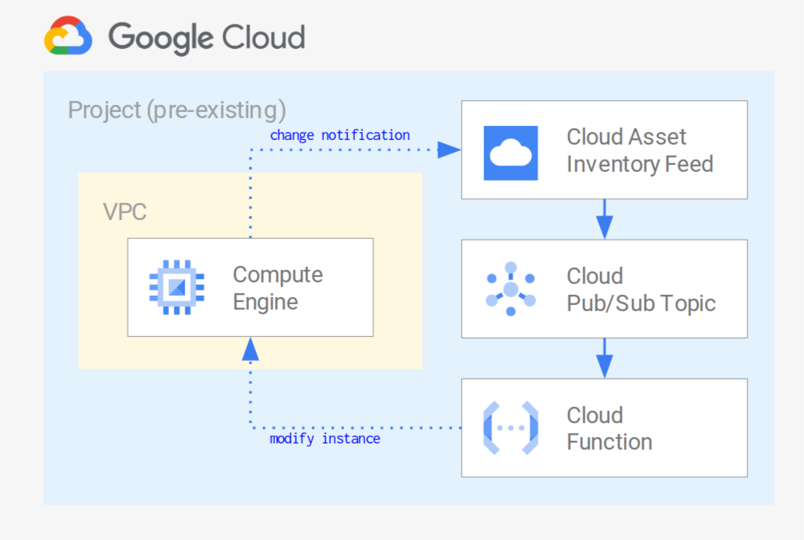

# Cloud Asset Inventory feeds for resource change tracking and remediation

This blueprint shows how to leverage [Cloud Asset Inventory feeds](https://cloud.google.com/asset-inventory/docs/monitoring-asset-changes) to stream resource changes in real time, and how to programmatically react to changes by wiring a Cloud Function to the feed outputs.

The Cloud Function can then be used for different purposes:

- updating remote data (eg a CMDB) to reflect the changed resources
- triggering alerts to surface critical changes
- adapting the configuration of separate related resources
- implementing remediation steps that enforce policy compliance by tweaking or reverting the changes.

A [companion Medium article](https://medium.com/google-cloud/using-cloud-asset-inventory-feeds-for-dynamic-configuration-and-policy-enforcement-c37b6a590c49) has been published for this blueprint, refer to it for more details on the context and the specifics of running the blueprint.

This blueprint shows a simple remediation use case: how to enforce policies on instance tags and revert non-compliant changes in near-real time, thus adding an additional measure of control when using tags for firewall rule scoping. Changing the [monitored asset](https://cloud.google.com/asset-inventory/docs/supported-asset-types) and the function logic allows simple adaptation to other common use cases:

- enforcing a centrally defined Cloud Armor policy in backend services
- creating custom DNS records for instances or forwarding rules

The blueprint uses a single project for ease of testing, in actual use a few changes are needed to operate at the resource hierarchy level:

- the feed should be set at the folder or organization level
- the custom role used to assign tag changing permissions should be defined at the organization level
- the role binding that grants the custom role to the Cloud Function service account should be set at the same level as the feed (folder or organization)

The resources created in this blueprint are shown in the high level diagram below:

## Running the blueprint

Clone this repository or [open it in cloud shell](https://ssh.cloud.google.com/cloudshell/editor?cloudshell_git_repo=https%3A%2F%2Fgithub.com%2Fterraform-google-modules%2Fcloud-foundation-fabric&cloudshell_print=cloud-shell-readme.txt&cloudshell_working_dir=blueprints%2Fcloud-operations%2Fasset-inventory-feed-remediation), then go through the following steps to create resources:

- `terraform init`
- `terraform apply -var project_id=my-project-id`

Once done testing, you can clean up resources by running `terraform destroy`. To persist state, check out the `backend.tf.sample` file.

## Testing the blueprint

The terraform outputs generate preset `gcloud` commands that you can copy and run in the console, to complete configuration and test the blueprint:

- `subscription_pull` shows messages in the PubSub queue, to check feed message format if the Cloud Function is disabled
- `cf_logs` shows Cloud Function logs to check that remediation works
- `tag_add` adds a non-compliant tag to the test instance, and triggers the Cloud Function remediation process
- `tag_show` displays the tags currently set on the test instance

Run the `subscription_pull` command until it returns nothing, then run the following commands in order to test remediation:

- the `tag_add` command
- the `cf_logs` command until the logs show that the change has been picked up, verified, and the compliant tags have been force-set on the instance
- the `tag_show` command to verify that the function output matches the resource state
<!-- BEGIN TFDOC -->

## Variables

| name | description | type | required | default |
|---|---|:---:|:---:|:---:|
| [project_id](variables.tf#L35) | Project id that references existing project. | <code>string</code> | ✓ |  |
| [bundle_path](variables.tf#L17) | Path used to write the intermediate Cloud Function code bundle. | <code>string</code> |  | <code>&#34;.&#47;bundle.zip&#34;</code> |
| [name](variables.tf#L23) | Arbitrary string used to name created resources. | <code>string</code> |  | <code>&#34;asset-feed&#34;</code> |
| [project_create](variables.tf#L29) | Create project instead of using an existing one. | <code>bool</code> |  | <code>false</code> |
| [region](variables.tf#L40) | Compute region used in the example. | <code>string</code> |  | <code>&#34;europe-west1&#34;</code> |

## Outputs

| name | description | sensitive |
|---|---|:---:|
| [cf_logs](outputs.tf#L17) | Cloud Function logs read command. |  |
| [subscription_pull](outputs.tf#L29) | Subscription pull command. |  |
| [tag_add](outputs.tf#L39) | Instance add tag command. |  |
| [tag_show](outputs.tf#L49) | Instance add tag command. |  |

<!-- END TFDOC -->
