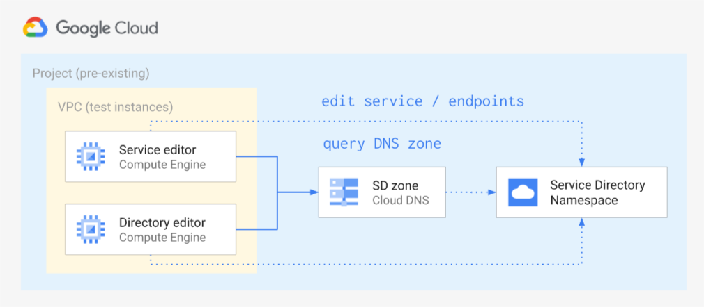

# Fine-grained Cloud DNS IAM via Service Directory

This blueprint shows how to leverage [Service Directory](https://cloud.google.com/blog/products/networking/introducing-service-directory) and Cloud DNS Service Directory private zones, to implement fine-grained IAM controls on DNS by

- creating a Service Directory namespace with two services and their endpoints
- creating a Cloud DNS private zone that uses the namespace as its authoritative source
- creating two service accounts and assigning them the `roles/servicedirectory.editor` role on the namespace and on one service respectively
- creating two VMs and setting them to use the two service accounts, so that DNS queries and `gcloud` commands can be used to verify the setup

The resources created in this blueprint are shown in the high level diagram below:



A [companion Medium article](https://medium.com/google-cloud/fine-grained-cloud-dns-iam-via-service-directory-446058b4362e) has been published for this blueprint, you can refer to it for more details on the context, and the specifics of running the blueprint.

## Running the blueprint

Clone this repository or [open it in cloud shell](https://ssh.cloud.google.com/cloudshell/editor?cloudshell_git_repo=https%3A%2F%2Fgithub.com%2Fterraform-google-modules%2Fcloud-foundation-fabric&cloudshell_print=cloud-shell-readme.txt&cloudshell_working_dir=blueprints%2Fcloud-operations%2Fdns-fine-grained-iam&cloudshell_open_in_editor=cloudshell_open%2Fcloud-foundation-fabric%2Fblueprints%2Fcloud-operations%2Fdns-fine-grained-iam%2Fvariables.tf), then go through the following steps to create resources:

- `terraform init`
- `terraform apply -var project_id=my-project-id`

Once done testing, you can clean up resources by running `terraform destroy`. To persist state, check out the `backend.tf.sample` file.

## Testing the blueprint

The terraform outputs generate preset `gcloud compute ssh` commands that you can copy and run in the console to connect to each VM. Remember to adapt the testing commands below if you changed the default values for the `name`, `region`, or `zone_domain` variables.

Connect via SSH to the `ns` VM and query the Service Directory namespace via DNS.

```bash
gcloud compute ssh dns-sd-test-ns-1 \
  --zone europe-west1-b \
  --tunnel-through-iap

dig app1.svc.example.org +short
# 127.0.0.2
# 127.0.0.3
# 127.0.0.7
dig app2.svc.example.org +short
# 127.0.0.4
# 127.0.0.5
dig _app1._tcp.app1.svc.example.org srv +short
# 10 10 80 vm1.app1.svc.example.org.
# 10 10 80 vm2.app1.svc.example.org.
# 10 10 80 vm3.app1.svc.example.org.
```

The DNS answers should match the ones in the comments above, after each command. Note the special format used to query `SRV` records.

If the above looks good, let's verify that the `ns` VM service account has edit rights on the namespace by creating a new service, and then verifying it via DNS.

```bash
gcloud beta service-directory services create app3 \
  --location europe-west1 \
  --namespace dns-sd-test
# Created service [app3].

gcloud beta service-directory endpoints create vm1 \
  --service app3 \
  --location europe-west1 \
  --namespace dns-sd-test \
  --address 127.0.0.6 \
  --port 80
# Created endpoint [vm1].

dig app3.svc.example.org +short
# 127.0.0.6
```

Log out from the `ns` VM and log in to the `svc` VM, then verify that its service account has no permissions on the whole namespace.

```bash
gcloud compute ssh dns-sd-test-svc-1 \
  --zone europe-west1-b \
  --tunnel-through-iap

gcloud beta service-directory services delete app3 \
  --location europe-west1 \
  --namespace dns-sd-test
# Deleted service [app3].
# ERROR: (gcloud.beta.service-directory.services.delete) PERMISSION_DENIED: Permission 'servicedirectory.services.delete' denied on resource 'projects/my-project/locations/europe-west1/namespaces/dns-sd-test/services/app3'.
```

Ignoring the `deleted` message which is clearly a bug (the service is still in beta after all), the error message shows that this identity has no rights to operate on the namespace. What it can do is operate on the single service we gave it access to.

```bash
gcloud beta service-directory endpoints create vm3 \
  --service app1 \
  --location europe-west1 \
  --namespace dns-sd-test \
  --address 127.0.0.7 \
  --port 80
# Created endpoint [vm3].

dig app1.svc.example.org +short
# 127.0.0.2
# 127.0.0.3
# 127.0.0.7
```
<!-- BEGIN TFDOC -->

## Variables

| name | description | type | required | default |
|---|---|:---:|:---:|:---:|
| [project_id](variables.tf#L29) | Existing project id. | <code>string</code> | ✓ |  |
| [name](variables.tf#L17) | Arbitrary string used to name created resources. | <code>string</code> |  | <code>&#34;dns-sd-test&#34;</code> |
| [project_create](variables.tf#L23) | Create project instead ofusing an existing one. | <code>bool</code> |  | <code>false</code> |
| [region](variables.tf#L34) | Compute region used in the example. | <code>string</code> |  | <code>&#34;europe-west1&#34;</code> |
| [zone_domain](variables.tf#L40) | Domain name used for the DNS zone. | <code>string</code> |  | <code>&#34;svc.example.org.&#34;</code> |

## Outputs

| name | description | sensitive |
|---|---|:---:|
| [gcloud_commands](outputs.tf#L17) | Commands used to SSH to the VMs. |  |
| [vms](outputs.tf#L25) | VM names. |  |

<!-- END TFDOC -->
