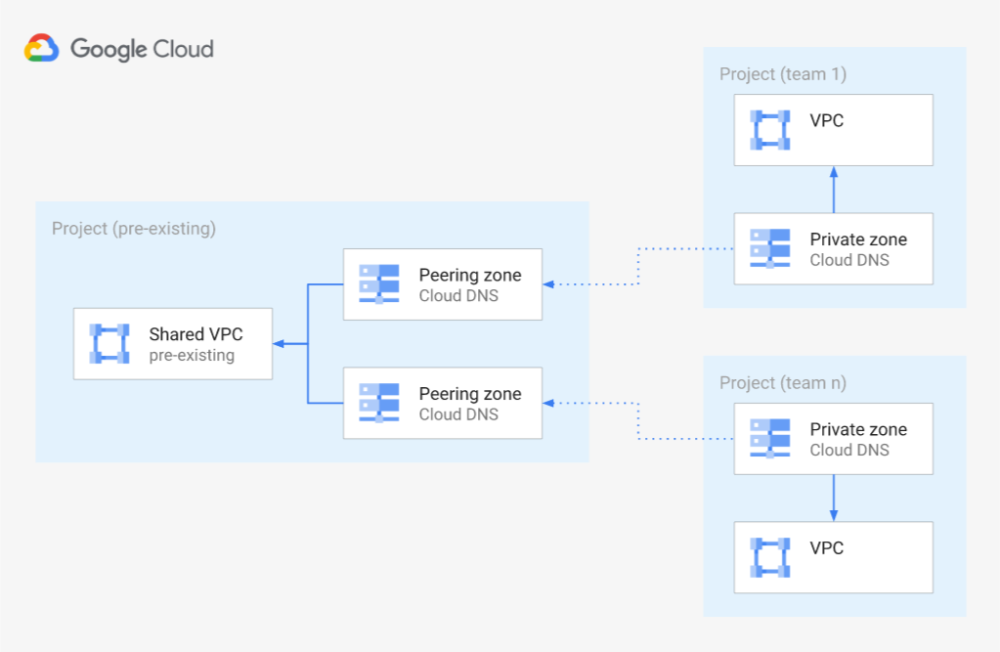

# Cloud DNS & Shared VPC design

## Usage

This blueprint shows how to create reusable and modular Cloud DNS architectures when using Shared VPC.

The goal is to provision dedicated Cloud DNS instances for application teams that want to manage their own DNS records, and configure DNS peering to ensure name resolution works in a common Shared VPC.

The blueprint will:

- Create a GCP project per application team based on the `teams` input variable
- Create a VPC and Cloud DNS instance per application team
- Create a Cloud DNS private zone per application team in the form of `[teamname].[dns_domain]`, with `teamname` and `dns_domain` based on input variables
- Configure DNS peering for each private zone from the Shared VPC to the DNS VPC of each application team

The resources created in this blueprint are shown in the high level diagram below:

Note that Terraform 0.13 at least is required due to the use of `for_each` with modules.
<!-- BEGIN TFDOC -->

## Variables

| name | description | type | required | default |
|---|---|:---:|:---:|:---:|
| [billing_account_id](variables.tf#L17) | Billing account associated with the GCP Projects that will be created for each team. | <code>string</code> | ✓ |  |
| [folder_id](variables.tf#L28) | Folder ID in which DNS projects will be created. | <code>string</code> | ✓ |  |
| [shared_vpc_link](variables.tf#L48) | Shared VPC self link, used for DNS peering. | <code>string</code> | ✓ |  |
| [dns_domain](variables.tf#L22) | DNS domain under which each application team DNS domain will be created. | <code>string</code> |  | <code>&#34;example.org&#34;</code> |
| [prefix](variables.tf#L33) | Customer name to use as prefix for resources' naming. | <code>string</code> |  | <code>&#34;test-dns&#34;</code> |
| [project_services](variables.tf#L39) | Service APIs enabled by default. | <code>list&#40;string&#41;</code> |  | <code title="&#91;&#10;  &#34;compute.googleapis.com&#34;,&#10;  &#34;dns.googleapis.com&#34;,&#10;&#93;">&#91;&#8230;&#93;</code> |
| [teams](variables.tf#L53) | List of application teams requiring their own Cloud DNS instance. | <code>list&#40;string&#41;</code> |  | <code title="&#91;&#10;  &#34;team1&#34;,&#10;  &#34;team2&#34;,&#10;&#93;">&#91;&#8230;&#93;</code> |

## Outputs

| name | description | sensitive |
|---|---|:---:|
| [teams](outputs.tf#L17) | Team resources. |  |

<!-- END TFDOC -->
