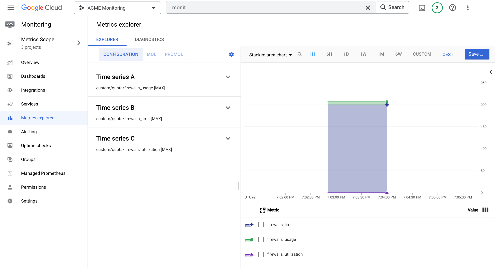

# Compute Engine quota monitoring

This blueprint improves on the [GCE quota exporter tool](https://github.com/GoogleCloudPlatform/professional-services/tree/master/tools/gce-quota-sync) (by the same author of this blueprint), and shows a practical way of collecting and monitoring [Compute Engine resource quotas](https://cloud.google.com/compute/quotas) via Cloud Monitoring metrics as an alternative to the recently released [built-in quota metrics](https://cloud.google.com/monitoring/alerts/using-quota-metrics).

Compared to the built-in metrics, it offers a simpler representation of quotas and quota ratios which is especially useful in charts, it allows filtering or combining quotas between different projects regardless of their monitoring workspace, and it creates a default alerting policy without the need to interact directly with the monitoring API.

Regardless of its specific purpose, this blueprint is also useful in showing how to manipulate and write time series to cloud monitoring. The resources it creates are shown in the high level diagram below:

The solution is designed so that the Cloud Function arguments that control function execution (eg to set which project quotas to monitor) are defined in the Cloud Scheduler payload set in the PubSub message, so that a single function can be used for different configurations by creating more schedules.

Quota time series are stored using  [custom metrics](https://cloud.google.com/monitoring/custom-metrics) with metric type for usage, limit and utilization; metric types are named using a common prefix and two tokens joined by a `-` character:

- `prefix` (custom.googleapis.com/quota/)
- `quota name` 
- `{usage,limit,utilization}`

e.g:

- `custom.googleapis.com/quota/firewalls_usage` 
- `custom.googleapis.com/quota/firewalls_limit` 
- `custom.googleapis.com/quota/firewalls_utilization`

All custom metrics are associated to the `global` resource type and use [gauge kind](https://cloud.google.com/monitoring/api/v3/kinds-and-types#metric-kinds) 

Labels are set with project id (which may differ from the monitoring workspace projects) and region (quotas that are not region specific are labelled  `global`), this is how a usage/limit/utilization triplet looks in in Metrics Explorer

The solution can also create a basic monitoring alert policy, to demonstrate how to raise alerts when quotas utilization goes over a predefined threshold, to enable it, set variable `alert_create` to true and reapply main.tf after main.py has run at least one and quota monitoring metrics have been creaed.

## Running the blueprint

Clone this repository or [open it in cloud shell](https://ssh.cloud.google.com/cloudshell/editor?cloudshell_git_repo=https%3A%2F%2Fgithub.com%2Fterraform-google-modules%2Fcloud-foundation-fabric&cloudshell_print=cloud-shell-readme.txt&cloudshell_working_dir=blueprints%2Fcloud-operations%2Fquota-monitoring), then go through the following steps to create resources:

- `terraform init`
- `terraform apply -var project_id=my-project-id`
<!-- BEGIN TFDOC -->

## Variables

| name | description | type | required | default |
|---|---|:---:|:---:|:---:|
| [project_id](variables.tf#L41) | Project id that references existing project. | <code>string</code> | ✓ |  |
| [alert_create](variables.tf#L17) | Enables the creation of a sample monitoring alert, false by default. | <code>bool</code> |  | <code>false</code> |
| [bundle_path](variables.tf#L23) | Path used to write the intermediate Cloud Function code bundle. | <code>string</code> |  | <code>&#34;.&#47;bundle.zip&#34;</code> |
| [name](variables.tf#L29) | Arbitrary string used to name created resources. | <code>string</code> |  | <code>&#34;quota-monitor&#34;</code> |
| [project_create](variables.tf#L35) | Create project instead of using an existing one. | <code>bool</code> |  | <code>false</code> |
| [quota_config](variables.tf#L46) | Cloud function configuration. | <code title="object&#40;&#123;&#10;  filters  &#61; list&#40;string&#41;&#10;  projects &#61; list&#40;string&#41;&#10;  regions  &#61; list&#40;string&#41;&#10;&#125;&#41;">object&#40;&#123;&#8230;&#125;&#41;</code> |  | <code title="&#123;&#10;  filters  &#61; null&#10;  projects &#61; null&#10;  regions  &#61; null&#10;&#125;">&#123;&#8230;&#125;</code> |
| [region](variables.tf#L60) | Compute region used in the example. | <code>string</code> |  | <code>&#34;europe-west1&#34;</code> |
| [schedule_config](variables.tf#L66) | Schedule timer configuration in crontab format. | <code>string</code> |  | <code>&#34;0 &#42; &#42; &#42; &#42;&#34;</code> |

<!-- END TFDOC -->
