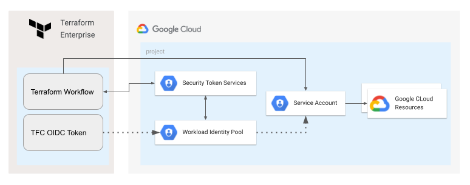

# Configuring workload identity federation for Terraform Cloud/Enterprise workflow

The most common way to use Terraform Cloud for GCP deployments is to store a GCP Service Account Key as a part of TFE Workflow configuration, as we all know there are security risks due to the fact that keys are long term credentials that could be compromised.

Workload identity federation enables applications running outside of Google Cloud to replace long-lived service account keys with short-lived access tokens. This is achieved by configuring Google Cloud to trust an external identity provider, so applications can use the credentials issued by the external identity provider to impersonate a service account.

This blueprint shows how to set up [Workload Identity Federation](https://cloud.google.com/iam/docs/workload-identity-federation) between [Terraform Cloud/Enterprise](https://developer.hashicorp.com/terraform/enterprise) instance and Google Cloud. This will be possible by configuring workload identity federation to trust oidc tokens generated for a specific workflow in a Terraform Enterprise organization.

The following diagram illustrates how the VM will get a short-lived access token and use it to access a resource:

 

## Running the blueprint

### Create Terraform Enterprise Workflow
If you don't have an existing Terraform Enterprise organization you can sign up for a [free trial](https://app.terraform.io/public/signup/account) account. 

Create a new Workspace for a `CLI-driven workflow` (Identity Federation will work for any workflow type, but for simplicity of the blueprint we use CLI driven workflow). 

Note workspace name and id (id starts with `ws-`), we will use them on a later stage.

Go to the organization settings and note the org name and id (id starts with `org-`).

### Deploy GCP Workload Identity Pool Provider for Terraform Enterprise

> **_NOTE:_**  This is a preparation part and should be executed on behalf of a user with enough permissions. 

Required permissions when new project is created:
 - Project Creator on the parent folder/org.
 
 Required permissions when an existing project is used:
 - Workload Identity Admin on the project level
 - Project IAM Admin on the project level

Fill out required variables, use TFE Org and Workspace IDs from the previous steps (IDs are not the names).
```bash
cd gcp-workload-identity-provider

mv terraform.auto.tfvars.template terraform.auto.tfvars

vi terraform.auto.tfvars
```

Authenticate using application default credentials, execute terraform code and deploy resources
```
gcloud auth application-default login

terraform init

terraform apply
```

As a result a set of outputs will be provided (your values will be different), note the output since we will use it on the next steps.

```
impersonate_service_account_email = "sa-tfe@fe-test-oidc.iam.gserviceaccount.com"
project_id = "tfe-test-oidc"
workload_identity_audience = "//iam.googleapis.com/projects/476538149566/locations/global/workloadIdentityPools/tfe-pool/providers/tfe-provider"
workload_identity_pool_provider_id = "projects/476538149566/locations/global/workloadIdentityPools/tfe-pool/providers/tfe-provider"
```

### Configure OIDC provider for your TFE Workflow

To enable OIDC for a TFE workflow it's enough to setup an environment variable `TFC_WORKLOAD_IDENTITY_AUDIENCE`. 

Go the the Workflow -> Variables and add a new variable `TFC_WORKLOAD_IDENTITY_AUDIENCE` equal to the value of `workload_identity_audience` output, in our example it's:

```
TFC_WORKLOAD_IDENTITY_AUDIENCE = "//iam.googleapis.com/projects/476538149566/locations/global/workloadIdentityPools/tfe-pool/providers/tfe-provider"
```

At that point we setup GCP Identity Federation to trust TFE generated OIDC tokens, so the TFE workflow can use the token to impersonate a GCP Service Account. 

## Testing the blueprint

In order to test the setup we will deploy a GCS bucket from TFE Workflow using OIDC token for Service Account Impersonation.

### Configure backend and variables

First, we need to configure TFE Remote backend for our testing terraform code, use TFE Organization name and workspace name (names are not the same as ids)

```
cd ../tfc-workflow-using-wif

mv backend.tf.template backend.tf


vi backend.tf

```

Fill out variables based on the output from the preparation steps:

```
mv terraform.auto.tfvars.template terraform.auto.tfvars

vi terraform.auto.tfvars

```

### Authenticate terraform for triggering CLI-driven workflow

Follow this [documentation](https://learn.hashicorp.com/tutorials/terraform/cloud-login) to login ti terraform cloud from the CLI.

### Trigger the workflow

```
terraform init

terraform apply
```

As a result we have a successfully deployed GCS bucket from Terraform Enterprise workflow using Workload Identity Federation.

Once done testing, you can clean up resources by running `terraform destroy` first in the `tfc-workflow-using-wif` and then `gcp-workload-identity-provider` folders. 
