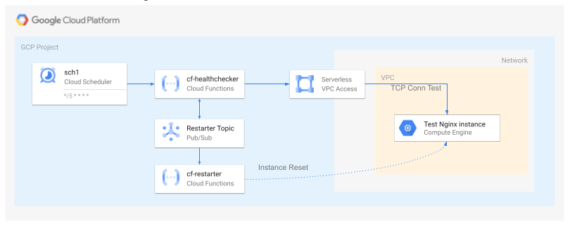

# TCP healthcheck and restart for unmanaged GCE instances

This blueprint shows how to leverage [Serverless VPC Access](https://cloud.google.com/vpc/docs/configure-serverless-vpc-access) and Cloud Functions to organize a highly performant TCP healthcheck for unmanaged GCE instances. Healthchecker Cloud Function uses [goroutines](https://gobyexample.com/goroutines) to achieve parallel healthchecking for multiple instances and handles up to 1 thousand VMs checked in less than a second execution time.

**_NOTE:_** [Managed Instance Groups](https://cloud.google.com/compute/docs/instance-groups/autohealing-instances-in-migs) has autohealing functionality out of the box, current blueprint is more applicable for standalone VMs or VMs in an unmanaged instance group.

The blueprint contains the following components:

- [Cloud Scheduler](https://cloud.google.com/scheduler) to initiate a healthcheck on a schedule.
- [Serverless VPC Connector](https://cloud.google.com/vpc/docs/configure-serverless-vpc-access) to allow Cloud Functions TCP level access to private GCE instances.
- **Healthchecker** Cloud Function to perform TCP checks against GCE instances. 
- **Restarter** PubSub topic to keep track of instances which are to be restarted.
- **Restarter** Cloud Function to perform GCE instance reset for instances which are failing TCP healthcheck.


The resources created in this blueprint are shown in the high level diagram below:



### Healthchecker configuration
Healthchecker cloud function has the following configuration options:

- `FILTER` to filter list of GCE instances the health check will be targeted to. For instance `(name = nginx-*) AND (labels.env = dev)`
- `GRACE_PERIOD` time period to prevent instance check of newly created instanced allowing services to start on the instance. 
- `MAX_PARALLELISM` - max amount of healthchecks performed in parallel, be aware that every check requires an open TCP connection which is limited.
- `PUBSUB_TOPIC` topic to publish the message with instance metadata. 
- `RECHECK_INTERVAL` time period for performing recheck, when a check is failed it will be rechecked before marking as unhealthy. 
- `TCP_PORT` port used for health checking
- `TIMEOUT` the timeout time of a TCP probe.

**_NOTE:_** In the current example `healthchecker` is used along with the `restarter` cloud function, but restarter can be replaced with another function like [Pubsub2Inbox](https://github.com/GoogleCloudPlatform/professional-services/tree/main/tools/pubsub2inbox) for email notifications.


## Running the blueprint

Clone this repository or [open it in cloud shell](https://ssh.cloud.google.com/cloudshell/editor?cloudshell_git_repo=https%3A%2F%2Fgithub.com%2Fterraform-google-modules%2Fcloud-foundation-fabric&cloudshell_print=cloud-shell-readme.txt&cloudshell_working_dir=blueprints%2Fcloud-operations%2Funmanaged-instances-healthcheck), then go through the following steps to create resources:

- `terraform init`
- `terraform apply -var project_id=my-project-id`

Once done testing, you can clean up resources by running `terraform destroy`. To persist state, check out the `backend.tf.sample` file.

## Testing the blueprint
Configure `gcloud` with the project used for the deployment
```bash
gcloud config set project <MY-PROJECT-ID>
```

Wait until cloud scheduler executes the healthchecker function
```bash
gcloud scheduler jobs describe healthchecker-schedule
```

Check the healthchecker function logs to ensure instance is checked and healthy
```bash
gcloud functions logs read cf-healthchecker --region=europe-west1

#cf-healthchecker  ywn0mojbmgnw  2022-03-15 21:40:01.446  Function execution took 419 ms, finished with status code: 200
#cf-healthchecker  ywn0mojbmgnw  2022-03-15 21:40:01.442  1  instances found to be health checked.
#cf-healthchecker  ywn0mojbmgnw  2022-03-15 21:40:01.028  Function execution started
```

Stop `nginx` service on the test instance
```
gcloud compute ssh --zone europe-west1-b  nginx-test -- 'sudo systemctl stop nginx'
```

Wait a few minutes to allow scheduler to execute another healthcheck and examine the function logs
```bash
gcloud functions logs read cf-healthchecker --region=europe-west1

#cf-healthchecker  ywn0bmojtrji  2022-03-15 21:59:21.202  Instance restart task has been sent for instance nginx-test
#cf-healthchecker  ywn0bmojtrji  2022-03-15 21:59:21.201  Restart message published with id=4211063168407327
#cf-healthchecker  ywn0bmojtrji  2022-03-15 21:59:20.919  Healthcheck failed for instance nginx-test
#cf-healthchecker  ywn0bmojtrji  2022-03-15 21:59:10.914  Instance nginx-test is not responding, will recheck.
#cf-healthchecker  ywn0bmojtrji  2022-03-15 21:59:10.910  1  instances found to be health checked.
#cf-healthchecker  ywn0bmojtrji  2022-03-15 21:59:10.522  Function execution started
```

Examine `cf-restarter` function logs
```bash
gcloud functions logs read cf-restarter --region=europe-west1

#cf-restarter  yj6qiott5c4p  2022-03-15 21:59:24.625  Function execution took 975 ms, finished with status: 'ok'
#cf-restarter  yj6qiott5c4p  2022-03-15 21:59:24.623  Instance nginx-test has been reset.
#cf-restarter  yj6qiott5c4p  2022-03-15 21:59:23.653  Function execution started

```

Verify that `nginx` service is running again and uptime shows that instance has been reset
```bash
gcloud compute ssh --zone europe-west1-b  nginx-test -- 'sudo systemctl status nginx'
gcloud compute ssh --zone europe-west1-b  nginx-test -- 'uptime'
```
<!-- BEGIN TFDOC -->

## Variables

| name | description | type | required | default |
|---|---|:---:|:---:|:---:|
| [billing_account](variables.tf#L16) | Billing account id used as default for new projects. | <code>string</code> | ✓ |  |
| [project_id](variables.tf#L33) | Project id to create a project when `project_create` is `true`, or to be used when `false`. | <code>string</code> | ✓ |  |
| [grace_period](variables.tf#L56) | Grace period for an instance startup. | <code>string</code> |  | <code>&#34;180s&#34;</code> |
| [location](variables.tf#L21) | App Engine location used in the example (required for CloudFunctions). | <code>string</code> |  | <code>&#34;europe-west&#34;</code> |
| [project_create](variables.tf#L27) | Create project instead of using an existing one. | <code>bool</code> |  | <code>false</code> |
| [region](variables.tf#L38) | Compute region used in the example. | <code>string</code> |  | <code>&#34;europe-west1&#34;</code> |
| [root_node](variables.tf#L44) | The resource name of the parent folder or organization for project creation, in 'folders/folder_id' or 'organizations/org_id' format. | <code>string</code> |  | <code>null</code> |
| [schedule](variables.tf#L50) | Cron schedule for executing compute instances healthcheck. | <code>string</code> |  | <code>&#34;&#42;&#47;5 &#42; &#42; &#42; &#42;&#34; &#35; every five minutes&#34;</code> |
| [tcp_port](variables.tf#L62) | TCP port to run healthcheck against. | <code>string</code> |  | <code>&#34;80&#34; &#35;http&#34;</code> |
| [timeout](variables.tf#L68) | TCP probe timeout. | <code>string</code> |  | <code>&#34;1000ms&#34;</code> |

## Outputs

| name | description | sensitive |
|---|---|:---:|
| [cloud-function-healthchecker](outputs.tf#L16) | Cloud Function Healthchecker instance details. |  |
| [cloud-function-restarter](outputs.tf#L21) | Cloud Function Healthchecker instance details. |  |
| [pubsub-topic](outputs.tf#L26) | Restarter PubSub topic. |  |

<!-- END TFDOC -->
