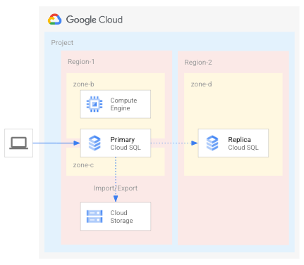
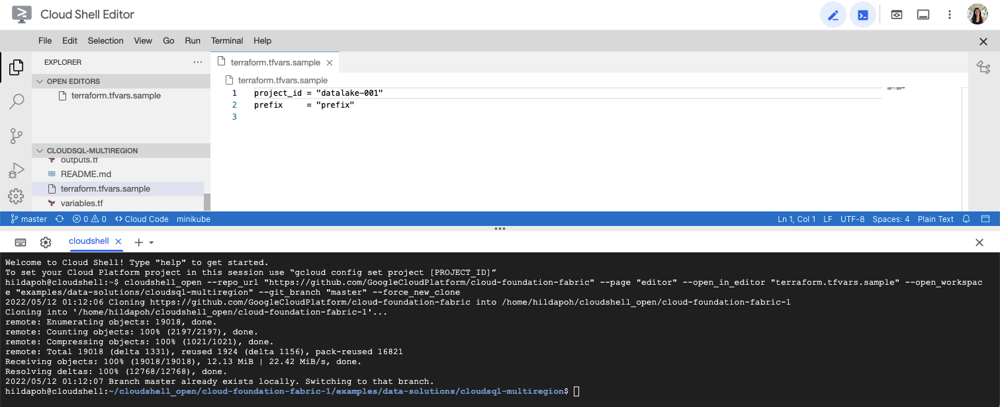
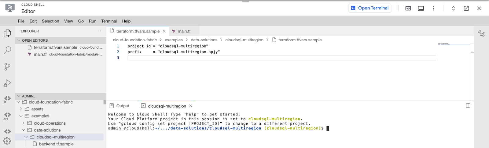
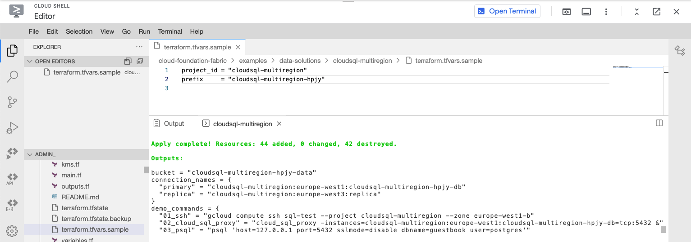

# Cloud SQL instance with multi-region read replicas

From startups to enterprises, database disaster recovery planning is critical to provide the continuity of processing. While Cloud SQL does provide high availability within a single region, regional failures or unavailability can occur from cyber attacks to natural disasters. Such incidents or outages lead to a quick domino effect for startups, making it difficult to recover from the loss of revenue and customers, which is especially true for bootstrapped or lean startups. It is critical that your database is regionally resilient and made available promptly in a secondary region. With Cloud SQL for PostgreSQL, you can configure cross-region read replicas for a complete DR failover and fallback process.

This blueprint creates a [Cloud SQL instance](https://cloud.google.com/sql) with multi-region read replicas as described in the [Cloud SQL for PostgreSQL disaster recovery](https://cloud.google.com/architecture/cloud-sql-postgres-disaster-recovery-complete-failover-fallback) article.

The solution is resilient to a regional outage. To get familiar with the procedure needed in the unfortunate case of a disaster recovery, please follow steps described in [part two](https://cloud.google.com/architecture/cloud-sql-postgres-disaster-recovery-complete-failover-fallback#phase-2) of the aforementioned article.

Use cases:

Configuring the CloudSQL instance for DR can be done in the following steps:

- Create an HA Cloud SQL for PostgreSQL instance.
- Deploy a cross-region read replica on Google Cloud using Cloud SQL for PostgreSQL.

The solution will use:

- [VPC](https://cloud.google.com/vpc) with Private Service Access to deploy the instances and VM
- [Cloud SQL - Postgre SQL](https://cloud.google.com/sql/pricing) instanced with Private IP
- [Goocle Cloud Storage](https://cloud.google.com/storage/) bucket to handle database import/export
- [Google Cloud Engine](https://cloud.google.com/compute) instance to connect to the Posgre SQL instance
- [Google Cloud NAT](https://cloud.google.com/nat/docs/overview) to access internet resources

This is the high level diagram:



If you're migrating from another Cloud Provider, refer to [this](https://cloud.google.com/free/docs/aws-azure-gcp-service-comparison) documentation to see equivalent services and comparisons in Microsoft Azure and Amazon Web Services.

## Requirements

This blueprint will deploy all its resources into the project defined by the `project_id` variable. Please note that we assume this project already exists. However, if you provide the appropriate values to the `project_create` variable, the project will be created as part of the deployment.

If `project_create` is left to `null`, the identity performing the deployment needs the `owner` role on the project defined by the `project_id` variable. Otherwise, the identity performing the deployment needs `resourcemanager.projectCreator` on the resource hierarchy node specified by `project_create.parent` and `billing.user` on the billing account specified by `project_create.billing_account_id`.

## Deployment

### Step 0: Cloning the repository

Click on the image below, sign in if required and when the prompt appears, click on “confirm”.

[](https://goo.gle/GoCloudSQL)

This will clone the repository to your cloud shell and a screen like this one will appear:



Before you deploy the architecture, make sure you run the following command to move your cloudshell session  into your service project: `gcloud config set project [SERVICE_PROJECT_ID]`

Before we deploy the architecture, you will need the following information:

- The service project ID.
- A unique prefix that you want all the deployed resources to have (for example: cloudsql-multiregion-hpjy). This must be a string with no spaces or tabs.

Once you can see your service project id in the yellow parenthesis, you’re ready to start.

### Step 1: Deploy resources

Once you have the required information, head back to the cloud shell editor. Make sure you’re in the following directory: `cloudshell_open/cloud-foundation-fabric/blueprints/data-solutions/cloudsql-multiregion/`

Configure the Terraform variables in your `terraform.tfvars` file. You need to specify at least the `project_id` and `prefix` variables. See  [`terraform.tfvars.sample`](terraform.tfvars.sample) as starting point.



Run Terraform init:

```shell
terraform init
terraform apply
```

The resource creation will take a few minutes, at the end this is the output you should expect for successful completion along with a list of the created resources:



## Move to real use case consideration

This implementation is intentionally minimal and easy to read. A real world use case should consider:

- Using a Shared VPC
- Using VPC-SC to mitigate data exfiltration

### Shared VPC

The example supports the configuration of a Shared VPC as an input variable.
To deploy the solution on a Shared VPC, you have to configure the `network_config` variable:

```
network_config = {
    host_project       = "PROJECT_ID"
    network_self_link  = "https://www.googleapis.com/compute/v1/projects/PROJECT_ID/global/networks/VPC_NAME"
    subnet_self_link   = "https://www.googleapis.com/compute/v1/projects/PROJECT_ID/regions/$REGION/subnetworks/SUBNET_NAME"
    cloudsql_psa_range = "10.60.0.0/24"
  }
```

To run this example, the Shared VPC project needs to have:

- A Private Service Connect with a range of `/24` (example: `10.60.0.0/24`) to deploy the Cloud SQL instance.
- Internet access configured (for example Cloud NAT) to let the Test VM download packages.

In order to run the example and deploy Cloud SQL on a shared VPC the identity running Terraform must have the following IAM role on the Shared VPC Host project.

- Compute Network Admin (roles/compute.networkAdmin)
- Compute Shared VPC Admin (roles/compute.xpnAdmin)

## Test your environment

We assume all those steps are run using a user listed on `data_eng_principals`. You can authenticate as the user using the following command:

```shell
gcloud init
gcloud auth application-default login
```

Below you can find commands to connect to the VM instance and Cloud SQL instance.

```shell
  $ gcloud compute ssh sql-test --project PROJECT_ID --zone ZONE
  sql-test:~$ cloud_sql_proxy -instances=CLOUDSQL_INSTANCE=tcp:5432
  sql-test:~$ psql 'host=127.0.0.1 port=5432 sslmode=disable dbname=DATABASE user=USER'
```

You can find computed commands on the Terraform `demo_commands` output.

## How to recover your initial deployment by using a fallback

To implement a fallback to your original region (R1) after it becomes available, you can follow the same process that is described in the above section. The process is summarized [here](https://cloud.google.com/architecture/cloud-sql-postgres-disaster-recovery-complete-failover-fallback#phase_3_implementing_a_fallback).

## Clean up your environment

The easiest way to remove all the deployed resources is to run the following command in Cloud Shell:

```shell
terraform destroy 
```

The above command will delete the associated resources so there will be no billable charges made afterwards.
<!-- BEGIN TFDOC -->

## Variables

| name | description | type | required | default |
|---|---|:---:|:---:|:---:|
| [postgres_user_password](variables.tf#L40) | `postgres` user password. | <code>string</code> | ✓ |  |
| [prefix](variables.tf#L51) | Unique prefix used for resource names. Not used for project if 'project_create' is null. | <code>string</code> | ✓ |  |
| [project_id](variables.tf#L65) | Project id, references existing project if `project_create` is null. | <code>string</code> | ✓ |  |
| [data_eng_principals](variables.tf#L23) | Groups with Service Account Token creator role on service accounts in IAM format, only user supported on CloudSQL, eg 'user@domain.com'. | <code>list&#40;string&#41;</code> |  | <code>&#91;&#93;</code> |
| [network_config](variables.tf#L29) | Shared VPC network configurations to use. If null networks will be created in projects with preconfigured values. | <code title="object&#40;&#123;&#10;  host_project       &#61; string&#10;  network_self_link  &#61; string&#10;  subnet_self_link   &#61; string&#10;  cloudsql_psa_range &#61; string&#10;&#125;&#41;">object&#40;&#123;&#8230;&#125;&#41;</code> |  | <code>null</code> |
| [postgres_database](variables.tf#L45) | `postgres` database. | <code>string</code> |  | <code>&#34;guestbook&#34;</code> |
| [project_create](variables.tf#L56) | Provide values if project creation is needed, uses existing project if null. Parent is in 'folders/nnn' or 'organizations/nnn' format. | <code title="object&#40;&#123;&#10;  billing_account_id &#61; string&#10;  parent             &#61; string&#10;&#125;&#41;">object&#40;&#123;&#8230;&#125;&#41;</code> |  | <code>null</code> |
| [regions](variables.tf#L70) | Map of instance_name => location where instances will be deployed. | <code>map&#40;string&#41;</code> |  | <code title="&#123;&#10;  primary &#61; &#34;europe-west1&#34;&#10;  replica &#61; &#34;europe-west3&#34;&#10;&#125;">&#123;&#8230;&#125;</code> |
| [service_encryption_keys](variables.tf#L17) | Cloud KMS keys to use to encrypt resources. Provide a key for each reagion configured. | <code>map&#40;string&#41;</code> |  | <code>null</code> |
| [sql_configuration](variables.tf#L84) | Cloud SQL configuration | <code title="object&#40;&#123;&#10;  availability_type &#61; string&#10;  database_version  &#61; string&#10;  psa_range         &#61; string&#10;  tier              &#61; string&#10;&#125;&#41;">object&#40;&#123;&#8230;&#125;&#41;</code> |  | <code title="&#123;&#10;  availability_type &#61; &#34;REGIONAL&#34;&#10;  database_version  &#61; &#34;POSTGRES_13&#34;&#10;  psa_range         &#61; &#34;10.60.0.0&#47;16&#34;&#10;  tier              &#61; &#34;db-g1-small&#34;&#10;&#125;">&#123;&#8230;&#125;</code> |

## Outputs

| name | description | sensitive |
|---|---|:---:|
| [bucket](outputs.tf#L22) | Cloud storage bucket to import/export data from Cloud SQL. |  |
| [connection_names](outputs.tf#L17) | Connection name of each instance. |  |
| [demo_commands](outputs.tf#L37) | Demo commands. |  |
| [ips](outputs.tf#L27) | IP address of each instance. |  |
| [project_id](outputs.tf#L32) | ID of the project containing all the instances. |  |
| [service_accounts](outputs.tf#L46) | Service Accounts. |  |

<!-- END TFDOC -->
