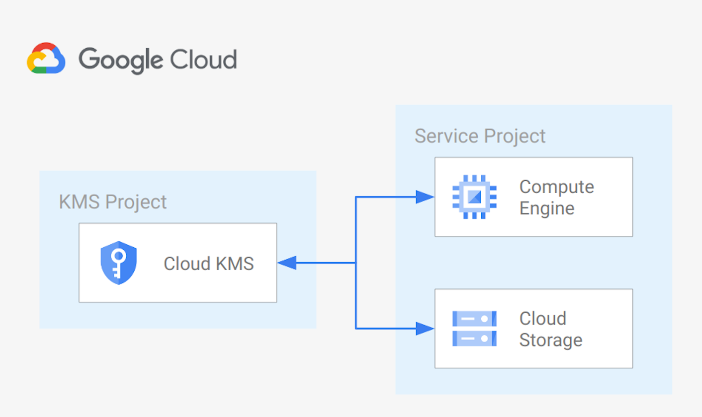

# GCE and GCS CMEK via centralized Cloud KMS

This example creates a sample centralized [Cloud KMS](https://cloud.google.com/kms?hl=it) configuration, and uses it to implement CMEK for [Cloud Storage](https://cloud.google.com/storage/docs/encryption/using-customer-managed-keys) and [Compute Engine](https://cloud.google.com/compute/docs/disks/customer-managed-encryption) in a separate project.

The example is designed to match real-world use cases with a minimum amount of resources, and be used as a starting point for scenarios where application projects implement CMEK using keys managed by a central team. It also includes the IAM wiring needed to make such scenarios work.

This is the high level diagram:

## Managed resources and services

This sample creates several distinct groups of resources:

- projects
  - Cloud KMS project
  - Service Project configured for GCE instances and GCS buckets
- networking
  - VPC network
  - One subnet
  - Firewall rules for [SSH access via IAP](https://cloud.google.com/iap/docs/using-tcp-forwarding) and open communication within the VPC
- IAM
  - One service account for the GGE instance
- KMS
  - One key ring
  - One crypto key (Protection level: software) for Cloud Engine
  - One crypto key (Protection level: software) for Cloud Storage
- GCE
  - One instance encrypted with a CMEK Cryptokey hosted in Cloud KMS
- GCS
  - One bucket encrypted with a CMEK Cryptokey hosted in Cloud KMS
<!-- BEGIN TFDOC -->

## Variables

| name | description | type | required | default |
|---|---|:---:|:---:|:---:|
| [billing_account](variables.tf#L16) | Billing account id used as default for new projects. | <code>string</code> | ✓ |  |
| [root_node](variables.tf#L45) | The resource name of the parent Folder or Organization. Must be of the form folders/folder_id or organizations/org_id. | <code>string</code> | ✓ |  |
| [location](variables.tf#L21) | The location where resources will be deployed. | <code>string</code> |  | <code>&#34;europe&#34;</code> |
| [project_kms_name](variables.tf#L27) | Name for the new KMS Project. | <code>string</code> |  | <code>&#34;my-project-kms-001&#34;</code> |
| [project_service_name](variables.tf#L33) | Name for the new Service Project. | <code>string</code> |  | <code>&#34;my-project-service-001&#34;</code> |
| [region](variables.tf#L39) | The region where resources will be deployed. | <code>string</code> |  | <code>&#34;europe-west1&#34;</code> |
| [vpc_ip_cidr_range](variables.tf#L50) | Ip range used in the subnet deployef in the Service Project. | <code>string</code> |  | <code>&#34;10.0.0.0&#47;20&#34;</code> |
| [vpc_name](variables.tf#L56) | Name of the VPC created in the Service Project. | <code>string</code> |  | <code>&#34;local&#34;</code> |
| [vpc_subnet_name](variables.tf#L62) | Name of the subnet created in the Service Project. | <code>string</code> |  | <code>&#34;subnet&#34;</code> |

## Outputs

| name | description | sensitive |
|---|---|:---:|
| [bucket](outputs.tf#L15) | GCS Bucket URL. |  |
| [bucket_keys](outputs.tf#L20) | GCS Bucket Cloud KMS crypto keys. |  |
| [projects](outputs.tf#L25) | Project ids. |  |
| [vm](outputs.tf#L33) | GCE VM. |  |
| [vm_keys](outputs.tf#L41) | GCE VM Cloud KMS crypto keys. |  |

<!-- END TFDOC -->
