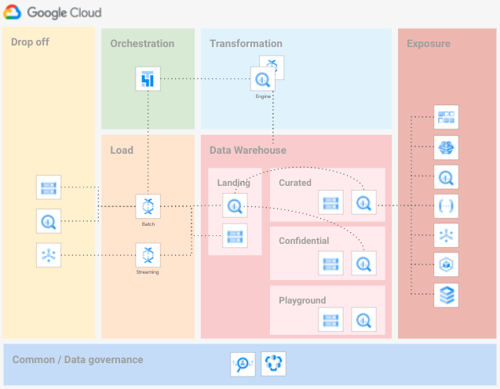
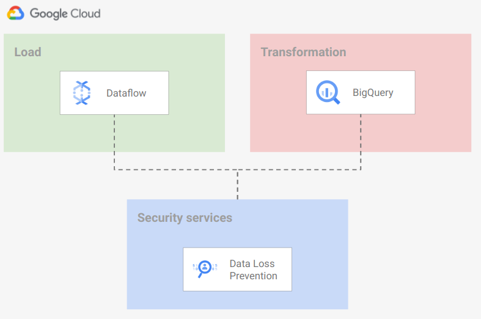

# Data Platform

This module implements an opinionated Data Platform Architecture that creates and setup projects and related resources that compose an end-to-end data environment.

The code is intentionally simple, as it's intended to provide a generic initial setup and then allow easy customizations to complete the implementation of the intended design.

The following diagram is a high-level reference of the resources created and managed here:



A demo Airflow pipeline is also part of this blueprint: it can be built and run on top of the foundational infrastructure to verify or test the setup quickly.

## Design overview and choices

Despite its simplicity, this stage implements the basics of a design that we've seen working well for various customers.

The approach adapts to different high-level requirements:

- boundaries for each step
- clearly defined actors
- least privilege principle
- rely on service account impersonation

The code in this blueprint doesn't address Organization-level configurations (Organization policy, VPC-SC, centralized logs). We expect those elements to be managed by automation stages external to this script like those in [FAST](../../../fast).

### Project structure

The Data Platform is designed to rely on several projects, one project per data stage. The stages identified are:

- drop off
- load
- data warehouse
- orchestration
- transformation
- exposure

This separation into projects allows adhering to the least-privilege principle by using project-level roles.

The script will create the following projects:

- **Drop off** Used to store temporary data. Data is pushed to Cloud Storage, BigQuery, or Cloud PubSub. Resources are configured with a customizable lifecycle policy.
- **Load** Used to load data from the drop off zone to the data warehouse. The load is made with minimal to zero transformation logic (mainly `cast`). Anonymization or tokenization of Personally Identifiable Information (PII) can be implemented here or in the transformation stage, depending on your requirements. The use of [Cloud Dataflow templates](https://cloud.google.com/dataflow/docs/concepts/dataflow-templates) is recommended.
- **Data Warehouse** Several projects distributed across 3 separate layers, to host progressively processed and refined data:
  - **Landing - Raw data** Structured Data, stored in relevant formats: structured data stored in BigQuery, unstructured data stored on Cloud Storage with additional metadata stored in BigQuery (for example pictures stored in Cloud Storage and analysis of the images for Cloud Vision API stored in BigQuery).
  - **Curated - Cleansed, aggregated and curated data**
  - **Confidential - Curated and unencrypted layer**
  - **Playground** Temporary tables that Data Analyst may use to perform R&D on data available in other Data Warehouse layers.
- **Orchestration** Used to host Cloud Composer, which orchestrates all tasks that move data across layers.
- **Transformation** Used to move data between Data Warehouse layers. We strongly suggest relying on BigQuery Engine to perform the transformations. If BigQuery doesn't have the features needed to perform your transformations, you can use Cloud Dataflow with [Cloud Dataflow templates](https://cloud.google.com/dataflow/docs/concepts/dataflow-templates). This stage can also optionally  anonymize or tokenize PII.
- **Exposure** Used to host resources that share processed data with external systems. Depending on the access pattern, data can be presented via Cloud SQL, BigQuery, or Bigtable. For BigQuery data, we strongly suggest relying on [Authorized views](https://cloud.google.com/bigquery/docs/authorized-views).

### Roles

We assign roles on resources at the project level, granting the appropriate roles via groups (humans) and service accounts (services and applications) according to best practices.

### Service accounts

Service account creation follows the least privilege principle, performing a single task which requires access to a defined set of resources. The table below shows a high level overview of roles for each service account on each data layer, using `READ` or `WRITE` access patterns for simplicity. For detailed roles please refer to the code.

|Service Account|Drop off|DWH Landing|DWH Curated|DWH Confidential|
|-|:-:|:-:|:-:|:-:|
|`drop-sa`|`WRITE`|-|-|-|
|`load-sa`|`READ`|`READ`/`WRITE`|-|-|
|`transformation-sa`|-|`READ`/`WRITE`|`READ`/`WRITE`|`READ`/`WRITE`|
|`orchestration-sa`|-|-|-|-|

A full reference of IAM roles managed by the Data Platform [is available here](./IAM.md).

Using of service account keys within a data pipeline exposes to several security risks deriving from a credentials leak. This blueprint shows how to leverage impersonation to avoid the need of creating keys.

### User groups

User groups provide a stable frame of reference that allows decoupling the final set of permissions from the stage where entities and resources are created, and their IAM bindings defined.

We use three groups to control access to resources:

- *Data Engineers* They handle and run the Data Hub, with read access to all resources in order to troubleshoot possible issues with pipelines. This team can also impersonate any service account.
- *Data Analysts*. They perform analysis on datasets, with read access to the Data Warehouse Confidential project, and BigQuery READ/WRITE access to the playground project.
- *Data Security*:. They handle security configurations related to the Data Hub. This team has admin access to the common project to configure Cloud DLP templates or Data Catalog policy tags.

The table below shows a high level overview of roles for each group on each project, using `READ`, `WRITE` and `ADMIN` access patterns for simplicity. For detailed roles please refer to the code.

|Group|Drop off|Load|Transformation|DHW Landing|DWH Curated|DWH Confidential|DWH Playground|Orchestration|Common|
|-|:-:|:-:|:-:|:-:|:-:|:-:|:-:|:-:|:-:|
|Data Engineers|`ADMIN`|`ADMIN`|`ADMIN`|`ADMIN`|`ADMIN`|`ADMIN`|`ADMIN`|`ADMIN`|`ADMIN`|
|Data Analysts|-|-|-|-|-|`READ`|`READ`/`WRITE`|-|-|
|Data Security|-|-|-|-|-|-|-|-|`ADMIN`|

You can configure groups via the `groups` variable.

### Virtual Private Cloud (VPC) design

As is often the case in real-world configurations, this blueprint accepts as input an existing [Shared-VPC](https://cloud.google.com/vpc/docs/shared-vpc) via the `network_config` variable. Make sure that the GKE API (`container.googleapis.com`) is enabled in the VPC host project.

If the `network_config` variable is not provided, one VPC will be created in each project that supports network resources (load, transformation and orchestration).

### IP ranges and subnetting

To deploy this blueprint with self-managed VPCs you need the following ranges:

- one /24 for the load project VPC subnet used for Cloud Dataflow workers
- one /24 for the transformation VPC subnet used for Cloud Dataflow workers
- one /24 range for the orchestration VPC subnet used for Composer workers
- one /22 and one /24 ranges for the secondary ranges associated with the orchestration VPC subnet

If you are using Shared VPC, you need one subnet with one /22 and one /24 secondary range defined for Composer pods and services.

In both VPC scenarios, you also need these ranges for Composer:

- one /24 for Cloud SQL
- one /28 for the GKE control plane
- one /28 for the web server

### Resource naming conventions

Resources follow the naming convention described below.

- `prefix-layer` for projects
- `prefix-layer-prduct` for resources
- `prefix-layer[2]-gcp-product[2]-counter` for services and service accounts

### Encryption

We suggest a centralized approach to key management, where Organization Security is the only team that can access encryption material, and keyrings and keys are managed in a project external to the Data Platform.


To configure the use of Cloud KMS on resources, you have to specify the key id on the `service_encryption_keys` variable. Key locations should match resource locations. Example:

```tfvars
service_encryption_keys = {
    bq       = "KEY_URL_MULTIREGIONAL"
    composer = "KEY_URL_REGIONAL"
    dataflow = "KEY_URL_REGIONAL"
    storage  = "KEY_URL_MULTIREGIONAL"
    pubsub   = "KEY_URL_MULTIREGIONAL"
}
# tftest skip
```

This step is optional and depends on customer policies and security best practices.

## Data Anonymization

We suggest using Cloud Data Loss Prevention to identify/mask/tokenize your confidential data.

While implementing a Data Loss Prevention strategy is out of scope for this blueprint, we enable the service in two different projects so that [Cloud Data Loss Prevention templates](https://cloud.google.com/dlp/docs/concepts-templates) can be configured in one of two ways:

- during the ingestion phase, from Dataflow
- during the transformation phase, from [BigQuery](https://cloud.google.com/bigquery/docs/scan-with-dlp) or [Cloud Dataflow](https://cloud.google.com/architecture/running-automated-dataflow-pipeline-de-identify-pii-dataset)

Cloud Data Loss Prevention resources and templates should be stored in the security project:



You can find more details and best practices on using DLP to De-identification and re-identification of PII in large-scale datasets in the [GCP documentation](https://cloud.google.com/architecture/de-identification-re-identification-pii-using-cloud-dlp).

## Data Catalog

[Data Catalog](https://cloud.google.com/data-catalog) helps you to document your data entry at scale. Data Catalog relies on [tags](https://cloud.google.com/data-catalog/docs/tags-and-tag-templates#tags) and [tag template](https://cloud.google.com/data-catalog/docs/tags-and-tag-templates#tag-templates) to manage metadata for all data entries in a unified and centralized service. To implement [column-level security](https://cloud.google.com/bigquery/docs/column-level-security-intro) on BigQuery, we suggest to use `Tags` and `Tag templates`.

The default configuration will implement 3 tags:

- `3_Confidential`: policy tag for columns that include very sensitive information, such as credit card numbers.
- `2_Private`: policy tag for columns that include sensitive personal identifiable information (PII) information, such as a person's first name.
- `1_Sensitive`: policy tag for columns that include data that cannot be made public, such as the credit limit.

Anything that is not tagged is available to all users who have access to the data warehouse.

For the purpose of the blueprint no groups has access to tagged data. You can configure your tags and roles associated by configuring the `data_catalog_tags` variable. We suggest using the "[Best practices for using policy tags in BigQuery](https://cloud.google.com/bigquery/docs/best-practices-policy-tags)" article as a guide to designing your tags structure and access pattern.

## How to run this script

To deploy this blueprint on your GCP organization, you will need

- a folder or organization where new projects will be created
- a billing account that will be associated with the new projects

The Data Platform is meant to be executed by a Service Account (or a regular user) having this minimal set of permission:

- **Billing account**
  - `roles/billing.user`
- **Folder level**:
  - `roles/resourcemanager.folderAdmin`
  - `roles/resourcemanager.projectCreator`
- **KMS Keys** (If CMEK encryption in use):
  - `roles/cloudkms.admin` or a custom role with `cloudkms.cryptoKeys.getIamPolicy`, `cloudkms.cryptoKeys.list`, `cloudkms.cryptoKeys.setIamPolicy` permissions
- **Shared VPC host project** (if configured):\
  - `roles/compute.xpnAdmin` on the host project folder or org
  - `roles/resourcemanager.projectIamAdmin` on the host project, either with no conditions or with a condition allowing [delegated role grants](https://medium.com/google-cloud/managing-gcp-service-usage-through-delegated-role-grants-a843610f2226#:~:text=Delegated%20role%20grants%20is%20a,setIamPolicy%20permission%20on%20a%20resource.) for `roles/compute.networkUser`, `roles/composer.sharedVpcAgent`, `roles/container.hostServiceAgentUser`

## Variable configuration

There are three sets of variables you will need to fill in:

```tfvars
billing_account_id  = "111111-222222-333333"
older_id            = "folders/123456789012"
organization_domain = "domain.com"
prefix              = "myco"
# tftest skip`
``

For more fine details check variables on [`variables.tf`](./variables.tf) and update according to the desired configuration. Remember to create team groups described [below](#groups).

Once the configuration is complete, run the project factory by running

```bash
terraform init
terraform apply
```

## How to use this blueprint from Terraform

While this blueprint can be used as a standalone deployment, it can also be called directly as a Terraform module by providing the variables values as show below:

```hcl
module "data-platform" {
  source              = "./fabric/blueprints/data-solutions/data-platform-foundations"
  billing_account_id  = var.billing_account_id
  folder_id           = var.folder_id
  organization_domain = "example.com"
  prefix              = "myprefix"
}

# tftest modules=42 resources=316
```

## Customizations

### Create Cloud Key Management keys as part of the Data Platform

To create Cloud Key Management keys in the Data Platform you can uncomment the Cloud Key Management resources configured in the [`06-common.tf`](./06-common.tf) file and update Cloud Key Management keys pointers on `local.service_encryption_keys.*` to the local resource created.

### Assign roles at BQ Dataset level

To handle multiple groups of `data-analysts` accessing the same Data Warehouse layer projects but only to the dataset belonging to a specific group, you may want to assign roles at BigQuery dataset level instead of at project-level.
To do this, you need to remove IAM binging at project-level for the `data-analysts` group and give roles at BigQuery dataset level using the `iam` variable on `bigquery-dataset` modules.

## Demo pipeline

The application layer is out of scope of this script. As a demo purpuse only, several Cloud Composer DAGs are provided. Demos will import data from the `drop off` area to the `Data Warehouse Confidential` dataset suing different features.

You can find examples in the `[demo](./demo)` folder.
<!-- BEGIN TFDOC -->

## Variables

| name | description | type | required | default |
|---|---|:---:|:---:|:---:|
| [billing_account_id](variables.tf#L17) | Billing account id. | <code>string</code> | ✓ |  |
| [folder_id](variables.tf#L53) | Folder to be used for the networking resources in folders/nnnn format. | <code>string</code> | ✓ |  |
| [organization_domain](variables.tf#L98) | Organization domain. | <code>string</code> | ✓ |  |
| [prefix](variables.tf#L103) | Unique prefix used for resource names. | <code>string</code> | ✓ |  |
| [composer_config](variables.tf#L22) | Cloud Composer config. | <code title="object&#40;&#123;&#10;  node_count      &#61; number&#10;  airflow_version &#61; string&#10;  env_variables   &#61; map&#40;string&#41;&#10;&#125;&#41;">object&#40;&#123;&#8230;&#125;&#41;</code> |  | <code title="&#123;&#10;  node_count      &#61; 3&#10;  airflow_version &#61; &#34;composer-1-airflow-2&#34;&#10;  env_variables   &#61; &#123;&#125;&#10;&#125;">&#123;&#8230;&#125;</code> |
| [data_catalog_tags](variables.tf#L36) | List of Data Catalog Policy tags to be created with optional IAM binging configuration in {tag => {ROLE => [MEMBERS]}} format. | <code>map&#40;map&#40;list&#40;string&#41;&#41;&#41;</code> |  | <code title="&#123;&#10;  &#34;3_Confidential&#34; &#61; null&#10;  &#34;2_Private&#34;      &#61; null&#10;  &#34;1_Sensitive&#34;    &#61; null&#10;&#125;">&#123;&#8230;&#125;</code> |
| [data_force_destroy](variables.tf#L47) | Flag to set 'force_destroy' on data services like BiguQery or Cloud Storage. | <code>bool</code> |  | <code>false</code> |
| [groups](variables.tf#L58) | User groups. | <code>map&#40;string&#41;</code> |  | <code title="&#123;&#10;  data-analysts  &#61; &#34;gcp-data-analysts&#34;&#10;  data-engineers &#61; &#34;gcp-data-engineers&#34;&#10;  data-security  &#61; &#34;gcp-data-security&#34;&#10;&#125;">&#123;&#8230;&#125;</code> |
| [location](variables.tf#L68) | Location used for multi-regional resources. | <code>string</code> |  | <code>&#34;eu&#34;</code> |
| [network_config](variables.tf#L74) | Shared VPC network configurations to use. If null networks will be created in projects with preconfigured values. | <code title="object&#40;&#123;&#10;  host_project      &#61; string&#10;  network_self_link &#61; string&#10;  subnet_self_links &#61; object&#40;&#123;&#10;    load           &#61; string&#10;    transformation &#61; string&#10;    orchestration  &#61; string&#10;  &#125;&#41;&#10;  composer_ip_ranges &#61; object&#40;&#123;&#10;    cloudsql   &#61; string&#10;    gke_master &#61; string&#10;    web_server &#61; string&#10;  &#125;&#41;&#10;  composer_secondary_ranges &#61; object&#40;&#123;&#10;    pods     &#61; string&#10;    services &#61; string&#10;  &#125;&#41;&#10;&#125;&#41;">object&#40;&#123;&#8230;&#125;&#41;</code> |  | <code>null</code> |
| [project_services](variables.tf#L108) | List of core services enabled on all projects. | <code>list&#40;string&#41;</code> |  | <code title="&#91;&#10;  &#34;cloudresourcemanager.googleapis.com&#34;,&#10;  &#34;iam.googleapis.com&#34;,&#10;  &#34;serviceusage.googleapis.com&#34;,&#10;  &#34;stackdriver.googleapis.com&#34;&#10;&#93;">&#91;&#8230;&#93;</code> |
| [project_suffix](variables.tf#L119) | Suffix used only for project ids. | <code>string</code> |  | <code>null</code> |
| [region](variables.tf#L125) | Region used for regional resources. | <code>string</code> |  | <code>&#34;europe-west1&#34;</code> |
| [service_encryption_keys](variables.tf#L131) | Cloud KMS to use to encrypt different services. Key location should match service region. | <code title="object&#40;&#123;&#10;  bq       &#61; string&#10;  composer &#61; string&#10;  dataflow &#61; string&#10;  storage  &#61; string&#10;  pubsub   &#61; string&#10;&#125;&#41;">object&#40;&#123;&#8230;&#125;&#41;</code> |  | <code>null</code> |

## Outputs

| name | description | sensitive |
|---|---|:---:|
| [bigquery-datasets](outputs.tf#L17) | BigQuery datasets. |  |
| [demo_commands](outputs.tf#L93) | Demo commands. |  |
| [gcs-buckets](outputs.tf#L28) | GCS buckets. |  |
| [kms_keys](outputs.tf#L42) | Cloud MKS keys. |  |
| [projects](outputs.tf#L47) | GCP Projects informations. |  |
| [vpc_network](outputs.tf#L75) | VPC network. |  |
| [vpc_subnet](outputs.tf#L84) | VPC subnetworks. |  |

<!-- END TFDOC -->
## TODOs

Features to add in future releases:

- Add example on how to use Cloud Data Loss Prevention
- Add solution to handle Tables, Views, and Authorized Views lifecycle
- Add solution to handle Metadata lifecycle
