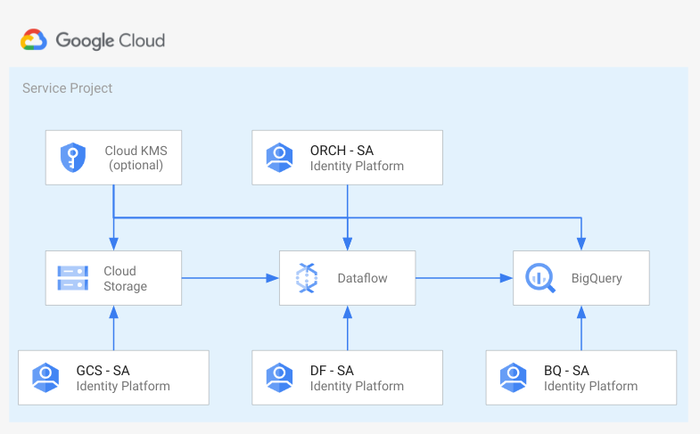
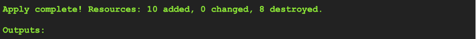
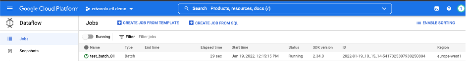
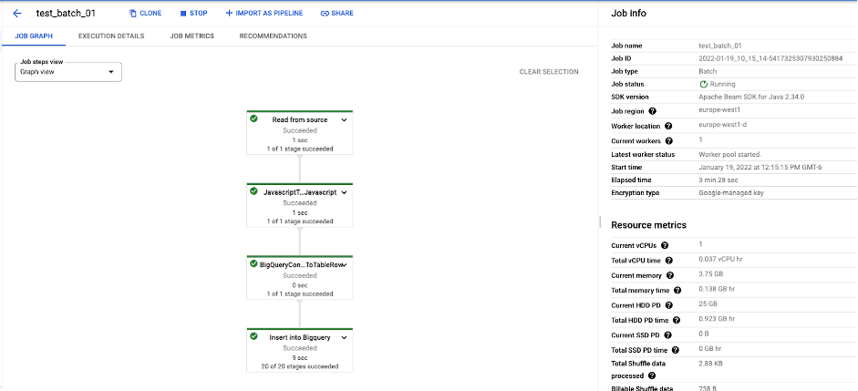

# Spinning up a foundation data pipeline on Google Cloud using Cloud Storage, Dataflow and BigQuery

## Introduction

This repository contains the necessary Terraform modules to securely deploy a basic ETL pipeline that will dump data from a Google Cloud Storage (GCS) bucket to tables in BigQuery.

An ETL pipeline is defined in three steps:

* Extraction: retrieving data from sources.
* Transformation: cleaning the data, putting it into a common format, calculating other fields, taking out duplicates or erroneous records so it can be stored into a target.
* Loading: inserting the formatted data into the target database, data store, data warehouse or data lake.

You can learn more about cloud-based ETL [here](https://cloud.google.com/learn/what-is-etl).

## Use cases

Whether you’re transferring from another Cloud Service Provider or you’re taking your first steps into the cloud with Google Cloud, building a data pipeline sets a good foundation to begin deriving insights for your business.

* __Anomaly Detection__: building data pipelines to identify cyber security threats or fraudulent transactions using machine learning (ML) models.
* __Interactive Data Analysis__: carry out interactive data analysis with BigQuery BI Engine that enables you to analyze large and complex datasets interactively with sub-second query response time and high concurrency.
* __Predictive Forecasting__: building solid pipelines to capture real-time data for ML modeling and using it as a forecasting engine for situations ranging from weather predictions to market forecasting.
* __Create Machine Learning models__: using BigQueryML you can create and execute machine learning models in BigQuery using standard SQL queries. Create a variety of models pre-built into BigQuery that you train with your data.

## Architecture

The main components that we would be setting up are (to learn more about these products, click on the hyperlinks):

* [Cloud Storage (GCS) bucket](https://cloud.google.com/storage/): data lake solution to store extracted raw data that must undergo some kind of transformation.
* [Cloud Dataflow pipeline](https://cloud.google.com/dataflow): to build fully managed batch and streaming pipelines to transform data stored in GCS buckets ready for processing in the Data Warehouse using Apache Beam.
* [BigQuery datasets and tables](https://cloud.google.com/bigquery): to store the transformed data in and query it using SQL, use it to make reports or begin training [machine learning](https://cloud.google.com/bigquery-ml/docs/introduction) models without having to take your data out.
* [Service accounts](https://cloud.google.com/iam/docs/service-accounts) (__created with least privilege on each resource__): one for uploading data into the GCS bucket, one for Orchestration, one for Dataflow instances and one for the BigQuery tables. You can also configure users or groups of users to assign them a viewer role on the created resources and the ability to impersonate service accounts to test the Dataflow pipelines before automating them with a tool like [Cloud Composer](https://cloud.google.com/composer).

For a full list of the resources that will be created, please refer to the [github repository](https://github.com/GoogleCloudPlatform/cloud-foundation-fabric/tree/master/blueprints/data-solutions/gcs-to-bq-with-least-privileges) for this project. If you're migrating from another Cloud Provider, refer to [this](https://cloud.google.com/free/docs/aws-azure-gcp-service-comparison) documentation to see equivalent services and comparisons in Microsoft Azure and Amazon Web Services

## Costs

Pricing Estimates - We have created a sample estimate based on some usage we see from new startups looking to scale. This estimate would give you an idea of how much this deployment would essentially cost per month at this scale and you extend it to the scale you further prefer. Here's the [link](https://cloud.google.com/products/calculator#id=44710202-c9d4-49d5-a378-99d7dd34f5e2).

## Setup

This solution assumes you already have a project created and set up where you wish to host these resources. If not, and you would like for the project to create a new project as well,  please refer to the [github repository](https://github.com/GoogleCloudPlatform/cloud-foundation-fabric/tree/master/blueprints/data-solutions/gcs-to-bq-with-least-privileges) for instructions.

### Prerequisites

* Have an [organization](https://cloud.google.com/resource-manager/docs/creating-managing-organization) set up in Google cloud.
* Have a [billing account](https://cloud.google.com/billing/docs/how-to/manage-billing-account) set up.
* Have an existing [project](https://cloud.google.com/resource-manager/docs/creating-managing-projects) with [billing enabled](https://cloud.google.com/billing/docs/how-to/modify-project), we’ll call this the __service project__.

### Roles & Permissions

In order to spin up this architecture, you will need to be a user with the “__Project owner__” [IAM](https://cloud.google.com/iam) role on the existing project:

__Note__: To grant a user a role, take a look at the [Granting and Revoking Access](https://cloud.google.com/iam/docs/granting-changing-revoking-access#grant-single-role) documentation.

### Spinning up the architecture

#### Step 1: Cloning the repository

Click on the button below, sign in if required and when the prompt appears, click on “confirm”.

This will clone the repository to your cloud shell and a screen like this one will appear:

Before you deploy the architecture, make sure you run the following command to move your cloudshell session into your service project:

        gcloud config set project [SERVICE_PROJECT_ID]

Once you can see your service project id in the yellow parenthesis, you’re ready to start.

Before we deploy the architecture, you will need the following information:

* The __service project ID__.
* A __unique prefix__ that you want all the deployed resources to have (for example: awesomestartup). This must be a string with no spaces or tabs.
* A __list of Groups or Users__ with Service Account Token creator role on Service Accounts in IAM format, eg 'group:group@domain.com'.

#### Step 2: Deploying the resources

1. Once you have the required information, head back to the cloud shell editor. Make sure you’re in the following directory:

        cloudshell_open/cloud-foundation-fabric/blueprints/data-solutions/gcs-to-bq-with-least-privileges

2. In the editor, edit the terraform.tfvars.sample file with the variables you gathered in the step above.

* a. Fill in __data_eng_principals__ with the list of Users or Groups to impersonate service accounts.

* b. Fill in __project_id__ with the service project ID.

* c. Fill in the prefix with your chosen unique prefix for resources.

* d. Save the file with __Ctrl(or ⌘)+S__ or by going to __File → Save__.

3. Then, run the following commands:

        terraform init
        
        terraform apply -var-file=terraform.tfvars.sample -auto-approve

The resource creation will take a few minutes, at the end this is the output you should expect for successful completion along with a list of the created resources:

__Congratulations!__ You have successfully deployed the foundation for running your first ETL pipeline on Google Cloud.

### Testing your architecture

For the purpose of demonstrating how the ETL pipeline flow works, we’ve set up an example pipeline for you to run.  First of all, we assume all the steps are run using a user listed on the __data_eng_principles__ variable (or a user that belongs to one of the groups you specified). Authenticate the user using the following command and make sure your active cloudshell session is set to the __service project__:

        gcloud auth application-default login

Follow the instructions in the cloudshell to authenticate the user.

To make the next steps easier, create two environment variables with the service project id and the prefix:

        export SERVICE_PROJECT_ID=[SERVICE_PROJECT_ID]
        export PREFIX=[PREFIX]

Again, make sure you’re in the following directory:

        cloudshell_open/cloud-foundation-fabric/blueprints/data-solutions/gcs-to-bq-with-least-privileges

For the purpose of the example we will import from GCS to Bigquery a CSV file with the following structure:

        name,surname,timestamp

We need to create 3 files:

* A person.csv file containing your data in the form name,surname,timestamp.  For example: `Eva,Rivarola,1637771951'.
* A person_udf.js containing the [UDF javascript file](https://cloud.google.com/bigquery/docs/reference/standard-sql/user-defined-functions) used by the Dataflow template.
* A person_schema.json file containing the table schema used to import the CSV.

An example of those files can be found  in the folder ./data-demo. Inside the same repository where you ran the terraform commands.

You can copy the example files into the GCS bucket by running:

        gsutil -i gcs-landing@$SERVICE_PROJECT_ID.iam.gserviceaccount.com cp data-demo/* gs://$PREFIX-data

Once this is done, the 3 files necessary to run the Dataflow Job will have been copied to the GCS bucket that was created along with the resources.

Run the following command to start the dataflow job:

    gcloud --impersonate-service-account=orchestrator@$SERVICE_PROJECT_ID.iam.gserviceaccount.com dataflow jobs run test_batch_01 \
    --gcs-location gs://dataflow-templates/latest/GCS_Text_to_BigQuery \
    --project $SERVICE_PROJECT_ID \
    --region europe-west1 \
    --disable-public-ips \
    --subnetwork https://www.googleapis.com/compute/v1/projects/$SERVICE_PROJECT_ID/regions/europe-west1/subnetworks/subnet \
    --staging-location gs://$PREFIX-df-tmp \
    --service-account-email df-loading@$SERVICE_PROJECT_ID.iam.gserviceaccount.com \
    --parameters \
    javascriptTextTransformFunctionName=transform,\
    JSONPath=gs://$PREFIX-data/person_schema.json,\
    javascriptTextTransformGcsPath=gs://$PREFIX-data/person_udf.js,\
    inputFilePattern=gs://$PREFIX-data/person.csv,\
    outputTable=$SERVICE_PROJECT_ID:datalake.person,\
    bigQueryLoadingTemporaryDirectory=gs://$PREFIX-df-tmp

This command will start a dataflow job called test_batch_01 that uses a Dataflow transformation script stored in the public GCS bucket:

        gs://dataflow-templates/latest/GCS_Text_to_BigQuery.

The expected output is the following:

Then, if you navigate to Dataflow on the console, you will see the following:

This shows the job you started from the cloudshell is currently running in Dataflow.
If you click on the job name, you can see the job graph created and how every step of the Dataflow pipeline is moving along:

Once the job completes, you can navigate to BigQuery in the console and under __SERVICE_PROJECT_ID__ → datalake → person, you can see the data that was successfully imported into BigQuery through the Dataflow job.

## Cleaning up your environment

The easiest way to remove all the deployed resources is to run the following command in Cloud Shell:

        terraform destroy -var-file=terraform.tfvars.sample -auto-approve
  
The above command will delete the associated resources so there will be no billable charges made afterwards.
<!-- BEGIN TFDOC -->

## Variables

| name | description | type | required | default |
|---|---|:---:|:---:|:---:|
| [prefix](variables.tf#L36) | Unique prefix used for resource names. Not used for project if 'project_create' is null. | <code>string</code> | ✓ |  |
| [project_id](variables.tf#L50) | Project id, references existing project if `project_create` is null. | <code>string</code> | ✓ |  |
| [cmek_encryption](variables.tf#L15) | Flag to enable CMEK on GCP resources created. | <code>bool</code> |  | <code>false</code> |
| [data_eng_principals](variables.tf#L21) | Groups with Service Account Token creator role on service accounts in IAM format, eg 'group:group@domain.com'. | <code>list&#40;string&#41;</code> |  | <code>&#91;&#93;</code> |
| [network_config](variables.tf#L27) | Shared VPC network configurations to use. If null networks will be created in projects with preconfigured values. | <code title="object&#40;&#123;&#10;  host_project     &#61; string&#10;  subnet_self_link &#61; string&#10;&#125;&#41;">object&#40;&#123;&#8230;&#125;&#41;</code> |  | <code>null</code> |
| [project_create](variables.tf#L41) | Provide values if project creation is needed, uses existing project if null. Parent is in 'folders/nnn' or 'organizations/nnn' format. | <code title="object&#40;&#123;&#10;  billing_account_id &#61; string&#10;  parent             &#61; string&#10;&#125;&#41;">object&#40;&#123;&#8230;&#125;&#41;</code> |  | <code>null</code> |
| [region](variables.tf#L55) | The region where resources will be deployed. | <code>string</code> |  | <code>&#34;europe-west1&#34;</code> |
| [vpc_subnet_range](variables.tf#L61) | Ip range used for the VPC subnet created for the example. | <code>string</code> |  | <code>&#34;10.0.0.0&#47;20&#34;</code> |

## Outputs

| name | description | sensitive |
|---|---|:---:|
| [bq_tables](outputs.tf#L15) | Bigquery Tables. |  |
| [buckets](outputs.tf#L20) | GCS bucket Cloud KMS crypto keys. |  |
| [command_01_gcs](outputs.tf#L43) | gcloud command to copy data into the created bucket impersonating the service account. |  |
| [command_02_dataflow](outputs.tf#L48) | Command to run Dataflow template impersonating the service account. |  |
| [command_03_bq](outputs.tf#L69) | BigQuery command to query imported data. |  |
| [project_id](outputs.tf#L28) | Project id. |  |
| [service_accounts](outputs.tf#L33) | Service account. |  |

<!-- END TFDOC -->
