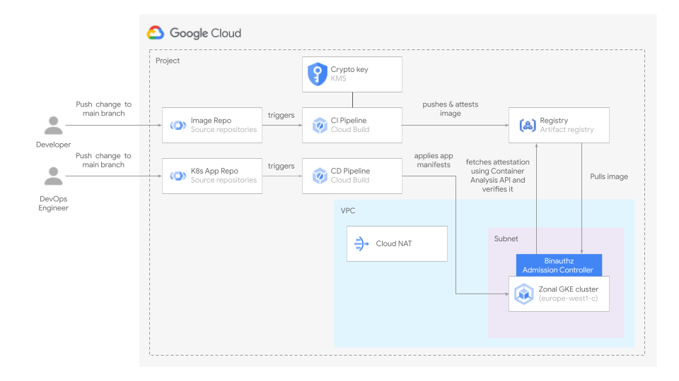

# GKE blueprints

The blueprints in this folder show implement **end-to-end scenarios** for GKE topologies that show how to automate common configurations or leverage specific products.

They are meant to be used as minimal but complete starting points to create actual infrastructure, and as playgrounds to experiment with Google Cloud features.

## Blueprints

### Binary Authorization Pipeline

 This [blueprint](../gke/binauthz/) shows how to create a CI and a CD pipeline in Cloud Build for the deployment of an application to a private GKE cluster with unrestricted access to a public endpoint. The blueprint enables a Binary Authorization policy in the project so only images that have been attested can be deployed to the cluster. The attestations are created using a cryptographic key pair that has been provisioned in KMS.

 

### Multi-cluster mesh on GKE (fleet API)

 This [blueprint](../gke/multi-cluster-mesh-gke-fleet-api/) shows how to create a multi-cluster mesh for two private clusters on GKE. Anthos Service Mesh with automatic control plane management is set up for clusters using the Fleet API. This can only be done if the clusters are in a single project and in the same VPC. In this particular case both clusters having being deployed to different subnets in a shared VPC.

 

### Multitenant GKE fleet

 This [blueprint](./multitenant-fleet/) allows simple centralized management of similar sets of GKE clusters and their nodepools in a single project, and optional fleet management via GKE Hub templated configurations.
 

### Shared VPC with GKE and per-subnet support

 This [blueprint](../networking/shared-vpc-gke/) shows how to configure a Shared VPC, including the specific IAM configurations needed for GKE, and to give different level of access to the VPC subnets to different identities.

It is meant to be used as a starting point for most Shared VPC configurations, and to be integrated to the above blueprints where Shared VPC is needed in more complex network topologies.

 
