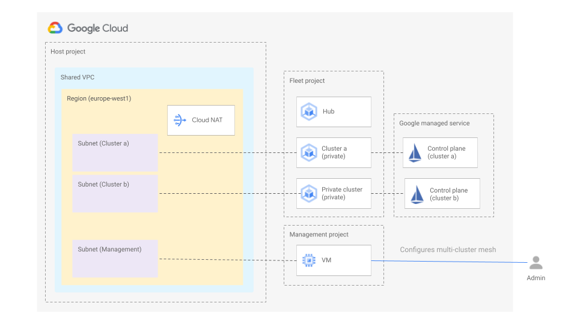

# Multi-cluster mesh on GKE (fleet API)

The following blueprint shows how to create a multi-cluster mesh for two private clusters on GKE. Anthos Service Mesh with automatic control plane management is set up for clusters using the Fleet API. This can only be done if the clusters are in a single project and in the same VPC. In this particular case both clusters having being deployed to different subnets in a shared VPC.

The diagram below depicts the architecture of the blueprint.

Terraform is used to provision the required infrastructure, create the IAM binding and register the clusters to the fleet.

Ansible is used to execute commands in the management VM. From this VM there is access to the cluster's endpoint. More specifically the following is done using Ansible:

1. Install required dependencies in the VM
2. Enable automatic control plane management in both clusters.
3. Verify the control plane has been provisioned for both clusters.
4. Configure ASM control plane endpoint discovery between the two clusters.
5. Create a sample namespace in both clusters.
6. Configure automatic sidecar injection in the created namespace.
7. Deploy a hello-world service in both clusters
8. Deploy a hello-world deployment (v1) in cluster a
9. Deploy a hello-world deployment (v2) in cluster b
10. Deploy a sleep service in both clusters.
11. Send requests from a sleep pod to the hello-world service from both clusters, to verify that we get responses from alternative versions.

## Running the blueprint

Clone this repository or [open it in cloud shell](https://ssh.cloud.google.com/cloudshell/editor?cloudshell_git_repo=https%3A%2F%2Fgithub.com%2Fterraform-google-modules%2Fcloud-foundation-fabric&cloudshell_print=cloud-shell-readme.txt&cloudshell_working_dir=blueprints%2Fcloud-operations%2Fmulti-cluster-mesh-gke-fleet-api), then go through the following steps to create resources:

* `terraform init`
* `terraform apply -var billing_account_id=my-billing-account-id -var parent=folders/my-folder-id -var host_project_id=my-host-project-id -var fleet_project_id=my-fleet-project-id -var mgmt_project_id=my-mgmt-project-id`

Once terraform completes do the following:

* Change to the ansible folder

        cd ansible

* Run the ansible playbook

        ansible-playbook -v playbook.yaml

## Testing the blueprint

The last two commands executed with Ansible Send requests from a sleep pod to the hello-world service from both clusters. If you see in the output of those two commands responses from alternative versions, everything works as expected.

Once done testing, you can clean up resources by running `terraform destroy`.

<!-- TFDOC OPTS files:1 -->
<!-- BEGIN TFDOC -->

## Files

| name | description | modules | resources |
|---|---|---|---|
| [ansible.tf](./ansible.tf) | Ansible generated files. |  | <code>local_file</code> |
| [gke.tf](./gke.tf) | GKE cluster and hub resources. | <code>gke-cluster</code> · <code>gke-hub</code> · <code>gke-nodepool</code> |  |
| [main.tf](./main.tf) | Project resources. | <code>project</code> |  |
| [variables.tf](./variables.tf) | Module variables. |  |  |
| [vm.tf](./vm.tf) | Management server. | <code>compute-vm</code> |  |
| [vpc.tf](./vpc.tf) | Networking resources. | <code>net-cloudnat</code> · <code>net-vpc</code> · <code>net-vpc-firewall</code> |  |

## Variables

| name | description | type | required | default |
|---|---|:---:|:---:|:---:|
| [billing_account_id](variables.tf#L17) | Billing account id. | <code>string</code> | ✓ |  |
| [fleet_project_id](variables.tf#L32) | Management Project ID. | <code>string</code> | ✓ |  |
| [host_project_id](variables.tf#L27) | Project ID. | <code>string</code> | ✓ |  |
| [mgmt_project_id](variables.tf#L37) | Management Project ID. | <code>string</code> | ✓ |  |
| [parent](variables.tf#L22) | Parent. | <code>string</code> | ✓ |  |
| [clusters_config](variables.tf#L54) | Clusters configuration. | <code title="map&#40;object&#40;&#123;&#10;  subnet_cidr_block   &#61; string&#10;  master_cidr_block   &#61; string&#10;  services_cidr_block &#61; string&#10;  pods_cidr_block     &#61; string&#10;&#125;&#41;&#41;">map&#40;object&#40;&#123;&#8230;&#125;&#41;&#41;</code> |  | <code title="&#123;&#10;  cluster-a &#61; &#123;&#10;    subnet_cidr_block   &#61; &#34;10.0.1.0&#47;24&#34;&#10;    master_cidr_block   &#61; &#34;10.16.0.0&#47;28&#34;&#10;    services_cidr_block &#61; &#34;192.168.1.0&#47;24&#34;&#10;    pods_cidr_block     &#61; &#34;172.16.0.0&#47;20&#34;&#10;  &#125;&#10;  cluster-b &#61; &#123;&#10;    subnet_cidr_block   &#61; &#34;10.0.2.0&#47;24&#34;&#10;    master_cidr_block   &#61; &#34;10.16.0.16&#47;28&#34;&#10;    services_cidr_block &#61; &#34;192.168.2.0&#47;24&#34;&#10;    pods_cidr_block     &#61; &#34;172.16.16.0&#47;20&#34;&#10;  &#125;&#10;&#125;">&#123;&#8230;&#125;</code> |
| [istio_version](variables.tf#L98) | ASM version | <code>string</code> |  | <code>&#34;1.14.1-asm.3&#34;</code> |
| [mgmt_server_config](variables.tf#L78) | Mgmt server configuration | <code title="object&#40;&#123;&#10;  disk_size     &#61; number&#10;  disk_type     &#61; string&#10;  image         &#61; string&#10;  instance_type &#61; string&#10;  region        &#61; string&#10;  zone          &#61; string&#10;&#125;&#41;">object&#40;&#123;&#8230;&#125;&#41;</code> |  | <code title="&#123;&#10;  disk_size     &#61; 50&#10;  disk_type     &#61; &#34;pd-ssd&#34;&#10;  image         &#61; &#34;projects&#47;ubuntu-os-cloud&#47;global&#47;images&#47;family&#47;ubuntu-2204-lts&#34;&#10;  instance_type &#61; &#34;n1-standard-2&#34;&#10;  region        &#61; &#34;europe-west1&#34;&#10;  zone          &#61; &#34;europe-west1-c&#34;&#10;&#125;">&#123;&#8230;&#125;</code> |
| [mgmt_subnet_cidr_block](variables.tf#L42) | Management subnet CIDR block. | <code>string</code> |  | <code>&#34;10.0.0.0&#47;28&#34;</code> |
| [region](variables.tf#L48) | Region. | <code>string</code> |  | <code>&#34;europe-west1&#34;</code> |

<!-- END TFDOC -->
