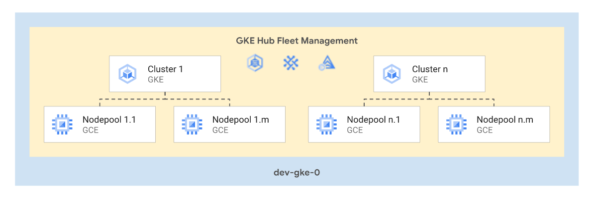

# GKE Multitenant Blueprint

This blueprint presents an opinionated architecture to handle multiple homogeneous GKE clusters. The general idea behind this blueprint is to deploy a single project hosting multiple clusters leveraging several useful GKE features.

The pattern used in this design is useful, for blueprint, in cases where multiple clusters host/support the same workloads, such as in the case of a multi-regional deployment. Furthermore, combined with Anthos Config Sync and proper RBAC, this architecture can be used to host multiple tenants (e.g. teams, applications) sharing the clusters.

This blueprint is used as part of the [FAST GKE stage](../../../fast/stages/03-gke-multitenant/) but it can also be used independently if desired.

<p align="center">
  
</p>

The overall architecture is based on the following design decisions:

- All clusters are assumed to be [private](https://cloud.google.com/kubernetes-engine/docs/how-to/private-clusters), therefore only [VPC-native clusters](https://cloud.google.com/kubernetes-engine/docs/concepts/alias-ips) are supported.
- Logging and monitoring configured to use Cloud Operations for system components and user workloads.
- [GKE metering](https://cloud.google.com/kubernetes-engine/docs/how-to/cluster-usage-metering) enabled by default and stored in a bigquery dataset created within the project.
- Optional [GKE Fleet](https://cloud.google.com/kubernetes-engine/docs/fleets-overview) support with the possibility to enable any of the following features:
  - [Fleet workload identity](https://cloud.google.com/anthos/fleet-management/docs/use-workload-identity)
  - [Anthos Config Management](https://cloud.google.com/anthos-config-management/docs/overview)
  - [Anthos Service Mesh](https://cloud.google.com/service-mesh/docs/overview)
  - [Anthos Identity Service](https://cloud.google.com/anthos/identity/setup/fleet)
  - [Multi-cluster services](https://cloud.google.com/kubernetes-engine/docs/concepts/multi-cluster-services)
  - [Multi-cluster ingress](https://cloud.google.com/kubernetes-engine/docs/concepts/multi-cluster-ingress).
- Support for [Config Sync](https://cloud.google.com/anthos-config-management/docs/config-sync-overview), [Hierarchy Controller](https://cloud.google.com/anthos-config-management/docs/concepts/hierarchy-controller), and [Policy Controller](https://cloud.google.com/anthos-config-management/docs/concepts/policy-controller) when using Anthos Config Management.
- [Groups for GKE](https://cloud.google.com/kubernetes-engine/docs/how-to/google-groups-rbac) can be enabled to facilitate the creation of flexible RBAC policies referencing group principals.
- Support for [application layer secret encryption](https://cloud.google.com/kubernetes-engine/docs/how-to/encrypting-secrets).
- Support to customize peering configuration of the control plane VPC (e.g. to import/export routes to the peered network)
- Some features are enabled by default in all clusters:
  - [Intranode visibility](https://cloud.google.com/kubernetes-engine/docs/how-to/intranode-visibility)
  - [Dataplane v2](https://cloud.google.com/kubernetes-engine/docs/concepts/dataplane-v2)
  - [Shielded GKE nodes](https://cloud.google.com/kubernetes-engine/docs/how-to/shielded-gke-nodes)
  - [Workload identity](https://cloud.google.com/kubernetes-engine/docs/how-to/workload-identity)
  - [Node local DNS cache](https://cloud.google.com/kubernetes-engine/docs/how-to/nodelocal-dns-cache)
  - [Use of the GCE persistent disk CSI driver](https://cloud.google.com/kubernetes-engine/docs/how-to/persistent-volumes/gce-pd-csi-driver)
  - Node [auto-upgrade](https://cloud.google.com/kubernetes-engine/docs/how-to/node-auto-upgrades) and [auto-repair](https://cloud.google.com/kubernetes-engine/docs/how-to/node-auto-repair) for all node pools

<!--
- [GKE subsetting for L4 internal load balancers](https://cloud.google.com/kubernetes-engine/docs/concepts/service-load-balancer#subsetting) enabled by default in all clusters
-->

## Basic usage

The following example shows how to deploy two clusters and one node pool for each

```hcl
locals {
  cluster_defaults = {
    private_cluster_config = {
      enable_private_endpoint = true
      master_global_access    = true
    }
  }
  subnet_self_links = {
    ew1 = "projects/prj-host/regions/europe-west1/subnetworks/gke-0"
    ew3 = "projects/prj-host/regions/europe-west3/subnetworks/gke-0"
  }
}

module "gke-fleet" {
  source             = "./fabric/blueprints/gke/multitenant-fleet/"
  project_id         = var.project_id
  billing_account_id = var.billing_account_id
  folder_id          = var.folder_id
  prefix             = "myprefix"
  group_iam = {
    "gke-admin@example.com" = [
      "roles/container.admin"
    ]
  }
  iam = {
    "roles/container.clusterAdmin" = [
      "cicd@my-cicd-project.iam.gserviceaccount.com"
    ]
  }
  clusters = {
    cluster-0 = {
      location               = "europe-west1"
      private_cluster_config = local.cluster_defaults.private_cluster_config
      vpc_config = {
        subnetwork = local.subnet_self_links.ew1
        master_ipv4_cidr_block = "172.16.10.0/28"
      }
    }
    cluster-1 = {
      location               = "europe-west3"
      private_cluster_config = local.cluster_defaults.private_cluster_config
      vpc_config = {
        subnetwork = local.subnet_self_links.ew3
        master_ipv4_cidr_block = "172.16.20.0/28"
      }
    }
  }
  nodepools = {
    cluster-0 = {
      nodepool-0 = {
        node_config = {
          disk_type = "pd-balanced"
          machine_type = "n2-standard-4"
          spot = true
        }
      }
    }
    cluster-1 = {
      nodepool-0 = {
        node_config = {
          disk_type = "pd-balanced"
          machine_type = "n2-standard-4"
        }
      }
    }
  }
  vpc_config = {
    host_project_id = "my-host-project-id"
    vpc_self_link   = "projects/prj-host/global/networks/prod-0"
  }
}
# tftest modules=7 resources=26
```

## GKE Fleet

This example deploys two clusters and configures several GKE Fleet features:

- Enables [multi-cluster ingress](https://cloud.google.com/kubernetes-engine/docs/concepts/multi-cluster-ingress) and sets the configuration cluster to be `cluster-eu1`.
- Enables [Multi-cluster services](https://cloud.google.com/kubernetes-engine/docs/concepts/multi-cluster-services) and assigns the [required roles](https://cloud.google.com/kubernetes-engine/docs/how-to/multi-cluster-services#authenticating) to its service accounts.
- A `default` Config Management template is created with binary authorization, config sync enabled with a git repository, hierarchy controller, and policy controller.
- The two clusters are configured to use the `default` Config Management template.

```hcl
locals {
  subnet_self_links = {
    ew1 = "projects/prj-host/regions/europe-west1/subnetworks/gke-0"
    ew3 = "projects/prj-host/regions/europe-west3/subnetworks/gke-0"
  }
}

module "gke" {
  source             = "./fabric/blueprints/gke/multitenant-fleet/"
  project_id         = var.project_id
  billing_account_id = var.billing_account_id
  folder_id          = var.folder_id
  prefix             = "myprefix"
  clusters = {
    cluster-0 = {
      location               = "europe-west1"
      vpc_config = {
        subnetwork = local.subnet_self_links.ew1
      }
    }
    cluster-1 = {
      location               = "europe-west3"
      vpc_config = {
        subnetwork = local.subnet_self_links.ew3
      }
    }
  }
  nodepools = {
    cluster-0 = {
      nodepool-0 = {
        node_config = {
          disk_type = "pd-balanced"
          machine_type = "n2-standard-4"
          spot = true
        }
      }
    }
    cluster-1 = {
      nodepool-0 = {
        node_config = {
          disk_type = "pd-balanced"
          machine_type = "n2-standard-4"
        }
      }
    }
  }
  fleet_features = {
    appdevexperience             = false
    configmanagement             = true
    identityservice              = true
    multiclusteringress          = "cluster-0"
    multiclusterservicediscovery = true
    servicemesh                  = true
  }
  fleet_workload_identity = true
  fleet_configmanagement_templates = {
    default = {
      binauthz = true
      config_sync = {
        git = {
          gcp_service_account_email = null
          https_proxy               = null
          policy_dir                = "configsync"
          secret_type               = "none"
          source_format             = "hierarchy"
          sync_branch               = "main"
          sync_repo                 = "https://github.com/myorg/myrepo"
          sync_rev                  = null
          sync_wait_secs            = null
        }
        prevent_drift = true
        source_format = "hierarchy"
      }
      hierarchy_controller = {
        enable_hierarchical_resource_quota = true
        enable_pod_tree_labels             = true
      }
      policy_controller    = {
        audit_interval_seconds     = 30
        exemptable_namespaces      = ["kube-system"]
        log_denies_enabled         = true
        referential_rules_enabled  = true
        template_library_installed = true
      }
      version              = "1.10.2"
    }
  }
  fleet_configmanagement_clusters = {
    default = ["cluster-0", "cluster-1"]
  }
  vpc_config = {
    host_project_id = "my-host-project-id"
    vpc_self_link   = "projects/prj-host/global/networks/prod-0"
  }
}

# tftest modules=8 resources=35
```

<!-- TFDOC OPTS files:1 -->
<!-- BEGIN TFDOC -->

## Files

| name | description | modules |
|---|---|---|
| [gke-clusters.tf](./gke-clusters.tf) | GKE clusters. | <code>gke-cluster</code> |
| [gke-hub.tf](./gke-hub.tf) | GKE hub configuration. | <code>gke-hub</code> |
| [gke-nodepools.tf](./gke-nodepools.tf) | GKE nodepools. | <code>gke-nodepool</code> |
| [main.tf](./main.tf) | Project and usage dataset. | <code>bigquery-dataset</code> · <code>project</code> |
| [outputs.tf](./outputs.tf) | Output variables. |  |
| [variables.tf](./variables.tf) | Module variables. |  |

## Variables

| name | description | type | required | default |
|---|---|:---:|:---:|:---:|
| [billing_account_id](variables.tf#L17) | Billing account id. | <code>string</code> | ✓ |  |
| [folder_id](variables.tf#L132) | Folder used for the GKE project in folders/nnnnnnnnnnn format. | <code>string</code> | ✓ |  |
| [prefix](variables.tf#L179) | Prefix used for resources that need unique names. | <code>string</code> | ✓ |  |
| [project_id](variables.tf#L184) | ID of the project that will contain all the clusters. | <code>string</code> | ✓ |  |
| [vpc_config](variables.tf#L196) | Shared VPC project and VPC details. | <code title="object&#40;&#123;&#10;  host_project_id &#61; string&#10;  vpc_self_link   &#61; string&#10;&#125;&#41;">object&#40;&#123;&#8230;&#125;&#41;</code> | ✓ |  |
| [clusters](variables.tf#L22) | Clusters configuration. Refer to the gke-cluster module for type details. | <code title="map&#40;object&#40;&#123;&#10;  cluster_autoscaling &#61; optional&#40;any&#41;&#10;  description         &#61; optional&#40;string&#41;&#10;  enable_addons &#61; optional&#40;any, &#123;&#10;    horizontal_pod_autoscaling &#61; true, http_load_balancing &#61; true&#10;  &#125;&#41;&#10;  enable_features &#61; optional&#40;any, &#123;&#10;    workload_identity &#61; true&#10;  &#125;&#41;&#10;  issue_client_certificate &#61; optional&#40;bool, false&#41;&#10;  labels                   &#61; optional&#40;map&#40;string&#41;&#41;&#10;  location                 &#61; string&#10;  logging_config           &#61; optional&#40;list&#40;string&#41;, &#91;&#34;SYSTEM_COMPONENTS&#34;&#93;&#41;&#10;  maintenance_config &#61; optional&#40;any, &#123;&#10;    daily_window_start_time &#61; &#34;03:00&#34;&#10;    recurring_window        &#61; null&#10;    maintenance_exclusion   &#61; &#91;&#93;&#10;  &#125;&#41;&#10;  max_pods_per_node  &#61; optional&#40;number, 110&#41;&#10;  min_master_version &#61; optional&#40;string&#41;&#10;  monitoring_config &#61; optional&#40;object&#40;&#123;&#10;    enable_components  &#61; optional&#40;list&#40;string&#41;, &#91;&#34;SYSTEM_COMPONENTS&#34;&#93;&#41;&#10;    managed_prometheus &#61; optional&#40;bool&#41;&#10;  &#125;&#41;&#41;&#10;  node_locations         &#61; optional&#40;list&#40;string&#41;&#41;&#10;  private_cluster_config &#61; optional&#40;any&#41;&#10;  release_channel        &#61; optional&#40;string&#41;&#10;  vpc_config &#61; object&#40;&#123;&#10;    subnetwork &#61; string&#10;    network    &#61; optional&#40;string&#41;&#10;    secondary_range_blocks &#61; optional&#40;object&#40;&#123;&#10;      pods     &#61; string&#10;      services &#61; string&#10;    &#125;&#41;&#41;&#10;    secondary_range_names &#61; optional&#40;object&#40;&#123;&#10;      pods     &#61; string&#10;      services &#61; string&#10;    &#125;&#41;, &#123; pods &#61; &#34;pods&#34;, services &#61; &#34;services&#34; &#125;&#41;&#10;    master_authorized_ranges &#61; optional&#40;map&#40;string&#41;&#41;&#10;    master_ipv4_cidr_block   &#61; optional&#40;string&#41;&#10;  &#125;&#41;&#10;&#125;&#41;&#41;">map&#40;object&#40;&#123;&#8230;&#125;&#41;&#41;</code> |  | <code>&#123;&#125;</code> |
| [fleet_configmanagement_clusters](variables.tf#L70) | Config management features enabled on specific sets of member clusters, in config name => [cluster name] format. | <code>map&#40;list&#40;string&#41;&#41;</code> |  | <code>&#123;&#125;</code> |
| [fleet_configmanagement_templates](variables.tf#L77) | Sets of config management configurations that can be applied to member clusters, in config name => {options} format. | <code title="map&#40;object&#40;&#123;&#10;  binauthz &#61; bool&#10;  config_sync &#61; object&#40;&#123;&#10;    git &#61; object&#40;&#123;&#10;      gcp_service_account_email &#61; string&#10;      https_proxy               &#61; string&#10;      policy_dir                &#61; string&#10;      secret_type               &#61; string&#10;      sync_branch               &#61; string&#10;      sync_repo                 &#61; string&#10;      sync_rev                  &#61; string&#10;      sync_wait_secs            &#61; number&#10;    &#125;&#41;&#10;    prevent_drift &#61; string&#10;    source_format &#61; string&#10;  &#125;&#41;&#10;  hierarchy_controller &#61; object&#40;&#123;&#10;    enable_hierarchical_resource_quota &#61; bool&#10;    enable_pod_tree_labels             &#61; bool&#10;  &#125;&#41;&#10;  policy_controller &#61; object&#40;&#123;&#10;    audit_interval_seconds     &#61; number&#10;    exemptable_namespaces      &#61; list&#40;string&#41;&#10;    log_denies_enabled         &#61; bool&#10;    referential_rules_enabled  &#61; bool&#10;    template_library_installed &#61; bool&#10;  &#125;&#41;&#10;  version &#61; string&#10;&#125;&#41;&#41;">map&#40;object&#40;&#123;&#8230;&#125;&#41;&#41;</code> |  | <code>&#123;&#125;</code> |
| [fleet_features](variables.tf#L112) | Enable and configue fleet features. Set to null to disable GKE Hub if fleet workload identity is not used. | <code title="object&#40;&#123;&#10;  appdevexperience             &#61; bool&#10;  configmanagement             &#61; bool&#10;  identityservice              &#61; bool&#10;  multiclusteringress          &#61; string&#10;  multiclusterservicediscovery &#61; bool&#10;  servicemesh                  &#61; bool&#10;&#125;&#41;">object&#40;&#123;&#8230;&#125;&#41;</code> |  | <code>null</code> |
| [fleet_workload_identity](variables.tf#L125) | Use Fleet Workload Identity for clusters. Enables GKE Hub if set to true. | <code>bool</code> |  | <code>false</code> |
| [group_iam](variables.tf#L137) | Project-level IAM bindings for groups. Use group emails as keys, list of roles as values. | <code>map&#40;list&#40;string&#41;&#41;</code> |  | <code>&#123;&#125;</code> |
| [iam](variables.tf#L144) | Project-level authoritative IAM bindings for users and service accounts in  {ROLE => [MEMBERS]} format. | <code>map&#40;list&#40;string&#41;&#41;</code> |  | <code>&#123;&#125;</code> |
| [labels](variables.tf#L151) | Project-level labels. | <code>map&#40;string&#41;</code> |  | <code>&#123;&#125;</code> |
| [nodepools](variables.tf#L157) | Nodepools configuration. Refer to the gke-nodepool module for type details. | <code title="map&#40;map&#40;object&#40;&#123;&#10;  gke_version           &#61; optional&#40;string&#41;&#10;  labels                &#61; optional&#40;map&#40;string&#41;, &#123;&#125;&#41;&#10;  max_pods_per_node     &#61; optional&#40;number&#41;&#10;  name                  &#61; optional&#40;string&#41;&#10;  node_config           &#61; optional&#40;any, &#123; disk_type &#61; &#34;pd-balanced&#34; &#125;&#41;&#10;  node_count            &#61; optional&#40;map&#40;number&#41;, &#123; initial &#61; 1 &#125;&#41;&#10;  node_locations        &#61; optional&#40;list&#40;string&#41;&#41;&#10;  nodepool_config       &#61; optional&#40;any&#41;&#10;  pod_range             &#61; optional&#40;any&#41;&#10;  reservation_affinity  &#61; optional&#40;any&#41;&#10;  service_account       &#61; optional&#40;any&#41;&#10;  sole_tenant_nodegroup &#61; optional&#40;string&#41;&#10;  tags                  &#61; optional&#40;list&#40;string&#41;&#41;&#10;  taints                &#61; optional&#40;list&#40;any&#41;&#41;&#10;&#125;&#41;&#41;&#41;">map&#40;map&#40;object&#40;&#123;&#8230;&#125;&#41;&#41;&#41;</code> |  | <code>&#123;&#125;</code> |
| [project_services](variables.tf#L189) | Additional project services to enable. | <code>list&#40;string&#41;</code> |  | <code>&#91;&#93;</code> |

## Outputs

| name | description | sensitive |
|---|---|:---:|
| [cluster_ids](outputs.tf#L22) | Cluster ids. |  |
| [clusters](outputs.tf#L17) | Cluster resources. |  |
| [project_id](outputs.tf#L29) | GKE project id. |  |

<!-- END TFDOC -->
