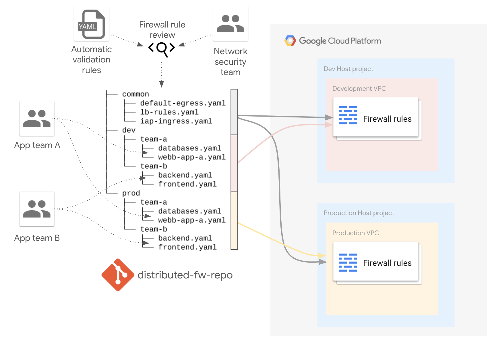

# Decentralized firewall management

This example shows how a decentralized firewall management can be organized using the [firewall factory](../../factories/net-vpc-firewall-yaml/README.md).

This approach is a good fit when Shared VPCs are used across multiple application/infrastructure teams. A central repository keeps environment/team 
specific folders with firewall definitions in `yaml` format. 

In the current blueprint multiple teams can define their [VPC Firewall Rules](https://cloud.google.com/vpc/docs/firewalls) 
for [dev](./firewall/dev) and [prod](./firewall/prod) environments using team specific subfolders. Rules defined in the 
[common](./firewall/common) folder are applied to both dev and prod environments.

> **_NOTE:_**  Common rules are meant to be used for situations where [hierarchical rules](https://cloud.google.com/vpc/docs/firewall-policies) 
do not map precisely to requirements (e.g. SA, etc.) 

This is the high level diagram:

The rules can be validated either using an automated process or a manual process (or a combination of 
the two). There is an blueprint of a YAML-based validator using [Yamale](https://github.com/23andMe/Yamale) 
in  the [`validator/`](validator/) subdirectory, which can be integrated as part of a CI/CD pipeline.
<!-- BEGIN TFDOC -->

## Variables

| name | description | type | required | default |
|---|---|:---:|:---:|:---:|
| [billing_account_id](variables.tf#L15) | Billing account id used as default for new projects. | <code>string</code> | ✓ |  |
| [prefix](variables.tf#L29) | Prefix used for resources that need unique names. | <code>string</code> | ✓ |  |
| [root_node](variables.tf#L50) | Hierarchy node where projects will be created, 'organizations/org_id' or 'folders/folder_id'. | <code>string</code> | ✓ |  |
| [ip_ranges](variables.tf#L20) | Subnet IP CIDR ranges. | <code>map&#40;string&#41;</code> |  | <code title="&#123;&#10;  prod &#61; &#34;10.0.16.0&#47;24&#34;&#10;  dev  &#61; &#34;10.0.32.0&#47;24&#34;&#10;&#125;">&#123;&#8230;&#125;</code> |
| [project_services](variables.tf#L34) | Service APIs enabled by default in new projects. | <code>list&#40;string&#41;</code> |  | <code title="&#91;&#10;  &#34;container.googleapis.com&#34;,&#10;  &#34;dns.googleapis.com&#34;,&#10;  &#34;stackdriver.googleapis.com&#34;,&#10;&#93;">&#91;&#8230;&#93;</code> |
| [region](variables.tf#L44) | Region used. | <code>string</code> |  | <code>&#34;europe-west1&#34;</code> |

## Outputs

| name | description | sensitive |
|---|---|:---:|
| [fw_rules](outputs.tf#L15) | Firewall rules. |  |
| [projects](outputs.tf#L33) | Project ids. |  |
| [vpc](outputs.tf#L41) | Shared VPCs. |  |

<!-- END TFDOC -->
