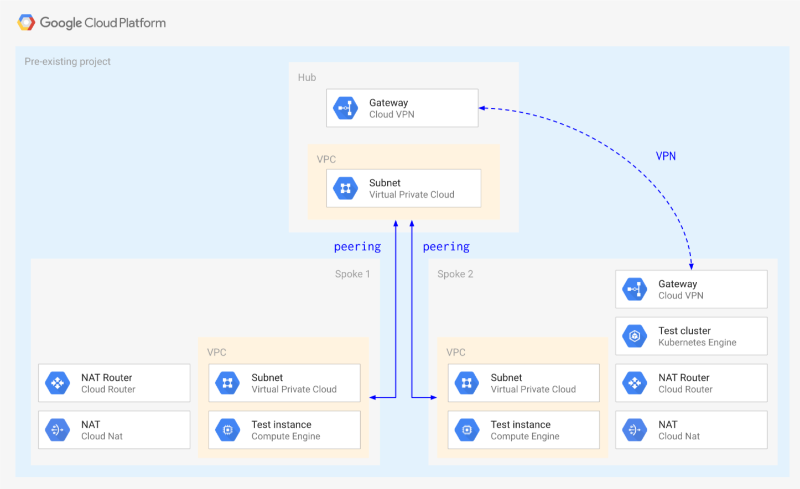

# Hub and Spoke via VPC Peering

This blueprint creates a simple **Hub and Spoke** setup, where the VPC network connects satellite locations (spokes) through a single intermediary location (hub) via [VPC Peering](https://cloud.google.com/vpc/docs/vpc-peering).

The blueprint shows some of the limitations that need to be taken into account when using VPC Peering, mostly due to the lack of transitivity between peerings:

- no mesh networking between the spokes
- complex support for managed services hosted in tenant VPCs connected via peering (Cloud SQL, GKE, etc.)

One possible solution to the managed service limitation above is presented here, using a static VPN to establish connectivity to the GKE masters in the tenant project ([courtesy of @drebes](https://github.com/drebes/tf-samples/blob/master/gke-master-from-hub/main.tf#L10)). Other solutions typically involve the use of proxies, as [described in this GKE article](https://cloud.google.com/solutions/creating-kubernetes-engine-private-clusters-with-net-proxies).

One other topic that needs to be considered when using peering is the limit of 25 peerings in each peering group, which constrains the scalability of design like the one presented here.

The blueprint has been purposefully kept simple to show how to use and wire the VPC modules together, and so that it can be used as a basis for more complex scenarios. This is the high level diagram:



## Managed resources and services

This sample creates several distinct groups of resources:

- one VPC each for hub and each spoke
- one set of firewall rules for each VPC
- one Cloud NAT configuration for each spoke
- one test instance for each spoke
- one GKE cluster with a single nodepool in spoke 2
- one service account for the GCE instances
- one service account for the GKE nodes
- one static VPN gateway in hub and spoke 2 with a single tunnel each

## Testing GKE access from spoke 1

As mentioned above, a VPN tunnel is used as a workaround to avoid the peering transitivity issue that would prevent any VPC other than spoke 2 to connect to the GKE master. This diagram illustrates the solution


To test cluster access, first log on to the spoke 2 instance and confirm cluster and IAM roles are set up correctly:

```bash
gcloud container clusters get-credentials cluster-1 --zone europe-west1-b
kubectl get all
```

The blueprint configures the peering with the GKE master VPC to export routes for you, so that VPN routes are passed through the peering. You can disable by hand in the console or by editing the `peering_config` variable in the `gke-cluster` module, to test non-working configurations or switch to using the [GKE proxy](https://cloud.google.com/solutions/creating-kubernetes-engine-private-clusters-with-net-proxies).

### Export routes via Terraform (recommended)

Change the GKE cluster module and add a new variable after `private_cluster_config`:

```tfvars
  peering_config = {
    export_routes = true
    import_routes = false
  }
```

If you added the variable after applying, simply apply Terraform again.

### Export routes via gcloud (alternative)

If you prefer to use `gcloud` to export routes on the peering, first identify the peering (it has a name like `gke-xxxxxxxxxxxxxxxxxxxx-xxxx-xxxx-peer`) in the Cloud Console from the *VPC network peering* page, or using `gcloud`, then configure it to export routes:

```
gcloud compute networks peerings list
# find the gke-xxxxxxxxxxxxxxxxxxxx-xxxx-xxxx-peer in the spoke-2 network
gcloud compute networks peerings update [peering name from above] \
  --network spoke-2 --export-custom-routes
```

### Test routes

Then connect via SSH to the spoke 1 instance and run the same commands you ran on the spoke 2 instance above, you should be able to run `kubectl` commands against the cluster. To test the default situation with no supporting VPN, just comment out the two VPN modules in `main.tf` and run `terraform apply` to bring down the VPN gateways and tunnels. GKE should only become accessible from spoke 2.

## Operational considerations

A single pre-existing project is used in this blueprint to keep variables and complexity to a minimum, in a real world scenario each spoke would use a separate project (and Shared VPC).

A few APIs need to be enabled in the project, if `apply` fails due to a service not being enabled just click on the link in the error message to enable it for the project, then resume `apply`.

The VPN used to connect the GKE masters VPC does not account for HA, upgrading to use HA VPN is reasonably simple by using the relevant [module](../../../modules/net-vpn-ha).
<!-- BEGIN TFDOC -->

## Variables

| name | description | type | required | default |
|---|---|:---:|:---:|:---:|
| [project_id](variables.tf#L66) | Project id used for all resources. | <code>string</code> | ✓ |  |
| [ip_ranges](variables.tf#L15) | IP CIDR ranges. | <code>map&#40;string&#41;</code> |  | <code title="&#123;&#10;  hub     &#61; &#34;10.0.0.0&#47;24&#34;&#10;  spoke-1 &#61; &#34;10.0.16.0&#47;24&#34;&#10;  spoke-2 &#61; &#34;10.0.32.0&#47;24&#34;&#10;&#125;">&#123;&#8230;&#125;</code> |
| [ip_secondary_ranges](variables.tf#L25) | Secondary IP CIDR ranges. | <code>map&#40;string&#41;</code> |  | <code title="&#123;&#10;  spoke-2-pods     &#61; &#34;10.128.0.0&#47;18&#34;&#10;  spoke-2-services &#61; &#34;172.16.0.0&#47;24&#34;&#10;&#125;">&#123;&#8230;&#125;</code> |
| [prefix](variables.tf#L34) | Arbitrary string used to prefix resource names. | <code>string</code> |  | <code>null</code> |
| [private_service_ranges](variables.tf#L40) | Private service IP CIDR ranges. | <code>map&#40;string&#41;</code> |  | <code title="&#123;&#10;  spoke-2-cluster-1 &#61; &#34;192.168.0.0&#47;28&#34;&#10;&#125;">&#123;&#8230;&#125;</code> |
| [project_create](variables.tf#L48) | Set to non null if project needs to be created. | <code title="object&#40;&#123;&#10;  billing_account &#61; string&#10;  oslogin         &#61; bool&#10;  parent          &#61; string&#10;&#125;&#41;">object&#40;&#123;&#8230;&#125;&#41;</code> |  | <code>null</code> |
| [region](variables.tf#L71) | VPC region. | <code>string</code> |  | <code>&#34;europe-west1&#34;</code> |

## Outputs

| name | description | sensitive |
|---|---|:---:|
| [project](outputs.tf#L15) | Project id. |  |
| [vms](outputs.tf#L20) | GCE VMs. |  |

<!-- END TFDOC -->
