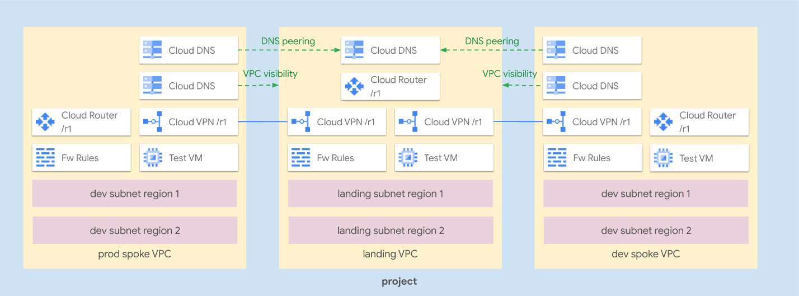

# Hub and Spoke via VPN

This blueprint creates a simple **Hub and Spoke VPN** setup, where the VPC network connects satellite locations (spokes) through a single intermediary location (hub) via [IPsec HA VPN](https://cloud.google.com/network-connectivity/docs/vpn/concepts/overview#ha-vpn).

A few additional features are also shown:

- [custom BGP advertisements](https://cloud.google.com/router/docs/how-to/advertising-overview) to implement transitivity between spokes
- [VPC Global Routing](https://cloud.google.com/network-connectivity/docs/router/how-to/configuring-routing-mode) to leverage a regional set of VPN gateways in different regions as next hops (used here for illustrative/study purpose, not usually done in real life)

The blueprint has been purposefully kept simple to show how to use and wire the VPC and VPN-HA modules together, and so that it can be used as a basis for experimentation. For a more complex scenario that better reflects real-life usage, including [Shared VPC](https://cloud.google.com/vpc/docs/shared-vpc) and [DNS cross-project binding](https://cloud.google.com/dns/docs/zones/cross-project-binding) please refer to the [FAST network stage](../../../fast/stages/02-networking-vpn/).

This is the high level diagram of this blueprint:



## Managed resources and services

This sample creates several distinct groups of resources:

- one VPC for each hub and each spoke
- one set of firewall rules for each VPC
- one HA VPN gateway with two tunnels and one Cloud Router for each spoke
- two HA VPN gateways with two tunnels and a shared Cloud Routers for the hub
- one DNS private zone in the hub
- one DNS peering zone and one DNS private zone in each spoke
- one test instance for the hub each spoke

## Prerequisites

A single pre-existing project is used in this blueprint to keep variables and complexity to a minimum, in a real world scenarios each spoke would probably use a separate project.

The provided project needs a valid billing account, the Compute and DNS APIs are enabled by the blueprint.

You can easily create such a project by commenting turning on project creation in the project module contained in `main.tf`, as shown in this snippet:

```hcl
module "project" {
  source           = "../../..//modules/project"
  name             = var.project_id
  # comment or remove this line to enable project creation
  # project_create = false
  # add the following line with your billing account id value
  billing_account  = "12345-ABCD-12345"
  services = [
    "compute.googleapis.com",
    "dns.googleapis.com"
  ]
}

# tftest skip
```

## Testing

Once the blueprint is up, you can quickly test features by logging in to one of the test VMs:

```bash
gcloud compute ssh hs-ha-lnd-test-r1
# test DNS resolution of the landing zone
ping test-r1.example.com
# test DNS resolution of the prod zone, and prod reachability
ping test-r1.prod.example.com
# test DNS resolution of the dev zone, and dev reachability via global routing
ping test-r2.dev.example.com
```

<!-- TFDOC OPTS files:1 -->
<!-- BEGIN TFDOC -->

## Files

| name | description | modules |
|---|---|---|
| [main.tf](./main.tf) | Module-level locals and resources. | <code>compute-vm</code> · <code>project</code> |
| [net-dev.tf](./net-dev.tf) | Development spoke VPC. | <code>dns</code> · <code>net-vpc</code> · <code>net-vpc-firewall</code> |
| [net-landing.tf](./net-landing.tf) | Landing hub VPC. | <code>dns</code> · <code>net-vpc</code> · <code>net-vpc-firewall</code> |
| [net-prod.tf](./net-prod.tf) | Production spoke VPC. | <code>dns</code> · <code>net-vpc</code> · <code>net-vpc-firewall</code> |
| [outputs.tf](./outputs.tf) | Module outputs. |  |
| [variables.tf](./variables.tf) | Module variables. |  |
| [versions.tf](./versions.tf) | Version pins. |  |
| [vpn-dev-r1.tf](./vpn-dev-r1.tf) | Landing to Development VPN for region 1. | <code>net-vpn-ha</code> |
| [vpn-prod-r1.tf](./vpn-prod-r1.tf) | Landing to Production VPN for region 1. | <code>net-vpn-ha</code> |

## Variables

| name | description | type | required | default |
|---|---|:---:|:---:|:---:|
| [project_id](variables.tf#L49) | Project id for all resources. | <code>string</code> | ✓ |  |
| [ip_ranges](variables.tf#L15) | Subnet IP CIDR ranges. | <code>map&#40;string&#41;</code> |  | <code title="&#123;&#10;  land-0-r1 &#61; &#34;10.0.0.0&#47;24&#34;&#10;  land-0-r2 &#61; &#34;10.0.8.0&#47;24&#34;&#10;  dev-0-r1  &#61; &#34;10.0.16.0&#47;24&#34;&#10;  dev-0-r2  &#61; &#34;10.0.24.0&#47;24&#34;&#10;  prod-0-r1 &#61; &#34;10.0.32.0&#47;24&#34;&#10;  prod-0-r2 &#61; &#34;10.0.40.0&#47;24&#34;&#10;&#125;">&#123;&#8230;&#125;</code> |
| [ip_secondary_ranges](variables.tf#L28) | Subnet secondary ranges. | <code>map&#40;map&#40;string&#41;&#41;</code> |  | <code>&#123;&#125;</code> |
| [prefix](variables.tf#L34) | Prefix used in resource names. | <code>string</code> |  | <code>null</code> |
| [project_create_config](variables.tf#L40) | Populate with billing account id to trigger project creation. | <code title="object&#40;&#123;&#10;  billing_account_id &#61; string&#10;  parent_id          &#61; string&#10;&#125;&#41;">object&#40;&#123;&#8230;&#125;&#41;</code> |  | <code>null</code> |
| [regions](variables.tf#L54) | VPC regions. | <code>map&#40;string&#41;</code> |  | <code title="&#123;&#10;  r1 &#61; &#34;europe-west1&#34;&#10;  r2 &#61; &#34;europe-west4&#34;&#10;&#125;">&#123;&#8230;&#125;</code> |
| [vpn_configs](variables.tf#L63) | VPN configurations. | <code title="map&#40;object&#40;&#123;&#10;  asn           &#61; number&#10;  custom_ranges &#61; map&#40;string&#41;&#10;&#125;&#41;&#41;">map&#40;object&#40;&#123;&#8230;&#125;&#41;&#41;</code> |  | <code title="&#123;&#10;  land-r1 &#61; &#123;&#10;    asn &#61; 64513&#10;    custom_ranges &#61; &#123;&#10;      &#34;10.0.0.0&#47;8&#34; &#61; &#34;internal default&#34;&#10;    &#125;&#10;  &#125;&#10;  dev-r1 &#61; &#123;&#10;    asn           &#61; 64514&#10;    custom_ranges &#61; null&#10;  &#125;&#10;  prod-r1 &#61; &#123;&#10;    asn           &#61; 64515&#10;    custom_ranges &#61; null&#10;  &#125;&#10;&#125;">&#123;&#8230;&#125;</code> |

## Outputs

| name | description | sensitive |
|---|---|:---:|
| [subnets](outputs.tf#L15) | Subnet details. |  |
| [vms](outputs.tf#L39) | GCE VMs. |  |

<!-- END TFDOC -->
