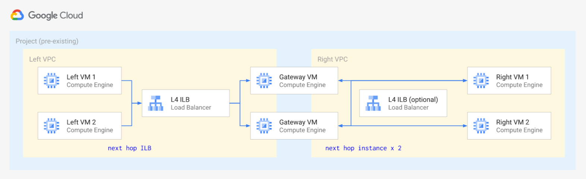
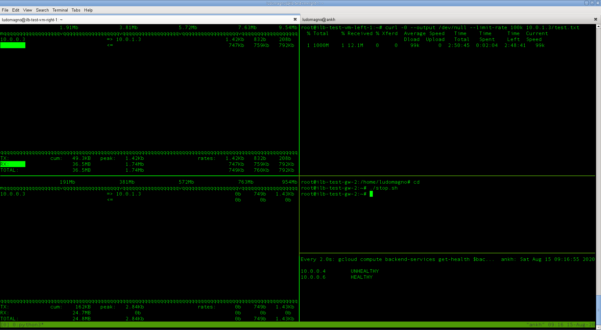

# Internal Load Balancer as Next Hop

This blueprint bootstraps a minimal infrastructure for testing [ILB as next hop](https://cloud.google.com/load-balancing/docs/internal/ilb-next-hop-overview),  using simple Linux gateway VMS between two VPCs to emulate virtual appliances.

The following diagram shows the resources created by this blueprint



Two ILBs are configured on the primary and secondary interfaces of gateway VMs with active health checks, but only a single one is used as next hop by default to simplify testing. The second (right-side) VPC has default routes that point to the gateway VMs, to also use the right-side ILB as next hop set the `ilb_right_enable` variable to `true`.

## Testing

This setup can be used to test and verify new ILB features like [forwards all protocols on ILB as next hops](https://cloud.google.com/load-balancing/docs/internal/ilb-next-hop-overview#all-traffic) and [symmetric hashing](https://cloud.google.com/load-balancing/docs/internal/ilb-next-hop-overview#symmetric-hashing), using simple `curl` and `ping` tests on clients. To make this practical, test VMs on both VPCs have `nginx` pre-installed and active on port 80.

On the gateways, `iftop` and `tcpdump` are installed by default to quickly monitor traffic passing forwarded across VPCs.

Session affinity on the ILB backend services can be changed using `gcloud compute backend-services update` on each of the ILBs, or by setting the `ilb_session_affinity` variable to update both ILBs.

Simple `/root/start.sh` and `/root/stop.sh` scripts are pre-installed on both gateways to configure `iptables` so that health check requests are rejected and re-enabled, to quickly simulate removing instances from the ILB backends.

Some scenarios to test:

- short-lived connections with session affinity set to the default of `NONE`, then to `CLIENT_IP`
- long-lived connections, failing health checks on the active gateway while the connection is active

### Useful commands

Basic commands to SSH to VMs and monitor backend health are provided in the Terraform outputs, and they already match input variables so that names, zones, etc. are correct. Other testing commands are provided below, adjust names to match your setup.

Create a large file on a destination VM (eg `ilb-test-vm-right-1`) to test long-running connections.

```bash
dd if=/dev/zero of=/var/www/html/test.txt bs=10M count=100 status=progress
```

Run curl from a source VM (eg `ilb-test-vm-left-1`) to send requests to a destination VM artificially slowing traffic.

```bash
curl -0 --output /dev/null --limit-rate 10k 10.0.1.3/test.txt
```

Monitor traffic from a source VM (eg `ilb-test-vm-left-1`) on the gateways.

```bash
iftop -n -F 10.0.0.3/32
```

Poll summary health status for a backend.

```bash
watch '\
  gcloud compute backend-services get-health ilb-test-ilb-right \
    --region europe-west1 \
    --flatten status.healthStatus \
    --format "value(status.healthStatus.ipAddress, status.healthStatus.healthState)" \
'
```

A sample testing session using `tmux`:

<a href="https://raw.githubusercontent.com/terraform-google-modules/cloud-foundation-fabric/master/networking/ilb-next-hop/test_session.png" title="Test session screenshot"></img>
<!-- BEGIN TFDOC -->

## Variables

| name | description | type | required | default |
|---|---|:---:|:---:|:---:|
| [project_id](variables.tf#L50) | Existing project id. | <code>string</code> | ✓ |  |
| [ilb_right_enable](variables.tf#L17) | Route right to left traffic through ILB. | <code>bool</code> |  | <code>false</code> |
| [ilb_session_affinity](variables.tf#L23) | Session affinity configuration for ILBs. | <code>string</code> |  | <code>&#34;CLIENT_IP&#34;</code> |
| [ip_ranges](variables.tf#L29) | IP CIDR ranges used for VPC subnets. | <code>map&#40;string&#41;</code> |  | <code title="&#123;&#10;  left  &#61; &#34;10.0.0.0&#47;24&#34;&#10;  right &#61; &#34;10.0.1.0&#47;24&#34;&#10;&#125;">&#123;&#8230;&#125;</code> |
| [prefix](variables.tf#L38) | Prefix used for resource names. | <code>string</code> |  | <code>&#34;ilb-test&#34;</code> |
| [project_create](variables.tf#L44) | Create project instead of using an existing one. | <code>bool</code> |  | <code>false</code> |
| [region](variables.tf#L55) | Region used for resources. | <code>string</code> |  | <code>&#34;europe-west1&#34;</code> |
| [zones](variables.tf#L61) | Zone suffixes used for instances. | <code>list&#40;string&#41;</code> |  | <code>&#91;&#34;b&#34;, &#34;c&#34;&#93;</code> |

## Outputs

| name | description | sensitive |
|---|---|:---:|
| [addresses](outputs.tf#L17) | IP addresses. |  |
| [backend_health_left](outputs.tf#L28) | Command-line health status for left ILB backends. |  |
| [backend_health_right](outputs.tf#L38) | Command-line health status for right ILB backends. |  |
| [ssh_gw](outputs.tf#L48) | Command-line login to gateway VMs. |  |
| [ssh_vm_left](outputs.tf#L56) | Command-line login to left VMs. |  |
| [ssh_vm_right](outputs.tf#L64) | Command-line login to right VMs. |  |

<!-- END TFDOC -->
