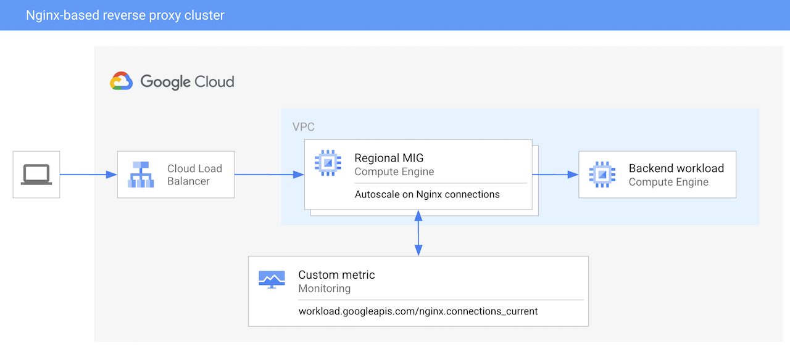

# Nginx-based reverse proxy cluster

This blueprint shows how to deploy an autoscaling reverse proxy cluster using Nginx, based on regional Managed Instance Groups.

The autoscaling is driven by Nginx current connections metric, sent by Cloud Ops Agent.

The example is for Nginx, but it could be easily adapted to any other reverse proxy software (eg. Squid, Varnish, etc).

## Ops Agent image

There is a simple [`Dockerfile`](Dockerfile) available for building Ops Agent to be run inside the ContainerOS instance. Build the container, push it to your Container/Artifact Repository and set the `ops_agent_image` to point to the image you built.

<!-- BEGIN TFDOC -->

## Variables

| name | description | type | required | default |
|---|---|:---:|:---:|:---:|
| [autoscaling_metric](variables.tf#L31) |  | <code title="object&#40;&#123;&#10;  name                       &#61; string&#10;  single_instance_assignment &#61; number&#10;  target                     &#61; number&#10;  type                       &#61; string &#35; GAUGE, DELTA_PER_SECOND, DELTA_PER_MINUTE&#10;  filter                     &#61; string&#10;&#125;&#41;&#10;&#10;&#10;default &#61; &#123;&#10;  name                       &#61; &#34;workload.googleapis.com&#47;nginx.connections_current&#34;&#10;  single_instance_assignment &#61; null&#10;  target                     &#61; 10 &#35; Target 10 connections per instance, just for demonstration purposes&#10;  type                       &#61; &#34;GAUGE&#34;&#10;  filter                     &#61; null&#10;&#125;">object&#40;&#123;&#8230;&#125;</code> | ✓ |  |
| [project_name](variables.tf#L108) | Name of an existing project or of the new project | <code>string</code> | ✓ |  |
| [autoscaling](variables.tf#L17) | Autoscaling configuration for the instance group. | <code title="object&#40;&#123;&#10;  min_replicas    &#61; number&#10;  max_replicas    &#61; number&#10;  cooldown_period &#61; number&#10;&#125;&#41;">object&#40;&#123;&#8230;&#125;&#41;</code> |  | <code title="&#123;&#10;  min_replicas    &#61; 1&#10;  max_replicas    &#61; 10&#10;  cooldown_period &#61; 30&#10;&#125;">&#123;&#8230;&#125;</code> |
| [backends](variables.tf#L49) | Nginx locations configurations to proxy traffic to. | <code>string</code> |  | <code title="&#34;&#60;&#60;-EOT&#10;  location &#47; &#123;&#10;    proxy_pass      http:&#47;&#47;10.0.16.58:80;&#10;    proxy_http_version 1.1;&#10;    proxy_set_header Connection &#34;&#34;;&#10;  &#125;&#10;EOT&#34;">&#34;&#60;&#60;-EOT&#8230;EOT&#34;</code> |
| [cidrs](variables.tf#L61) | Subnet IP CIDR ranges. | <code>map&#40;string&#41;</code> |  | <code title="&#123;&#10;  gce &#61; &#34;10.0.16.0&#47;24&#34;&#10;&#125;">&#123;&#8230;&#125;</code> |
| [network](variables.tf#L69) | Network name. | <code>string</code> |  | <code>&#34;reverse-proxy-vpc&#34;</code> |
| [network_create](variables.tf#L75) | Create network or use existing one. | <code>bool</code> |  | <code>true</code> |
| [nginx_image](variables.tf#L81) | Nginx container image to use. | <code>string</code> |  | <code>&#34;gcr.io&#47;cloud-marketplace&#47;google&#47;nginx1:latest&#34;</code> |
| [ops_agent_image](variables.tf#L87) | Google Cloud Ops Agent container image to use. | <code>string</code> |  | <code>&#34;gcr.io&#47;sfans-hub-project-d647&#47;ops-agent:latest&#34;</code> |
| [prefix](variables.tf#L93) | Prefix used for resources that need unique names. | <code>string</code> |  | <code>&#34;&#34;</code> |
| [project_create](variables.tf#L99) | Parameters for the creation of the new project | <code title="object&#40;&#123;&#10;  billing_account_id &#61; string&#10;  parent             &#61; string&#10;&#125;&#41;">object&#40;&#123;&#8230;&#125;&#41;</code> |  | <code>null</code> |
| [region](variables.tf#L113) | Default region for resources. | <code>string</code> |  | <code>&#34;europe-west4&#34;</code> |
| [subnetwork](variables.tf#L119) | Subnetwork name. | <code>string</code> |  | <code>&#34;gce&#34;</code> |
| [tls](variables.tf#L125) | Also offer reverse proxying with TLS (self-signed certificate). | <code>bool</code> |  | <code>false</code> |

## Outputs

| name | description | sensitive |
|---|---|:---:|
| [load_balancer_url](outputs.tf#L17) | Load balancer for the reverse proxy instance group. |  |

<!-- END TFDOC -->
