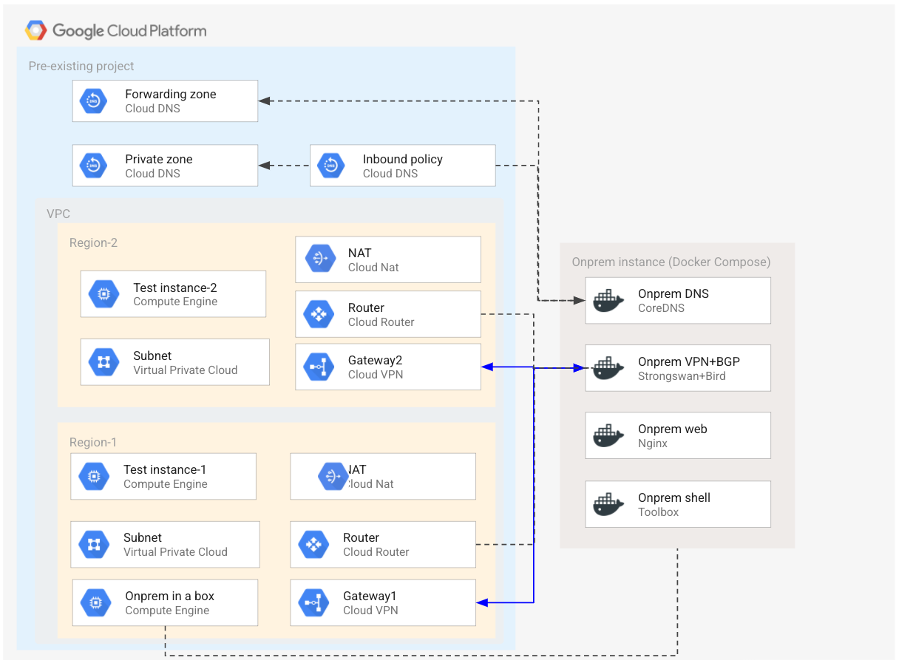

# On-prem DNS and Google Private Access

This blueprint leverages the [on prem in a box](../../../modules/cloud-config-container/onprem) module to bootstrap an emulated on-premises environment on GCP, then connects it via VPN and sets up BGP and DNS so that several specific features can be tested:

- [Cloud DNS forwarding zone](https://cloud.google.com/dns/docs/overview#fz-targets) to on-prem
- DNS forwarding from on-prem via a [Cloud DNS inbound policy](https://cloud.google.com/dns/docs/policies#create-in)
- [Private Access for on-premises hosts](https://cloud.google.com/vpc/docs/configure-private-google-access-hybrid)

The blueprint has been purposefully kept simple to show how to use and wire the on-prem module, but it lends itself well to experimenting and can be combined with the other [infrastructure blueprints](../) in this repository to test different GCP networking patterns in connection to on-prem. This is the high level diagram:



## Managed resources and services

This sample creates several distinct groups of resources:

- one VPC with two regions
- one set of firewall rules
- one Cloud NAT configuration per region
- one test instance on each region
- one service account for the test instances
- one service account for the onprem instance
- two dynamic VPN gateways in each of the regions with a single tunnel
- two DNS zones (private and forwarding) and a DNS inbound policy
- one emulated on-premises environment in a single GCP instance

## Cloud DNS inbound forwarder entry point

The Cloud DNS inbound policy reserves an IP address in the VPC, which is used by the on-prem DNS server to forward queries to Cloud DNS. This address needs of course to be explicitly set in the on-prem DNS configuration (see below for details), but since there's currently no way for Terraform to find the exact address (cf [Google provider issue](https://github.com/terraform-providers/terraform-provider-google/issues/3753)), the following manual workaround needs to be applied.

### Find out the forwarder entry point address

Run this gcloud command to (find out the address assigned to the inbound forwarder)[https://cloud.google.com/dns/docs/policies#list-in-entrypoints]:

```bash
gcloud compute addresses list --project [your project id]
```

In the list of addresses, look for the address with purpose `DNS_RESOLVER` in the subnet `to-onprem-default`. If its IP address is `10.0.0.2` it matches the default value in the Terraform `forwarder_address` variable, which means you're all set. If it's different, proceed to the next step.

### Update the forwarder address variable and recreate on-prem

If the forwarder address does not match the Terraform variable, add the correct value in your `terraform.tfvars` (or change the default value in `variables.tf`), then taint the onprem instance and apply to recreate it with the correct value in the DNS configuration:

```bash
tf apply
tf taint 'module.vm-onprem.google_compute_instance.default["onprem-1"]'
tf apply
```

## CoreDNS configuration for on-premises

The on-prem module uses a CoreDNS container to expose its DNS service, configured with foru distinct blocks:

- the onprem block serving static records for the `onprem.example.com` zone that map to each of the on-prem containers
- the forwarding block for the `gcp.example.com` zone and for Google Private Access, that map to the IP address of the Cloud DNS inbound policy
- the `google.internal` block that exposes to containers a name for the instance metadata address
- the default block that forwards to Google public DNS resolvers

This is the CoreDNS configuration:

```coredns
onprem.example.com {
  root /etc/coredns
  hosts onprem.hosts
  log
  errors
}
gcp.example.com googleapis.com {
  forward . ${resolver_address}
  log
  errors
}
google.internal {
  hosts {
    169.254.169.254 metadata.google.internal
  }
}
. {
  forward . 8.8.8.8
  log
  errors
}
```

## Testing

### Onprem to cloud

```bash
# check containers are running
sudo docker ps

# connect to the onprem instance
gcloud compute ssh onprem-1

# check that the VPN tunnels are up
sudo docker exec -it onprem_vpn_1 ipsec statusall

Status of IKE charon daemon (strongSwan 5.8.1, Linux 5.4.0-1029-gcp, x86_64):
  uptime: 6 minutes, since Nov 30 08:42:08 2020
  worker threads: 11 of 16 idle, 5/0/0/0 working, job queue: 0/0/0/0, scheduled: 8
  loaded plugins: charon aesni mgf1 random nonce x509 revocation constraints pubkey pkcs1 pkcs7 pkcs8 pkcs12 pgp dnskey sshkey pem openssl fips-prf gmp curve25519 xcbc cmac curl sqlite attr kernel-netlink resolve socket-default farp stroke vici updown eap-identity eap-sim eap-aka eap-aka-3gpp2 eap-simaka-pseudonym eap-simaka-reauth eap-md5 eap-mschapv2 eap-radius eap-tls xauth-generic xauth-eap dhcp unity counters
Listening IP addresses:
  10.0.16.2
  169.254.1.2
  169.254.2.2
Connections:
         gcp:  %any...35.233.104.67,0.0.0.0/0,::/0  IKEv2, dpddelay=30s
         gcp:   local:  uses pre-shared key authentication
         gcp:   remote: [35.233.104.67] uses pre-shared key authentication
         gcp:   child:  0.0.0.0/0 === 0.0.0.0/0 TUNNEL, dpdaction=restart
        gcp2:  %any...35.246.101.51,0.0.0.0/0,::/0  IKEv2, dpddelay=30s
        gcp2:   local:  uses pre-shared key authentication
        gcp2:   remote: [35.246.101.51] uses pre-shared key authentication
        gcp2:   child:  0.0.0.0/0 === 0.0.0.0/0 TUNNEL, dpdaction=restart
Security Associations (2 up, 0 connecting):
        gcp2[4]: ESTABLISHED 6 minutes ago, 10.0.16.2[34.76.57.103]...35.246.101.51[35.246.101.51]
        gcp2[4]: IKEv2 SPIs: 227cb2c52085a743_i 13b18b0ad5d4de2b_r*, pre-shared key reauthentication in 9 hours
        gcp2[4]: IKE proposal: AES_GCM_16_256/PRF_HMAC_SHA2_512/MODP_2048
        gcp2{4}:  INSTALLED, TUNNEL, reqid 2, ESP in UDP SPIs: cb6fdb84_i eea28dee_o
        gcp2{4}:  AES_GCM_16_256, 3298 bytes_i, 3051 bytes_o (48 pkts, 3s ago), rekeying in 2 hours
        gcp2{4}:   0.0.0.0/0 === 0.0.0.0/0
         gcp[3]: ESTABLISHED 6 minutes ago, 10.0.16.2[34.76.57.103]...35.233.104.67[35.233.104.67]
         gcp[3]: IKEv2 SPIs: e2cffed5395b63dd_i 99f343468625507c_r*, pre-shared key reauthentication in 9 hours
         gcp[3]: IKE proposal: AES_GCM_16_256/PRF_HMAC_SHA2_512/MODP_2048
         gcp{3}:  INSTALLED, TUNNEL, reqid 1, ESP in UDP SPIs: c3f09701_i 4e8cc8d5_o
         gcp{3}:  AES_GCM_16_256, 3438 bytes_i, 3135 bytes_o (49 pkts, 8s ago), rekeying in 2 hours
         gcp{3}:   0.0.0.0/0 === 0.0.0.0/0

# check that the BGP sessions works and the advertised routes are set
sudo docker exec -it onprem_bird_1 ip route 
default via 10.0.16.1 dev eth0 
10.0.0.0/24  proto bird  src 10.0.16.2 
        nexthop via 169.254.1.1  dev vti0 weight 1
        nexthop via 169.254.2.1  dev vti1 weight 1
10.0.16.0/24 dev eth0  proto kernel  scope link  src 10.0.16.2 
10.10.0.0/24  proto bird  src 10.0.16.2 
        nexthop via 169.254.1.1  dev vti0 weight 1
        nexthop via 169.254.2.1  dev vti1 weight 1
35.199.192.0/19  proto bird  src 10.0.16.2 
        nexthop via 169.254.1.1  dev vti0 weight 1
        nexthop via 169.254.2.1  dev vti1 weight 1
169.254.1.0/30 dev vti0  proto kernel  scope link  src 169.254.1.2 
169.254.2.0/30 dev vti1  proto kernel  scope link  src 169.254.2.2 
199.36.153.4/30  proto bird  src 10.0.16.2 
        nexthop via 169.254.1.1  dev vti0 weight 1
        nexthop via 169.254.2.1  dev vti1 weight 1
199.36.153.8/30  proto bird  src 10.0.16.2 
        nexthop via 169.254.1.1  dev vti0 weight 1
        nexthop via 169.254.2.1  dev vti1 weight 1


# get a shell on the toolbox container
sudo docker exec -it onprem_toolbox_1 sh

# test pinging the IP address of the test instances (check outputs for it)
ping 10.0.0.3
ping 10.10.0.3

# note: if you are able to ping the IP but the DNS tests below do not work,
#       refer to the sections above on configuring the DNS inbound fwd IP

# test forwarding from CoreDNS via the Cloud DNS inbound policy
dig test-1-1.gcp.example.org +short
10.0.0.3
dig test-2-1.gcp.example.org +short
10.10.0.3

# test that Private Access is configured correctly
dig compute.googleapis.com +short
private.googleapis.com.
199.36.153.8
199.36.153.9
199.36.153.10
199.36.153.11

# issue an API call via Private Access
gcloud config set project [your project id]
gcloud compute instances list
```

### Cloud to onprem

```bash
# connect to the test instance
gcloud compute ssh test-1

# test forwarding from Cloud DNS to onprem CoreDNS (address may differ)
dig gw.onprem.example.org +short
10.0.16.1

# test a request to the onprem web server
curl www.onprem.example.org -s |grep h1
<h1>On Prem in a Box</h1>
```

## Operational considerations

A single pre-existing project is used in this blueprint to keep variables and complexity to a minimum, in a real world scenarios each spoke would probably use a separate project.

The VPN-s used to connect to the on-premises environment do not account for HA, upgrading to use HA VPN is reasonably simple by using the relevant [module](../../../modules/net-vpn-ha).
<!-- BEGIN TFDOC -->

## Variables

| name | description | type | required | default |
|---|---|:---:|:---:|:---:|
| [project_id](variables.tf#L59) | Project id for all resources. | <code>string</code> | ✓ |  |
| [bgp_asn](variables.tf#L17) | BGP ASNs. | <code>map&#40;number&#41;</code> |  | <code title="&#123;&#10;  gcp1    &#61; 64513&#10;  gcp2    &#61; 64520&#10;  onprem1 &#61; 64514&#10;  onprem2 &#61; 64514&#10;&#125;">&#123;&#8230;&#125;</code> |
| [bgp_interface_ranges](variables.tf#L28) | BGP interface IP CIDR ranges. | <code>map&#40;string&#41;</code> |  | <code title="&#123;&#10;  gcp1 &#61; &#34;169.254.1.0&#47;30&#34;&#10;  gcp2 &#61; &#34;169.254.2.0&#47;30&#34;&#10;&#125;">&#123;&#8230;&#125;</code> |
| [dns_forwarder_address](variables.tf#L37) | Address of the DNS server used to forward queries from on-premises. | <code>string</code> |  | <code>&#34;10.0.0.2&#34;</code> |
| [forwarder_address](variables.tf#L43) | GCP DNS inbound policy forwarder address. | <code>string</code> |  | <code>&#34;10.0.0.2&#34;</code> |
| [ip_ranges](variables.tf#L49) | IP CIDR ranges. | <code>map&#40;string&#41;</code> |  | <code title="&#123;&#10;  gcp1   &#61; &#34;10.0.0.0&#47;24&#34;&#10;  gcp2   &#61; &#34;10.10.0.0&#47;24&#34;&#10;  onprem &#61; &#34;10.0.16.0&#47;24&#34;&#10;&#125;">&#123;&#8230;&#125;</code> |
| [region](variables.tf#L64) | VPC region. | <code>map&#40;string&#41;</code> |  | <code title="&#123;&#10;  gcp1 &#61; &#34;europe-west1&#34;&#10;  gcp2 &#61; &#34;europe-west2&#34;&#10;&#125;">&#123;&#8230;&#125;</code> |
| [ssh_source_ranges](variables.tf#L73) | IP CIDR ranges that will be allowed to connect via SSH to the onprem instance. | <code>list&#40;string&#41;</code> |  | <code>&#91;&#34;0.0.0.0&#47;0&#34;&#93;</code> |

## Outputs

| name | description | sensitive |
|---|---|:---:|
| [onprem-instance](outputs.tf#L17) | Onprem instance details. |  |
| [test-instance1](outputs.tf#L26) | Test instance details. |  |
| [test-instance2](outputs.tf#L33) | Test instance details. |  |

<!-- END TFDOC -->
