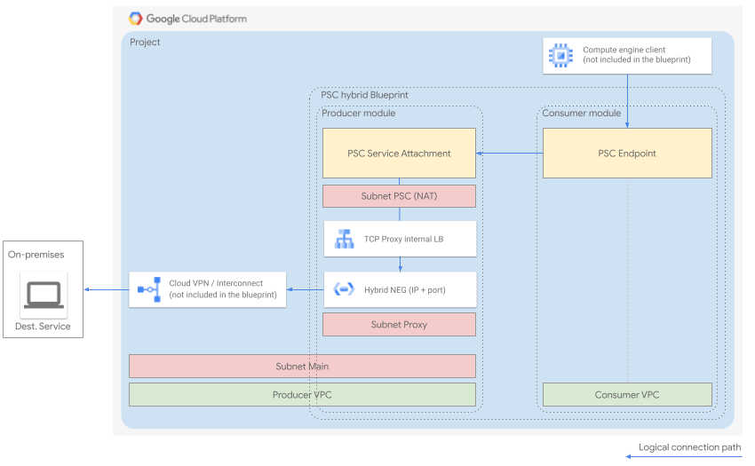

# Hybrid connectivity to on-premise services through PSC

The sample allows to connect to an on-prem service leveraging Private Service Connect (PSC).

It creates:

* A [producer](./psc-producer/README.md): a VPC exposing a PSC Service Attachment (SA), connecting to an internal regional TCP proxy load balancer, using a hybrid NEG backend that connects to an on-premises service (IP address + port)

* A [consumer](./psc-consumer/README.md): a VPC with a PSC endpoint pointing to the PSC SA exposed by the producer. The endpoint is accessible by clients through a local IP address on the consumer VPC.

## Sample modules

The blueprint makes use of the modules [psc-producer](psc-producer) and [psc-consumer](psc-consumer) contained in this folder. This is done so you can build on top of these building blocks, in order to support more complex scenarios.

## Prerequisites

Before applying this Terraform

- On-premises
	- Allow ingress from *35.191.0.0/16* and *130.211.0.0/22* CIDRs (for HCs)
	- Allow ingress from the proxy-only subnet CIDR
- GCP
	- Advertise from GCP to on-prem *35.191.0.0/16* and *130.211.0.0/22* CIDRs
	- Advertise from GCP to on-prem the proxy-only subnet CIDRs

## Relevant Links

* [Private Service Connect](https://cloud.google.com/vpc/docs/private-service-connect)

* [Hybrid connectivity Network Endpoint Groups](https://cloud.google.com/load-balancing/docs/negs/hybrid-neg-concepts)

* [Regional TCP Proxy with Hybrid NEGs](https://cloud.google.com/load-balancing/docs/tcp/set-up-int-tcp-proxy-hybrid)

* [PSC approval](https://cloud.google.com/vpc/docs/configure-private-service-connect-producer#publish-service-explicit)
<!-- BEGIN TFDOC -->

## Variables

| name | description | type | required | default |
|---|---|:---:|:---:|:---:|
| [dest_ip_address](variables.tf#L37) | On-prem service destination IP address. | <code>string</code> | ✓ |  |
| [prefix](variables.tf#L17) | Prefix to use for resource names. | <code>string</code> | ✓ |  |
| [producer](variables.tf#L88) | Producer configuration. | <code title="object&#40;&#123;&#10;  subnet_main     &#61; string      &#35; CIDR&#10;  subnet_proxy    &#61; string      &#35; CIDR&#10;  subnet_psc      &#61; string      &#35; CIDR&#10;  accepted_limits &#61; map&#40;number&#41; &#35; Accepted project ids &#61;&#62; PSC endpoint limit&#10;&#125;&#41;">object&#40;&#123;&#8230;&#125;&#41;</code> | ✓ |  |
| [project_id](variables.tf#L22) | When referncing existing projects, the id of the project where resources will be created. | <code>string</code> | ✓ |  |
| [region](variables.tf#L27) | Region where resources will be created. | <code>string</code> | ✓ |  |
| [subnet_consumer](variables.tf#L98) | Consumer subnet CIDR. | <code>string &#35; CIDR</code> | ✓ |  |
| [zone](variables.tf#L32) | Zone where resources will be created. | <code>string</code> | ✓ |  |
| [dest_port](variables.tf#L42) | On-prem service destination port. | <code>string</code> |  | <code>&#34;80&#34;</code> |
| [project_create](variables.tf#L48) | Whether to automatically create a project. | <code>bool</code> |  | <code>false</code> |
| [vpc_config](variables.tf#L60) | VPC and subnet ids, in case existing VPCs are used. | <code title="object&#40;&#123;&#10;  producer &#61; object&#40;&#123;&#10;    id              &#61; string&#10;    subnet_main_id  &#61; string&#10;    subnet_proxy_id &#61; string&#10;    subnet_psc_id   &#61; string&#10;  &#125;&#41;&#10;  consumer &#61; object&#40;&#123;&#10;    id             &#61; string&#10;    subnet_main_id &#61; string&#10;  &#125;&#41;&#10;&#125;&#41;">object&#40;&#123;&#8230;&#125;&#41;</code> |  | <code title="&#123;&#10;  producer &#61; &#123;&#10;    id              &#61; &#34;xxx&#34;&#10;    subnet_main_id  &#61; &#34;xxx&#34;&#10;    subnet_proxy_id &#61; &#34;xxx&#34;&#10;    subnet_psc_id   &#61; &#34;xxx&#34;&#10;  &#125;&#10;  consumer &#61; &#123;&#10;    id             &#61; &#34;xxx&#34;&#10;    subnet_main_id &#61; &#34;xxx&#34;&#10;  &#125;&#10;&#125;">&#123;&#8230;&#125;</code> |
| [vpc_create](variables.tf#L54) | Whether to automatically create VPCs. | <code>bool</code> |  | <code>true</code> |

<!-- END TFDOC -->
