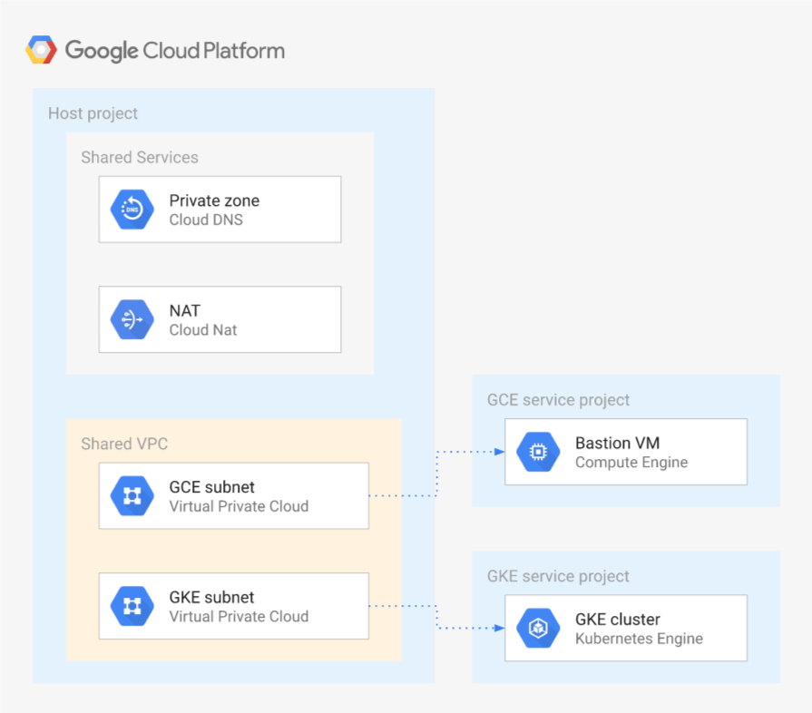

# Shared VPC with optional GKE cluster

This sample creates a basic [Shared VPC](https://cloud.google.com/vpc/docs/shared-vpc) setup using one host project and two service projects, each with a specific subnet in the shared VPC.

The setup also includes the specific IAM-level configurations needed for [GKE on Shared VPC](https://cloud.google.com/kubernetes-engine/docs/how-to/cluster-shared-vpc) in one of the two service projects, and optionally creates a cluster with a single nodepool.

If you only need a basic Shared VPC, or prefer creating a cluster manually, set the `cluster_create` variable to `False`.

The sample has been purposefully kept simple so that it can be used as a basis for different Shared VPC configurations. This is the high level diagram:



## Accessing the bastion instance and GKE cluster

The bastion VM has no public address so access is mediated via [IAP](https://cloud.google.com/iap/docs), which is supported transparently in the `gcloud compute ssh` command. Authentication is via OS Login set as a project default.

Cluster access from the bastion can leverage the instance service account's `container.developer` role: the only configuration needed is to fetch cluster credentials via `gcloud container clusters get-credentials` passing the correct cluster name, location and project via command options.

For convenience, [Tinyproxy](http://tinyproxy.github.io/) is installed on the bastion host, allowing `kubectl` use via [IAP](https://cloud.google.com/iap/docs) from an external client:

```bash
gcloud container clusters get-credentials "${CLUSTER_NAME}" \
  --zone "${CLUSTER_ZONE}" \
  --project "${CLUSTER_PROJECT_NAME}"

gcloud compute ssh "${BASTION_INSTANCE_NAME}" \
  --project "${CLUSTER_PROJECT_NAME}" \
  --zone "${CLUSTER_ZONE}" \
  -- -L 8888:localhost:8888 -N -q -f

# Run kubectl through the proxy
HTTPS_PROXY=localhost:8888 kubectl get pods
```

An alias can also be created. For example:

```bash
alias k='HTTPS_PROXY=localhost:8888 kubectl $@'
```

## Destroying

There's a minor glitch that can surface running `terraform destroy`, where the service project attachments to the Shared VPC will not get destroyed even with the relevant API call succeeding. We are investigating the issue, in the meantime just manually remove the attachment in the Cloud console or via the `gcloud beta compute shared-vpc associated-projects remove` command when `terraform destroy` fails, and then relaunch the command.
<!-- BEGIN TFDOC -->

## Variables

| name | description | type | required | default |
|---|---|:---:|:---:|:---:|
| [billing_account_id](variables.tf#L15) | Billing account id used as default for new projects. | <code>string</code> | ✓ |  |
| [prefix](variables.tf#L62) | Prefix used for resources that need unique names. | <code>string</code> | ✓ |  |
| [root_node](variables.tf#L90) | Hierarchy node where projects will be created, 'organizations/org_id' or 'folders/folder_id'. | <code>string</code> | ✓ |  |
| [cluster_create](variables.tf#L20) | Create GKE cluster and nodepool. | <code>bool</code> |  | <code>true</code> |
| [ip_ranges](variables.tf#L26) | Subnet IP CIDR ranges. | <code>map&#40;string&#41;</code> |  | <code title="&#123;&#10;  gce &#61; &#34;10.0.16.0&#47;24&#34;&#10;  gke &#61; &#34;10.0.32.0&#47;24&#34;&#10;&#125;">&#123;&#8230;&#125;</code> |
| [ip_secondary_ranges](variables.tf#L35) | Secondary IP CIDR ranges. | <code>map&#40;string&#41;</code> |  | <code title="&#123;&#10;  gke-pods     &#61; &#34;10.128.0.0&#47;18&#34;&#10;  gke-services &#61; &#34;172.16.0.0&#47;24&#34;&#10;&#125;">&#123;&#8230;&#125;</code> |
| [owners_gce](variables.tf#L44) | GCE project owners, in IAM format. | <code>list&#40;string&#41;</code> |  | <code>&#91;&#93;</code> |
| [owners_gke](variables.tf#L50) | GKE project owners, in IAM format. | <code>list&#40;string&#41;</code> |  | <code>&#91;&#93;</code> |
| [owners_host](variables.tf#L56) | Host project owners, in IAM format. | <code>list&#40;string&#41;</code> |  | <code>&#91;&#93;</code> |
| [private_service_ranges](variables.tf#L67) | Private service IP CIDR ranges. | <code>map&#40;string&#41;</code> |  | <code title="&#123;&#10;  cluster-1 &#61; &#34;192.168.0.0&#47;28&#34;&#10;&#125;">&#123;&#8230;&#125;</code> |
| [project_services](variables.tf#L75) | Service APIs enabled by default in new projects. | <code>list&#40;string&#41;</code> |  | <code title="&#91;&#10;  &#34;container.googleapis.com&#34;,&#10;  &#34;stackdriver.googleapis.com&#34;,&#10;&#93;">&#91;&#8230;&#93;</code> |
| [region](variables.tf#L84) | Region used. | <code>string</code> |  | <code>&#34;europe-west1&#34;</code> |

## Outputs

| name | description | sensitive |
|---|---|:---:|
| [gke_clusters](outputs.tf#L15) | GKE clusters information. |  |
| [projects](outputs.tf#L24) | Project ids. |  |
| [vms](outputs.tf#L33) | GCE VMs. |  |
| [vpc](outputs.tf#L40) | Shared VPC. |  |

<!-- END TFDOC -->
