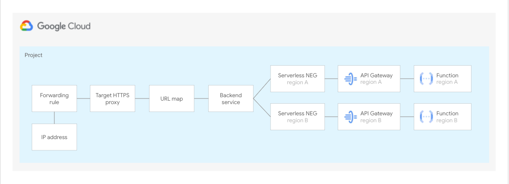

# Serverless blueprints

The blueprints in this folder show implement **end-to-end scenarios** for Serveless topologies that show how to automate common configurations or leverage specific products.

They are meant to be used as minimal but complete starting points to create actual infrastructure, and as playgrounds to experiment with Google Cloud features.

## Blueprints

### Multi-region deployments for API Gateway

 This [blueprint](./api-gateway/) shows how to configure a load balancer to enable multi-region deployments for API Gateway. For more details on how this set up work have a look at the article [here](https://cloud.google.com/api-gateway/docs/multi-region-deployment)
 
