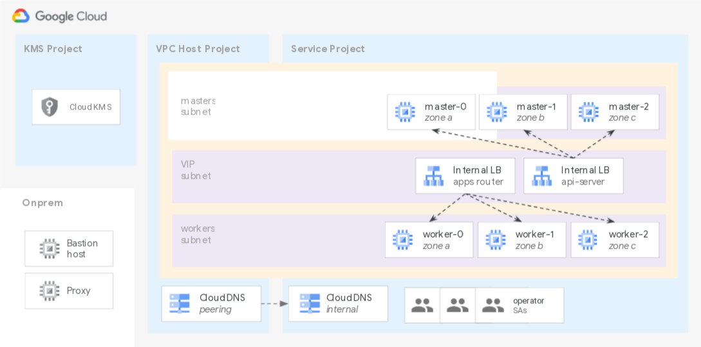

# Third Party Solutions

The blueprints in this folder show how to automate installation of specific third party products on GCP, following typical best practices.

## Blueprints

### OpenShift cluster bootstrap on Shared VPC

 This [example](./openshift/) shows how to quickly bootstrap an OpenShift 4.7 cluster on GCP, using typical enterprise features like Shared VPC and CMEK for instance disks.

 

### Wordpress deployment on Cloud Run

 This [example](./wordpress/cloudrun/) shows how to deploy a functioning new Wordpress website exposed to the public internet via CloudRun and Cloud SQL, with minimal technical overhead.

 
