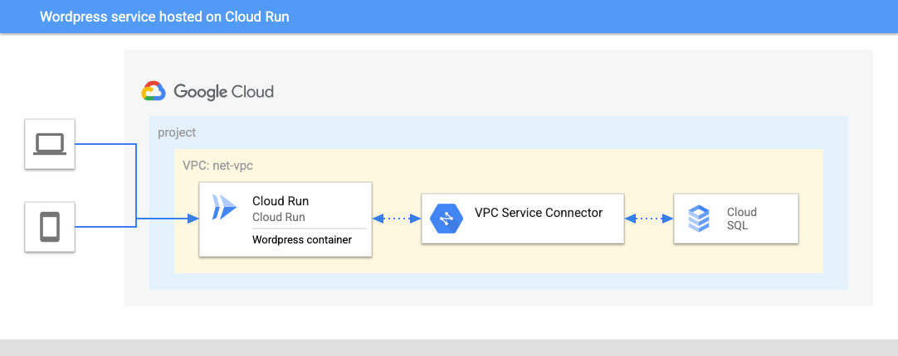

# Wordpress deployment on Cloud Run

43% of the Web is built on Wordpress. Because of its simplicity and versatility, Wordpress can be used for internal websites as well as customer facing e-commerce platforms in small to large businesses, while still offering security.

This repository contains the necessary Terraform files to deploy a functioning new Wordpress website exposed to the public internet with minimal technical overhead.

This architecture can be used for the following use cases and more:

* Blog
* Intranet / internal Wiki
* E-commerce platform

# Architecture



The main components that are deployed in this architecture are the following (you can learn about them by following the hyperlinks):

* [Cloud Run](https://cloud.google.com/run): serverless PaaS offering to host containers for web-oriented applications, while offering security, scalability and easy versioning
* [Cloud SQL](https://cloud.google.com/sql): Managed solution for SQL databases
* [VPC Serverless Connector](https://cloud.google.com/vpc/docs/serverless-vpc-access): Solution to access the CloudSQL VPC from Cloud Run, using only internal IP addresses

# Setup

## Prerequisites

### Setting up the project for the deployment

This example will deploy all its resources into the project defined by the `project_id` variable. Please note that we assume this project already exists. However, if you provide the appropriate values to the `project_create` variable, the project will be created as part of the deployment.

If `project_create` is left to null, the identity performing the deployment needs the `owner` role on the project defined by the `project_id` variable. Otherwise, the identity performing the deployment needs `resourcemanager.projectCreator` on the resource hierarchy node specified by `project_create.parent` and `billing.user` on the billing account specified by `project_create.billing_account_id`.

## Deployment

### Step 0: Cloning the repository

If you want to deploy from your Cloud Shell, click on the image below, sign in if required and when the prompt appears, click on “confirm”.

[](https://shell.cloud.google.com/cloudshell/editor?cloudshell_git_repo=https%3A%2F%2Fgithub.com%2FGoogleCloudPlatform%2Fcloud-foundation-fabric&cloudshell_workspace=blueprints%2Fthird-party-solutions%2Fwordpress%2Fcloudrun)

Otherwise, in your console of choice:

```bash
git clone https://github.com/GoogleCloudPlatform/cloud-foundation-fabric
```

Before you deploy the architecture, you will need at least the following information (for more precise configuration see the Variables section):

* The project ID.
* A Google Cloud Registry path to a Wordpress container image.

### Step 1: Add Wordpress image

In order to deploy the Wordpress service to Cloud Run, you need to store the [Wordpress image](https://hub.docker.com/r/bitnami/wordpress/) in Google Cloud Registry (GCR).

Make sure that the Google Container Registry API is enabled and run the following commands in your Cloud Shell environment with your `project_id` in place of the `MY_PROJECT` placeholder:

``` {shell}
docker pull bitnami/wordpress:6.0.2
docker tag bitnami/wordpress:6.0.2 gcr.io/MY_PROJECT/wordpress
docker push gcr.io/MY_PROJECT/wordpress
```

**Note**: This example has been built for this particular Docker image. If you decide to use another one, this example might not work (or you can edit the variables in the Terraform files).

### Step 2: Prepare the variables

Once you have the required information, head back to your cloned repository. Make sure you’re in the directory of this tutorial (where this README is in).

Configure the Terraform variables in your `terraform.tfvars` file. See [terraform.tfvars.sample](terraform.tfvars.sample) as starting point - just copy it to `terraform.tfvars` and edit the latter. See the variables documentation below.

**Notes**:

1. If you will want to change your admin password later on, please note that it will only work in the admin interface of Wordpress, but not with redeploying with Terraform, since Wordpress writes that password into the database upon installation and ignores the environment variables (that you can change with Terraform) after that.
2. If you have the [domain restriction org. policy](https://cloud.google.com/resource-manager/docs/organization-policy/restricting-domains) on your organization, you have to edit the `cloud_run_invoker` variable and give it a value that will be accepted in accordance to your policy.

### Step 3: Deploy resources

Initialize your Terraform environment and deploy the resources:

``` {shell}
terraform init
terraform apply
```

The resource creation will take a few minutes.

**Note**: you might get the following error (or a similar one):

``` {shell}
│ Error: resource is in failed state "Ready:False", message: Revision '...' is not ready and cannot serve traffic.│
```

You might try to reapply at this point, the Cloud Run service just needs several minutes.

### Step 4: Use the created resources

Upon completion, you will see the output with the values for the Cloud Run service and the user and password to access the `/admin` part of the website. You can also view it later with:

``` {shell}
terraform output
# or for the concrete variable:
terraform output cloud_run_service
```

1. Open your browser at the URL that you get with that last command, and you will see your Wordpress installation.
2. Add "/admin" in the end of the URL and log in to the admin interface, using the outputs "wp_user" and "wp_password".

## Cleaning up your environment

The easiest way to remove all the deployed resources is to run the following command in Cloud Shell:

``` {shell}
terraform destroy
```

The above command will delete the associated resources so there will be no billable charges made afterwards.
<!-- BEGIN TFDOC -->

## Variables

| name | description | type | required | default |
|---|---|:---:|:---:|:---:|
| [project_id](variables.tf#L78) | Project id, references existing project if `project_create` is null. | <code>string</code> | ✓ |  |
| [wordpress_image](variables.tf#L89) | Image to run with Cloud Run, starts with \"gcr.io\" | <code>string</code> | ✓ |  |
| [cloud_run_invoker](variables.tf#L18) | IAM member authorized to access the end-point (for example, 'user:YOUR_IAM_USER' for only you or 'allUsers' for everyone) | <code>string</code> |  | <code>&#34;allUsers&#34;</code> |
| [cloudsql_password](variables.tf#L24) | CloudSQL password (will be randomly generated by default) | <code>string</code> |  | <code>null</code> |
| [connector](variables.tf#L30) | Existing VPC serverless connector to use if not creating a new one | <code>string</code> |  | <code>null</code> |
| [create_connector](variables.tf#L36) | Should a VPC serverless connector be created or not | <code>bool</code> |  | <code>true</code> |
| [ip_ranges](variables.tf#L43) | CIDR blocks: VPC serverless connector, Private Service Access(PSA) for CloudSQL, CloudSQL VPC | <code title="object&#40;&#123;&#10;  connector &#61; string&#10;  psa       &#61; string&#10;  sql_vpc   &#61; string&#10;&#125;&#41;">object&#40;&#123;&#8230;&#125;&#41;</code> |  | <code title="&#123;&#10;  connector &#61; &#34;10.8.0.0&#47;28&#34;&#10;  psa       &#61; &#34;10.60.0.0&#47;24&#34;&#10;  sql_vpc   &#61; &#34;10.0.0.0&#47;20&#34;&#10;&#125;">&#123;&#8230;&#125;</code> |
| [prefix](variables.tf#L57) | Unique prefix used for resource names. Not used for project if 'project_create' is null. | <code>string</code> |  | <code>&#34;&#34;</code> |
| [principals](variables.tf#L63) | List of users to give rights to (CloudSQL admin, client and instanceUser, Logging admin, Service Account User and TokenCreator), eg 'user@domain.com'. | <code>list&#40;string&#41;</code> |  | <code>&#91;&#93;</code> |
| [project_create](variables.tf#L69) | Provide values if project creation is needed, uses existing project if null. Parent is in 'folders/nnn' or 'organizations/nnn' format. | <code title="object&#40;&#123;&#10;  billing_account_id &#61; string&#10;  parent             &#61; string&#10;&#125;&#41;">object&#40;&#123;&#8230;&#125;&#41;</code> |  | <code>null</code> |
| [region](variables.tf#L83) | Region for the created resources | <code>string</code> |  | <code>&#34;europe-west4&#34;</code> |
| [wordpress_password](variables.tf#L94) | Password for the Wordpress user (will be randomly generated by default) | <code>string</code> |  | <code>null</code> |
| [wordpress_port](variables.tf#L100) | Port for the Wordpress image | <code>number</code> |  | <code>8080</code> |

## Outputs

| name | description | sensitive |
|---|---|:---:|
| [cloud_run_service](outputs.tf#L17) | CloudRun service URL | ✓ |
| [cloudsql_password](outputs.tf#L23) | CloudSQL password | ✓ |
| [wp_password](outputs.tf#L29) | Wordpress user password | ✓ |
| [wp_user](outputs.tf#L35) | Wordpress username |  |

<!-- END TFDOC -->
