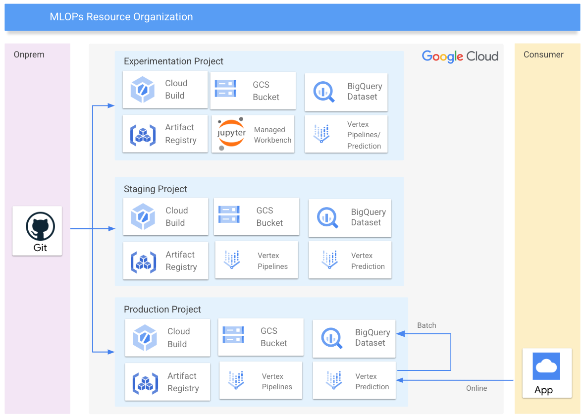

# MLOps with Vertex AI - Infra setup

## Introduction
This example implements the infrastructure required to deploy an end-to-end [MLOps process](https://services.google.com/fh/files/misc/practitioners_guide_to_mlops_whitepaper.pdf) using [Vertex AI](https://cloud.google.com/vertex-ai) platform.


##  GCP resources
A terraform script is provided to setup all the required resources:

- GCP Project  to host all the resources
- Isolated VPC network and a subnet to be used by Vertex and Dataflow (using a Shared VPC is also possible). 
- Firewall rule to allow the internal subnet communication required by Dataflow
- Cloud NAT required to reach the internet from the different computing resources (Vertex and Dataflow)
- GCS buckets to host Vertex AI and Cloud Build Artifacts.
- BigQuery Dataset where the training data will be stored
- Service account `mlops-[env]@` with the minimum permissions required by Vertex and Dataflow
- Service account `github` to be used by Workload Identity Federation, to federate Github identity.
- Secret to store the Github SSH key to get access the CI/CD code repo (you will set the secret value later, so it can be used).



## Pre-requirements

### User groups

User groups provide a stable frame of reference that allows decoupling the final set of permissions from the stage where entities and resources are created, and their IAM bindings defined. These groups should be created before launching Terraform.

We use the following groups to control access to resources:

- *Data Scientits* (gcp-ml-ds@<company.org>). They create ML pipelines in the experimentation environment.
- *ML Engineers* (gcp-ml-eng@<company.org>). They handle and run the different environments, with access to all resources in order to troubleshoot possible issues with pipelines. 

These groups are not suitable for production grade environments. You can configure the group names through the `groups`variable. 

### Git environment for the ML Pipelines

Clone the Google Cloud Professional services [repo](https://github.com/GoogleCloudPlatform/professional-services) to a temp directory: 
```
git clone https://github.com/GoogleCloudPlatform/professional-services.git
cd professional-services/
```

Setup your new Github repo using the Github web console or CLI.

Copy the `vertex_mlops_enterprise` folder to your local folder, including the Github actions, hidden dirs and files:

```
cp -r ./examples/vertex_mlops_enterprise/  <YOUR LOCAL FOLDER>
```

Commit the files in the main branch (`main`):
```
git init
git add *
git commit -m "first commit"
git branch -M main
git remote add origin https://github.com/<ORG>/<REPO>.git
git push -u origin main
```
You will need to configure the Github organization and repo name in the `github` variable.

### Branches
Create the additional branches in Github (`dev`, `staging`, `prod`). This can be also done from the UI (`Create branch: dev from main`).

Pull the remote repo with `git pull`.

Checkout the staging branch with `git checkout dev`.

Review the files `*.yml` files in the `.github/workflows` and modify them if needed. These files should be automatically updated when launched terraform.

Review the files `*.yaml` files in the `build` folder and modify them if needed. These files should be automatically updated when launched terraform.

##  Instructions
###  Deploy the different environments

You will need to repeat this process for each one of the different environments (01-development, 02-staging, 03-production):

- Go to the environment folder: I.e. `cd ../terraform/01-dev`
- In the file `providers.tf`, set the name of a bucket that you want to use as the storage for your Terraform state. This should be an existing bucket that your user has access to.
- Create a `terraform.tfvars` file and specify the required variables. You can use the `terraform.tfvars.sample` an an starting point

```tfm
project_create = {
    billing_account_id = "000000-123456-123456"
    parent             = "folders/111111111111"
}
project_id          = "creditcards-dev"
```
- Make sure you fill in the following parameters:
  - `project_create.billing_account_id`: Billing account
  - `project_create.parent `: Parent folder where the project will be created.
  - `project_id`:  Project id, references existing project if `project_create` is null.
- Make sure you have the right authentication setup (application default credentials, or a service account key)
- Run `terraform init` and `terraform apply`
- It is possible that some errors like `googleapi: Error 400: Service account xxxx does not exist.` appears. This is due to some dependencies with the Project IAM authoritative bindings of the service accounts. In this case, re-run again the process with `terraform apply`

##  What's next?
Continue [configuring the GIT integration with Cloud Build](./02-GIT_SETUP.md) and [launching the MLOps pipeline](./03-MLOPS.md).

<!-- BEGIN TFDOC -->
<!-- END TFDOC -->
