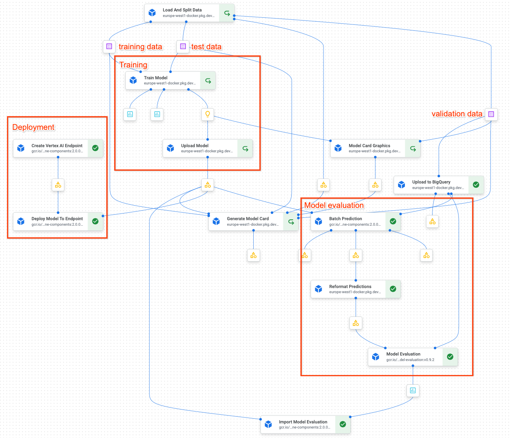

# Reference KFP Pipeline

We include here a reference KFP pipeline implementation, that follows best practices such as:

* Traceability of data by storing training, test and validation datasets as an intermediate artifact
* Splitting the input data into training, test and validation and giving the training step only access to the training and test data
* Producing a model card for flexibility of governance
* Evaluate the model performance metrics and upload this evaluation to Vertex Model Registry

## Preparing to run the reference pipeline

The custom components used in this pipeline use a custom package, mainly to be able to access the configuration in `config.py`. Prior to building this custom image, we need to set the following environment variables:

```
export PROJECT_ID=<your-project-id>
export REGION=<region>
export ARTIFACT_REG_REPO=kfp_reference_pipeline # or choose a different name
```

First create a docker repository in Artifact Registry to store the image:

```
gcloud artifacts repositories create $ARTIFACT_REG_REPO --project=$PROJECT --location=$REGION --repository-format=docker
```

This custom image is built with the following command, executed from this directory (where the `Dockerfile` is):

```
gcloud builds submit --tag ${REGION}-docker.pkg.dev/${PROJECT_ID}/${ARTIFACT_REG_REPO}/base:latest
```

## Launch the pipeline

From the `src` directory:

```
python pipeline.py
```

## Functional description of the pipeline

This pipeline trains an XGBoost model and uploads it to the Vertex AI Model Registry. It then proceeds to deploy this model 
to a Vertex Endpoint for online predictions. It also uses the validation dataset to evaluate the model, and it uploads this
model evaluation to Model Registry, where it is visualised (see the [Google Cloud Blog](https://cloud.google.com/blog/topics/developers-practitioners/improving-model-quality-scale-vertex-ai-model-evaluation)). We have indicated these different parts of the pipeline process 
in the diagram below.



The pipeline starts by retrieving the input data from BigQuery and splitting it into a training dataset, a test dataset, and
an evaluation dataset. The training and the test data are used by the model training process to train the model. The validation
data is kept apart (it is not used until the model is completely trained). These datasets are stored in CSV on Google Cloud Storage,
so that we have a record of exactly the data that the model was trained and evaluated with.

The **training part of the pipeline** has just the model training and model upload steps, which finish with a new version of a model
in the Model Registry.

The **deployment section** creates a new Vertex Endpoint and deploys the model to it. In a more realistic scenario, you probably want
to make the deployment conditional on the model performance. 

The **model evaluation** is a bit more complex. We start by uploading the evaluation data to BigQuery, to facilitate the evaluation
process. We run it through a batch prediction job to generate the model predictions and pass the output to a "model evaluation"
step, that joins the model predictions and the examples from the validation dataset (which contains the ground truth). This
gives us a dataset with examples that have both the model output and the ground truth, and we can use this to evaluate the model 
performance. We do expect the model output in a certain format though, so produce the right formatting we have introduce a step
to format the model output field according to expectation.

Aside from these processes, we have a few pipeline steps that are not included anywhere, and these are to generate a 
[model card](https://medium.com/google-cloud/build-responsible-models-with-model-cards-and-vertex-ai-pipelines-8cbf451e7632) for our model.
A model card, in this case, is an HTML document with any information that we may be required to provide about our model. Think about
what the model can be used for in case someone else might want to use it, the risks associated with using the model, the performance, and so
on. Generating a model card as part of the pipeline provides the flexibility to meet any documentation requirements that the users or the
organization may have.
