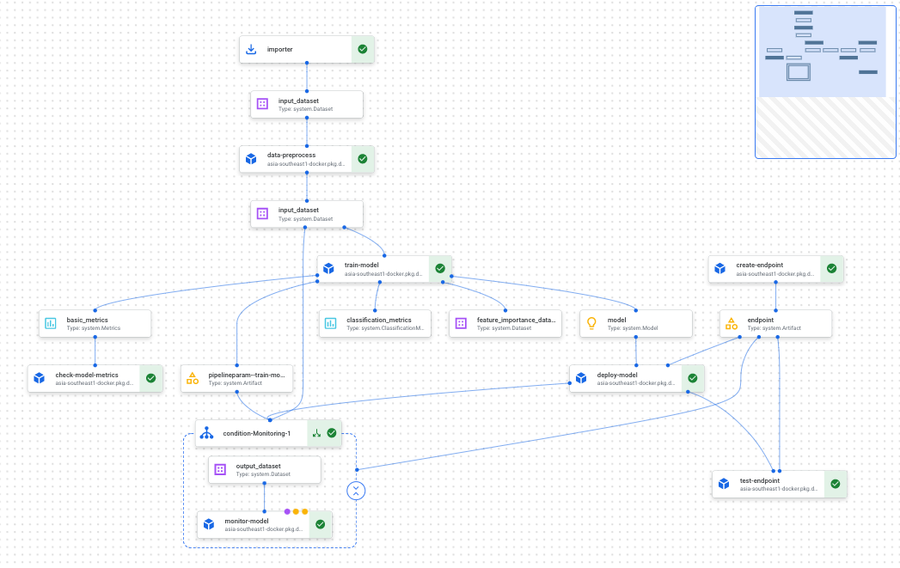

<!--
Copyright 2021 Google LLC. All Rights Reserved.

Licensed under the Apache License, Version 2.0 (the "License");
you may not use this file except in compliance with the License.
You may obtain a copy of the License at:

     http://www.apache.org/licenses/LICENSE-2.0

Unless required by applicable law or agreed to in writing, software
distributed under the License is distributed on an "AS IS" BASIS,
WITHOUT WARRANTIES OR CONDITIONS OF ANY KIND, either express or implied.
See the License for the specific language governing permissions and
limitations under the License.
==============================================================================
-->

# Vertex AI Pipeline
This repository demonstrates end-to-end [MLOps process](https://services.google.com/fh/files/misc/practitioners_guide_to_mlops_whitepaper.pdf) 
using [Vertex AI](https://cloud.google.com/vertex-ai) platform 
and [Smart Analytics](https://cloud.google.com/solutions/smart-analytics) technology capabilities.

In particular two general [Vertex AI Pipeline](https://cloud.google.com/vertex-ai/docs/pipelines) 
templates has been provided:
- Training pipeline including:
  - Data processing
  - Custom model training
  - Model evaluation
  - Endpoint creation
  - Model deployment
  - Deployment testing
  - Model monitoring
- Batch-prediction pipeline including
  - Data processing
  - Batch prediction using deployed model

Note that besides Data processing being done using BigQuery, all other steps are build on top of
[Vertex AI](https://cloud.google.com/vertex-ai) platform capabilities.

<p align="center">
    
</p>

### Dataset
The dataset used throughout the demonstration is
[Banknote Authentication Data Set](https://archive.ics.uci.edu/ml/datasets/banknote+authentication).
Data were extracted from images that were taken from genuine and forged banknote-like specimens. 
For digitization, an industrial camera usually used for print inspection was used. 
The final images have 400x 400 pixels. Due to the object lens and distance to the 
investigated object gray-scale pictures with a resolution of about 660 dpi were gained. 
Wavelet Transform tool were used to extract features from images.
Attribute Information:
1. variance of Wavelet Transformed image (continuous)
2. skewness of Wavelet Transformed image (continuous)
3. curtosis of Wavelet Transformed image (continuous)
4. entropy of image (continuous)
5. class (integer)

### Machine Learning Problem
Given the Banknote Authentication Data Set, a binary classification problem is adopted where 
attribute `class` is chosen as label and the remaining attributes are used as features.

[LightGBM](https://github.com/microsoft/LightGBM), a gradient boosting framework that uses tree based 
learning algorithms, is used to train the model for purpose of demonstrating 
[custom training](https://cloud.google.com/vertex-ai/docs/training/custom-training) and
[custom serving](https://cloud.google.com/vertex-ai/docs/predictions/use-custom-container) 
capabilities of Vertex AI platform, which provide more native support for e.g. Tensorflow,
Pytorch, Scikit-Learn and Pytorch.


## Repository Structure

The repository contains the following:

```
.
├── components    : custom vertex pipeline components
├── images        : custom container images for training and serving
├── pipelines     : vertex ai pipeline definitions and runners
├── configs       : configurations for defining vertex ai pipeline
├── scripts       : scripts for runing local testing 
└── notebooks     : notebooks used development and testing of vertex ai pipeline
```
In addition
- `build_components_cb.sh`: build all components defined in `components` folder using Cloud Build
- `build_images_cb.sh`: build custom images (training and serving) defined in `images` folder using Cloud Build
- `build_pipeline_cb.sh`: build training and batch-prediction pipeline defined in `pipelines` folder using Cloud Build

## Get Started

The end-to-end process of creating and running the training pipeline contains the following steps:

1. Setting up [MLOps environment](https://github.com/GoogleCloudPlatform/mlops-with-vertex-ai/tree/main/provision) on Google Cloud.
2. Create an [Artifact Registry](https://cloud.google.com/artifact-registry) for your organization to manage container images
3. Develop the training and serving logic
4. Create the components required to build and run the pipeline
5. Prepare and consolidate the configurations of the various steps of the pipeline
6. Build the pipeline
7. Run and orchestrate the pipeline

### Create Artifact Registry
[Artifact Registry](https://cloud.google.com/artifact-registry)
is a single place for your organization to manage container images and language 
packages (such as Maven and npm). It is fully integrated with Google Cloud’s tooling and 
runtimes and comes with support for native artifact protocols. More importantly, it supports 
regional and multi-regional repositories.

We have provided a helper script: `scripts/create_artifact_registry.sh`


### Develop Training and Serving Logic
Develop your machine learning program and then containerize them as demonstrated in `images`. 
The requirements for writing training code can be found 
[here](https://cloud.google.com/vertex-ai/docs/training/code-requirements) as well.
Note that custom serving image is not necessary if your choosen framework is supported by 
[pre-built-container](https://cloud.google.com/vertex-ai/docs/predictions/pre-built-containers),
which are organized by machine learning (ML) framework and framework version, 
provide HTTP prediction servers that you can use to serve predictions with minimal configuration

We have also provided helper scripts:
- `scripts/run_training_local.sh`: test the training program locally
- `scripts/run_serving_local.sh`: test the serving program locally
- `build_images_cb.sh`: build the images using Cloud Build service

#### Environment variables for special Cloud Storage directories
Vertex AI sets the following environment variables when it runs your training code:

- `AIP_MODEL_DIR`: a Cloud Storage URI of a directory intended for saving model artifacts.
- `AIP_CHECKPOINT_DIR`: a Cloud Storage URI of a directory intended for saving checkpoints.
- `AIP_TENSORBOARD_LOG_DIR`: a Cloud Storage URI of a directory intended for saving TensorBoard logs. See Using Vertex TensorBoard with custom training.

### Build Components
The following template custom components are provided:
- `components/data_process`: read BQ table, perform transformation in BQ and export to GCS
- `components/train_model`: launch custom (distributed) training job on Vertex AI platform 
- `components/check_model_metrics`: check the metrics of a training job and verify whether it produces better model
- `components/create_endpoint`: create an endpoint on Vertex AI platform
- `components/deploy_model`: deployed a model artifact to a created endpoint on Vertex AI platform
- `components/test_endpoint`: call the endpoint of deployed model for verification
- `components/monitor_model`: track deployed model performance using Vertex Model Monitoring
- `components/batch_prediction`: launch batch prediction job on Vertex AI platform

We have also provided a helper script: `build_components_cb.sh`

### Build and Run Pipeline
The sample definition of pipelines are
- `pipelines/training_pipeline.py`
- `pipelines/batch_prediction_pipeline.py`

After compiled the training or batch-prediction pipeline, you may trigger the pipeline run
using the provided runner
- `pipelines/trainin_pipeline_runner.py`
- `pipelines/batch_prediction_pipeline_runner.py`

An example to run training pipeline using the runner
```shell
python training_pipeline_runner \
  --project_id "$PROJECT_ID" \
  --pipeline_region $PIPELINE_REGION \
  --pipeline_root $PIPELINE_ROOT \
  --pipeline_job_spec_path $PIPELINE_SPEC_PATH \
  --data_pipeline_root $DATA_PIPELINE_ROOT \
  --input_dataset_uri "$DATA_URI" \
  --training_data_schema ${DATA_SCHEMA} \
  --data_region $DATA_REGION \
  --gcs_data_output_folder $GCS_OUTPUT_PATH \
  --training_container_image_uri "$TRAIN_IMAGE_URI" \
  --train_additional_args $TRAIN_ARGS \
  --serving_container_image_uri "$SERVING_IMAGE_URI" \
  --custom_job_service_account $CUSTOM_JOB_SA \
  --hptune_region $PIPELINE_REGION \
  --hp_config_max_trials 30 \
  --hp_config_suggestions_per_request 5 \
  --vpc_network "$VPC_NETWORK" \
  --metrics_name $METRIC_NAME \
  --metrics_threshold $METRIC_THRESHOLD \
  --endpoint_machine_type n1-standard-4 \
  --endpoint_min_replica_count 1 \
  --endpoint_max_replica_count 2 \
  --endpoint_test_instances ${TEST_INSTANCE} \
  --monitoring_user_emails $MONITORING_EMAIL \
  --monitoring_log_sample_rate 0.8 \
  --monitor_interval 3600 \
  --monitoring_default_threshold 0.3 \
  --monitoring_custom_skew_thresholds $MONITORING_CONFIG \
  --monitoring_custom_drift_thresholds $MONITORING_CONFIG \
  --enable_model_monitoring True \
  --pipeline_schedule "0 2 * * *" \
  --pipeline_schedule_timezone "US/Pacific" \
  --enable_pipeline_caching
```

We have also provided helper scripts:
- `scripts/build_pipeline_spec.sh`: compile and build the pipeline specs locally
- `scripts/run_training_pipeline.sh`: create and run training Vertex AI Pipeline based on the specs
- `scripts/run_batch_prediction_pipeline.sh`: create and run batch-prediction Vertex AI Pipeline based on the specs
- `build_pipeline_spec_cb.sh`: compile and build the pipeline specs using Cloud Build service


### Some common parameters
|Field|Explanation|
|-----|-----|
|project_id|Your GCP project|
|pipeline_region|The region to run Vertex AI Pipeline|
|pipeline_root|The GCS buckets used for storing artifacts of your pipeline runs|
|data_pipeline_root|The GCS staging location for custom job|
|input_dataset_uri|Full URI of input dataset|
|data_region|Region of input dataset|