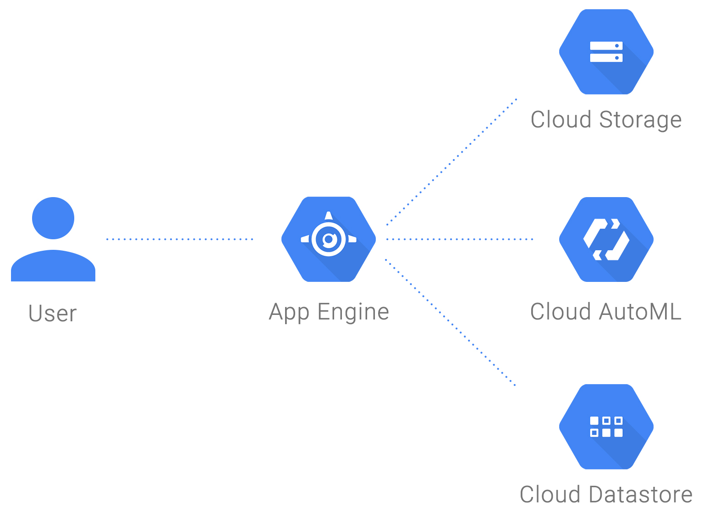

# Cloud AutoML Custom Vision Sport Classification

keywords: Cloud AutoML, AutoML Vision, Image classification, Custom Vision API, Google Cloud Platform, GCP,
Demo Guide available at https://www.cloudconnect.goog/docs/DOC-23460

<table>
	<tr>
		<td>Description</td>
		<td>Building a state of the art image classification app for developers <b>with no ML expertise</b>.</td>
	</tr>
	<tr>
		<td>Intended audience</td>
		<td>Companies that use a high volume of docs and files like images, receipts, drawings, maps, blueprints, etc. and need to categorize them, like: media and entertainment, autonomous cars, automatic retail checkout, predictive maintenance, automatic industrial applications.</td>
	</tr>
	<tr>
		<td>Products used</td>
		<td>Cloud AutoML, App Engine, Cloud Storage, Cloud Datastore</td>
	</tr>
</table>


## Introduction

In this demo you will learn how to build an AutoML Vision model for sport classification and deploy a Python Flask web application to the App Engine Flexible environment. The AutoML Vision model is built by uploading 100 photos for each sport category from a public image dataset ([Open Images dataset](https://bigquery.cloud.google.com/dataset/bigquery-public-data:open_images)) and training it with a few clicks. The example application allows a user to upload a photo of one of ten popular sports (track and field, baseball, basketball, cricket, golf, gymnastics, Soccer, swimming, tennis and volleyball) and learn what sport it is. The application uses Google Cloud APIs for AutoML Vision, Storage, and Datastore.

The demo introduces an image classification model and shows how GCP tools are used to build a solution consisting of:
- A Python Flask web application served by App Engine Flexible
- An image classification model on AutoML Custom Vision API
- Cloud Storage and Datastore to store data
The following diagram shows how different services are set up:



- App Engine provides a webpage to upload an image.
- Cloud Storage provides a file storage web service.
- AutoML Vision provides image classification.
- Datastore provides a fully managed database for storing classification results.
- The visualization engine is provided by App Engine.

## Instructions

Allow from two to four hours the first time you set up the demo. The setup time should drop to about 45 minutes in future releases of AutoML Vision.

### Setup and requirements

1. Create a project on Google Cloud Platform. If you don't already have a Google Account (Gmail or Google Apps), you must create one. Sign-in to Google Cloud Platform console (console.cloud.google.com) and create a new project. Remember the project ID, <PROJECT_ID>, a unique name across all Google Cloud projects. It will be referred to later in this document as <PROJECT_ID>.
2. Enable billing in the Cloud Console in order to use Google Cloud resources.
3. Install Google Cloud SDK by following the instructions. If you have already installed Google Cloud SDK, update all of your installed components to the latest version:
```
gcloud components update
```
4. Initialize Cloud SDK:
   1. In the Cloud Shell run the following command:
   ```
   gcloud init
   ```
   2. When prompted, create a new configuration and give it a meaningful name.
   3. Select the user account to associate this new configuration with.
   4. Follow the instructions and when prompted enter the <PROJECT_ID> for the project you created.
5. Go to Google Cloud Platform console.
6. From the menu select ‘APIs and Services’ -> Library and enable the required APIs:
   1. Google Compute Engine API
   2. Google App Engine Flexible Environment
   3. Google Cloud Datastore API
   4. Google Cloud Storage.

### Build the AutoML model

1. Download the [training data](https://storage.googleapis.com/automl-vision-sports/Archive.zip) to your local computer. The training data consists of 10 folders each named with a specific sport. Each folder contains 100 images for that sport.
2. Go to [AutoML Vision API](https://custom-vision.appspot.com/vision).
3. Click on ‘GET STARTED’.
4. Enter your Google Cloud project ID, <PROJECT_ID>, as instructed and click ‘CONTINUE’.
5. Click on ‘SETUP NOW’ to enable billing, the required APIs, service accounts and a bucket for image on GCS.
6. Click on ‘SETUP’ in the window that appears.
7. Choose an account.
8. Click on ‘ALLOW’. The ‘SETTING UP’ may take a few minutes. Wait for it to finish.
9. Enter a dataset name, <DATASET_NAME>, in the space provided. This will also be your the name of your AutoML model, <MODEL_NAME>.
10. Leave 'Allow more than one label per image' and 'Respect file order' unchecked. Click on ‘+ ADD NEW DATASET’.
11. Select ‘Upload training images from your computer' and click the ‘UPLOAD’ button under the it.
12. In the window that appears select the training data archive file that you downloaded and click ‘Open’.
13. Wait for the uploading to end and then click on ‘IMPORT’ at the bottom of the page. Wait for the dataset processing to finish (this may take a while).
14. From the top menu click on the ‘TRAIN’ tab.
15. Choose ‘Base model (free) about 1 hour train time’. You may alternatively select ‘Advanced model ($550) up to 24 hours train time’ but it will not be free.
16. Click on the ‘TRAIN’ button at the bottom of the page. This will train your model. It may take about an hour to finish (24 hours if you selected the Advanced model).
17. After the training is finished select your dataset from the table by clicking on the <DATASET_NAME>.
18. Write down the value in ‘Metrics for model’. That is your <MODEL_VERSION>.

### Get the sample code and configure the settings

1. Clone the app source code by clicking on the 'Clone or download' button in the GitHub page and following the instructions.
2. Switch to your new local Git repository:
```
cd app
```
3. Open app.yaml using an editor and replace the actual values for <PROJECT_ID>, <CLOUD_STORAGE_BUCKET>, <MODEL_NAME> and <MODEL_VERSION>:
```
env_variables:
  PROJECT_ID: <PROJECT_ID>
  CLOUD_STORAGE_BUCKET: <CLOUD_STORAGE_BUCKET>
  MODEL_NAME: <MODEL_NAME>
  MODEL_VERSION: <MODEL_VERSION>
```
4. Save and close the file.

### Deploy the app to App Engine:

1. Deploy the application to App Engine by running:
```
gcloud app deploy
```
2. Choose the region where you want your App Engine application located
3. When asked ‘Do you want to continue’, enter Y and press enter.

### Test your application

1. After the app is deployed you can run it by going to its URL (replace the actual value for your <PROJECT_ID>):
```
https://<PROJECT_ID>.appspot.com
```
2. Click on ‘Choose File’ and select an image from your computer showing one of the 10 sports in this demo.
3. Click on ‘Submit’. Wait a few seconds. The app will display the photo on its page and also the image classification returned from AutoML Vision API.

### Debugging tip

- During the alpha period, there may be a warm up delay with your model. If your initial requests return an error, please wait a few seconds before trying again.