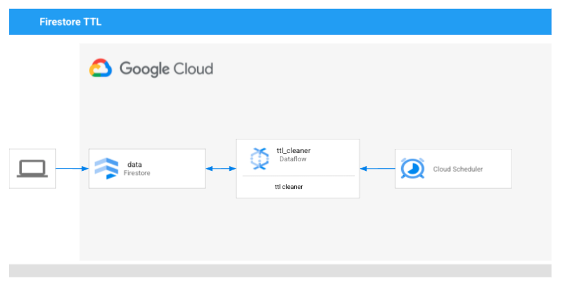

# Overview
Cloud Dataflow template for running a TTL (time to live) to delete expired documents in Cloud Firestore

# Architecture

# Compile and run

The following code is used for testing purposes:

```sh
Authorize your local with gcloud command:
gcloud auth application-default login
gcloud config set project anand-fb-test-1

To run locally: 
For using documnent snapshot create_date (internal)
python3 read.py --collection test-create-date --ttl "1 seconds"

For user defined column scan
python3 read.py --collection test-create-date --ttl "1 seconds" --ttlcolumn create_date
```

To run in dataflow first export variables for PROJECT, REGION and BUCKET

```sh
export PROJECT=anand-fb-test-1
export REGION=us-east1
export BUCKET=anand-fb-test-1_videos
```

Then you can create a template and store it in template location gs://$BUCKET/template/firestoreTTL

```sh
python3 read.py \
  --runner DataflowRunner \
  --region $REGION \
  --project $PROJECT \
  --temp_location gs://$BUCKET/tmp/ \
  --template_location gs://$BUCKET/template/firestoreTTL \
  --requirements_file requirements.txt \
  --staging_location gs://$BUCKET/staging/s1 
```
Then you can use the following gcloud command to kick start the job or you can use the console UI also.

```sh
gcloud dataflow jobs run firestore_ttl_$(date +"%Y-%m-%d_%H:%M:%S") \
  --gcs-location gs://$BUCKET/template/firestoreTTL \
  --region $REGION \
  --parameters collection=test-create-date,ttl="2 seconds",ttlcolumn=create_date
```