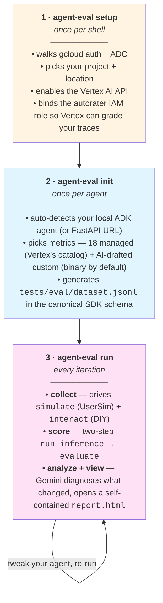
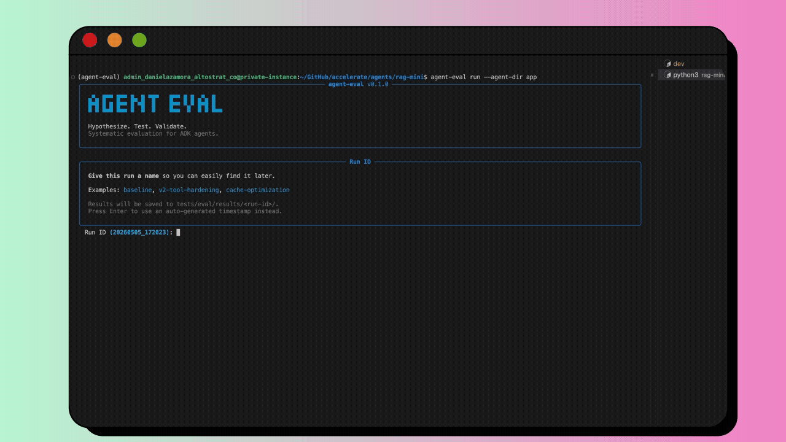
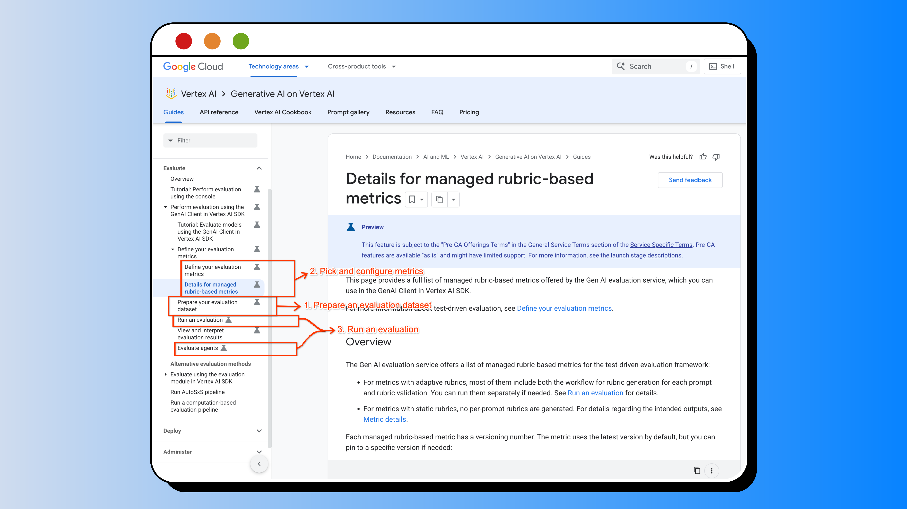
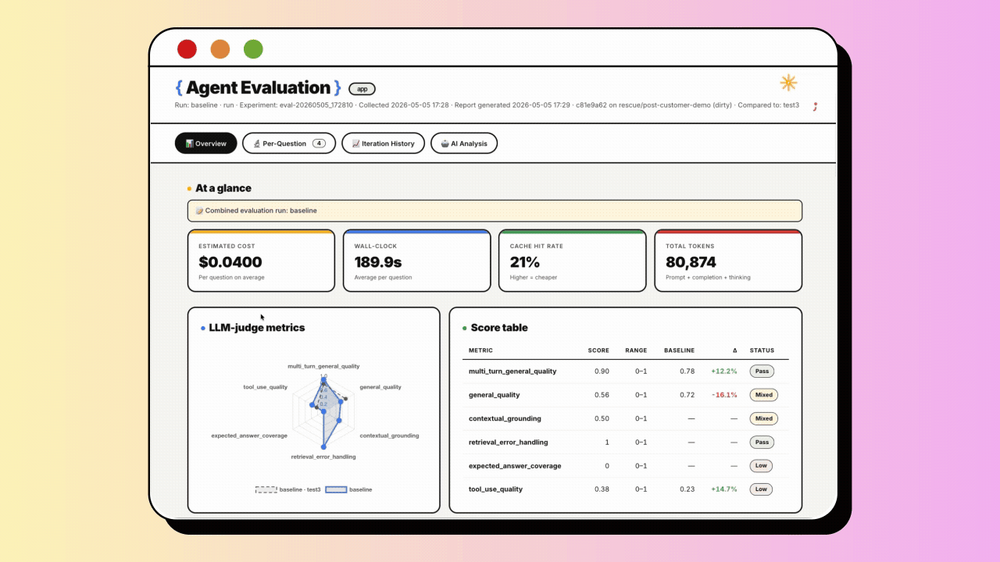

# agent-eval

A hand-on-shoulder CLI walkthrough of the [Vertex AI Generative AI Evaluation Service](https://docs.cloud.google.com/vertex-ai/generative-ai/docs/models/evaluation-genai-sdk) for ADK agents.

<p align="center">
  
</p>

## What to expect

Three commands, in order. The first is once-per-shell setup, the second is once-per-agent scaffolding, and the third is the iteration loop you'll spend most of your time in.



Each phase inside `run` is also exposed as a standalone command (`simulate`, `interact`, `evaluate`, `analyze`, `report`, `dashboard`) for finer control. The CLI teaches as you go — `--help` and the in-flow prompts carry the technical detail; [`docs/reference.md`](docs/reference.md) is the deep catalog.

## Quickstart

### [0] Install + set up Google Cloud

You need **Python 3.10–3.12**, **[`uv`](https://docs.astral.sh/uv/)**, and **[`gcloud`](https://cloud.google.com/sdk/docs/install)** installed locally.

```bash
cd agent-eval
uv sync                   # creates .venv/ and installs all deps
source .venv/bin/activate # so `agent-eval` is on your PATH
```

Then walk Google Cloud setup (once per shell):

```bash
agent-eval setup
```

Six idempotent steps — walks gcloud auth, picks your project + location, enables the Vertex AI API, binds the autorater IAM. Re-run whenever you switch projects or your token expires; already-done steps are detected and skipped.

> ⚠️ **Use Vertex AI, not `GOOGLE_API_KEY`** — eval metrics will be empty otherwise. `agent-eval setup` configures this for you.

> Wheel install is on the roadmap; for now, source clone + `uv sync` is the supported install path.

### [1] Initialize an agent

<details>
<summary><b>Don't have an ADK agent yet?</b></summary>

Drop new agents into the `agents/` folder so `agent-eval init` finds them by default. Pick the deploy target that matches how you want to evaluate:

```bash
mkdir -p agents && cd agents
uvx agent-starter-pack create my-agent \
    -a adk -d agent_engine \
    --cicd-runner google_cloud_build --region us-central1 --auto-approve
cd my-agent && make install
make backend     # only needed for `agent_engine` / `cloud_run` — provisions + deploys
```

</details>

**What `init` looks for** in your project tree (skipping `.venv`, `__pycache__`, `node_modules`, `.git`, `.adk`, etc.):

- **`agent.py`** — the ADK convention is one per agent module (e.g. `app/agent.py`) defining a `root_agent` symbol. Any matching file in your tree counts. Multiple agents? `init` lists them and asks you to pick.

**What `init` scaffolds** under your project's `tests/eval/`:

- **`dataset.jsonl`** — your single source of truth for evaluation rows (canonical Vertex SDK columns: `prompt`, `response`, `reference`, `history`, `intermediate_events`, `session_inputs`, …). One file feeds every command.
- **`metrics/metric_definitions.json`** — LLM-as-judge rubrics. With `--ai-metrics`, Gemini reads your agent code and drafts agent-specific metrics; without it, you get a curated starter set.

```bash
agent-eval init   # auto-detects your agent + scaffolds dataset/metrics (run from anywhere)
```

`init` walks the directory and announces what it found. The local pipeline (UserSim multi-turn + DIY single-turn `interact` + scoring + analysis) is the default — that's where you iterate, and it's what you'll see in the next step.

### [2] Run evaluation

<p align="center">
  
</p>

```bash
cd agents/<YOUR_AGENT_FOLDER>
uv pip install -e .   # install the agent's deps — we import its agent.py for tool schemas
agent-eval run        # collect → score → analyze → view
```

`run` ends by opening that self-contained `report.html` in your browser. On a remote dev box without a display, it offers to spawn a localhost HTTP server you can SSH-tunnel or open via Cloud Workstation's Web Preview. `agent-eval report` re-opens it anytime.

See [`docs/reference.md`](docs/reference.md) for the per-phase walkthrough, every flag, dataset schema details, custom metric patterns, troubleshooting, and the BYOD roadmap.

## Background Story

`agent-eval` is built on top of the **Vertex AI Gen AI SDK** (the previous standalone Vertex AI Eval SDK is no longer maintained, so all of `agent-eval` targets the new one).

<p align="center">
  
</p>

The Gen AI SDK eval docs cover three things (the boxes above):

1. **Prepare an evaluation dataset** — the canonical columns each metric expects (`prompt`, `response`, `reference`, `history`, `instruction`, `intermediate_events`, `rubric_groups` for adaptive rubrics, plus `session_inputs` for ADK state seeding). One unified `tests/eval/dataset.jsonl` feeds every command — `simulate` reads multi-turn rows, `interact` and `agent-engine` read single-turn rows.
2. **Pick and configure metrics** — what each metric scores, what columns it reads, and how to mix metric families freely in one evaluation.
3. **Run an evaluation** — the two-step `client.evals.run_inference()` → `client.evals.evaluate()`, the workhorse for everyday iteration.

`agent-eval` folds those three things into the three commands shown in the [What to expect](#what-to-expect) map up top.

---

`agent-eval` started as the evaluation process for one real agent and has been re-implemented, tested, and improved against several more since. Each piece of the report you'll see below traces back to a specific engineer or user asking for it — and the output format itself is the receipt of that iteration: it began as raw CSV cells, became eval_summary.json dumps, then a stack of markdown files, and is now a single self-contained report.html. Same data, surfaced in the form the next person actually wanted.

<p align="center">
  
</p>

Take the overview page — the radar plot (the most recent addition) is dear to us. It was a natural implementation from two beloved engineers when they started iterating on their agent using eval data. One headline number ("`general_quality` went up to 0.8!") hides the fact that the same change might have tanked `tool_use_quality` or `hallucination`; plotting every LLM-judge metric on the same axes, with the previous run dashed underneath, makes that regression hard to miss. The four tiles above the radar exist because production cost and latency are very requested dimensions too — there isn't much value in scoring 0.95 on `general_quality` if every turn costs $10 and takes 90 seconds.

The per-question view started as plain per-question scores. Then we kept adding what was missing — deterministic metadata from each LLM call, the full conversation trace including what happened *inside* each turn (tool calls with arguments and results, not just inputs and outputs), the final session state, the system instruction the LLM saw, the autorater's per-rubric reasoning. The principle is "as much information as possible at the moment of debugging," because a 0.2 on `tool_use_quality` is useless without seeing what the agent actually did. The heatmap up top makes failing cells (red) jump out so you know where to click first.

The iteration history came from Google teammates wanting to use eval data for real hillclimbing — watching a specific part of the agent improve or regress run over run. It started as a markdown file we still call `OPTIMIZATION_LOG.md` (kept on disk for git/grep) and is now a Chart.js trend line per metric with per-iteration delta cards tied to the git commit, so a score movement maps back to a specific code change.

The thing we engineers kept asking after the first few evals: *"I have all these beautiful numbers and metadata… and then what? What do I actually do with this?"* That question is what made us start running the full eval output back through Gemini — every score, every trace, every failed rubric, the agent's own code, ADK design patterns from our reference — and have it write the analysis: which tool is misbehaving, which prompt instruction is inducing fabrication, which retry loop is blowing up the context window, which specific lines in `agent.py` to look at. The intent is to shrink the loop between "the report says something's wrong" and "I know the fix."

---

## A note from the team

Everything you see here is months of *"this didn't work — what do we actually need?"* It isn't set in stone. There's room to make it more resilient, more reusable, or better suited to your team's evaluation needs. We recommend `agent-eval` as a starting point — you'd be building on months of iteration with real agents, rather than starting from scratch. If you want to contribute back, open an issue or send a PR. We'll keep at it.

— *other engineers wanting to scientifically improve their agents, not only vibe (vibe, yes, but then quantify)*

**Honest caveats up front** — see [`docs/FUTURE_WORK.md`](docs/FUTURE_WORK.md) for the full context on each:

- The streamlined Agent Engine pass (`agent-eval agent-engine`) is currently being re-validated; the local pipeline (`agent-eval run`) is what we ship and recommend.
- Token / cache / thinking metrics read Gemini-specific field names from `usage_metadata` — verified against Gemini 3 / 3.1 Flash and Pro. After a model-family bump, sanity-check `eval_summary.json` for unexpected zeros.
- ADK is the only agent framework supported out of the box. Other frameworks need the trace-collection layer abstracted.

If any of these matter for your use case, the FUTURE_WORK doc has reproduction steps and concrete pickup hooks.

---

## License

Apache 2.0
