# Reference Guide

Complete documentation for every `agent-eval` command, option, metric type, data format, and customization point.

For installation and getting started, see the [README](../README.md).

---

## Table of Contents

1. [Why this design](#why-this-design)
2. [Mapping to the Vertex AI eval docs sidebar](#mapping-to-the-vertex-ai-eval-docs-sidebar)
3. [Architecture overview](#architecture-overview)
   - [The metric families](#the-metric-families)
   - [Two evaluation surfaces](#two-evaluation-surfaces)
   - [Which SDK call drives which command](#which-sdk-call-drives-which-command)
   - [Dataset row schema](#dataset-row-schema)
   - [Folder layout (legacy → new)](#folder-layout-legacy--new)
   - [Custom metric patterns](#custom-metric-patterns)
4. [Authentication](#authentication)
5. [CLI Reference](#cli-reference)
   - [init](#init)
   - [run](#run)
   - [report](#report) — open the HTML report
   - [stories](#stories) — browse the wait-time essays
   - [simulate](#simulate)
   - [interact](#interact)
   - [evaluate](#evaluate)
   - [analyze](#analyze)
   - [agent-engine](#agent-engine) *(currently being re-validated — see note in section)*
   - [import](#import)
   - [migrate](#migrate)
   - [convert](#convert)
   - [create-dataset](#create-dataset)
   - [dashboard](#dashboard)
6. [Metrics](#metrics)
   - [Deterministic Metrics](#deterministic-metrics)
   - [Managed Metrics (Vertex AI)](#managed-metrics-vertex-ai)
   - [Custom LLM-as-Judge Metrics](#custom-llm-as-judge-metrics)
7. [Creating Custom Metrics](#creating-custom-metrics)
   - [Basic Structure](#basic-structure)
   - [Dataset Mapping Constraint](#dataset-mapping-constraint)
   - [Available Source Columns](#available-source-columns)
   - [Per-row capability detection (`requires_reference` / `requires_multi_turn`)](#per-row-capability-detection)
   - [Combining Multiple Sources](#combining-multiple-sources)
   - [Structured Response Evaluation](#structured-response-evaluation)
   - [Binary Decomposition](#binary-decomposition)
   - [Example: Trajectory Accuracy](#example-trajectory-accuracy)
   - [Example: Tool Usage Quality](#example-tool-usage-quality)
8. [Interaction Modes](#interaction-modes)
   - [ADK User Sim](#adk-user-sim)
   - [DIY Interactions](#diy-interactions)
9. [Data Formats](#data-formats)
   - [Golden Dataset](#golden-dataset)
   - [Conversation Scenarios](#conversation-scenarios)
   - [Session Input](#session-input)
   - [Processed JSONL Fields](#processed-jsonl-fields)
10. [Output Files](#output-files)
    - [report.html](#reporthtml) — the canonical viewing surface
    - [eval_summary.json](#eval_summaryjson)
    - [gemini_analysis.md](#gemini_analysismd)
    - [OPTIMIZATION_LOG.md](#optimization_logmd)
11. [Run Comparison](#run-comparison)
12. [Managed Metrics Catalog](#managed-metrics-catalog)
13. [Models and Pricing](#models-and-pricing)
14. [ADK Optimization Patterns](#adk-optimization-patterns)
15. [AI Assistant Integration](#ai-assistant-integration)
16. [Troubleshooting](#troubleshooting)
17. [Experimental & on the roadmap](#experimental--on-the-roadmap)
    - [BYOD — `agent-eval ingest-traces`](#byod-bring-your-own-data--agent-eval-ingest-traces)
    - [Other deferred items from the plan](#other-deferred-items-from-the-plan)
    - [SDK features `agent-eval` doesn't surface yet](#sdk-features-agent-eval-doesnt-surface-yet)

---

## Why this design

> **TL;DR — three problems the SDK-aligned refactor (April 2026) solved:**
> 1. Hand-maintained "metrics that need a reference" lists kept going stale → introspect the SDK at runtime.
> 2. CLI didn't mirror the Vertex docs → reorganized one-for-one against the docs sidebar.
> 3. Two folders + two data shapes + unclear Agent Engine story → one canonical `tests/eval/dataset.jsonl` feeds every command.
>
> Skim the rest if you want the *why* behind these; jump to [CLI Reference](#cli-reference) if you just need the commands.

`agent-eval` exists because we wanted to use the Vertex AI Generative AI Evaluation Service to evaluate our ADK agents — and we wanted the experience of *following the docs* to be the same as the experience of *using the CLI*. This section explains the three problems the SDK-aligned refactor (April 2026) addressed, so you understand the choices reflected in the rest of this doc.

**1. Hardcoded reference requirements.** Earlier versions of `agent-eval` carried a hand-maintained set of "metrics that need a reference field." Every time Google added a new managed metric, our list went stale. The refactor replaces that with `metric_families.classify()` — which introspects the SDK directly via `ComputationMetricHandler.SUPPORTED_COMPUTATION_METRICS`, `TranslationMetricHandler.SUPPORTED_TRANSLATION_METRICS`, and `_evals_constant.SUPPORTED_PREDEFINED_METRICS`. New metrics land in the right family automatically.

**2. The CLI didn't mirror the docs.** Users had to learn two mental models — Google's docs and our flow. The CLI now mirrors the [Vertex AI eval docs sidebar](https://cloud.google.com/vertex-ai/generative-ai/docs/models/evaluation/) one-for-one: *Define metrics* (init Step 3, family-grouped picker) → *Prepare dataset* (init Step 4 / `import`) → *Run evaluation* (`simulate` / `interact` → `evaluate`) → *View results* (`analyze` + `dashboard`) → *Evaluate agents* (`agent-engine` for the streamlined Agent Engine pass).

**3. Two folders, two data shapes, no clear story for Agent Engine.** The old layout had `app/eval/` (ours) sitting next to `tests/eval/evalsets/` (ADK's), with separate `scenarios/*.json` and `golden_dataset.json` files using different shapes, and unclear handling for Agent Engine deployments. The post-rescue (April 2026) layout consolidates everything into ONE file at the project root: `<project_root>/tests/eval/dataset.jsonl`. Every command consumes this single file — `simulate` filters multi-turn rows, `interact` and `agent-engine` filter single-turn rows. ADK's required scenario files inside the agent module are an ephemeral cache projected from `dataset.jsonl` by `simulate`, not a parallel data source the user maintains. The local pipeline is always available; if you've also deployed to Agent Engine, the streamlined single-turn pass adds on top — they compose, they don't compete. See [Two evaluation surfaces](#two-evaluation-surfaces). BYOD lives as a roadmap note, not a third surface.

**Doc strategy:** the [README](../README.md) is the e2e walk-through — it covers the local iteration loop end-to-end and shows how an Agent Engine deployment unlocks the streamlined pass on top, including ASP scaffolding for users who don't have an agent yet. The CLI itself carries the in-flow technical detail (`--help`, questionary prompts, Rich panels). This document is the deep reference for when you want to know *why* something works the way it does, plus the catalog of every CLI command, metric, and data shape.

---

## Mapping to the Vertex AI eval docs sidebar

Each section under *"Perform evaluation using the GenAI Client in Vertex AI SDK"* in the eval docs sidebar maps one-for-one to a step in `agent-eval`. Every row links to the official Vertex AI page so you can cross-reference what we're doing on your behalf:

| Docs section | What `agent-eval` does for you |
|---|---|
| [Tutorial: Evaluate models using the GenAI Client](https://cloud.google.com/vertex-ai/generative-ai/docs/models/evaluation-genai-sdk) | `agent-eval init` walks you through environment setup, agent discovery, and a first-run scaffold — the docs' tutorial, but for ADK agents instead of raw model calls. |
| [Define your evaluation metrics](https://cloud.google.com/vertex-ai/generative-ai/docs/models/determine-eval) | `init` Step 3 — managed metrics grouped by family (adaptive / static / computation / translation), with `GENERAL_QUALITY` pre-checked per the docs' recommendation. |
| ↳ [Details for managed rubric-based metrics](https://cloud.google.com/vertex-ai/generative-ai/docs/models/rubric-metric-details) | `metric_families.classify()` introspects the SDK's `_evals_constant.SUPPORTED_PREDEFINED_METRICS`, so the picker stays in sync with the managed `RubricMetric.*` entries automatically. |
| [Prepare your evaluation dataset](https://cloud.google.com/vertex-ai/generative-ai/docs/models/evaluation-dataset) | `init` Step 4 generates a unified `<project_root>/tests/eval/dataset.jsonl`. Each row carries an explicit `kind` (`multi_turn` / `single_turn` / `both`) + `id` + the canonical SDK FLATTEN columns (`prompt`, `response`, `history`, `instruction`, `intermediate_events`, `rubric_groups`) + `session_inputs` for ADK state seeding + a nested `reference_data` dict where reference-required metrics pull from (canonical: `reference_data.expected_behavior` for the SDK `reference` column, with per-metric `reference_field` overrides for domain-specific golden fields like `expected_docs` / `expected_routing`). `agent-eval import --from <evalset>` flattens existing ADK evalsets into the same file. |
| [Run an evaluation](https://cloud.google.com/vertex-ai/generative-ai/docs/models/run-evaluation) | The **local pipeline** — `agent-eval simulate` (multi-turn via ADK UserSim) or `agent-eval interact` (single-turn via ADK FastAPI) capture responses + traces, then `agent-eval evaluate` scores them with `client.evals.evaluate()`. |
| [View and interpret evaluation results](https://cloud.google.com/vertex-ai/generative-ai/docs/models/view-evaluation) | `agent-eval analyze` produces a Gemini diagnosis + cumulative `OPTIMIZATION_LOG.md`; `agent-eval dashboard` opens an interactive comparison view. |
| [Evaluate agents](https://cloud.google.com/vertex-ai/generative-ai/docs/models/evaluation-agents-client) | `agent-eval agent-engine` is the **streamlined Agent Engine pass** — calls `client.evals.run_inference()` + `client.evals.create_evaluation_run()` against a deployed Reasoning Engine. Adds a managed single-turn pass on top of the local pipeline whenever a deployment is detected. |

---

## Architecture overview

`agent-eval` is a thin orchestration layer over the Vertex AI Generative AI Evaluation Service (Preview). The CLI's job is to walk you through the same workflow the docs describe — discover an agent, prepare a dataset, pick metrics, run inference + evaluation, view results — without you having to glue the SDK calls together yourself.

This section is the mental model the rest of the doc assumes.

### The metric families

Vertex AI managed metrics belong to one of four families per the docs catalog. Knowing the family tells you what data the metric needs and how the SDK scores it. The two **rubric** families are what the `init` picker actually surfaces as managed picks today; **Computation** and **Translation** are catalogued upstream but the SDK we pin (`google-cloud-aiplatform>=1.132.0,<1.140.0`) doesn't expose them as managed picks — write them as custom metrics (see the [Define your evaluation metrics](https://cloud.google.com/vertex-ai/generative-ai/docs/models/determine-eval) overview, which describes BLEU/ROUGE/exact_match alongside the rubric metrics) if you need them.

| Family | Examples | Reference required? | How scoring works | In `init` picker today |
|---|---|---|---|---|
| **Adaptive Rubric** (recommended start) | `GENERAL_QUALITY`, `TEXT_QUALITY`, `INSTRUCTION_FOLLOWING`, `MULTI_TURN_*`, `FINAL_RESPONSE_QUALITY`, `FINAL_RESPONSE_REFERENCE_FREE`, `TOOL_USE_QUALITY` | optional | Judge LLM generates rubrics on the fly from the prompt + response. | ✅ ~8 metrics |
| **Static Rubric** | `GROUNDING`, `SAFETY`, `FINAL_RESPONSE_MATCH`, `HALLUCINATION` | optional / match-only | Judge LLM applies a fixed rubric. | ✅ ~3 metrics |
| **Computation** (deterministic) | `EXACT_MATCH`, `BLEU`, `ROUGE_1`, `ROUGE_L_SUM`, `tool_*` | **required** | Mathematical comparison against `reference`. | ❌ catalogued, not managed — write as custom |
| **Translation** (niche) | `comet`, `metricx` | **required** | Translation-quality scorers. | ❌ catalogued, not managed — write as custom |

`agent-eval init` groups its checkbox picker by family using `metric_families.classify()`, which introspects the SDK directly — adding a new managed metric upstream lands it in the right group automatically. The `init` background table at run time *only* renders families that have ≥1 metric in the catalog (so you don't see empty rows for Computation / Translation right before a picker that has no Computation / Translation options); the table includes a footnote naming what's missing and where it went.

The Vertex AI docs recommend starting with `GENERAL_QUALITY` only and opting into more metrics as you learn what your agent needs. The CLI follows that recommendation: only `GENERAL_QUALITY` is pre-checked.

### Two evaluation surfaces

`agent-eval` exposes two evaluation surfaces that **compose** — they're not alternatives. The local pipeline is the default and runs against any local `agent.py`. A deployed Agent Engine *adds* the streamlined single-turn managed pass on top, without changing how local works.

> **Why local is the default.** You don't need a deployment to evaluate. The most common case is iterating on an agent before shipping it: change a prompt or a tool, re-run the local pipeline, look at the deltas. Once you deploy, the streamlined pass becomes available as the "confirm against the live deployment" check — but it doesn't replace the local loop, which stays the iteration surface forever.

| Surface | When it's available | What runs the agent | Multi-turn? | Trace fidelity |
|---|---|---|---|---|
| **Local pipeline** (default, always on) | Whenever a local `agent.py` is on disk, OR you can point at any ADK FastAPI URL | `agent-eval simulate` (UserSim, in-process import — no FastAPI server needed) + `agent-eval interact` (DIY, REST against any ADK URL) | **Yes** — UserSim drives multi-turn dialogues | Full when local-dev or Agent Engine; degraded on Cloud Run (state-derived metrics only) |
| **Streamlined Agent Engine pass** (additive) | Agent is deployed to a Reasoning Engine (typically via Agent Starter Pack `make backend`) | `agent-eval agent-engine` → `client.evals.create_evaluation_run()` — Vertex calls the deployed agent for you | **No** — `create_evaluation_run` is single-turn; Vertex doesn't ship a user simulator | Full (managed by Vertex) |

**Auto-detection.** `agent-eval init` runs `path_detector.detect_execution_path()` early and announces what it found:

| Detected | Scaffolded |
|---|---|
| Local `agent.py` only | One unified `<project_root>/tests/eval/dataset.jsonl` + `tests/eval/metrics/metric_definitions.json` |
| Agent Engine deployment + local `agent.py` (the typical `make backend` case) | Same one file. The Next Steps panel additionally surfaces `agent-eval agent-engine` for the streamlined deployed pass |
| Agent Engine deployment only (rare — no source on disk) | Same one file. Next Steps surfaces only `agent-engine` (no local pipeline available without source to import) |
| Neither | Same one file (the typical "I'm starting fresh" case — wire up `agent.py` next, then re-run init) |

Same files, different commands surfaced. The Phase D unified-dataset refactor (April 2026) collapsed the old per-detection scaffold variants — there is nothing the user maintains other than `tests/eval/dataset.jsonl` and `tests/eval/metrics/metric_definitions.json`. ADK's per-run scenario files live inside the agent module dir as ephemeral cache projected from `dataset.jsonl` by `simulate`.

Detection signals: `AGENT_ENGINE_RESOURCE_NAME` env var or `deployment/agent_engine_metadata.json` (from ASP) for the deployment; an `agent.py` reachable from `cwd` via `rglob` for local source.

If auto-detection misses your deployment (metadata file in an unexpected place, env var not exported in the current shell, etc.), `init` prints "No Agent Engine deployment found here" and immediately offers a manual escape hatch: paste a `projects/<NUMBER>/locations/<REGION>/reasoningEngines/<ID>` resource name and `init` synthesizes the same `ae_detection` it would have built from a real metadata file — the streamlined pass lights up exactly as if it had been auto-found. Skipped under `AGENT_EVAL_NO_PAUSES=1` so CI runs don't deadlock; invalid format (regex `projects/.+/locations/.+/reasoningEngines/.+`) prints a yellow warning and falls back to local-only.

> **Non-ADK agent? (BYOD)** There's no third surface in the UI. The schema unification means you can hand-write a converter against the row shape in [Dataset row schema](#dataset-row-schema), drop the JSONL into `tests/eval/dataset.jsonl`, and run `agent-eval evaluate` like normal. A streamlined `agent-eval ingest-traces` command is on the [roadmap](#byod-bring-your-own-data--agent-eval-ingest-traces).

**The local pipeline has three sub-modes**, all hitting the same ADK FastAPI routes:

| Sub-mode | Started by | Trace persistence |
|---|---|---|
| Local dev | `make playground`, `python -m google.adk.cli` | Full traces — latency, spans, tool calls |
| Cloud Run | Deployed FastAPI on Cloud Run | **Often missing** — `agent_eval` falls back to state-derived metrics only (`processor.py` already handles this gracefully) |
| Remote ADK | Any other ADK FastAPI URL | Depends on the host |

If you pick the DIY interaction mode in `init`, the CLI surfaces the Cloud Run trace caveat upfront so you're not surprised when latency metrics come back empty.

### Which SDK call drives which command

The Vertex AI eval docs describe a clean two-step pattern: `client.evals.run_inference()` to generate responses, then `client.evals.evaluate()` to score them. That pattern fits perfectly when you're evaluating a raw model or an Agent Engine deployment — but it doesn't fit a *local ADK agent*, which lives behind ADK's FastAPI server, not behind Vertex's inference API.

So the **local pipeline** reaches the agent through ADK-native channels and converges at `client.evals.evaluate()` for scoring. The **streamlined Agent Engine pass** uses Vertex's one-call `create_evaluation_run`, which subsumes inference + scoring + GCS upload. This table is the truth of which call drives which command:

| Command | Surface | How it gets the agent's responses | How it scores them |
|---|---|---|---|
| `agent-eval simulate` | Local pipeline | ADK's [User Simulation](https://google.github.io/adk-docs/evaluate/user-sim/) drives a simulated user against your imported `agent.py`. ADK writes traces to `.adk/eval_history/`; we convert them to JSONL. | `client.evals.evaluate(dataset, metrics)` |
| `agent-eval interact` | Local pipeline | Our REST client (`agent_client.py`) hits ADK's FastAPI endpoints directly: `/run`, `/apps/.../sessions/...`, `/debug/trace/session/{id}`. We capture the full trace ourselves. | `client.evals.evaluate(dataset, metrics)` |
| `agent-eval evaluate` | Local pipeline | (Reads existing JSONL from `simulate` / `interact`.) | `client.evals.evaluate(dataset, metrics)` |
| `agent-eval agent-engine` | Streamlined Agent Engine pass | `client.evals.run_inference(agent=<resource>, src=df)` — Vertex calls your deployed Reasoning Engine for you. | `client.evals.create_evaluation_run(...)` — inference + scoring + GCS upload, one call. |

**Why doesn't the local pipeline use `run_inference()`?**

`client.evals.run_inference()` is built for two cases (per the [Run an evaluation](https://docs.cloud.google.com/vertex-ai/generative-ai/docs/models/run-evaluation) docs): a `model=` string for direct LLM calls, or an `agent=<reasoning-engine-resource>` for Agent Engine deployments. Local ADK agents fit neither — they're a FastAPI process you started locally or in Cloud Run. Reaching them through `run_inference` would require a managed bridge that doesn't exist.

ADK provides better-fitting tools for the local case:

- **UserSim** is the docs-aligned way to drive *multi-turn* agent dialogues with realistic, LLM-played user behavior. It's strictly more capable than passing a flat list of prompts to `run_inference()`.
- **The ADK FastAPI debug endpoints** (`/debug/trace/session/{id}`) give us full execution traces — latency per step, intermediate events, tool calls, session state — which `run_inference()` doesn't surface for non-Agent-Engine deployments.

The end result: both surfaces produce the same `dataset.jsonl` row shape, and both score through Vertex's eval client. The only difference is *how the response and trace columns get populated*. The streamlined pass delegates inference to Vertex; the local pipeline delegates inference to ADK; both meet at the same scoring layer.

### Dataset row schema

The unified dataset lives at `<project_root>/tests/eval/dataset.jsonl`. Every row is a JSON object that opens with `kind` + `id` so the row's identity is the first thing your eye lands on.

**Multi-turn row** (`kind: "multi_turn"` — drives `simulate`):

```jsonl
{
  "kind": "multi_turn",
  "id": "multi_turn_001",
  "prompt": "Set the active dataset to crwd and find the initial incident response reports.",
  "session_inputs": {"app_name": "app", "user_id": "u1", "state": {}},
  "conversation_plan": [
    "Summarize the key timelines from those retrieved documents.",
    "Map the communication network of the primary IT responders mentioned in the summary."
  ]
}
```

**Single-turn row** (`kind: "single_turn"` — drives `interact` + `agent-engine`):

```jsonl
{
  "kind": "single_turn",
  "id": "single_turn_001",
  "prompt": "Using the delta dataset, find emails about the Q3 pricing strategy.",
  "session_inputs": {"app_name": "app", "user_id": "u1", "state": {}},
  "reference_data": {
    "expected_behavior": "The orchestrator must call set_active_dataset('delta'), then delegate to discovery_agent.",
    "expected_routing": ["set_active_dataset", "discovery_agent"],
    "expected_docs": ["doc_pricing_v2"]
  }
}
```

A row may also carry `kind: "both"` to drive every path (multi-turn replay AND single-turn scoring).

**Field reference:**

| Field | Required | Where it goes |
|---|---|---|
| `kind` | yes | `"multi_turn"` / `"single_turn"` / `"both"` — decides which command(s) read the row. The scaffold writes it; `dataset_io.detect_capabilities` reads it first, falls back to field-presence inference for hand-written rows that omit it. |
| `id` | yes | Short label (`multi_turn_001`, `single_turn_007`, etc.) so failures point at a specific row. Edit freely. |
| `prompt` | yes | The user's first message to the agent. SDK FLATTEN canonical column. |
| `session_inputs` | recommended | ADK session init: `app_name` (must match the agent module folder name), `user_id`, `state` seed. |
| `conversation_plan` | multi-turn only | **JSON ARRAY of strings** — one per follow-up turn the simulated user sends. *Not a numbered string* — ADK's UserSim splits this and would iterate over individual characters of a string. |
| `history` | multi-turn only (optional) | Earlier user turns in canonical Vertex shape (`[{"role":"user","parts":[{"text":"..."}]}]`). Auto-built by the scaffold when `user_inputs` had >1 entry. SDK FLATTEN canonical name; `conversation_history` is the legacy alias. |
| `reference_data` | single-turn (when reference-required metrics are in play) | **NESTED dict** with `expected_behavior` (human-readable golden answer) + any metric-specific fields (`expected_response`, `expected_docs`, `expected_routing`, `expected_tool_calls`, `expected_citations`, etc.). Single source of truth — the evaluator pulls from here via `SDK_COLUMN_DEFAULTS["reference"] = "reference_data:expected_behavior"` plus per-metric `reference_field` overrides. |
| `response`, `intermediate_events` | added at runtime | By `run_inference` (Agent Engine pass) or `simulate` / `interact` (local pipeline). Don't hand-edit. |

`response` and `intermediate_events` are added at runtime — by `run_inference` (when going through the streamlined Agent Engine pass) or by `simulate` / `interact` (in the local pipeline). Optional fields per row enable mixed datasets. Per-row capability detection (`dataset_io.detect_capabilities`) determines metric eligibility at evaluation time using the `kind` field.

**Legacy aliases that still parse but aren't emitted by new code:** `conversation_history` (use `history`), top-level `reference` mirror (use `reference_data.expected_behavior`), top-level `expected_*` flat columns (nest under `reference_data`).

> **Why every generated row has `reference_data.expected_behavior` even when no metric explicitly reads it.** Two reasons it earns its keep: (1) **Doc value** — it's the human-readable description of what the row tests, so anyone scanning the file (or a test failure) immediately understands the intent without parsing metric mappings. (2) **Safety net** — `SDK_COLUMN_DEFAULTS["reference"] = "reference_data:expected_behavior"` makes it the fallback source for the SDK's `reference` column whenever a managed metric needs one (e.g. `FINAL_RESPONSE_MATCH`) and the user hasn't configured a per-metric `reference_field` or `dataset_mapping.reference` override. Without `expected_behavior`, those metrics would silently skip every row. Read it as the row's "test purpose / what good looks like" — load-bearing only for some metric configurations, but always useful as documentation.

**Sources of dataset rows:**

1. **Gemini-generated** — `agent-eval init` drafts test cases from your agent code, then pauses for review/edit/diff (Phase D4).
2. **ADK evalset import** — `agent-eval import --from <file>.evalset.json` flattens existing ADK evalsets.
3. **Hand-edited** — open `dataset.jsonl` and write rows directly.
4. **Legacy migration** — `dataset_io.migrate_legacy()` folds four legacy locations into the unified file: `<agent>/eval/scenarios/`, `<agent>/eval/eval_data/golden_dataset.json`, `<agent>/eval/metrics/metric_definitions.json` (relocated to `<project_root>/tests/eval/metrics/`), and the wrongly-placed `<agent>/tests/eval/dataset.jsonl` (F3, from pre-rescue scaffolds — folded and source removed). Originals copied to `<project_root>/tests/eval/.backup/<timestamp>/`. Idempotent.

### Folder layout (legacy → new)

The refactor moves eval artifacts into one folder that lives next to ADK's existing convention. Existing projects don't need to reorganize manually — `dataset_io.migrate_legacy()` handles the conversion and preserves originals.

**Before** (multiple folders, multiple data shapes, F3 scaffold-into-app/ bug — confusing):

```
my-agent/
├── app/
│   ├── eval/                            ← scaffolded by pre-rescue agent-eval
│   │   ├── scenarios/*.json
│   │   ├── eval_data/golden_dataset.json
│   │   └── results/
│   └── tests/eval/dataset.jsonl         ← F3: wrongly-placed unified file inside the agent module
└── tests/
    └── eval/evalsets/*.evalset.json     ← ADK's folder
```

**After** (one folder, one shape, at the project root — Phase D, April 2026):

```
my-agent/
├── app/                                 ← agent code (untouched)
│   ├── conversation_scenarios.json      ← ephemeral cache, projected from dataset.jsonl by `simulate`
│   ├── session_input.json               ← ephemeral cache (gitignore — regenerated each run)
│   └── eval_config.json                 ← ephemeral cache
├── pyproject.toml
└── tests/
    └── eval/
        ├── dataset.jsonl                ← UNIFIED — every command reads this single file
        ├── evalsets/*.evalset.json      ← ADK's existing files (preserved; importable via `agent-eval import`)
        ├── metrics/
        │   └── metric_definitions.json
        └── results/
            └── <timestamp>/…
```

**Rationale:** ADK already creates `tests/eval/`. Extending that folder instead of inventing `app/eval/` means one mental model, no parallel hierarchies, and existing ADK evalsets stay first-class — they become inputs you can import with `agent-eval import --from <file>.evalset.json`.

**Migration:** `dataset_io.migrate_legacy(agent_dir)` walks the old layout, flattens scenario rows + golden_dataset entries into the unified row shape, writes them to `tests/eval/dataset.jsonl`, and copies the originals into `tests/eval/.backup/<timestamp>/` so you don't lose data. Each migrated row gets an explicit `kind` (`multi_turn` for scenarios, `single_turn` for golden entries) and a per-kind `id`. `expected_behavior` lands inside `reference_data` (NESTED dict — single source of truth for reference-required metrics); domain-specific fields like `expected_docs` / `expected_tool_calls` also land inside `reference_data` rather than being flattened to top-level columns. The evaluator pulls from the nested dict via `SDK_COLUMN_DEFAULTS["reference"] = "reference_data:expected_behavior"` plus per-metric `reference_field` overrides.

### Custom metric patterns

The Vertex AI docs describe five custom metric patterns. `metric_factory.py` exposes all five, defined in `tests/eval/metrics/metric_definitions.json` using a unified `kind` schema. The CLI's "AI generation" flow drafts pattern #2 (`custom_llm_judge`) for you, but power users can add the others by editing the JSON directly:

| `kind` | Wraps | Use case |
|---|---|---|
| `managed` | `RubricMetric.<NAME>` | Pin a managed metric exactly as-is. |
| `parametrized_managed` | `RubricMetric.<NAME>(metric_spec_parameters=…)` | Add custom guidelines or rubric groups to a managed metric. |
| `custom_llm_judge` | `LLMMetric(prompt_template=MetricPromptBuilder(…))` | Hand-written LLM judge with instruction + criteria + rating scores. |
| `python_function` | `Metric(custom_function=…)` | In-process deterministic check (Python). **Not compatible with the streamlined Agent Engine pass** — `metric_factory.to_evaluation_run_metric()` rejects this kind for `create_evaluation_run` calls; use it via the local pipeline instead. |
| `remote_code` | `Metric(remote_custom_function=…)` | Sandboxed code execution metric. |

Schema example:

```jsonc
{
  "general_quality_with_guidelines": {
    "kind": "parametrized_managed",
    "base": "general_quality_v1",
    "guidelines": "Must maintain professional tone, no financial advice."
  },
  "language_simplicity": {
    "kind": "custom_llm_judge",
    "instruction": "Evaluate simplicity for a 5-year-old.",
    "criteria": {"Vocabulary": "...", "Sentences": "..."},
    "rating_scores": {"5": "...", "1": "..."}
  },
  "contains_keyword": {
    "kind": "python_function",
    "module": "tests/eval/custom_metrics.py",
    "function": "contains_keyword"
  }
}
```

`metric_factory.build_all()` reads this file and instantiates the right SDK type. The streamlined Agent Engine pass automatically wraps each metric via `to_evaluation_run_metric()` so it can be passed to `client.evals.create_evaluation_run()`.

---

## Authentication

The evaluation pipeline requires **Vertex AI** on Google Cloud. Two commands are involved, and they have **separate jobs** — keeping them separate is intentional, so you can re-run setup whenever your shell or token expires without re-doing init's per-agent scaffolding work.

| Command | Job | Cadence |
|---|---|---|
| **`agent-eval setup`** | The only command that *configures* your GCP env. Walks gcloud auth, picks your project + location, enables the Vertex AI API, sets the ADC quota project, and (interactively) binds the autorater IAM role. Idempotent — already-done steps are detected and skipped. | Once per shell session (or after switching projects / refreshing tokens) |
| **`agent-eval init`** | Verifies the env *looks* ready (project set, ADC file present, Vertex AI API enabled). If anything is missing it **aborts immediately** with a one-line pointer back to `agent-eval setup` — it never tries to fix things itself. | Once per agent |

### What `setup` does (six numbered steps)

| Step | Action | Skipped if |
|---|---|---|
| 1 | `gcloud auth login` for your personal account (must NOT be a `*-compute@`/`gce-sa@` service account — those usually can't enable APIs or grant IAM) | A non-service-account gcloud user is already active |
| 2 | Resolve `GOOGLE_CLOUD_PROJECT` + `GOOGLE_CLOUD_LOCATION`, write them to `.env`, and run `gcloud config set project` so step 3's ADC login can bind the quota project at creation time | Both env vars already set + gcloud config project already matches |
| 3 | `gcloud auth application-default login --billing-project=<project>` — creates the ADC file the Python SDK reads, with the quota project bound at creation. Falls back to a no-op-friendly `set-quota-project` for any pre-existing valid ADC. | ADC file is present **and** matches the active gcloud account from step 1 (see "ADC validation" below) |
| 4 | Enable the four foundation APIs: `serviceusage`, `cloudresourcemanager`, `aiplatform`, `iam` (Service Usage must come first or the others can't be enabled) | API already enabled (per `gcloud services list --enabled`) |
| 5 | Bind `roles/aiplatform.serviceAgent` to the AI Platform service agent (the autorater) so Vertex can grade your traces | Binding already in place |
| 6 | (Opt-in) Enable Cloud Build / Cloud Run / Artifact Registry — needed only if you'll deploy with Agent Starter Pack | You answered "no" to the ASP prompt, or the API is already enabled |

Run it once at the top of a fresh shell. Re-running on an already-configured project is cheap.

> **Why project-before-ADC?** Pre-2026-04-30 we did ADC first then bolted the quota project on with `set-quota-project` — which works but feels like an afterthought, and `gcloud` shows a warning during the ADC creation. Resolving the project first lets us pass `--billing-project` to the ADC login so the quota project is bound at the moment of creation. (Triggered by Dani 2026-04-30 — "the set quota project is weird otherwise".)

#### ADC validation (Step 3 — why file existence isn't enough)

Step 3 doesn't trust file existence alone. On Google Compute Engine VMs and Cloud Workstations, `gcloud auth application-default print-access-token` falls back to the GCE metadata service and lies about the identity in use. And `gcloud auth application-default revoke` can leave readable-but-stale artifacts behind. To catch both, step 3:

1. Confirms the ADC file exists at the expected path (`$GOOGLE_APPLICATION_CREDENTIALS` → `$CLOUDSDK_CONFIG/application_default_credentials.json` → `~/.config/gcloud/application_default_credentials.json`).
2. Reads the JSON. Modern user ADC files (`type: "authorized_user"`) are just a refresh token and **don't carry an email** — those are accepted as-is and labelled with the active gcloud account from step 1. Service-account JSON keys (`type: "service_account"`) do carry `client_email`, which we compare case-insensitively to the active gcloud account.
3. Three failure modes force a re-run of `gcloud auth application-default login`:

| Reason | What you'll see |
|---|---|
| `missing` | "No ADC file at `<path>` — on a VM, gcloud may fall back to metadata creds — that's not what we want." |
| `unreadable` | "ADC file at `<path>` is present but unreadable. It may be a leftover from `gcloud auth application-default revoke`." (file is present but not parseable JSON, or has an unknown `type`) |
| `mismatch` | "ADC file is for `<adc-email>` but you're logged in as `<gcloud-email>`. These need to match — otherwise the Python SDK will use the wrong identity." (only fires for service-account JSON keys, since user creds carry no email) |

On a clean user-creds match: `> ADC file present at /home/.../application_default_credentials.json  (you@example.com)`. On a service-account match the parenthetical reads `(account: …@…iam.gserviceaccount.com)` instead.

> **Heads-up:** before 2026-04-30 the validator looked for `account` / `client_email` on every ADC file and reported every modern user ADC as `unreadable` (because gcloud stopped writing `account` years ago). If you're on a Claude Code session older than that, pull main.

#### Resilient-on-failure (every step)

Every step that runs `gcloud` (1, 2-config-set-project, 3, 4, 5, 6) is wrapped in the same retry loop. If the command fails, you get an interactive choice:

- **Try again** — re-runs the same gcloud command (useful for transient errors, OAuth flow restarts, etc.)
- **Skip this step (I'll fix it manually before re-running)** — keeps `agent-eval setup` moving so you can finish other steps and come back to the failing one. Common case: you don't have `serviceusage.services.enable` permission on the project — skip, ask a project owner to enable the API, then re-run setup.
- **Exit setup** — calls `_abort_setup()` which prints "Re-run `agent-eval setup` after fixing the issue above." and aborts the click command. No silent half-finished state.

Permission-denied errors are detected explicitly and the prompt nudges you toward Skip + an owner-only command line you can hand off:

```
!     could not enable
      PERMISSION_DENIED: ...
      You don't seem to have permission to enable APIs on this project.
      Ask a project owner to run:  gcloud services enable aiplatform.googleapis.com --project=PROJECT
?    Enable aiplatform.googleapis.com failed. What now?  (Use arrow keys)
 » Try again
   Skip this step (I'll fix it manually before re-running)
   Exit setup
```

`--auto-approve` / `-y` (CI mode) bypasses the menu — failures print the warning and continue, since there's no human to answer.

### What `init` checks (and only checks)

| Check | If missing |
|-------|-----------|
| `GOOGLE_CLOUD_PROJECT` env var | Abort with: *"Run `agent-eval setup` first."* |
| Application Default Credentials file on disk | Abort with the same pointer |
| Vertex AI API enabled on the project | Abort with the same pointer |

There are no prompts, no fixes, no `.env` writes from init. It's purely a guardrail so init can proceed knowing the env is sane.

### Manual setup

If you prefer to configure everything yourself (or are running in CI), set these before running any `agent-eval` command:

```bash
# 1. Authenticate (personal account)
gcloud auth login

# 2. Pick your project FIRST so the ADC login below can bind the quota project
#    at creation time (avoids the awkward set-quota-project-after-the-fact dance).
export GOOGLE_CLOUD_PROJECT="your-project-id"
export GOOGLE_CLOUD_LOCATION="us-central1"
gcloud config set project $GOOGLE_CLOUD_PROJECT

# 3. ADC for the Python SDK (binds quota project at creation)
gcloud auth application-default login --billing-project=$GOOGLE_CLOUD_PROJECT

# 4. Enable Vertex AI API
gcloud services enable aiplatform.googleapis.com --project=$GOOGLE_CLOUD_PROJECT

# 5. Grant autorater permissions (one-time)
PROJECT_NUMBER=$(gcloud projects describe $GOOGLE_CLOUD_PROJECT --format="value(projectNumber)")

gcloud projects add-iam-policy-binding $GOOGLE_CLOUD_PROJECT \
    --member="serviceAccount:service-$PROJECT_NUMBER@gcp-sa-aiplatform.iam.gserviceaccount.com" \
    --role="roles/aiplatform.serviceAgent"
```

### Common auth issues

| Symptom | Cause | Fix |
|---------|-------|-----|
| Empty metrics / all scores zero | Using `GOOGLE_API_KEY` instead of Vertex AI | Remove `GOOGLE_API_KEY`, set `GOOGLE_CLOUD_PROJECT` |
| Permission denied on autorater | Service account lacks permissions | Run the autorater IAM command above |
| Gemini model location errors | Gemini 3+ models require `global` region | Auto-configured by default; override with `--location global` |

---

## CLI Reference

### init

Scaffolds the `eval/` folder structure for an ADK agent. Runs a quick readiness check on your Google Cloud env (and aborts pointing you at `agent-eval setup` if anything's missing — `init` never configures gcloud itself), then discovers `agent.py` files in the current directory tree and lets you select which agent to evaluate.

```bash
uv run agent-eval init
```

| Option | Default | Description |
|--------|---------|-------------|
| `--target-dir` | auto-detected | Directory containing agent.py (eval/ created here) |
| `--agent-name` | auto-detected | Agent module name |
| `--mode` | `both` | Interaction mode: `user-sim`, `diy`, or `both` |
| `--auto-approve`, `-y` | `false` | Skip interactive prompts, use defaults |
| `--ai-metrics` | `false` | Generate tailored metrics with AI (multi-step Gemini pipeline) |

#### Environment Setup

Before agent selection, `init` runs a quick readiness check against your Google Cloud environment — `GOOGLE_CLOUD_PROJECT`, the ADC file, and the Vertex AI API. If anything is missing it stops with a one-line pointer to `agent-eval setup`, which is the dedicated command that walks you through gcloud auth, ADC creation, API enablement, the autorater IAM binding, and the optional ASP-prereq APIs. See [Authentication](#authentication) for the full breakdown of what `setup` does.

#### AI-Powered Metric Generation

Step 3 runs a guided metric configuration pipeline (or use `--ai-metrics` with `-y` for non-interactive):

1. **Existing metrics detection** — If you've run `init` before, the CLI loads your existing `metric_definitions.json`, shows what you have, and pre-checks your previous selections.

2. **Managed metrics selection** — Discovers all available metrics from the Vertex AI SDK at runtime and presents an interactive checkbox UI (arrow keys to navigate, space to toggle, enter to confirm). Metrics are grouped into server-side (API Predefined, auto-evaluated by Google) and template-based (GCS YAML, evaluated by LLM judge). First run pre-selects only `GENERAL_QUALITY` (per the Vertex AI docs' recommended starting point — *"Start with `GENERAL_QUALITY` as the default"*); re-runs pre-select whatever you had before.

3. **Custom metrics priorities** — Optionally describe what matters most for your agent (e.g., "accuracy of billing lookups, response tone"). Press Enter to skip — Gemini will pick what to focus on by reading the agent code. Custom metric generation always runs; the accept/refine/skip loop after generation is your off-ramp.

4. **Agent analysis** (Gemini Call 1) — Analyzes your agent's source code to identify tools, state variables, sub-agents, and key behaviors. Surfaces any state-variable additions that would unlock richer metrics, with copy-paste-ready code snippets and an AI-generated disclaimer. After you've added them, the loop re-analyzes so the new state is visible to the next two calls.

5. **Metric generation** (Gemini Call 2) — Generates custom LLM-as-judge metric definitions that complement your selected managed metrics. Defaults to a 0-1 rubric scale, includes at least one `requires_reference: true` metric that compares the agent response against `reference_data.<field>` (the field name is chosen to match your agent's domain — e.g. `expected_response`, `expected_docs`, `expected_tool_calls`). For managed metrics that need a reference (e.g. `FINAL_RESPONSE_MATCH`), Gemini also sets a matching `reference_field` so the evaluator knows which slot in `reference_data` to read.

5b. **Materialize + review metrics** (NEW 2026-05-01, between Calls 2 and 3) — `metric_definitions.json` is written to disk as soon as Call 2 finishes. The CLI shows a polished editing guide ("what each metric does", "what you can edit freely", "what you must keep") and pauses for you to open the file in your editor. When you continue, the file is re-parsed, validated against the canonical schema (`kind` + per-kind required fields + `rating_scores` shape + `dataset_mapping` source-column validity), and any errors loop back through `Edit again / Restore the AI version / Abort init` until clean. Call 3 then reads this on-disk file (NOT an in-memory copy) so your edits flow forward into the test data generation.

6. **Evaluation data generation** (Gemini Call 3) — Asks how many test rows per kind to generate (default 5; multi-turn + single-turn = 10 total). Generates EXACTLY that many conversation scenarios (multi-turn, for simulation) and golden dataset entries (single-turn, for regression testing). The prompt receives both the metrics' `rationale` paragraph from Call 2 AND an explicit list of required `reference_data.<field>` names extracted from the metrics — so test rows are designed to EXERCISE the metrics rather than ignore them. The same `reference_data.<field>` chosen in step 5 is populated here as a starter; you're expected to refine the values with the actual answers you want the agent to produce.

6b. **Dataset coverage validation** — After `dataset.jsonl` is written + reviewed, a coverage gate runs: for each metric with `requires_reference: true`, checks that at least one row populates the expected `reference_data.<field>` (and surfaces "the field is at the top level instead of nested — move it" when that's the actual mistake). The "How everything connects" section then maps which metrics each row will score against.

After generation you can accept, refine (provide feedback and re-run), or skip to starter metrics.

**Non-destructive re-runs:** If eval files already exist, they are backed up to `<project_root>/tests/eval/.backup/<timestamp>/` before AI content is written. Existing custom metrics are preserved (Gemini is asked to keep them as-is or improve them). Dataset rows are merged with existing entries.

**Iterative review (Phase D4).** After each artifact is written — first `metric_definitions.json`, then `dataset.jsonl` — `init` pauses, shows the file path, renders an explanation table of what each section/field does and which internal flags drive routing, and waits for you to press Enter. While paused you can open the file in your editor and tweak anything that doesn't fit your agent. When you return, `init`:

1. Re-reads the file and re-hashes it.
2. If unchanged → continues with the in-memory generated version.
3. If changed → re-parses the JSON. On parse error, surfaces the parse error verbatim and aborts (fix the file and re-run).
4. On valid parse → diffs against the AI-generated baseline (saved as a sibling `.gen` snapshot, cleaned up afterward) and prints a human-readable change list:

```
✓ Picked up your edits to metric_definitions.json:
    + added    response_grounding
    ~ updated  citation_accuracy
    − removed  safety
```

5. Replaces the in-memory model with your edited version so downstream steps (e.g., dataset generation that references metric names) see your changes, not the AI draft.

This works because the metrics file is generated *before* the dataset file — by the time `dataset.jsonl` is generated, your metric edits have already flowed through. Same loop runs for `dataset.jsonl` after metrics.

**Project-root scaffolding (Phase D5).** Both files land at `<project_root>/tests/eval/` (parent of the agent module dir in standard ASP layout) — NEVER inside `<agent_dir>/tests/`. The project root is found by `agent_project_root(agent_dir)` in `core/path_resolver.py` (walks up looking for `pyproject.toml` / `setup.py`; falls back to `agent_dir` itself for fresh scaffolds with no marker yet). Pre-rescue scaffolds wrote inside the agent module — that was failure F3 in the 2026-04-23 customer demo.

**Resilient reference-field handling:** Reference data is a dict — users can put arbitrary domain-specific fields in it (e.g. `expected_docs`, `expected_citations`, `expected_tool_calls`). The evaluator resolves which field to compare against in three layers: (1) the metric's explicit `reference_field` if set; (2) a priority list of conventional names — `expected_response`, `expected_behavior`, `expected_output`, `expected_answer`, `ground_truth`, `reference`, `gold_response`; (3) a final fallback that joins all populated fields as `key: value` pairs so the judge always has *something* to compare against. New managed metrics that need a reference only need to be added to `_MANAGED_METRICS_REQUIRE_REFERENCE` in `src/agent_eval/core/metric_discovery.py`.

```bash
# Interactive — runs the full pipeline above
uv run agent-eval init

# Non-interactive — auto-selects general_quality + safety, runs all three Gemini calls
uv run agent-eval init -y --ai-metrics
```

#### Init Flow Diagram

```mermaid
flowchart TD
    A["🚦 Banner +<br/><b>Step 0</b> · Verify env<br/>• GOOGLE_CLOUD_PROJECT set<br/>• ADC file present<br/>• Vertex AI API enabled"]
    A --> DT["🔍 <b>Detect evaluation surfaces</b><br/>• <code>deployment_metadata.json</code> + env var → Agent Engine deployment<br/>• <code>agent.py</code> via rglob → local source<br/>• if neither found → manual resource-name escape hatch"]
    DT --> AGENT["📂 <b>Discover + pick agent module</b><br/>• rglob <code>agent.py</code> across cwd<br/>• one match → auto-select<br/>• many → questionary picker"]

    AGENT --> CAT["📚 <b>Step 4: Catalog walkthrough</b><br/>• Background 1 — the SDK call we'll run<br/>• Background 2 — dataset columns<br/>• Background 3 — families (rendered dynamically — only families with metrics)"]
    CAT --> PICK["☑️ <b>Managed metric picker</b><br/>• checkbox per family<br/>• ↩ Reopen catalog sentinel<br/>• Enter → review screen, NOT final<br/>• Lock-in confirms; Edit reopens with selections preserved"]

    PICK --> AI{"<b>AI custom metrics?</b><br/>(default yes — opt out with <code>--no-ai-metrics</code>)"}
    AI -->|skip| SCAF
    AI -->|yes| PRI["📝 <b>Custom priorities</b> <i>(optional free-text)</i>"]
    PRI --> G1["🤖 <b>Gemini call 1</b><br/>analyze_agent_data — read agent.py + tools + prompts"]
    G1 --> SUG["💡 <b>Display analysis</b><br/>• tools / state vars / behaviors<br/>• state-var suggestions (optional re-analyze)"]
    SUG --> G2["🤖 <b>Gemini call 2</b><br/>generate_metric_definitions — canonical schema, binary by default"]

    G2 --> REV1["🔍 <b>Review pause</b><br/>• show <code>metric_definitions.json</code><br/>• explain every section + key<br/>• edits during pause are diffed back"]
    REV1 --> G3["🤖 <b>Gemini call 3</b><br/>generate_eval_data — starter <code>dataset.jsonl</code> with reference_data fields"]
    G3 --> REV2["🔍 <b>Review pause</b><br/>• show <code>dataset.jsonl</code><br/>• edits diffed back<br/>• flow forward to scaffold"]

    REV2 --> SCAF["📦 <b>Scaffold</b><br/>• write at agent project root (<code>tests/eval/</code>)<br/>• back up existing files first<br/>• if AI skipped: use canonical STARTER_METRICS"]
    SCAF --> NEXT["🎯 <b>Next Steps panel</b><br/>• which commands to run next<br/>• tailored to detected surfaces"]

    style A fill:#e1f5ff
    style DT fill:#e1f5ff
    style CAT fill:#fff4e1
    style PICK fill:#fff4e1
    style G1 fill:#ffe1cc
    style G2 fill:#ffe1cc
    style G3 fill:#ffe1cc
    style REV1 fill:#e1ffe1
    style REV2 fill:#e1ffe1
    style SCAF fill:#ffe1f5
    style NEXT fill:#ffe1f5
```



Color key: 🔵 env-check + detection (blue) · 🟡 catalog + picker (yellow) · 🟠 Gemini API calls (orange) · 🟢 review-and-edit pauses (green) · 🩷 scaffolding + handoff (pink).

---

### run

Orchestrates the full evaluation pipeline as five sequential phases:
**simulate → interact → evaluate → analyze → view**. Each of the first four
is also a standalone command for finer control. The fifth (view) opens
the HTML report and is described under [`### report`](#report) below.

```bash
agent-eval run                                   # auto-detect everything from cwd
agent-eval run --agent-dir agents/my-agent/app   # explicit
agent-eval run --no-simulate --no-interact       # re-score existing traces
```

| Option | Default | Description |
|--------|---------|-------------|
| `--agent-dir` | auto-detected | Path to agent module directory (containing agent.py). Walks up from cwd. |
| `--eval-dir` | `<project_root>/tests/eval/` | Override the eval directory. |
| `--run-id` | prompted or timestamp | Name for the results folder (e.g. `baseline`, `v2-tool-hardening`). |
| `--simulate/--no-simulate` | on | Run ADK User Sim scenarios (multi-turn rows). |
| `--sim-parallelism` | `3` | Max concurrent ADK eval subprocesses. Higher = faster wall-clock but more Vertex quota pressure. Set `1` for serial. |
| `--interact/--no-interact` | on | Run DIY interactions against a live agent (single-turn rows). |
| `--base-url` | `http://localhost:8501` | Agent API URL for interact mode. |
| `--evaluate/--no-evaluate` | on | Run scoring metrics. |
| `--metrics-files` | every `*.json` in `tests/eval/metrics/` | Override the metric files. Repeatable: `--metrics-files A.json --metrics-files B.json`. |
| `--analyze/--no-analyze` | on | Run AI-powered analysis. Auto-disabled if `--no-evaluate`. |
| `--focus` | none | Metric names to highlight in analysis (e.g. `"latency, cache"`). |
| `--skip-gemini` | off | Skip AI analysis in the analyze phase. |
| `--app-name` | agent dir name | Agent app name for interact. |
| `--questions-file` | `tests/eval/dataset.jsonl` | Override interact's source. The unified loader filters single-turn rows. |
| `--num-questions` | `-1` (all) | Limit interact rows. |
| `--skip-traces` | off | Skip trace retrieval in interact mode. |
| `--dashboard/--no-dashboard` | prompt | Launch interactive dashboard after pipeline. |
| `--debug` | off | Stream raw ADK output, verbose evaluator logs, force serial sim. |

#### Phase-by-phase walkthrough

**0 · pre-flight** — auto-detects the agent (single `agent.py` under cwd, or pass `--agent-dir`). Probes `--base-url`, then scans `localhost`+`127.0.0.1` × {8501, 8500, 8000, 8080, 8888, 5000, 7860} in parallel. If nothing responds, **offers to spawn `adk web` itself** in the background — same command `make playground` runs — and tears it down at the end of the interact phase. No need to keep `make playground` running in another shell.

**1/5 Simulate** — projects multi-turn rows from `dataset.jsonl` into ADK's expected files (`conversation_scenarios.json`, `session_input.json`, `eval_config.json`) inside the agent dir. Caps `user_simulator_config.max_allowed_invocations` to `max(plan_depth) + 2` (default ADK is 20, which stalls slow agents). Splits scenarios into N evalsets and fires N `adk eval` subprocesses concurrently (`--sim-parallelism`). Streams per-scenario logs to `raw/sim_logs/` for live `tail -f`. Cleans up its own aux files after. Wall-clock = slowest single scenario (Amdahl's law); per-scenario timing is printed at the end so you see the distribution.

**2/5 Interact** — fires single-turn rows from `dataset.jsonl` at the live agent in parallel via `asyncio.gather`. The unified loader auto-skips multi-turn rows. If `--simulate` failed, you're prompted whether to continue with interact only.

**3/5 Evaluate** — passes both interaction files to the evaluator. Per-row capability filtering routes each row to the metrics it satisfies. LLM-as-judge metrics that fail (rate limits, schema mismatch) appear as `FAILED` in the table — never silent zeros. After the table renders, if any metric failed, you're prompted whether to continue to Analyze.

**4/5 Analyze** — focus prompt → auto-detect previous run → compute metric deltas → call Gemini for a comparative narrative (skipped when same git commit / no diff). Generates the HTML report. Updates `OPTIMIZATION_LOG.md`.

**5/5 View** — prints the report path + `file://` URL, prompts `Open the report now? [Y/n]`. On a remote dev box (no display), offers to spawn a localhost `http.server` inline — blocks until Ctrl+C with the SSH-tunnel + Cloud Workstation hints. Always ends with the re-open command (`agent-eval report` / `--serve`).

#### Storyteller

During the long simulate + interact waits (no debug mode), a background thread streams short essays from `_stories.py` paragraph-by-paragraph at reading pace (~28s/paragraph, typewriter character streaming for visible activity). Static reading material — no keys to press; scroll terminal up to re-read. Stories shuffle fresh every run. Browse the full library anytime: `agent-eval stories`.

#### Graceful failure paths

- **Sim fails** → red panel + `Continue with interact only? [y/N]`. Honors `AGENT_EVAL_NO_PAUSES=1` (auto-aborts in CI).
- **Interact fails** → red panel + `Continue with simulate output only? [y/N]`. Same NO_PAUSES behavior.
- **Evaluate has failed metrics** → yellow panel listing failures grouped by exception class + `Continue to Analyze with the partial metrics? [y/N]`.
- **Sim returns fewer traces than scenarios** (silent ADK timeout) → explicit `Sim returned 2/3 traces — 1 row lost (likely timeout / sim error)` warning.

---

### report

Opens the latest HTML evaluation report in your default browser, or starts a localhost HTTP server for remote dev environments.

```bash
agent-eval report                     # latest run, opens default browser
agent-eval report --run-id baseline   # specific run
agent-eval report --serve             # localhost http (SSH/remote dev)
agent-eval report --serve --port 8080 # pin a port for SSH tunneling
agent-eval report --no-open           # just print the path
```

| Option | Default | Description |
|--------|---------|-------------|
| `--run-id` | latest | Specific run folder under `tests/eval/results/`. Lists available runs on mismatch. |
| `--results-dir` | `<project>/tests/eval/results/` | Override the results directory. Auto-detected by walking up from cwd. |
| `--serve` | off | Start a localhost HTTP server instead of `webbrowser.open`. Required on SSH/remote dev where there's no display. |
| `--port` | OS-assigned | With `--serve`, the port to bind. |
| `--no-open` | off | Print the path; don't open a browser. |

**Local dev** → `webbrowser.open(file://...)` opens your default browser, done.

**Remote dev** → `--serve` starts `http.server` on a free port, prints the URL plus tunnel hints:
```
URL:     http://127.0.0.1:34567/report.html
SSH tunnel:        ssh -L 34567:localhost:34567 <host>
Cloud Workstation: use the Web Preview button → change port to 34567
Ctrl+C to stop the server.
```

#### What's in the report

`report.html` is a single self-contained file (~25-1500 KB depending on dataset size) — Chart.js + marked.js via CDN, all data embedded as JSON. Email it, attach to a ticket, drop in Slack. Four tabs:

- **Overview** — 4 stat tiles (cost / wall-clock / cache / tokens), LLM-judge radar chart with the previous iteration overlaid as a dashed baseline, score table with Pass/Mixed/Low pills + Δ deltas, full deterministic metrics table, and a **simulation vs interaction** side-by-side breakdown when both sources have data.
- **Per-Question** — color-graded heatmap (rows × LLM metrics, red→amber→green) plus a deep-dive accordion per question: run-time metric strip, full conversation thread, every tool call (args + results, failed calls auto-expand and the section header flags how many failed), final session state, agent path, the system instruction the LLM saw, tool declarations, thinking trace summary, and per-metric rubric verdicts with the autorater's reasoning.
- **Iteration History** — Chart.js trend lines built natively from each prior `eval_summary.json` (no markdown rendering), plus per-iteration cards with deltas vs the previous run, git commit + branch + dirty flag.
- **AI Analysis** — rendered `gemini_analysis.md` (markdown via marked.js).

The raw `gemini_analysis.md`, `question_answer_log.md`, and `OPTIMIZATION_LOG.md` are still written to disk for tooling that wants markdown — but the HTML is the recommended viewing surface.

---

### stories

Browse the wait-time story library (15+ short essays on agent eval, ADK internals, Vertex AI patterns). Stories appear during long simulate/interact waits; this command surfaces the full set in a pager.

```bash
agent-eval stories             # browse all in pager (q to quit, / to search)
agent-eval stories 7           # show story #7 only
agent-eval stories --random    # one random story
agent-eval stories --no-pager  # all to stdout (CI/scripting)
```

The pager handles agency: arrow keys scroll, `/` searches, `n`/`N` next/previous match, `q` quits.

---

### simulate

Runs the full ADK User Sim workflow: symlinks scenario files, clears stale traces, creates a fresh eval set, runs the simulation, and converts traces.

```bash
uv run agent-eval simulate --agent-dir path/to/agent_module
```

| Option | Default | Description |
|--------|---------|-------------|
| `--agent-dir` | required | Path to agent module directory |
| `--eval-dir` | auto-detected | Path to eval/ directory |
| `--run-id` | prompted or timestamp | Name for the results folder |
| `--debug` | `false` | Show ADK subprocess output and internal logs |

**What it does (5 steps):**

1. **Projects scenario files from `dataset.jsonl`** — reads multi-turn rows (rows with `history` or `conversation_plan`) from `<project_root>/tests/eval/dataset.jsonl`, writes `conversation_scenarios.json` + `session_input.json` + `eval_config.json` directly into `<agent_dir>/` as ephemeral cache (ADK requires these next to `agent.py`). Caps `user_simulator_config.max_allowed_invocations` to `max(plan_depth) + 2` (default ADK is 20, which can stall slow agents past your scripted plan).
2. **Clears eval history + stale aux files** — Removes `.adk/eval_history/` and any leftover `.agent_eval_tmp/eval_set_*.scenarios.json` from prior runs.
3. **Splits scenarios into N eval_sets** — One per scenario, named `eval_set_<run_id>_NNN`, so they can run in parallel.
4. **Runs ADK User Sim — parallel** — Fires up to `--sim-parallelism` (default 3) `adk eval` subprocesses concurrently. Each writes a per-scenario log to `raw/sim_logs/<eval_set>.log` for live `tail -f`. `uv` resolver pre-warmed once before fan-out to avoid lockfile contention. **Wall-clock = the slowest single scenario** (Amdahl's law); per-scenario timing printed at the end so you see the distribution.
5. **Converts traces** — Joins each ADK trace back to its source `dataset.jsonl` row by `starting_prompt` (ADK auto-assigns its own random `eval_id` so id-keyed lookup doesn't work). This propagates `reference_data` from multi-turn rows through to the saved interaction so metrics flagging both `requires_multi_turn` AND `requires_reference` actually score.

**Output:** `tests/eval/results/<run-id>/raw/processed_interaction_sim.jsonl`

#### eval_config.json handling

> ADK runs its own per-interaction LLM scoring during `adk eval` if `eval_config.json` has non-empty `criteria`. `simulate` deliberately writes empty `criteria` to its agent-dir copy so ADK skips this — `agent-eval` handles all scoring in batch via Vertex AI Evaluation, which is faster + parallel + custom-rubric capable. Running both is slow + confusing.
>
> If your project's `tests/eval/eval_config.json` has non-empty `criteria` (e.g. an Agent Starter Pack scaffold's defaults), `simulate` **backs it up** to `tests/eval/.backup/<timestamp>/eval_config.json` and replaces the source with empty `criteria` on the first run. Translate the backed-up criteria into `metric_definitions.json` as `custom_llm_judge` entries to bring them back into the agent-eval scoring path.

**CI / scripted runs.** Set `AGENT_EVAL_NO_PAUSES=1` to skip the interactive Run ID prompt (and every other `_continue` pause). The command falls back to a timestamp like `20260421_073914`, so you can pipe `simulate → evaluate → analyze` end-to-end without any keystrokes.

---

### interact

Runs interactions against a live agent endpoint. Prompts interactively for any missing configuration.

```bash
uv run agent-eval interact --agent-dir path/to/agent_module
```

Before running, start your agent in a separate terminal:
- **ADK Starter Pack:** `cd path/to/agent && make playground` (port 8501)
- **Custom agents:** start your server on any port

| Option | Default | Description |
|--------|---------|-------------|
| `--agent-dir` | prompted | Agent module directory |
| `--app-name` | directory name | Agent application name |
| `--questions-file` | auto-detected | Golden dataset JSON (prompted if not found) |
| `--base-url` | prompted | Agent API URL |
| `--results-dir` | auto-detected | Output directory |
| `--run-id` | prompted | Name for results folder |
| `--user-id` | `eval_user` | User ID for session |
| `--num-questions` | `-1` (all) | Limit number of questions to run |
| `--runs` | `1` | Number of runs per question |
| `--skip-traces` | `false` | Skip trace retrieval (faster, but no deterministic metrics) |
| `--filter` | none | Metadata filters in `key:value` format (can specify multiple) |
| `--state` | none | State variables in `key:value` format (can specify multiple) |
| `--user` | `$USER` | Operator username |
| `--debug` | `false` | Show detailed interaction and trace logs |

**Output:** `<results-dir>/<run-id>/raw/processed_interaction_<app_name>.jsonl`

---

### evaluate

Runs metrics on processed interaction data.

```bash
uv run agent-eval evaluate \
  --interaction-file path/to/interactions.jsonl \
  --metrics-files path/to/metric_definitions.json \
  --results-dir path/to/results
```

| Option | Default | Description |
|--------|---------|-------------|
| `--interaction-file` | required | Processed JSONL or CSV (can specify multiple times) |
| `--metrics-files` | required | Metric definition JSON (can specify multiple) |
| `--results-dir` | required | Output directory |
| `--input-label` | none | Run label (e.g., "baseline") |
| `--test-description` | none | Description for this run |
| `--debug` | `false` | Show Vertex AI SDK logs (retries, errors) |

**Combining data sources:** Specify `--interaction-file` multiple times to evaluate both simulation and DIY data together:

```bash
uv run agent-eval evaluate \
  --interaction-file results/run1/raw/processed_interaction_sim.jsonl \
  --interaction-file results/run1/raw/processed_interaction_app.jsonl \
  --metrics-files eval/metrics/metric_definitions.json \
  --results-dir results/run1
```

**Output:** `eval_summary.json`, `evaluation_results_*.csv`

> Both `simulate` and `interact` print the exact `evaluate` and `analyze` commands with correct paths at the end of their output. Just copy and paste them.

---

### analyze

Generates reports and AI-powered root cause analysis. Automatically compares against the previous evaluation run.

```bash
uv run agent-eval analyze \
  --results-dir eval/results/baseline \
  --agent-dir ./my_agent
```

| Option | Default | Description |
|--------|---------|-------------|
| `--results-dir` | required | Directory with eval results |
| `--agent-dir` | none | Agent source (adds context to AI analysis) |
| `--compare-to` | auto-detected | Previous run's results dir for comparison |
| `--focus` | none | Metric names to highlight (e.g., `"latency, cache"`) |
| `--strategy-file` | none | Optimization strategy markdown |
| `--report-audience` | none | Target audience for the report |
| `--report-tone` | none | Tone of the report |
| `--report-length` | none | Length of the report |
| `--model` | `gemini-3.1-pro-preview` | Gemini model for analysis |
| `--location` | auto-configured | Vertex AI region (auto-selects `global` for Gemini 3+ models, `us-central1` otherwise) |
| `--skip-gemini` | `false` | Skip AI analysis, still generate metrics table |
| `--gcs-bucket` | none | GCS bucket for uploading results |
| `--debug` | `false` | Show Gemini API logs |

**Output:** `question_answer_log.md`, `gemini_analysis.md`, `OPTIMIZATION_LOG.md` (in parent results dir)

See [Run Comparison](#run-comparison) for details on how comparison works.

---

### agent-engine

> ⚠️ **Currently being re-validated.** We've recently started hitting an issue when sending the inference request via `create_evaluation_run()`. The local pipeline (`agent-eval run`) works as expected. If we don't get this fixed before publishing, the full investigation + recovery plan will move into `docs/FUTURE_WORK.md` for contributors to pick up. The command is documented here for completeness — feel free to skip ahead to the next section.

The **streamlined Agent Engine pass** — for agents deployed to a Reasoning Engine. Wraps `client.evals.create_evaluation_run()` so Vertex handles inference, scoring, and GCS upload in one managed call. This is additive to the local pipeline; you don't choose between them.

```bash
agent-eval agent-engine [OPTIONS]
```

| Option | Default | Description |
|---|---|---|
| `--dataset` | resolved from `<project_root>/tests/eval/dataset.jsonl` (walks up looking for `pyproject.toml`) | Unified dataset JSONL. Multi-turn rows are automatically skipped here — Agent Engine's `create_evaluation_run` is single-turn only — with a clear pointer to use `agent-eval simulate` for those. |
| `--metrics` | resolved from `<project_root>/tests/eval/metrics/metric_definitions.json` | Metric definitions (managed rubrics + custom LLM judges via `template` + `score_range`). Falls back to `<agent>/eval/metrics/metric_definitions.json` for legacy projects until `agent-eval migrate` runs. |
| `--resource-name` | env `AGENT_ENGINE_RESOURCE_NAME` or auto-detection | Agent Engine resource (`projects/.../reasoningEngines/...`). |
| `--dest` | `gs://<project>-agent-eval/<timestamp>` | GCS destination for results. The bucket is **auto-created** on first run if it doesn't exist. |
| `--project` | env `GOOGLE_CLOUD_PROJECT` | GCP project ID. |
| `--location` | env `GOOGLE_CLOUD_LOCATION` or `us-central1` | Vertex AI evaluation location. Gemini 3+ models default this to `global`. |
| `--bucket-location` | falls back to `--location` (or `us-central1` when `--location` is `global`) | GCS region for the destination bucket if it needs to be created. **Decoupled from `--location` because GCS rejects `global` for STANDARD-class buckets** — that was the F5 customer-demo failure. Pass an explicit GCS region to override. |
| `--timeout` | `900` | Seconds to wait for the run to finish before giving up. The command polls `client.evals.get_evaluation_run(name=...)` every 10s and prints state transitions (`PENDING → INFERENCE → RUNNING → SUCCEEDED`). |
| `--no-wait` | _off_ | Submit the run and exit immediately. Prints the resource name + dashboard URL. Use this in CI when you don't want to block. |
| `--agent-module` | auto-detects `pkg.agent:root_agent` from local `agent.py` | Local agent import path used to build `AgentInfo` for the run. Override with `pkg.module:attr` for non-ASP layouts. |
| `--debug` | _off_ | Show full SDK logs (otherwise suppressed). |

**When to use this instead of `evaluate`:**

- Your agent is deployed via [Agent Starter Pack](https://adk.dev/deploy/agent-engine/asp/) (`uvx agent-starter-pack enhance --adk -d agent_engine && make backend`).
- You want managed inference — no local FastAPI server required, no traces to capture yourself.
- You want a single `dashboard_url` to share with stakeholders.

**Custom LLM metrics on the streamlined Agent Engine pass.** Every entry in `metric_definitions.json` declares one of six `kind` values per the canonical schema (`core/metric_schema.py`). `agent-engine` routes them all through `metric_factory.build_metric(name, spec)`: `kind: managed` and `kind: parametrized_managed` resolve via `getattr(types.RubricMetric, base.upper())`; `kind: custom_llm_judge` builds a `types.LLMMetric` whose `prompt_template` is a `types.MetricPromptBuilder(instruction=..., criteria={...}, rating_scores={...})`; `kind: computation` becomes `types.Metric(name='bleu' | 'rouge_l' | ...)`. The built metric is then wrapped via `metric_factory.to_evaluation_run_metric` for `create_evaluation_run`. `kind: python_function` and `kind: remote_code` are deferred — `create_evaluation_run` cannot execute local Python and our remote-code wrapping isn't wired through this path yet, so they're skipped with a warning.

**SDK pattern.** `agent-engine` follows the [evaluation-agents-client docs pattern](https://docs.cloud.google.com/vertex-ai/generative-ai/docs/models/evaluation-agents-client) verbatim: the `Client` is constructed with `http_options=HttpOptions(api_version="v1beta1")`, the local agent is imported (default `app.agent:root_agent`, override with `--agent-module`), and an `AgentInfo` is attached to `create_evaluation_run`. Without `agent_info` the deployed agent's events come back without `content.parts` and the SDK fails the run with "Failed to parse agent run response []" — the local-agent enrichment is what makes the deployed run actually score.

**Three layers of fidelity** for `AgentInfo`, picked automatically depending on what's importable in your venv:

1. **Full** — `AgentInfo.load_from_agent(agent, agent_resource_name=...)` walks `agent.tools` and produces JSON schemas. Highest fidelity for tool-trace metrics. Requires the agent's deps installed locally.
2. **Manual-from-agent** — `AgentInfo(name, instruction, ...)` from the imported agent's attributes, with empty `tool_declarations`. Used when `load_from_agent` trips on the ADK ↔ google-genai `tool_context: ToolContext` schema bug. Tool-trace metrics may score against incomplete data.
3. **Minimal-from-resource-name** — `AgentInfo(name="root_agent", agent_resource_name=...)` only. Used when the local import itself fails (e.g. agent has deps not in agent-eval's venv). The eval still runs but Vertex parses events server-side without the agent's tool schemas — sub-agent routing and tool-call-quality metrics may be unreliable.

> **⚠ Install the agent's deps in agent-eval's venv before running.** Most ASP-deployed agents bring extras like `vectorsearch_v1beta`, `neo4j`, custom retrievers, etc. — none of which are in agent-eval's venv by default. From the repo root: `uv pip install -e <agent_dir>`. The CLI surfaces actionable warnings when a missing dep forces the Layer 3 fallback (names the missing dep + gives the install command).

> **SDK pin.** `pyproject.toml` constrains `google-cloud-aiplatform[evaluation,agent-engines]>=1.132.0,<1.140.0`. Versions ≥1.140 changed the `AgentInfo` schema (drops `agent_resource_name`, requires an `agents`/`root_agent_id` map) and tightened `AgentData` validation in `run_inference` to reject ADK's rich event fields. Bumping past this will need `_build_agent_info` rewritten for the new schema.

The dataset only needs `prompt` (and optionally `session_inputs`) — `reference` is not required for managed rubrics, but custom judges that declare `requires_reference: true` will only score rows that have a reference column.

---

### import

Converts an ADK `.evalset.json` file into the unified `dataset.jsonl` format.

```bash
agent-eval import --from <path-to-evalset.json> [OPTIONS]
```

| Option | Default | Description |
|---|---|---|
| `--from` | _required_ | ADK `.evalset.json` file to import. |
| `--out` | `tests/eval/dataset.jsonl` | Destination dataset JSONL. |
| `--overwrite` | _off_ (appends) | Replace the output file instead of appending. |

The importer flattens each ADK `eval_case` into one row: the **last** user turn becomes `prompt`, earlier turns become `history` (SDK FLATTEN canonical name), `session_input` (ADK's singular form) maps to `session_inputs`, and any tool calls collected across the conversation become `expected_tool_calls`. Existing ADK evalsets become first-class inputs alongside Gemini-generated rows and hand-edited rows.

---

### migrate

Folds four legacy locations into the canonical `<project_root>/tests/eval/dataset.jsonl`:

1. `<agent>/eval/scenarios/conversation_scenarios.json` (legacy UserSim)
2. `<agent>/eval/eval_data/golden_dataset.json` (legacy DIY)
3. `<agent>/eval/metrics/metric_definitions.json` (relocated to `<project_root>/tests/eval/metrics/`)
4. `<agent>/tests/eval/dataset.jsonl` (the F3 wrongly-placed unified file from pre-rescue scaffolds — folded into the canonical project-root location, source folder removed)

Originals are copied to `<project_root>/tests/eval/.backup/<timestamp>/` first. Idempotent — re-running on an already-migrated project is a no-op.

```bash
agent-eval migrate [OPTIONS]
```

| Option | Default | Description |
|---|---|---|
| `--agent-dir` | `.` | Project root (auto-detects `app/eval/` or `eval/` underneath). |
| `--out` | `tests/eval/dataset.jsonl` | Destination unified dataset JSONL. |
| `--dry-run` | _off_ | Print the migration plan (rows, files, backup path) without writing anything. |
| `--no-backup` | _off_ | Skip copying originals into `tests/eval/.backup/` (rarely needed). |

**What it does:**

1. Auto-detects the legacy folder via `dataset_io._find_legacy_eval_dir()` — tries `<agent-dir>/app/eval/`, then `<agent-dir>/eval/`.
2. Flattens `scenarios/conversation_scenarios.json` (`starting_prompt` → `prompt`, `conversation_plan` preserved as a column) and `eval_data/golden_dataset.json` (last `user_inputs` → `prompt`, multi-turn user_inputs → `history`, `expected_behavior` → `reference`) into the unified row shape.
3. Copies `metric_definitions.json` from `<legacy>/metrics/` into `tests/eval/metrics/` if not already there.
4. Copies the original files to `tests/eval/.backup/<timestamp>/` (unless `--no-backup`), so `agent-eval simulate` keeps working against the legacy layout while you transition.

`init` also offers to run this for you when it detects a legacy layout.

---

### convert

Converts ADK simulator history (`.adk/eval_history/`) to evaluation JSONL. Called automatically by `simulate` — only needed if you ran ADK manually.

```bash
uv run agent-eval convert \
  --agent-dir path/to/agent_module \
  --output-dir path/to/results
```

| Option | Default | Description |
|--------|---------|-------------|
| `--agent-dir` | required | Agent module containing `.adk/eval_history/` |
| `--output-dir` | `results/` | Output directory |
| `--questions-file` | none | Golden dataset for merging reference data |

---

### create-dataset

Converts ADK test files to golden dataset format.

```bash
uv run agent-eval create-dataset \
  --input path/to/test.json \
  --output path/to/golden.json \
  --agent-name my_agent
```

| Option | Default | Description |
|--------|---------|-------------|
| `--input` | required | Path to ADK test JSON |
| `--output` | required | Path for output golden dataset |
| `--agent-name` | required | Agent name for metadata |
| `--metadata` | none | Tags in `key:value` format (can specify multiple) |
| `--prefix` | `q` | Question ID prefix (produces `q_001`, `q_002`, etc.) |

---

### dashboard

Launches an interactive Gradio dashboard for comparing evaluation runs. Auto-discovers all runs in the results directory.

```bash
uv run agent-eval dashboard --results-dir eval/results/
```

| Option | Default | Description |
|--------|---------|-------------|
| `--results-dir` | required | Path to results directory containing run sub-folders |
| `--port` | `7860` | Port for the dashboard server |
| `--share` | `false` | Create a public Gradio share link |

**Requires optional dependencies:**

```bash
pip install agent-eval[dashboard]
# or: uv pip install gradio plotly
```

**Tabs:**

| Tab | Description |
|-----|-------------|
| Overview | Scorecards with delta % (Cost, Latency, Quality) + full metrics comparison table |
| Metrics Comparison | Grouped bar chart with run/metric selection and normalize toggle |
| Per-Question Drilldown | Score table with question_id rows and run columns, filtered by metric |
| Analysis | Renders gemini_analysis.md for any selected run |
| Raw Data | Full flattened DataFrame with all metrics and metadata |

Auto-selects the oldest run as baseline and the newest as compare target. All scorecards and tables update reactively when you change the baseline or compare run.

---

## Metrics

### Deterministic Metrics

Automatically calculated from OpenTelemetry session traces. No configuration needed.

| Metric Group | Key Fields | Description |
|-------------|------------|-------------|
| `token_usage` | `total_tokens`, `prompt_tokens`, `completion_tokens`, `cached_tokens`, `llm_calls`, `models_used`, `estimated_cost_usd` | Token consumption and cost |
| `latency_metrics` | `total_latency_seconds`, `average_turn_latency_seconds`, `llm_latency_seconds`, `tool_latency_seconds`, `time_to_first_response_seconds` | Where time is spent |
| `cache_efficiency` | `cache_hit_rate`, `total_cached_tokens`, `total_fresh_prompt_tokens`, `total_input_tokens` | KV-cache performance |
| `tool_success_rate` | `tool_success_rate`, `total_tool_calls`, `failed_tool_calls`, `failed_tools_list` | Tool reliability |
| `thinking_metrics` | `reasoning_ratio`, `total_thinking_tokens`, `total_candidate_tokens`, `total_output_tokens`, `turns_with_thinking` | Model reasoning analysis |
| `tool_utilization` | `total_tool_calls`, `unique_tools_used`, `tool_counts` | Tool usage patterns |
| `grounding_utilization` | `total_grounding_chunks`, `total_grounded_responses`, `total_llm_responses` | RAG grounding usage |
| `context_saturation` | `max_total_tokens`, `peak_usage_span` | Context window utilization |
| `agent_handoffs` | `total_handoffs`, `unique_agents_count`, `agents_invoked_list` | Sub-agent delegation |
| `output_density` | `average_output_tokens`, `total_output_tokens`, `llm_calls_count` | Output verbosity |
| `sandbox_usage` | `total_sandbox_ops`, `unique_ops_used`, `sandbox_tools_used` | Code execution / sandbox tool usage |

> ⚠️ **Heads-up on model-API drift.** Token/cache/thinking metrics are computed by reading specific field names off each LLM response's `usage_metadata` — concretely: `prompt_token_count`, `candidates_token_count`, `cached_content_token_count`, `total_token_count`, `thoughts_token_count`. These are the field names emitted by the Gemini family today (Gemini 1.5 added `cached_content_token_count`; Gemini 2.5 added `thoughts_token_count`), and `agent-eval` has been verified against Gemini 3 / 3.1 Flash and Pro. When future model families ship and rename or restructure these fields, the affected metrics will silently report `0` rather than crash — same failure mode as the per-tool-call trace fields we patched in the May 2026 audit. If you bump to a new model family, sanity-check `eval_summary.json` for unexpected zeros under `token_usage`, `cache_efficiency`, or `thinking_metrics`. The extraction lives in `src/agent_eval/core/deterministic_metrics.py`.

### Managed Metrics (Vertex AI)

Built into the Vertex AI SDK, discovered at runtime by `agent-eval`. In `metric_definitions.json` they declare `kind: "managed"` (or `kind: "parametrized_managed"` when carrying custom guidelines) plus `base: "GENERAL_QUALITY"` (the SDK metric name). The `init` command configures them automatically; the picker generates the right shape per selection.

Managed metrics resolve via two distinct internal paths inside the SDK — this is internal mechanics, not part of the schema you write:

**Server-side (API Predefined)** — Evaluated on Google's servers. The SDK sends raw `request`/`response` Content objects; the server auto-extracts what it needs.

| Metric | Score | Description |
|--------|-------|-------------|
| `GENERAL_QUALITY` | 0-1 rubric | Overall response quality |
| `SAFETY` | 0-1 rubric | Safety and harmlessness |
| `HALLUCINATION` | 0-1 rubric | False claims detection |
| `TOOL_USE_QUALITY` | 0-1 rubric | Tool selection and arguments |
| `GROUNDING` | 0-1 rubric | Claims supported by context |
| `INSTRUCTION_FOLLOWING` | 1-5 pointwise | Adherence to instructions |
| `TEXT_QUALITY` | 1-5 pointwise | Writing quality and clarity |
| `FINAL_RESPONSE_MATCH` | 0-1 similarity | Response matches reference |
| `FINAL_RESPONSE_QUALITY` | 0-1 rubric | Final response quality (ADK) |
| `FINAL_RESPONSE_REFERENCE_FREE` | 0-1 rubric | Quality without reference (ADK) |
| `MULTI_TURN_GENERAL_QUALITY` | 0-1 rubric | Multi-turn conversation quality |
| `MULTI_TURN_TEXT_QUALITY` | 1-5 pointwise | Multi-turn text quality |

**Client-side (GCS YAML)** — Evaluated locally using an LLM-as-judge with templates downloaded from GCS. These need standard `prompt`/`response`/`reference` column mapping. Same `kind: "managed"` schema; the SDK handles the path resolution internally per metric name.

| Metric | Score | Description |
|--------|-------|-------------|
| `COHERENCE` | 1-5 pointwise | Logical flow and consistency |
| `FLUENCY` | 1-5 pointwise | Language fluency and naturalness |
| `GROUNDEDNESS` | 1-5 pointwise | Claims supported by context |
| `VERBOSITY` | -2 to 2 | Response length appropriateness |
| `SUMMARIZATION_QUALITY` | 1-5 pointwise | Summary coverage and accuracy |
| `QUESTION_ANSWERING_QUALITY` | 1-5 pointwise | QA accuracy and completeness |
| `MULTI_TURN_CHAT_QUALITY` | 0-1 rubric | Multi-turn conversation quality |
| `MULTI_TURN_SAFETY` | 0-1 rubric | Multi-turn safety |

> `agent-eval` automatically detects which resolution path each metric uses and applies the correct format. You don't need to worry about this when using `init` — it's handled for you.

**Choosing single-turn vs multi-turn:**

| Agent Pattern | Metrics to Use |
|---------------|----------------|
| User -> Agent (pipeline, single request) | `GENERAL_QUALITY`, `TEXT_QUALITY`, `INSTRUCTION_FOLLOWING` |
| User <-> Agent <-> User (back-and-forth) | `MULTI_TURN_GENERAL_QUALITY`, `MULTI_TURN_TEXT_QUALITY` |

> Using `MULTI_TURN_*` metrics on a dataset with no multi-turn rows is correctly skipped — the evaluator filters per-row by `requires_multi_turn` and reports `"no rows have required capabilities: multi_turn"` in the skipped-metrics list. Add a row with `history` or `conversation_plan` to drive multi-turn metrics.

### Custom LLM-as-Judge Metrics

Your own scoring rubrics, defined in `metric_definitions.json`. These use `metric_type: "llm"` and include a `template` with the evaluation prompt. See [Creating Custom Metrics](#creating-custom-metrics) below.

---

## Creating Custom Metrics

> **Two schemas live side by side today.** This section documents the **trace-driven schema** (`metric_type`, `dataset_mapping`, `requires_reference` / `requires_multi_turn`, `template`) used by `agent-eval evaluate` against the JSONL produced by `simulate` / `interact`. The **unified schema** (`kind: managed | parametrized_managed | custom_llm_judge | python_function | remote_code`) is used by `agent-eval agent-engine` (the streamlined Agent Engine pass) — see [Custom metric patterns](#custom-metric-patterns) above. Both schemas read the same `tests/eval/metrics/metric_definitions.json` file; `metric_factory.py` discriminates on the `kind` field, while the trace-driven evaluator path keys off `metric_type`.

### Basic Structure

```json
{
  "metrics": {
    "my_metric": {
      "metric_type": "llm",
      "agents": ["my_agent"],
      "score_range": {"min": 0, "max": 5, "description": "0=Fail, 5=Perfect"},
      "dataset_mapping": {
        "prompt": {"source_column": "user_inputs"},
        "response": {"source_column": "final_response"}
      },
      "template": "Evaluate the response.\n\n{prompt}\n{response}\n\nScore: [0-5]"
    }
  }
}
```

> Add `"requires_reference": true` or `"requires_multi_turn": true` to skip rows that don't carry the data the metric needs — see [Per-row capability detection](#per-row-capability-detection) below.

### Dataset Mapping Constraint

```
+------------------------------------------------------------------+
|  The Vertex AI Evaluation SDK only accepts three column names     |
|  in dataset_mapping:                                              |
|                                                                    |
|    prompt    — the user's request                                 |
|    response  — the agent's output                                 |
|    reference — supporting context (tools, state, etc.)            |
|                                                                    |
|  Using any other name will crash the SDK.                         |
|  Combine multiple data sources into these three columns.          |
+------------------------------------------------------------------+
```

> `prompt`, `response`, and `reference` all have sensible defaults (see `core/metric_schema.SDK_COLUMN_DEFAULTS`): `prompt` ← `user_inputs[-1]`, `response` ← `final_response`, `reference` ← `reference_data:expected_behavior`. A metric can override `reference` either by setting an explicit `dataset_mapping.reference.source_column` (e.g. `reference_data:expected_docs`) OR by declaring `reference_field: "<name>"` and letting the evaluator build the source path automatically.

### Available Source Columns

These are the values you can use in `source_column`:

| Source | Description |
|--------|-------------|
| `user_inputs` | User messages (JSON list) |
| `final_response` | Agent's final text response (or structured JSON) |
| `trace_summary` | Execution trajectory |
| `extracted_data:tool_interactions` | Tool calls with inputs/outputs |
| `extracted_data:tool_declarations` | Available tools with descriptions |
| `extracted_data:state_variables` | Session state variables |
| `extracted_data:conversation_history` | Full multi-turn conversation (legacy alias — new code emits `history` directly) |
| `extracted_data:sub_agent_trace` | Agent reasoning steps |
| `extracted_data:thinking_trace` | Detailed reasoning trace |
| `extracted_data:grounding_chunks` | Supporting context chunks |
| `extracted_data:<any_key>` | Any agent-specific state variable |

**Nested field access:** Use `:` to access nested fields:

```json
"response": {"source_column": "final_response:top_recommendation"}
```

<a id="per-row-capability-detection"></a>
### Per-row capability detection (`requires_reference` / `requires_multi_turn`)

Routing decisions are **per-row, not per-metric**. The evaluator inspects each row via `dataset_io.detect_capabilities` to see what data is actually present (reference / multi-turn user_inputs / session_inputs / intermediate_events / response), then matches that against the metric's required capability flags.

| Flag | What it requires from the row | Use it for |
|---|---|---|
| `"requires_reference": true` | The row has a non-empty nested `reference_data` dict. (Legacy aliases `reference` top-level column and top-level `expected_*` flat fields still parse but new code emits only `reference_data`.) | Correctness checks, fact-grounding, expected-tool-call comparisons. |
| `"requires_multi_turn": true` | The row's `kind` is `multi_turn` or `both`, OR (legacy fallback) the row has `history` / `conversation_history` / `conversation_plan`. | Trajectory / conversation flow / turn-by-turn coherence metrics. |
| _neither_ (default) | No requirement — runs on every row. | General quality, safety, tone — anything that scores the response on its own. |

**Why this matters:** the same `tests/eval/dataset.jsonl` file can hold a mix of single-turn and multi-turn rows, with reference data on some and not others. With per-row capability filtering, a `correctness` metric quietly skips rows without reference data instead of erroring; a `trajectory_accuracy` metric quietly skips single-turn rows. The evaluator reports skipped rows in its summary so you know what got filtered and why.

> **Backward compatibility.** The legacy `applies_to` field still works — `applies_to: "golden_dataset"` is interpreted as `requires_reference: true`, and `applies_to: "scenarios"` as `requires_multi_turn: true`. Run `agent-eval migrate` to drop `applies_to` from existing metric files.

### Combining Multiple Sources

When you need to evaluate against multiple data sources, combine them into the `reference` column using `template` + `source_columns`:

```json
"dataset_mapping": {
  "prompt": {"source_column": "user_inputs"},
  "response": {"source_column": "final_response"},
  "reference": {
    "template": "Available Tools: {extracted_data_tool_declarations}\n\nTool Calls: {extracted_data_tool_interactions}",
    "source_columns": ["extracted_data:tool_declarations", "extracted_data:tool_interactions"]
  }
}
```

**Rules:**
- `source_columns` lists the data sources to pull from
- `template` is a Python format string with `{variable}` placeholders
- Colons in source column names become underscores in template variables (e.g., `extracted_data:search_results` -> `{extracted_data_search_results}`)

### Structured Response Evaluation

When your agent returns structured JSON, access specific fields with `:` notation:

```json
"dataset_mapping": {
  "prompt": {"source_column": "user_inputs"},
  "response": {"source_column": "final_response:top_recommendation"}
}
```

This evaluates just the `top_recommendation` field from the JSON response, enabling fine-grained scoring of individual response components.

### Binary Decomposition

Instead of vague quality scores, break requirements into specific True/False assertions:

```json
"my_checklist_metric": {
  "metric_type": "llm",
  "score_range": {"min": 0, "max": 3, "description": "Sum of 3 binary checks"},
  "dataset_mapping": {
    "prompt": {"source_column": "user_inputs"},
    "response": {"source_column": "final_response"}
  },
  "template": "Evaluate the response.\n\nUser: {prompt}\nAgent: {response}\n\nChecklist:\n1. [_] Direct answer provided?\n2. [_] Solution offered?\n3. [_] Closing statement?\n\nMark [x] for each Yes. Sum the total.\n\nScore: [0-3]\nExplanation: [Show your checklist]"
}
```

This makes results auditable — the LLM shows its work.

### Example: Trajectory Accuracy

Evaluates whether the agent took the right execution path:

```json
{
  "trajectory_accuracy": {
    "metric_type": "llm",
    "agents": ["my_agent"],
    "requires_multi_turn": true,
    "score_range": {"min": 0, "max": 5, "description": "0=Wrong, 5=Perfect"},
    "dataset_mapping": {
      "prompt": {"source_column": "user_inputs"},
      "response": {"source_column": "trace_summary"},
      "reference": {"source_column": "extracted_data:tool_declarations"}
    },
    "template": "Evaluate the agent's execution trajectory.\n\n**User Request:**\n{prompt}\n\n**Agent Trajectory:**\n{response}\n\n**Available Tools:**\n{reference}\n\n**Scoring:**\n- 5: Perfect execution path\n- 3: Mostly correct with minor issues\n- 0: Completely wrong path\n\nCRITICAL: Only evaluate against tools that exist.\n\nScore: [0-5]\nExplanation: [Your reasoning]"
  }
}
```

### Example: Tool Usage Quality

Evaluates tool selection and argument quality using combined reference data:

```json
{
  "tool_use_quality": {
    "metric_type": "llm",
    "agents": ["my_agent"],
    "score_range": {"min": 0, "max": 5, "description": "0=Poor, 5=Excellent"},
    "dataset_mapping": {
      "prompt": {"source_column": "user_inputs"},
      "response": {"source_column": "final_response"},
      "reference": {
        "template": "Available Tools: {extracted_data_tool_declarations}\n\nTool Calls: {extracted_data_tool_interactions}",
        "source_columns": ["extracted_data:tool_declarations", "extracted_data:tool_interactions"]
      }
    },
    "template": "Evaluate tool usage.\n\n**Request:** {prompt}\n**Response:** {response}\n\n{reference}\n\n**Criteria:**\n1. Tool Selection: Were appropriate tools chosen?\n2. Arguments: Were parameters correct?\n3. Efficiency: Were calls non-redundant?\n\nOutput a single JSON object — no prose, no markdown, no code fences:\n{\"score\": <integer 0-5>, \"explanation\": \"<your reasoning>\"}"
  }
}
```

### Tips for Custom Metrics

1. **Be specific** — Define exactly what each score level means
2. **Request JSON output** — End every template with: `Output a single JSON object — no prose, no markdown, no code fences:\n{"score": <int>, "explanation": "<reasoning>"}`. The local `evaluate()` path tolerates the legacy `Score: [X]` markdown form, but the streamlined `agent-engine` (managed `create_evaluation_run`) path REQUIRES JSON and rejects markdown with `INVALID_ARGUMENT: Error parsing JSON`. JSON works for both.
3. **Include available_tools** — Prevents penalizing for non-existent tools
4. **Handle mock data** — Add "Do NOT penalize for mock data in test environments" to templates
5. **Use compound mapping** — For large state objects, select specific fields via `extracted_data:<key>`. Or just add a top-level extra column to your `dataset.jsonl` row — anything not in the canonical SDK column list is passed through to `EvalCase` and usable in the template as `{column_name}`.

---

## Interaction Modes

### ADK User Sim

Generates multi-turn conversations from scenario definitions. An LLM simulates realistic users following your conversation scripts.

**When to use:** Multi-turn conversational agents, rapid prototyping (no golden dataset needed), exploring agent behavior across many scenarios.

> ADK's runtime (`adk eval`) expects `conversation_scenarios.json` + `session_input.json` + `eval_config.json` at fixed paths next to `agent.py`. Phase D2 (April 2026) made those files an **ephemeral cache**: `simulate` reads multi-turn rows from the unified `<project_root>/tests/eval/dataset.jsonl`, projects them into ADK's expected shape, writes them inside the agent module dir, and runs `adk eval` against the cache. Users only ever edit `dataset.jsonl`. Add the cached filenames to `.gitignore`.

**What you maintain (one file):**

```
<project_root>/tests/eval/dataset.jsonl  # Multi-turn rows have `history` or `conversation_plan`
```

**What `simulate` writes as ephemeral cache (gitignore these):**

```
<agent_dir>/conversation_scenarios.json   # Projected from multi-turn rows in dataset.jsonl
<agent_dir>/session_input.json            # Pulled from row's session_inputs
<agent_dir>/eval_config.json              # ADK eval criteria (default: empty — agent-eval scores its own batch)
```

**Run it:**

```bash
uv run agent-eval simulate --agent-dir path/to/agent_module
```

The `simulate` command handles the full ADK workflow automatically: project from `dataset.jsonl` → clear stale `eval_history` → create fresh ADK eval_set → run `adk eval` → convert traces to the unified interaction JSONL.

### DIY Interactions

Sends queries from a golden dataset to a live agent endpoint. Responses and traces are captured as JSONL.

**When to use:** Single-turn pipeline agents, deployed/remote agents, regression testing with known-good responses.

**Run it:**

```bash
# Interactive — prompts for missing config
uv run agent-eval interact --agent-dir path/to/agent_module

# Non-interactive
uv run agent-eval interact \
  --agent-dir path/to/agent_module \
  --questions-file tests/eval/dataset.jsonl \
  --base-url http://localhost:8501 \
  --run-id baseline
```

---

## Data Formats

### Legacy per-file formats (pre-Phase D)

Pre-2026-04 these lived in three separate files:

- `<agent>/eval/eval_data/golden_dataset.json` — `{"golden_questions": [...]}` for DIY single-turn queries
- `<agent>/eval/scenarios/conversation_scenarios.json` — `{"scenarios": [...]}` for ADK User Sim scripts (with `conversation_plan` as a natural-language string)
- `<agent>/eval/scenarios/session_input.json` — `{"app_name": "...", "user_id": "..."}` for ADK session seeding

All three are now **rows in the unified `<project_root>/tests/eval/dataset.jsonl`** (Phase D, April 2026). The single-source-of-truth row schema is documented in [Dataset row schema](#dataset-row-schema) above.

If you have an existing project on the legacy layout, run:

```bash
uv run agent-eval migrate
```

`dataset_io.migrate_legacy(agent_dir)` flattens the three legacy files into the unified row shape (with explicit `kind` per row + nested `reference_data` + JSON-array `conversation_plan`), backs up originals to `<project_root>/tests/eval/.backup/<timestamp>/`, and removes the legacy files. Idempotent.

`session_input.json` is now an ephemeral cache that `simulate` projects from each row's `session_inputs` field at runtime — never user-edited.

**Critical:** `app_name` must match the **folder name** containing `agent.py`, not the agent's internal display name.

### Processed JSONL Fields

The evaluation pipeline produces JSONL with these fields:

| Field | Description | Used By |
|-------|-------------|---------|
| `question_id` | Unique test case ID | All metrics |
| `source_type` | `"simulation"` or `"interaction"` | Per-source summaries |
| `user_inputs` | User messages (JSON list) | LLM metrics |
| `final_response` | Agent's final response (text or JSON) | LLM metrics |
| `reference_data` | Ground truth (DIY mode only) | Reference metrics |
| `session_id` | Session UUID | Debugging |
| `extracted_data` | State, tools, traces, etc. | Custom metrics |
| `session_trace` | Full execution trace | Deterministic metrics |
| `trace_summary` | Simplified trajectory | Trajectory analysis |
| `request` | Gemini batch format request | Managed metrics (API Predefined) |
| `response` | Gemini batch format response | Managed metrics (API Predefined) |

---

## Output Files

Results are saved to `tests/eval/results/<run-id>/`. **Start with `report.html`** — every other file is also rendered into it.

### report.html

The canonical viewing surface. A single self-contained file (~25-1500 KB depending on dataset size) — Chart.js + marked.js via CDN, all data embedded as JSON. Email it, attach to a ticket, drop in Slack. Auto-generated by `agent-eval analyze` (and therefore `agent-eval run`); re-open anytime with `agent-eval report`. Four tabs:

- **Overview** — 4 stat tiles (cost / wall-clock / cache / tokens), LLM-judge radar with the previous run overlaid as a dashed baseline, score table with Pass/Mixed/Low pills + Δ deltas, full deterministic metrics table, and a **simulation vs interaction** side-by-side breakdown when both sources have data.
- **Per-Question** — color-graded heatmap (rows × LLM metrics) plus a deep-dive accordion per question: run-time metric strip, full conversation thread, every tool call (args + results, failures auto-expand and the section header flags how many failed), final session state, agent path, system instruction, tool declarations, thinking trace, per-metric rubric verdicts with reasoning.
- **Iteration History** — Chart.js trend line built natively from each prior `eval_summary.json` plus per-iteration cards with deltas, git commit + branch + dirty flag.
- **AI Analysis** — rendered `gemini_analysis.md` (markdown via marked.js).

The raw `gemini_analysis.md`, `question_answer_log.md`, and `OPTIMIZATION_LOG.md` are still written to disk for tooling that wants markdown — but the HTML is the recommended viewing surface.


```
eval/results/<run-id>/
├── eval_summary.json           # START HERE — aggregated metrics
├── question_answer_log.md      # Per-question transcript with scores
├── gemini_analysis.md          # AI root cause analysis
└── raw/
    ├── processed_interaction_*.jsonl  # Converted traces
    ├── evaluation_results_*.csv       # Full results spreadsheet
    ├── gemini_prompt.txt              # Prompt sent to Gemini (debug)
    ├── session_*.json                 # Session state dumps
    └── trace_*.json                   # Execution trace dumps
```

### eval_summary.json

Primary output with aggregated metrics:

```json
{
  "experiment_id": "eval-20260127_143022",
  "run_type": "baseline",
  "test_description": "Baseline evaluation",
  "interaction_datetime": "2026-01-27T14:30:22.123456",
  "git_info": {
    "commit": "a1b2c3d4...",
    "branch": "main",
    "dirty": false
  },
  "overall_summary": {
    "deterministic_metrics": {
      "token_usage.total_tokens": 15420,
      "latency_metrics.total_seconds": 12.5,
      "tool_success_rate.rate": 1.0
    },
    "llm_based_metrics": {
      "trajectory_accuracy": 4.2,
      "general_quality": 0.85
    }
  },
  "per_question_summary": [...],
  "per_source_summary": {...}
}
```

**`git_info`:** Captured automatically during `evaluate`. Records the commit hash, branch, and whether there were uncommitted changes. The `analyze` command uses this to diff commits between runs and explain what code changes caused metric movements. For best results, commit your agent changes before each evaluation run.

**`per_source_summary`:** Generated when evaluating multiple data sources together. Shows per-source metric averages alongside the overall summary.

### gemini_analysis.md

AI-generated root cause analysis with:
- Critical issues ranked by impact
- File and line number references
- Optimization recommendations mapped to ADK design patterns
- Comparison analysis (when a previous run exists)

### OPTIMIZATION_LOG.md

Cumulative log maintained in the parent results directory (`eval/results/`). Each `analyze` run appends an iteration with metric deltas, git info, and comparison summary. Uses emoji indicators: improvement, regression, neutral.

---

## Run Comparison

The `analyze` command automatically compares against the most recent previous run. This powers:

1. **Terminal metrics table** — Shows baseline, current, and change columns. Metrics matching `--focus` keywords are highlighted with a marker.

2. **Two Gemini calls** — Call 1 diagnoses the current run. Call 2 analyzes what changed between runs using `git diff`. Both are combined into `gemini_analysis.md`.

3. **OPTIMIZATION_LOG.md** — Cumulative log with iteration history.

**Direction classification:** Metrics are classified as "lower is better" (tokens, latency, cost, failed calls) or "higher is better" (quality scores, cache hit rate). Changes under 1% are marked neutral.

**Smart comparison skip:** If both runs share the same git commit and no code diff is detected, the comparison Gemini call is skipped to avoid wasting API calls analyzing LLM non-determinism.

**Override auto-detection:**

```bash
uv run agent-eval analyze --results-dir eval/results/v3 --compare-to eval/results/v1
```

---

## Managed Metrics Catalog

`agent-eval` discovers managed metrics from the installed Vertex AI SDK at runtime via the `metric_discovery` module. This ensures you always have access to the latest metrics without manual updates.

The discovery process:
1. Reads all attributes from `vertexai.types.RubricMetric` (20+ `LazyLoadedPrebuiltMetric` objects)
2. Checks each against `SUPPORTED_PREDEFINED_METRICS` to classify the resolution path (server-side API Predefined vs client-side GCS YAML — internal SDK mechanics)
3. Emits a canonical-schema entry (`kind: "managed"`, `base: "<NAME>"`) plus agent-eval discovery metadata (`requires_reference`, `requires_multi_turn`, `score_range` UI hint)

A static fallback catalog (`src/agent_eval/managed_metrics_catalog.json`) is included as reference but is deprecated in favor of runtime discovery.

---

## Models and Pricing

### Analysis Models

The `analyze` command uses Gemini for AI-powered analysis. Default: `gemini-3.1-pro-preview`. The region is auto-configured (`global` for Gemini 3+ models, `us-central1` for older models).

| Model | Region | Status |
|-------|--------|--------|
| `gemini-3.1-pro-preview` | `global` | **Default** |
| `gemini-3-flash-preview` | `global` | Active (faster, lower cost) |
| `gemini-2.5-pro` | `us-central1` | Sunsetting 2026-06-17 |
| `gemini-2.5-flash` | `us-central1` | Sunsetting 2026-06-17 |

Override with `--model` and `--location`:

```bash
uv run agent-eval analyze --results-dir eval/results/v2 --model gemini-3-flash-preview
```

### Cost Estimation

The `evaluate` command estimates per-run cost using model pricing stored in `src/agent_eval/core/deterministic_metrics.py`. Current pricing (April 2026):

| Model | Input / 1M tokens | Output / 1M tokens | Notes |
|-------|-------------------|---------------------|-------|
| `gemini-3.1-pro` | $2.00 | $12.00 | Current default |
| `gemini-3.1-flash-lite` | $0.25 | $1.50 | Lightweight |
| `gemini-3-flash` | $0.50 | $3.00 | |
| `gemini-2.5-pro` | $1.25 | $10.00 | Sunsetting 2026-06-17 |
| `gemini-2.5-flash` | $0.30 | $2.50 | Sunsetting 2026-06-17 |
| `gemini-2.0-flash` | $0.15 | $0.60 | Sunsetting 2026-06-01 |

Source: [Vertex AI Generative AI Pricing](https://cloud.google.com/vertex-ai/generative-ai/pricing)

---

## ADK Optimization Patterns

The `analyze` command includes ADK-specific design patterns in its Gemini prompt, enabling actionable recommendations with code examples. These patterns are bundled in `src/agent_eval/core/adk_optimization_patterns.py` and cover:

- **Tool design** — Error handling, output truncation, docstring constraints
- **Agent architecture** — Sub-agent isolation, sequential/parallel pipelines
- **Prompt engineering** — Capability constraints, clarification rules
- **State & context management** — Initialization, compaction
- **Model configuration** — Temperature, determinism

Recommendations map evaluation signals (e.g., high latency, low tool grounding) to the five **Context Engineering Principles**: Offload, Reduce, Retrieve, Isolate, Cache.

| Signal | Metric to Check | Recommended Fix |
|--------|-----------------|-----------------|
| Agent invents capabilities | `capability_honesty` < 3.0 | Add `KNOWN LIMITATIONS` to tool docstrings |
| Agent takes wrong paths | `trajectory_accuracy` < 3.0 | Isolate into specialized sub-agents |
| Tools called with bad args | `tool_use_quality` < 3.0 | Add Pydantic schemas, stricter types |
| High latency, bloated context | `prompt_tokens` > 10K | Compact stale tool outputs, offload to disk |
| Agent fabricates data on failure | `pipeline_integrity` < 3.0 | Add circuit breaker checks |
| Low cache hits | `cache_hit_rate` < 50% | Put static instructions in `global_instruction` |

---

## AI Assistant Integration

This repository includes context files for AI coding assistants:

- **`CLAUDE.md`** — Loaded automatically by Claude Code
- **`GEMINI.md`** — Loaded automatically by Gemini CLI

These provide project context so assistants can give relevant advice when you share evaluation results.

### Gemini CLI

```bash
npm install -g @google/gemini-cli
export GOOGLE_CLOUD_PROJECT=your-project-id
export GOOGLE_CLOUD_LOCATION=us-central1
export GOOGLE_GENAI_USE_VERTEXAI=true
gemini  # Run from project root
```

### Claude Code

```bash
npm install -g @anthropic-ai/claude-code

# Option A: Vertex AI
export ANTHROPIC_VERTEX_PROJECT_ID=your-project-id
export CLOUD_ML_REGION=us-central1

# Option B: API Key
export ANTHROPIC_API_KEY=your-api-key

claude  # Run from project root
```

### Tips

1. **Share data** — Paste `eval_summary.json` and `gemini_analysis.md` for data-driven help
2. **Be specific** — "Improve trajectory_accuracy by fixing tool selection" beats "make it better"
3. **Iterate** — Run eval -> share results -> get suggestions -> implement -> repeat

### Dashboard

For visual, interactive comparison of evaluation runs:

```bash
uv run agent-eval dashboard --results-dir eval/results/
# Open http://127.0.0.1:7860
```

Requires: `pip install agent-eval[dashboard]`. See the [dashboard](#dashboard) CLI reference for all options.

---

## Troubleshooting

### `uv` warning: `VIRTUAL_ENV=... does not match the project environment path .venv and will be ignored; use --active`

**This warning is expected and benign — leave it alone.** It fires when you have agent-eval activated (`source agent-eval/.venv/bin/activate`) and run `uv` commands inside the agent's directory (e.g. `make install`, `make backend`). uv reads the agent's `pyproject.toml`, sees its preferred venv is `<agent>/.venv`, notices your shell points at agent-eval's venv, and tells you it'll respect the project's preference (not yours).

This is exactly the right behavior for `make install` / `make backend` — the agent's deploy machinery needs the agent's own venv (with deployment-specific deps like `google-cloud-aiplatform[agent_engines]`, RAG retrievers, Neo4j drivers, etc.). Cross-installing those into agent-eval's venv would pollute it.

**Two-venv setup is intentional:**
- **agent-eval's venv** — for running `agent-eval` commands. Has agent-eval's own deps + the agent's deps via `uv pip install -e <agent_dir>` (which we recommend in the README and Next Steps panel so AgentInfo introspection works).
- **agent's venv** — for `make install`, `make backend`, `make playground`. Has the agent's runtime + deployment deps.

**If you want to silence the warning anyway** (don't recommend — it's a real signal about which venv is in play): run agent commands from a fresh shell without activating agent-eval. **Don't pass `uv ... --active`** in the agent's Makefile — that would tell uv to install into whatever's activated, defeating the separation.

### Token usage shows all zeros

**Cause:** `app_name` in the projected `session_input.json` doesn't match the folder name containing `agent.py`.
**Fix:** Set `session_inputs.app_name` in your `dataset.jsonl` rows to match the agent module folder name. The cache file gets regenerated on the next `simulate` run.

### Multi-turn metric reports `SKIPPED — no rows have required capabilities: multi_turn`

**Cause:** Your `dataset.jsonl` has no rows with `history` or `conversation_plan`, so the per-row capability filter correctly skips multi-turn metrics.
**Fix:** Either add rows that drive a multi-turn flow, or remove the multi-turn metric from `metric_definitions.json` if it doesn't fit your agent.

### Empty metrics / all scores are zero

**Cause:** Using `GOOGLE_API_KEY` instead of Vertex AI.
**Fix:** Remove `GOOGLE_API_KEY` and set `GOOGLE_CLOUD_PROJECT` instead.

### `simulate` dies with `ModuleNotFoundError: No module named 'app'`

**Cause:** A regression of A3 — `simulate.py:_clean_env` is supposed to prepend the agent's project root to `PYTHONPATH` so the `adk eval` subprocess can resolve top-level package imports like `import app.foo`.
**Fix:** Confirm `cli/commands/simulate.py:_clean_env` still sets `PYTHONPATH = project_root + os.pathsep + existing`. The smoke test at `tests/test_rescue_smoke.py` doesn't yet cover this directly — add a guard if it bites again.

### `agent-engine` first run errors `Project may not create storageClass STANDARD buckets with locationConstraint GLOBAL`

**Cause:** A regression of A4 — `_resolve_bucket_location` is supposed to map Vertex's `location='global'` to a real region (default `us-central1`) for GCS bucket creation.
**Fix:** Confirm `cli/commands/agent_engine.py:_resolve_bucket_location` still has the `_VERTEX_LOCATIONS_NOT_VALID_FOR_GCS = {"global"}` mapping and `--bucket-location` flag. Smoke test: `tests/test_rescue_smoke.py::TestA4BucketLocation`.

### Custom metric template rejected by `agent-engine` with `INVALID_ARGUMENT: Error parsing JSON`

**Cause:** Template emits the legacy `Score: [N]\nExplanation: ...` markdown form. `client.evals.evaluate` (local) tolerates it; `client.evals.create_evaluation_run` (managed) requires JSON.
**Fix:** Update the template to end with `Output a single JSON object — no prose, no markdown, no code fences:\n{"score": <int>, "explanation": "<reasoning>"}`. The local path keeps working with both forms.

### ADK evaluation shows stale results

**Cause:** Didn't clear `eval_history` before running.
**Fix:** Use `uv run agent-eval simulate` which clears eval_history automatically. If running ADK manually: `rm -rf agent_module/.adk/eval_history/*`

### Vertex AI authentication errors

**Fix:** Re-run `agent-eval init` — it will detect and fix missing credentials, project ID, and API configuration. Or see [Manual setup](#manual-setup) for the full list of commands.

### Permission denied on autorater model

**Cause:** Vertex AI service account lacks permissions.
**Fix:** See the autorater permissions command in [Manual setup](#manual-setup). This is also shown during `agent-eval init`.

### Gemini model location errors

**Cause:** Gemini 3+ models require `global` region.
**Fix:** Auto-configured by default. Override with `--location global` if needed.

### ADK UserSim: "Error rendering metric prompt template"

**Cause:** ADK runs its own built-in LLM scoring during `adk eval`, which is separate from `agent-eval`.
**Fix:** The `simulate` command defaults to an empty `eval_config.json` (`{"criteria": {}}`) which skips ADK's scoring. `agent-eval` handles all scoring via the `evaluate` command instead.

### Trajectory accuracy penalizing for missing tools

**Cause:** LLM judge expects tools that don't exist.
**Fix:** Include `extracted_data:tool_declarations` in your metric's `reference` mapping, and add "CRITICAL: Only evaluate against AVAILABLE tools listed above" to the template.

### Mock data being penalized

**Cause:** Test environments return mock data.
**Fix:** Add to your metric template: "Do NOT penalize the agent for correctly relaying mock data in test environments."

### Using --debug

Add `--debug` to any command to see detailed logs from ADK, Vertex AI SDK, and other services. By default, third-party logs are suppressed to keep the CLI output clean.

```bash
uv run agent-eval run --agent-dir ./my_agent --debug
```

---

## Contract guards (regression prevention)

`tests/test_rescue_smoke.py` and `tests/test_no_path_ab_in_user_facing.py` exist because the 2026-04-23 customer demo had eight distinct failures and the existing 175-test suite caught zero of them. Pytest was green; the demo was on fire. The post-rescue contract guards close that gap.

### `tests/test_rescue_smoke.py`

12 contract-shaped assertions covering the five most load-bearing rescue items:

| Test class | What it guards | Failure means |
|---|---|---|
| `TestA15ManagedMetricColumnShape` (3 tests) | `_build_managed_eval_dataset` returns plain-text `prompt`/`response` for managed metrics, includes `intermediate_events` for tool / hallucination / final-response metrics, honors per-metric `dataset_mapping` overrides | Someone re-introduced the JSON-wrapped `{"contents": [...]}` format from F1, or a managed metric is missing its required column |
| `TestA4BucketLocation` (4 tests) | `_resolve_bucket_location` maps `global` → `us-central1`, real regions pass through, explicit override wins, `_ensure_bucket_exists` never calls `storage.create_bucket(location='global')` | The F5 demo failure has returned — first-time users with a `global` Vertex location will hit the GCS 400 again |
| `TestD5ScaffoldAtProjectRoot` (2 tests) | `scaffold_dataset_jsonl` and `scaffold_metrics_only` write at `<project_root>/tests/eval/`, never at `<agent_dir>/tests/` | F3 has returned — the customer's "two confusing folders" complaint will repeat |
| `TestPhaseDUnifiedDataset` (2 tests) | `simulate` projects only multi-turn rows from `dataset.jsonl`; `interact` filters single-turn rows | The unified-dataset filtering is broken — commands will pull the wrong subset |
| `TestA2HonestFailureCopy` (1 test) | `run_single_metric_evaluation` returns the actual exception class + first-line message in `error_info` when retries exhaust | The "API rate limits" lie has returned — users will get misleading failure reasons in the eval table |

When updating one of these tests, ask first: **does the test reflect the user-facing contract, or is it asserting an old internal shape?** If the latter (common during refactors), update the test. If the former (rare but load-bearing), fix the code.

### `tests/test_no_path_ab_in_user_facing.py` + `tools/check_no_path_ab.sh`

Forbids "Path A" / "Path B" in user-facing strings. The vocabulary leaked through three iterations of "Phase 7" cleanup before B2 finally swept it and added the guard. CLAUDE.md / GEMINI.md (which document the rule itself) and `docs/tmp/` (frozen historical drafts) are allow-listed via `ALLOWLIST_PATTERNS` in the shell script.

To run the guard outside of pytest: `bash tools/check_no_path_ab.sh`.

---

## Experimental & on the roadmap

This section is a developer signpost — features sketched in the SDK-aligned plan that are intentionally deferred. They don't block the main workflow, and we'd rather build them once we have real-world signal.

### BYOD (Bring-Your-Own-Data) — `agent-eval ingest-traces`

**Status:** designed, not yet implemented (Step 10 of the SDK-aligned refactor).

**The problem this solves.** Today's CLI assumes either a local ADK agent (the local pipeline) or an Agent Engine deployment (the streamlined pass) — and ideally both. But plenty of agents in the wild aren't ADK-based — LangGraph, custom LLM pipelines, in-house frameworks. They typically emit OpenTelemetry traces. We want those agents to be evaluable too, without forcing a rewrite.

**The proposed flow:**

1. User runs `agent-eval ingest-traces ./my-traces/` against a directory of OTel JSONL or arbitrary trace dumps.
2. CLI inspects the first 3 traces, calls Gemini with: *"Here's a sample trace. Generate a Python conversion script that produces rows matching this JSON schema: `{prompt, response, history, intermediate_events, session_inputs}`."* (canonical SDK FLATTEN column names — see `~/.claude/projects/.../memory/vertex-eval-sdk-schema.md`).
3. CLI writes the draft to `tests/eval/byod_converter.py` for the user to review and tweak.
4. User runs `python tests/eval/byod_converter.py ./my-traces/ tests/eval/dataset.jsonl` to produce rows compatible with the rest of the pipeline.
5. From there, evaluation works exactly like the local pipeline — the dataset is just `dataset.jsonl`, the metrics live in `metric_definitions.json`, and the SDK doesn't care where the rows came from.

**Why it's deferred.** The dataset schema unification (`dataset_io.py`, the canonical SDK columns + free-form `expected_*` extras, the `getattr`-based custom metric resolution) is the *enabler* — once that's in place, BYOD is mechanical. But designing the converter prompt well requires real OTel trace samples. Building it speculatively risks producing a converter that handles toy examples and breaks on the messy traces people actually have. We'd rather wait for the first user with a non-ADK agent and design `ingest-traces` against their data.

**If you want to BYOD today (manual path):** the schema unification means you can hand-write a converter against the row shape documented in [Dataset row schema](#dataset-row-schema), drop the JSONL into `tests/eval/dataset.jsonl`, and run `agent-eval evaluate` like normal. The CLI doesn't validate the agent framework — it only reads rows.

### Other deferred items from the plan

- **5-option custom-metrics flow in `init`** — `metric_factory.py` already supports all five `kind` values (`managed`, `parametrized_managed`, `custom_llm_judge`, `python_function`, `remote_code`). The init flow currently exposes only the Gemini-drafted `custom_llm_judge` path because the questionary forms for the other four would add ~200 lines of UI for capability that power users can already access by hand-editing `metric_definitions.json`. If you want that UI surfaced interactively, file an issue.
- ~~**Folder collapse for UserSim files**~~ — **DONE in Phase D2 (April 2026).** UserSim no longer reads `eval/scenarios/` as a user-edited source; `simulate` projects the multi-turn rows from `<project_root>/tests/eval/dataset.jsonl` into `<agent_dir>/conversation_scenarios.json` (and the two siblings) as ephemeral cache that gets regenerated each run. The user maintains exactly one file: `dataset.jsonl`. ADK's filename constraint is hidden behind the projection, not propagated to the user.

### SDK features `agent-eval` doesn't surface yet

The Vertex AI eval SDK has a few more capabilities we've intentionally left at the SDK level — they're powerful, but adding CLI surface for them would conflate concerns or duplicate functionality the SDK already exposes cleanly. Listed here so you know what's possible and where to reach past the CLI when you need to.

| SDK capability | Where to find it | Why we don't wrap it |
|---|---|---|
| **`client.evals.generate_rubrics()` + `rubric_groups`** | [Define your evaluation metrics](https://cloud.google.com/vertex-ai/generative-ai/docs/models/determine-eval) | You can pre-generate per-prompt rubrics for an entire dataset and reuse them across runs (cheaper, more consistent than regenerating every time). The CLI defaults to in-flight rubric generation because most users iterate on prompts faster than they iterate on rubrics — but the `parametrized_managed` `kind` already accepts `rubric_groups` if you want this. |
| **`client.evals.batch_evaluate()` (async, large-scale)** | [Run an evaluation](https://docs.cloud.google.com/vertex-ai/generative-ai/docs/models/run-evaluation) | For datasets too large to score synchronously. We default to `evaluate()` because typical agent-eval datasets are 10–200 rows; if you have thousands of rows, call `batch_evaluate()` directly with the JSONL `agent-eval` produces. |
| **Multi-candidate comparison via `evaluate(dataset=[run_a, run_b], …)`** | [View and interpret results](https://cloud.google.com/vertex-ai/generative-ai/docs/models/view-evaluation) | Single-call comparison with built-in win/tie rates. Today `agent-eval analyze` and `agent-eval dashboard` compare runs *post-hoc* by reading their `eval_summary.json` files, which is friendlier when runs were generated days apart. The SDK's single-call path is better for A/B harness experiments — pass the JSONL files yourself when you need it. |
| **Versioned `RubricMetric(version='v1')`** | [Details for managed rubric-based metrics](https://cloud.google.com/vertex-ai/generative-ai/docs/models/rubric-metric-details) | Pinning a metric to a specific judge version makes results reproducible across SDK upgrades. `metric_factory.py` already accepts a `version` field on the `parametrized_managed` `kind` — the init flow just doesn't ask for it because `version=None` (latest) is what you want when you're iterating. |
| **GCS-YAML legacy metrics** (COHERENCE, FLUENCY, FULFILLMENT, GROUNDEDNESS, SAFETY, SUMMARIZATION_QUALITY, etc.) | [Older Vertex evaluation module](https://cloud.google.com/vertex-ai/docs/generative-ai/models/evaluation) | Predecessors to the GenAI Eval SDK we use. They work but aren't the recommended path; the SDK's `RubricMetric.SAFETY` etc. supersede them. Not exposed in our family-grouped picker because they'd duplicate names and confuse the "start with `GENERAL_QUALITY`" recommendation. |

If any of these become a frequent ask, they're cheap to wrap — the underlying SDK calls already work, we'd just be surfacing them in the CLI. File an issue with the use case.

---

## Additional Resources

- [ADK Documentation](https://google.github.io/adk-docs/)
- [ADK User Simulation](https://google.github.io/adk-docs/evaluate/user-sim/)
- [Vertex AI Evaluation](https://cloud.google.com/vertex-ai/docs/generative-ai/evaluation/)
- [Agent Starter Pack](https://github.com/GoogleCloudPlatform/agent-starter-pack)
