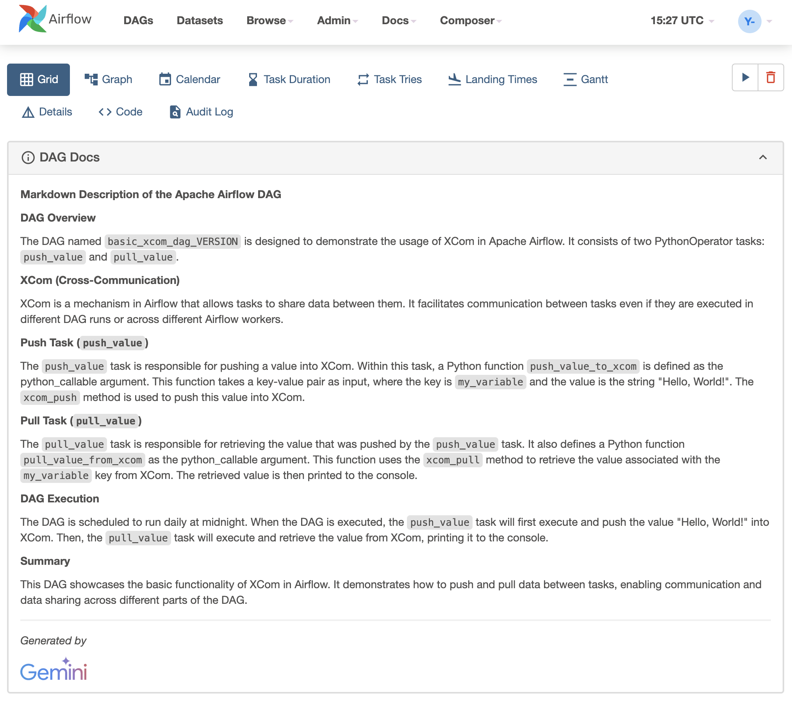

# Airflow DAG AI Documenter

## About

Use Google's generative models to analyze Airflow DAGs and supplement them with generated `doc_md` values. 

Airflow supports DAG documentation via the [`doc_md` DAG attribute](https://airflow.apache.org/docs/apache-airflow/1.10.8/tutorial.html#adding-dag-and-tasks-documentation). DAG documentation only support [markdown](https://www.markdownguide.org/) so far. The formatted markdown will display in the Airflow Web UI under DAG Docs to allow for any developer or use to quickly understand what the DAG is meant to do.

`run.sh` takes input directory and calls a python script to write new DAG files with `doc_md` values into the output directory. Also runs [black](https://github.com/psf/black) to automatically format output.

## Setup

```bash
./run.sh --src /path/to/your/dag/folder/ --tgt /path/to/your/target/output/folder
```

## Results

### Original Airflow DAG

```python
with models.DAG(
    dag_id=f"basic_xcom_dag_{VERSION}",
    description="Sample DAG for a python xcom task.",
    schedule="0 0 * * *",
    tags=tags,
    default_args=default_args,
    user_defined_macros=user_defined_macros,
    is_paused_upon_creation=True,
    catchup=False,
    max_active_runs=2,
    dagrun_timeout=timedelta(minutes=30),
):

    def push_value_to_xcom(**kwargs):
        task_instance = kwargs["ti"]
        value_to_push = "Hello, World!"
        task_instance.xcom_push(key="my_variable", value=value_to_push)

    def pull_value_from_xcom(**kwargs):
        task_instance = kwargs["ti"]
        value_pulled = task_instance.xcom_pull(key="my_variable")
        print(f"Pulled value: {value_pulled}")

    push_task = PythonOperator(
        task_id="push_value", python_callable=push_value_to_xcom, provide_context=True
    )
    pull_task = PythonOperator(
        task_id="pull_value", python_callable=pull_value_from_xcom, provide_context=True
    )
    push_task >> pull_task
```


### Generated `doc_md`

```python
    doc_md='\n## Airflow DAG for XCom Example\n\n### DAG Description\n\nThis Apache Airflow DAG is a sample demonstration of how to use XCom, a mechanism for sharing data between tasks in an Airflow DAG. XCom allows tasks to pass data to each other, enabling complex data dependencies and flexible data sharing in Airflow workflows.\n\n### DAG Structure\n\nThe DAG consists of two PythonOperator tasks:\n\n- **push_value**: This task pushes a value, "Hello, World!", to an XCom variable with the key "my_variable".\n- **pull_value**: This task retrieves the value stored in the XCom variable "my_variable" and prints it out.\n\n### Task Dependencies\n\nThe DAG sets up a dependency between the two tasks such that the **pull_value** task can only run after the **push_value** task has successfully completed and pushed the value to the XCom variable.\n\n### XCom Usage\n\nXCom is used in this DAG to share data between tasks. The **push_value** task sets the XCom variable "my_variable" to the value "Hello, World!". The **pull_value** task then retrieves the value stored in that XCom variable and prints it out.\n\n### DAG Scheduling\n\nThe DAG is scheduled to run daily at midnight.\n\n### Example Usage\n\nThis DAG can be used as a simple example of how to use XCom to share data between tasks in Airflow. It can be used for various purposes, such as passing data from one task to another, storing intermediate results, or sharing data between different workflows.\n\n### Additional Notes\n\n- The DAG uses default arguments, including retries and email notifications, as defined in the `default_args` section.\n- The DAG has a defined SLA (Service Level Agreement) of 25 minutes, meaning that if any task takes longer than 25 minutes to complete, it will be considered failed and retried.\n- The DAG is paused upon creation, meaning it will not start running automatically. You must manually unpause the DAG before it can run.\n---\n*Generated by* \n\n\n        ',
```

### Airflow Web UI with DAG Docs


