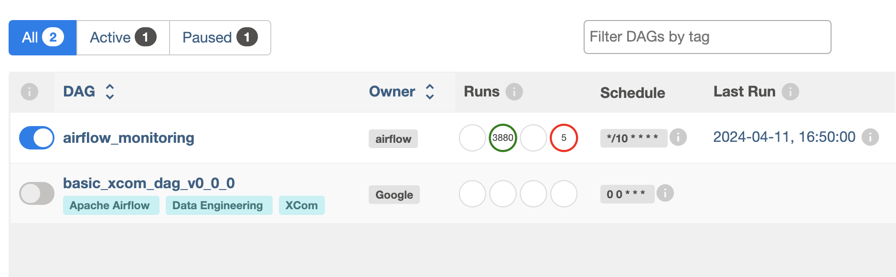
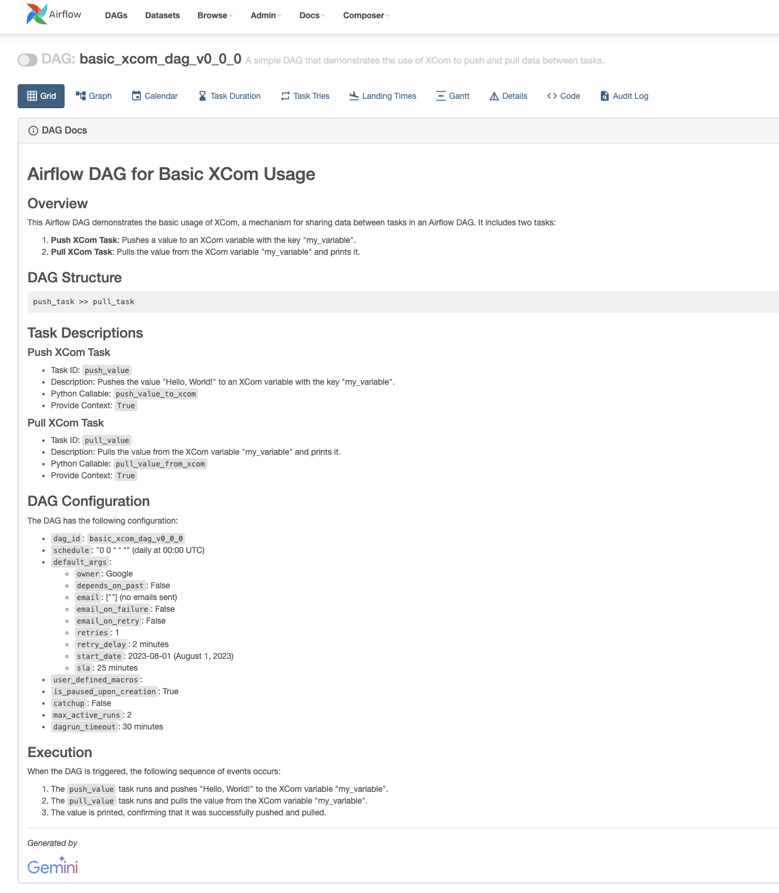

# Airflow DAG AI Documenter

## About

Use Google's generative models to analyze Airflow DAGs and supplement them with generated metadata values. 

Airflow supports DAG documentation via the [`doc_md` DAG attribute](https://airflow.apache.org/docs/apache-airflow/1.10.8/tutorial.html#adding-dag-and-tasks-documentation). DAG documentation only support [markdown](https://www.markdownguide.org/) so far. The formatted markdown will display in the Airflow Web UI under DAG Docs to allow for any developer or use to quickly understand what the DAG is meant to do.

`run.sh` takes input directory and calls a python script to write new DAG files with `description`, `tags`, and `doc_md` values into the output directory. Also runs [black](https://github.com/psf/black) to automatically format output.

Note: will *not* overwrite any existing `description`, `tags`, and `doc_md` values.

## Setup

```bash
./run.sh --src /path/to/your/dag/folder/ --tgt /path/to/your/target/output/folder
```

## Results

### Original Airflow DAG (missing `description`, `tags`, `doc_md`)

```python
with models.DAG(
    dag_id=f"basic_xcom_dag_{VERSION}",
    schedule="0 0 * * *",
    default_args=default_args,
    user_defined_macros=user_defined_macros,
    is_paused_upon_creation=True,
    catchup=False,
    max_active_runs=2,
    dagrun_timeout=timedelta(minutes=30),
):

    def push_value_to_xcom(**kwargs):
        task_instance = kwargs["ti"]
        value_to_push = "Hello, World!"
        task_instance.xcom_push(key="my_variable", value=value_to_push)

    def pull_value_from_xcom(**kwargs):
        task_instance = kwargs["ti"]
        value_pulled = task_instance.xcom_pull(key="my_variable")
        print(f"Pulled value: {value_pulled}")

    push_task = PythonOperator(
        task_id="push_value", python_callable=push_value_to_xcom, provide_context=True
    )
    pull_task = PythonOperator(
        task_id="pull_value", python_callable=pull_value_from_xcom, provide_context=True
    )
    push_task >> pull_task
```


### New Airflow DAG with Metadata (`description`, `tags`, `doc_md`)

```python
with models.DAG(
    dag_id=f"basic_xcom_dag_{VERSION}",
    schedule="0 0 * * *",
    default_args=default_args,
    user_defined_macros=user_defined_macros,
    is_paused_upon_creation=True,
    catchup=False,
    max_active_runs=2,
    dagrun_timeout=timedelta(minutes=30),
    description="A simple DAG that demonstrates the use of XCom to push and pull data between tasks.",
    tags=["Data Engineering", "Apache Airflow", "XCom"],
    doc_md='\n## Airflow DAG for Basic XCom Usage\n\n### Overview\n\nThis Airflow DAG demonstrates the basic usage of XCom, a mechanism for sharing data between tasks in an Airflow DAG. It includes two tasks:\n\n1. **Push XCom Task**: Pushes a value to an XCom variable with the key "my_variable".\n2. **Pull XCom Task**: Pulls the value from the XCom variable "my_variable" and prints it.\n\n### DAG Structure\n\n```\npush_task >> pull_task\n```\n\n### Task Descriptions\n\n#### Push XCom Task\n\n* Task ID: `push_value`\n* Description: Pushes the value "Hello, World!" to an XCom variable with the key "my_variable".\n* Python Callable: `push_value_to_xcom`\n* Provide Context: `True`\n\n#### Pull XCom Task\n\n* Task ID: `pull_value`\n* Description: Pulls the value from the XCom variable "my_variable" and prints it.\n* Python Callable: `pull_value_from_xcom`\n* Provide Context: `True`\n\n### DAG Configuration\n\nThe DAG has the following configuration:\n\n- `dag_id`: `basic_xcom_dag_v0_0_0`\n- `schedule`: "0 0 * * *" (daily at 00:00 UTC)\n- `default_args`:\n    - `owner`: Google\n    - `depends_on_past`: False\n    - `email`: [""] (no emails sent)\n    - `email_on_failure`: False\n    - `email_on_retry`: False\n    - `retries`: 1\n    - `retry_delay`: 2 minutes\n    - `start_date`: 2023-08-01 (August 1, 2023)\n    - `sla`: 25 minutes\n- `user_defined_macros`: \n- `is_paused_upon_creation`: True\n- `catchup`: False\n- `max_active_runs`: 2\n- `dagrun_timeout`: 30 minutes\n\n### Execution\n\nWhen the DAG is triggered, the following sequence of events occurs:\n\n1. The `push_value` task runs and pushes "Hello, World!" to the XCom variable "my_variable".\n2. The `pull_value` task runs and pulls the value from the XCom variable "my_variable".\n3. The value is printed, confirming that it was successfully pushed and pulled.\n\n---\n\n*Generated by* \n\n\n    ',
):

    def push_value_to_xcom(**kwargs):
        task_instance = kwargs["ti"]
        value_to_push = "Hello, World!"
        task_instance.xcom_push(key="my_variable", value=value_to_push)

    def pull_value_from_xcom(**kwargs):
        task_instance = kwargs["ti"]
        value_pulled = task_instance.xcom_pull(key="my_variable")
        print(f"Pulled value: {value_pulled}")

    push_task = PythonOperator(
        task_id="push_value", python_callable=push_value_to_xcom, provide_context=True
    )
    pull_task = PythonOperator(
        task_id="pull_value", python_callable=pull_value_from_xcom, provide_context=True
    )
    push_task >> pull_task
```

### Airflow Web UI with DAG description


### Airflow Web UI with DAG tags



### Airflow Web UI with DAG Docs

