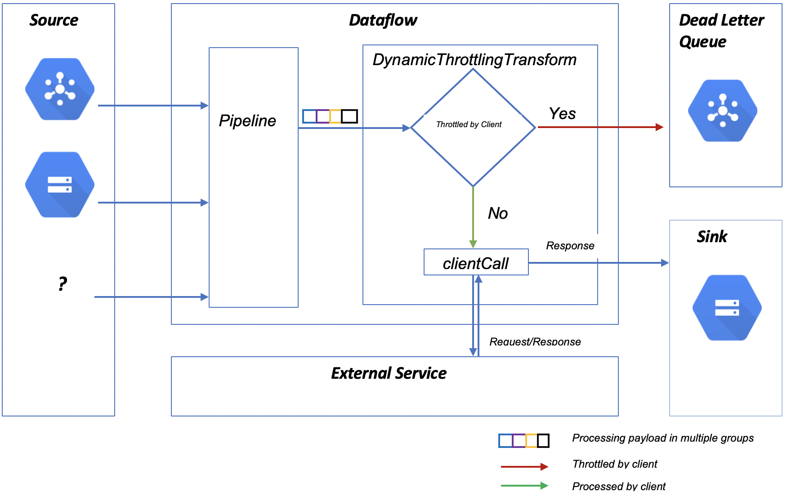

# Client-side Throttling in Apache Beam

### Introduction
When Apache Beam pipeline tries to get a response for an incoming event from third-party API there is a chance of the request to fail because of infrastructure issues: network saturation, limits on API calls, etc. Client-side throttling can act as a way to limit the number of requests coming from Apache Beam by either postponing or dropping excessive requests. It can also serve as a fail-safe mechanism that prevents the loss of payload of requests throttled by the server by storing failed requests in a Dead Letter Queue.

For example, when a streaming pipeline calls the Cloud DLP API for each event to inspect sensitive data or de-identify the additional columns, DLP API can accept only 600 requests per minute though the incoming flow can be more than the limit (the 600 rpm quota can be increased on request). In this scenario, instead of sending events to DLP API and getting failures, client-side throttling buffers the requests locally and fails them only if the DLP service starts to throttle the client, even if the number of requests sent by Apache Beam is below quota. Apache Beam throttling can also reroute the events to a Dead Letter Queue or to any other sink from where you can reprocess the events.

This artifact is designed to implement distributed adaptive client-side throttling in Apache Beam. Adaptive throttling activates when a service called by Apache Beam pipeline starts rejecting requests due to throughput higher than expected. The main transform in this library tracks the request rejection probability to decide whether it should fail locally without going through network to save the cost of rejecting a request.

### Apache Beam Throttling

This library is intended to create a buffer for requests above API quota and reject requests that have a high probability of being rejected by the server locally on Dataflow nodes. When Apache Beam pipeline sends HTTP requests to the external service with input elements as payload, once the request has been processed by the backend, the backend  must send a response back whether the request has been accepted or rejected. The response code is used by the library to determine whether the request was throttled or not. An error code for a throttled request depends up on the backend throttling implementation (usually it's HTTP code 429).
As part of the integration process, a user of this library needs to implement clientCall function which makes requests to the external service.



### Adaptive throttling in Apache Beam

Apache Beam pipeline maintains the number of requests it has sent to the backend and the number of requests got accepted by the backend. Using stateTimer, it will process a batch of elements from each state value and remove the processed requests from the state value when they are processed. Request rejection probability is calculated as follows:
    ```RequestRejectionProbability = (total_requests - k * total_accepts)/(total_requests+1)```

For each request, if RequestRejectionProbability is more than a random number between 0 or 1 generated for each request, the request is sent to either Pub/Sub dead letter queue or any other sink defined by the user. If the value is less than this random value the request is sent to the external service.

For more information on these parameters see [Adaptive throttling](https://landing.google.com/sre/sre-book/chapters/handling-overload/#eq2101). The count of the incoming requests and accepted requests should be equal under normal conditions. Once the requests start getting rejected, the number of processing requests gets decreased by the difference of incoming requests and accepted requests.

Apache Beam pipeline will process the payload in multiple groups. To achieve this, the pipeline will transform the PCollection[Bounded/Unbounded] into multiple groups based on random distribution (the random distribution behavior can be overridden).

Pipeline PCollection transform steps:
* Conversion of the Input PCollection<T> into PCollection<Key,T>. Here, Key will be group id (random by default) and Value will be payload.
* Adaptive throttling is applied to each group[State cell] accordingly.
* Pipeline processes each state cell using [stateful](https://beam.apache.org/blog/2017/02/13/stateful-processing.html) and [timely](https://beam.apache.org/blog/2017/08/28/timely-processing.html) processing. That said, each state cell will be processed after reaching a predefined interval of time.
* ClientCall, a user defined function, is invoked. This function sends PCollection elements to the backend node. Based on the response of the clientCall respective counters are incremented.

The variables which stores the total number of requested and accepted requests are zeroed out after a certain interval of time (defaults to 1 min). This reset speeds up client recovery if server throughput was limited due to limitations on the server side not caused by the client.

### Limitations
* When the Dynamic Throttling Transform is used inside FixedWindows, the state is restricted per key per window and rejection probability as well as the throughput rate is calculated per window. This can cause an overlap of a fixed window that processes the current events with other fixed windows which are processing a backlog; thus causing a higher rate of events sent to the external service.

### Library testing: HTTP Server with Throttling capabilities

#### Requirements

* Install Java 8+
* Install Maven 3

To simulate a third-party service a test web server is created intended to accept and process certain number of HTTP requests only, remaining requests should get rejected. The requests will be sent from a job running on Dataflow. Each HTTP request will carry an element from the ParDo function as payload. Follow these steps to create a test environment.

#### 1. Clone the repository

* git clone https://github.com/GoogleCloudPlatform/professional-services.git to a GCE instance or local machine.
* Change directory to professional-services/tools/apachebeamthrottling/src/main/java/com/google/cloud/pso/beamthrottling
* Pass the InetSocketAddress as a run-time argument, which should be your Compute Engine instance internal IP or ‘localhost’ if you’re using DirectRunner to run Dataflow on your local machine.

#### 2. Compile and run the backend server

```bash
javac HttpServerThrottling.java && java HttpServerThrottling localhost
```

#### 3. Running DynamicThrottlingTransform

* Create a Google Cloud Platform project.
* Go to GCP console and activate cloud shell. Change the directory to $HOME.
* To run on your machine, set up a service account. In GCP console, in navigation menu go to IAM & Admin and click on service accounts. Create a service account and for the role select Dataflow worker. Create a key and download it to your machine. Export the path to environment variable GOOGLE_APPLICATION_CREDENTIALS.
* Create a cloud storage bucket where input and output objects can be stored.
* Clone the repository.
* Issue the following Maven command to run the Dataflow pipeline:
```bash
#Project vars
PROJECT_ID=<project-id>
BUCKET=<bucket>
PIPELINE_FOLDER=gs://${BUCKET}/dataflowthrottling
#Set the runner
RUNNER=DataflowRunner
#Build the template
mvn clean
mvn compile exec:java \
-Dexec.mainClass=com.google.cloud.pso.dataflowthrottling.ThrottlingOrchestration \
-Dexec.args=” \
--project = ${PROJECT_ID} \
--stagingLoaction = ${PIPELINE_FOLDER}/staging \
--tempLoaction = ${PIPELINE_FOLDER}/temp \
--inputFilePattern = ${PIPELINE_FOLDER}/input \
--outputFilePattern = ${PIPELINE_FOLDER}/output/ \
--inputTopic = projects/${PROJECT_ID}/topics/${TOPIC_NAME} \
--runner = ${RUNNER}”
```
* Expected results
    * Successful requests will write return value from clientCall to ${PIPELINE_FOLDER}/output/successTag.
	* Payload of throttled requests and requests rejected by backend node as well as the error message are written to ${PIPELINE_FOLDER}/output/throttlingTag.
		* Throttled requests will be written as {"input": payload,"error":"Throttled by Client. Request rejection probability: 0.3111111111111111"}.
		* Rejected requests by backend will be written as {"input":"payload","error":"Server returned HTTP response code: 429"}.
	* Requests which are failed with unexpected errors will be written to ${PIPELINE_FOLDER}/output/errorTag.
		* For example {"input":"payload","error":"Corresponding error"}.
* To call a dependency other than Java Http Server, update lambda function `clientCall` with how each request should be processed.
```
DynamicThrottlingTransform<InputType, OutputType> clientCall = request -> {
    //Process the request
    response = <Response from the external service>
    if(response is Out of Quota Error){
        throw new ThrottlingException;
    }
    else{
        return request_response;
    }
}
```