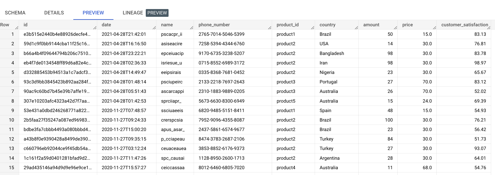
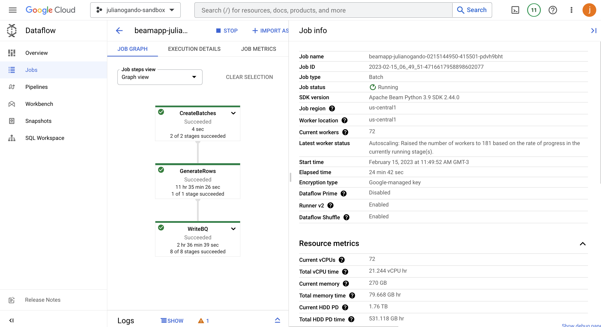
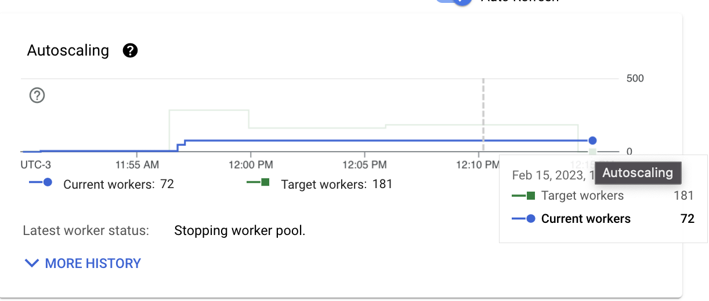

# Example

The following benchmarks were calculated using the [sales_sample_bigquery.json](../config_file_samples/sales_sample_bigquery.json) config file (100M rows to be generated) and using the default Dataflow machine type(`n1-standard-1`)

Runtime: 25min \
Workers used: 72 (there was a resource quota limitation, otherwise more would have been used)

# BigQuery table
Create the BigQuery table in which we will store the generated data
```
bq mk \
    -t \
    --schema 'id:STRING,date:DATETIME,name:STRING,phone_number:STRING,product_id:STRING,country:STRING,amount:INTEGER,price:FLOAT,customer_satisfaction:FLOAT' \
    --time_partitioning_field date \
    --time_partitioning_type DAY \
    bigdata_sample.data-generator-test1
```

## Generated data



## Dataflow metrics





## Field-level benchmark

| Field |  Generation type | Runtime (ms) | 
|----------|----------|----------|
| id | UUID | 26ms |  
| date | RANDOM_BETWEEN(2 dates) | 103ms |  
| name | RANDOM_BETWEEN(string) | 24ms |
| phone_number | RANDOM_FROM_REGEX | 299ms |
| product_id | RANDOM_FROM_LIST | 16ms |
| country | RANDOM_FROM_LIST | 7ms |
| amount | RANDOM_BETWEEN(int) | 4ms |
| price | LOOKUP_VALUE | 3ms |
| customer_satisfaction | RANDOM_BETWEEN(float) | 12ms |