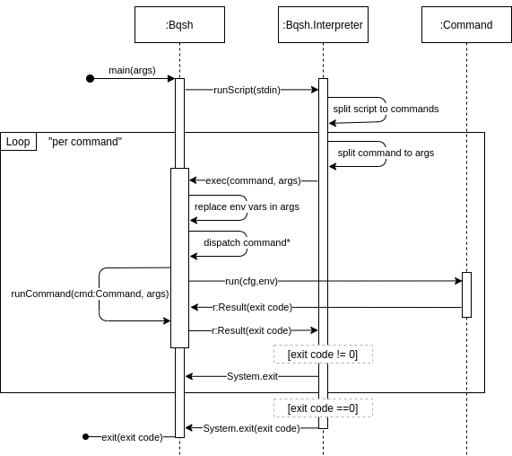

# Google BigQuery z/OS Mainframe Connector (gszutil)

This utility uploads data to Google Cloud Storage from a MVS batch jobs running on IBM z/OS mainframe.

It is built using IBM's jzos Java SDK and provides a shell emulator that accepts `gsutil` and `bq` command-line
invocations via JCL in-stream dataset. It attempts to accept arguments that appear similar to the official command-line
utilties.

The utility is deployed as a cataloged procedure called by
the [JCL EXEC statement](https://www.ibm.com/support/knowledgecenter/en/SSLTBW_2.3.0/com.ibm.zos.v2r3.ieab100/execst.htm)
.

## Usage

Users can make multiple calls in a single step by entering commands on separate lines or delimited by a semicolon (`;`).

Typically, a JES job will contain multiple steps, each step executing the `BQSH` procedure with one or more `gsutil`
or `bq` commands.

### Simple file copy

This example has 1 steps:

1. Upload z/OS dataset to Cloud Storage
   (gzip compression is enabled by default)

```
//STEP01 EXEC BQSH
//INFILE DD DSN=HLQ.DATA,DISP=SHR
//STDIN DD *
scp --inDD INFILE --outDsn gs://bucket/prefix
/*
```

### Example JCL

This example has 3 steps:

1. Upload COBOL dataset as ORC to a bucket
2. Load ORC file to BigQuery table
3. Query BigQuery table

```
//STEP01 EXEC BQSH
//INFILE DD DSN=<HLQ>.DATA.FILENAME,DISP=SHR
//COPYBOOK DD DISP=SHR,DSN=<HLQ>.COPYBOOK.FILENAME
//STDIN DD *
gsutil cp --replace gs://bucket/tablename.orc
/*
//COND02 IF (STEP01.RC = 0) THEN
//STEP02 EXEC BQSH
//STDIN DD *
bq load --project_id=myproject \
  myproject:DATASET.TABLE \
  gs://bucket/tablename.orc/*
/*
//COND03 IF (STEP02.RC = 0) THEN
//STEP03 EXEC BQSH
//QUERY DD DSN=<HLQ>.QUERY.FILENAME,DISP=SHR
//STDIN DD *
bq query --project_id=myproject \
  myproject:DATASET.TABLE \
  gs://bucket/tablename.orc/*
/*
```

### Subcommand Usage

#### gsutil

```
gsutil (gszutil-1.0.0)
Usage: gsutil [cp|rm] [options] destinationUri

  --help                   prints this usage text
Command: cp [options]
Upload Binary MVS Dataset to GCS
  --replace                delete before uploading
  --partSizeMB <value>     target part size in megabytes (default: 256)
  --batchSize <value>      blocks per batch (default: 1000)
  -p, --parallelism <value>
                           number of concurrent writers (default: 6)
  --timeOutMinutes <value>
                           timeout in minutes (default: 60)
  --pic_t_charset <value>  Set encoding for PIC T copybook type. 
                           Supported encodings are: UTF-8, x-IBM939 (JPNEBCDIC1399_4IJ),
                           x-IBM935 (SCHEBCDIC935_6IJ alias name)                          
Command: rm [options]
Delete objects in GCS
  -r, --recursive          delete directory
  -f, --force              delete without use interaction (always true)
  destinationUri           Destination URI (gs://bucket/path)
  --dataset_id <value>     The default dataset to use for requests. This flag is ignored when not applicable. You can set the value to [PROJECT_ID]:[DATASET] or [DATASET]. If [PROJECT_ID] is missing, the default project is used. You can override this setting by specifying the --project_id flag. The default value is ''.
  --location <value>       A string corresponding to your region or multi-region location.
  --project_id <value>     The project ID to use for requests. The default value is ''.
  --allow_non_ascii        allow non ascii characters
  --stats_table <value>    tablespec of table to insert stats
  --max_error_pct <value>  job failure threshold for row decoding errors (default: 0.0
```


#### gszutil

```
gszutil (gszutil-1.0.0)
Usage: gszutil [options] gcsOutUri

  --help                          prints this usage text
  --cobDsn<value>                 DSN to read copybook from. If not provided, copybook will be read from DD:COPYBOOK
  --inDsn<value>                  DSN of data set to be transcoded to ORC
  --gcsOutUri<value>              Cloud Storage path for output ORC files (format: gs://BUCKET/PREFIX)
  --remoteHost<value>             Remote host or ip address
  --remotePort<value>             Remote port (default: 52701)
  --pic_t_charset<value>          Charset used for encoding and decoding international strings, used with PIC T copybook type, default is EBCDIC
  --timeOutMinutes<value>         Timeout in minutes for GRecvExportGrpc call. (default for GCS: 90 minutes)
  --keepAliveTimeInSeconds<value> Keep alive timeout in seconds for http channel. (default: 480 seconds)
  --stats_table<value>            tablespec of table to insert stats
  --project_id <value>            The project ID to use for requests. The default value is ''.
  --dataset_id <value>            The default dataset to use for requests. This flag is ignored when not applicable. You can set the value to [PROJECT_ID]:[DATASET] or [DATASET]. If [PROJECT_ID] is missing, the default project is used. You can override this setting by specifying the --project_id flag. The default value is ''.
  --location <value>              A string corresponding to your region or multi-region location.
```

#### bq load

```
load (gszutil-1.0.0)
Usage: load [options] tablespec path [schema]

  --help                   prints this usage text
  tablespec                Tablespec in format [PROJECT]:[DATASET].[TABLE]
  path                     Comma-separated source URIs in format gs://bucket/path,gs://bucket/path
  schema                   Comma-separated list of column definitions in the form [FIELD]:[DATA_TYPE],[FIELD]:[DATA_TYPE].
  --allow_jagged_rows      When specified, allow missing trailing optional columns in CSV data.
  --allow_quoted_newlines  When specified, allow quoted newlines in CSV data.
  --autodetect             When specified, enable schema auto-detection for CSV and JSON data.
  --destination_kms_key <value>
                           The Cloud KMS key for encryption of the destination table data.
  -E, --encoding <value>   The character encoding used in the data. Possible values include:
ISO-8859-1 (also known as Latin-1) UTF-8
  -F, --field_delimiter <value>
                           The character that indicates the boundary between columns in the data. Both \t and tab are allowed for tab delimiters.
  --ignore_unknown_values  When specified, allow and ignore extra, unrecognized values in CSV or JSON data.
  --max_bad_records <value>
                           An integer that specifies the maximum number of bad records allowed before the entire job fails. The default value is 0. At most, five errors of any type are returned regardless of the --max_bad_records value.
  --null_marker <value>    An optional custom string that represents a NULL value in CSV data.
  --clustering_fields <value>
                           If specified, a comma-separated list of columns is used to cluster the destination table in a query. This flag must be used with the time partitioning flags to create either an ingestion-time partitioned table or a table partitioned on a DATE or TIMESTAMP column. When specified, the table is first partitioned, and then it is clustered using the supplied columns.
  --projection_fields <value>
                           If used with --source_format set to DATASTORE_BACKUP, indicates which entity properties to load from a Cloud Datastore export as a comma-separated list. Property names are case sensitive and must refer to top-level properties. The default value is ''. This flag can also be used with Cloud Firestore exports.
  --quote <value>          The quote character to use to enclose records. The default value is " which indicates no quote character.
  --replace                When specified, existing data is erased when new data is loaded. The default value is false.
  --append_table           When specified, append data to a destination table. The default value is false.
  --schema <value>         Comma-separated list of column definitions in the form [FIELD]:[DATA_TYPE],[FIELD]:[DATA_TYPE].
  --schema_update_option <value>
                           When appending data to a table (in a load job or a query job), or when overwriting a table partition, specifies how to update the schema of the destination table. Possible values include:
ALLOW_FIELD_ADDITION: Allow new fields to be added
ALLOW_FIELD_RELAXATION: Allow relaxing REQUIRED fields to NULLABLE
Repeat this flag to specify multiple schema update options.
  --skip_leading_rows <value>
                           An integer that specifies the number of rows to skip at the beginning of the source file.
  --source_format <value>  The format of the source data. Possible values include: CSV NEWLINE_DELIMITED_JSON AVRO DATASTORE_BACKUP PARQUET ORC (Default: ORC)
  --time_partitioning_expiration <value>
                           An integer that specifies (in seconds) when a time-based partition should be deleted. The expiration time evaluates to the partition's UTC date plus the integer value. A negative number indicates no expiration.
  --time_partitioning_field <value>
                           The field used to determine how to create a time-based partition. If time-based partitioning is enabled without this value, the table is partitioned based on the load time.
  --time_partitioning_type <value>
                           Enables time-based partitioning on a table and sets the partition type. Currently, the only possible value is DAY which generates one partition per day.
  --require_partition_filter <value>
                           If specified, a partition filter is required for queries over the supplied table. This flag can only be used with a partitioned table.
  --use_avro_logical_types <value>
                           If sourceFormat is set to AVRO, indicates whether to convert logical types into their corresponding types (such as TIMESTAMP) instead of only using their raw types (such as INTEGER).
  --dataset_id <value>     The default dataset to use for requests. This flag is ignored when not applicable. You can set the value to [PROJECT_ID]:[DATASET] or [DATASET]. If [PROJECT_ID] is missing, the default project is used. You can override this setting by specifying the --project_id flag. The default value is ''.
  --debug_mode <value>     Set logging level to debug. The default value is false.
  --job_id <value>         The unique job ID to use for the request. If not specified in a job creation request, a job ID is generated. This flag applies only to commands that create jobs: cp, extract, load, and query.
  --location <value>       A string corresponding to your region or multi-region location.
  --project_id <value>     The project ID to use for requests. The default value is ''.
  --synchronous_mode <value>
                           If set to true, wait for the command to complete before returning, and use the job completion status as the error code. If set to false, the job is created, and successful completion status is used for the error code. The default value is true.
  --sync <value>           If set to true, wait for the command to complete before returning, and use the job completion status as the error code. If set to false, the job is created, and successful completion status is used for the error code. The default value is true.
  --stats_table <value>    tablespec of table to insert stats

```

#### bq mk

```
mk (gszutil-1.0.0)
Usage: mk [options] tablespec

  --help                   prints this usage text
  tablespec                [PROJECT_ID]:[DATASET].[TABLE]
  --clustering_fields <value>
                           A comma-separated list of column names used to cluster a table. This flag is currently available only for partitioned tables. When specified, the table is partitioned and then clustered using these columns.
  -d, --dataset            When specified, creates a dataset. The default value is false.
  --default_partition_expiration <value>
                           An integer that specifies the default expiration time, in seconds, for all partitions in newly-created partitioned tables in the dataset. A partition's expiration time is set to the partition's UTC date plus the integer value. If this property is set, it overrides the dataset-level default table expiration if it exists. If you supply the --time_partitioning_expiration flag when you create or update a partitioned table, the table-level partition expiration takes precedence over the dataset-level default partition expiration.
  --default_table_expiration <value>
                           An integer that specifies the default lifetime, in seconds, for newly-created tables in a dataset. The expiration time is set to the current UTC time plus this value.
  --description <value>    The description of the dataset or table.
  --destination_kms_key <value>
                           The Cloud KMS key used to encrypt the table data.
  --display_name <value>   The display name for the transfer configuration. The default value is ''.
  --expiration <value>     An integer that specifies the table or view's lifetime in milliseconds. The expiration time is set to the current UTC time plus this value.
  -e, --external_table_definition <value>
                           Specifies a table definition to used to create an external table. The format of an inline definition is format=uri. Example: ORC=gs://bucket/table_part1.orc/*,gs://bucket/table_part2.orc/*
  -f, --force              When specified, if a resource already exists, the exit code is 0. The default value is false.
  --label <value>          A label to set on the table. The format is [KEY]:[VALUE]. Repeat this flag to specify multiple labels.
  --require_partition_filter <value>
                           When specified, this flag determines whether to require a partition filter for queries over the supplied table. This flag only applies to partitioned tables. The default value is true.
  --schema <value>         The path to a local JSON schema file or a comma-separated list of column definitions in the form [FIELD]:[DATA_TYPE],[FIELD]:[DATA_TYPE]. The default value is ''.
  -t, --table              When specified, create a table. The default value is false.
  --time_partitioning_expiration <value>
                           An integer that specifies (in seconds) when a time-based partition should be deleted. The expiration time evaluates to the partition's UTC date plus the integer value. A negative number indicates no expiration.
  --time_partitioning_field <value>
                           The field used to determine how to create a time-based partition. If time-based partitioning is enabled without this value, the table is partitioned based on the load time.
  --time_partitioning_type <value>
                           Enables time-based partitioning on a table and sets the partition type. Currently, the only possible value is DAY which generates one partition per day.
  --use_legacy_sql         When set to false, uses a standard SQL query to create a view. The default value is false (uses Standard SQL).
  --view                   When specified, creates a view. The default value is false.
  --dataset_id <value>     The default dataset to use for requests. This flag is ignored when not applicable. You can set the value to [PROJECT_ID]:[DATASET] or [DATASET]. If [PROJECT_ID] is missing, the default project is used. You can override this setting by specifying the --project_id flag. The default value is ''.
  --debug_mode             Set logging level to debug. The default value is false.
  --job_id <value>         The unique job ID to use for the request. If not specified in a job creation request, a job ID is generated. This flag applies only to commands that create jobs: cp, extract, load, and query.
  --location <value>       A string corresponding to your region or multi-region location.
  --project_id <value>     The project ID to use for requests. The default value is ''.
  --synchronous_mode <value>
                           If set to true, wait for the command to complete before returning, and use the job completion status as the error code. If set to false, the job is created, and successful completion status is used for the error code. The default value is true.
  --sync <value>           If set to true, wait for the command to complete before returning, and use the job completion status as the error code. If set to false, the job is created, and successful completion status is used for the error code. The default value is true.
  --stats_table <value>    tablespec of table to insert stats

```

#### bq query

```
query (gszutil-1.0.0)
Usage: query [options]

  --help                   prints this usage text
  --parameters_from_file <value>
                           Comma-separated query parameters in the form [NAME]:[TYPE]:[DDNAME]. An empty name creates a positional parameter. [TYPE] may be omitted to assume a STRING value in the form: name::ddname or ::ddname. NULL produces a null value.
  --create_if_needed       When specified, create destination table. The default value is false.
  -m, --allow_multiple_queries
                           Deprecated. Use split_sql instead.
  --split_sql <value>      Boolean flag. When true, splits input sql script on single queries. The default value is false.
  --allow_large_results    When specified, enables large destination table sizes for legacy SQL queries.
  --append_table           When specified, append data to a destination table. The default value is false.
  --batch                  When specified, run the query in batch mode. The default value is false.
  --clustering_fields <value>
                           If specified, a comma-separated list of columns is used to cluster the destination table in a query. This flag must be used with the time partitioning flags to create either an ingestion-time partitioned table or a table partitioned on a DATE or TIMESTAMP column. When specified, the table is first partitioned, and then it is clustered using the supplied columns.
  --destination_kms_key <value>
                           The Cloud KMS key used to encrypt the destination table data.
  --destination_schema <value>
                           The path to a local JSON schema file or a comma-separated list of column definitions in the form [FIELD]:[DATA_TYPE],[FIELD]:[DATA_TYPE]. The default value is ''.
  --destination_table <value>
                           The name of the destination table for writing query results. The default value is ''
  --dryRun                 When specified, the query is validated but not run.
  --external_table_definition <value>
                           The table name and schema definition used in an external table query. The schema can be a path to a local JSON schema file or a comma-separated list of column definitions in the form [FIELD]:[DATA_TYPE],[FIELD]:[DATA_TYPE]. The format for supplying the table name and schema is: [TABLE]::[PATH_TO_FILE] or [TABLE]::[SCHEMA]@[SOURCE_FORMAT]=[CLOUD_STORAGE_URI]. Repeat this flag to query multiple tables.
  --label <value>          A label to apply to a query job in the form [KEY]:[VALUE]. Repeat this flag to specify multiple labels.
  --maximum_bytes_billed <value>
                           An integer that limits the bytes billed for the query. If the query goes beyond the limit, it fails (without incurring a charge). If not specified, the bytes billed is set to the project default.
  --parameters <value>     comma-separated query parameters in the form [NAME]:[TYPE]:[VALUE]. An empty name creates a positional parameter. [TYPE] may be omitted to assume a STRING value in the form: name::value or ::value. NULL produces a null value.
  --replace                If specified, overwrite the destination table with the query results. The default value is false.
  --require_cache          If specified, run the query only if results can be retrieved from the cache.
  --require_partition_filter <value>
                           If specified, a partition filter is required for queries over the supplied table. This flag can only be used with a partitioned table.
  --schema_update_option <value>
                           When appending data to a table (in a load job or a query job), or when overwriting a table partition, specifies how to update the schema of the destination table. Possible values include:

 ALLOW_FIELD_ADDITION: Allow
new fields to be added
 ALLOW_FIELD_RELAXATION: Allow relaxing REQUIRED fields to NULLABLE
  --time_partitioning_expiration <value>
                           An integer that specifies (in seconds) when a time-based partition should be deleted. The expiration time evaluates to the partition's UTC date plus the integer value. A negative number indicates no expiration.
  --time_partitioning_field <value>
                           The field used to determine how to create a time-based partition. If time-based partitioning is enabled without this value, the table is partitioned based on the load time.
  --time_partitioning_type <value>
                           Enables time-based partitioning on a table and sets the partition type. Currently, the only possible value is DAY which generates one partition per day.
  --timeOutMinutes <value>
                           An integer that sets how long client waits BigQuery job response from BigQuery API in minutes.
  --use_cache <value>      When specified, caches the query results. The default value is true.
  --use_legacy_sql         When set to false, runs a standard SQL query. The default value is false (uses Standard SQL).
  --dataset_id <value>     The default dataset to use for requests. This flag is ignored when not applicable. You can set the value to [PROJECT_ID]:[DATASET] or [DATASET]. If [PROJECT_ID] is missing, the default project is used. You can override this setting by specifying the --project_id flag. The default value is ''.
  --debug_mode             Set logging level to debug. The default value is false.
  --job_id <value>         The unique job ID to use for the request. If not specified in a job creation request, a job ID is generated. This flag applies only to commands that create jobs: cp, extract, load, and query.
  --location <value>       A string corresponding to your region or multi-region location.
  --project_id <value>     The project ID to use for requests. The default value is ''.
  --synchronous_mode <value>
                           If set to true, wait for the command to complete before returning, and use the job completion status as the error code. If set to false, the job is created, and successful completion status is used for the error code. The default value is true.
  --sync <value>           If set to true, wait for the command to complete before returning, and use the job completion status as the error code. If set to false, the job is created, and successful completion status is used for the error code. The default value is true.
  --stats_table <value>    tablespec of table to insert stats

```

#### bq rm

```
rm (gszutil-1.0.0)
Usage: rm [options] tablespec

  --help                   prints this usage text
  tablespec                [PROJECT_ID]:[DATASET].[TABLE]
  -d, --dataset            When specified, deletes a dataset. The default value is false.
  -f, --force              When specified, deletes a table, view, model, or dataset without prompting. The default value is false.
  -m, --model <value>      When specified, deletes a BigQuery ML model.
  -r, --recursive          When specified, deletes a dataset and any tables, table data, or models in it. The default value is false.
  -t, --table              When specified, deletes a table. The default value is false.
  --dataset_id <value>     The default dataset to use for requests. This flag is ignored when not applicable. You can set the value to [PROJECT_ID]:[DATASET] or [DATASET]. If [PROJECT_ID] is missing, the default project is used. You can override this setting by specifying the --project_id flag. The default value is ''.
  --debug_mode             Set logging level to debug. The default value is false.
  --job_id <value>         The unique job ID to use for the request. If not specified in a job creation request, a job ID is generated. This flag applies only to commands that create jobs: cp, extract, load, and query.
  --location <value>       A string corresponding to your region or multi-region location.
  --project_id <value>     The project ID to use for requests. The default value is ''.
  --synchronous_mode <value>
                           If set to true, wait for the command to complete before returning, and use the job completion status as the error code. If set to false, the job is created, and successful completion status is used for the error code. The default value is true.
  --sync <value>           If set to true, wait for the command to complete before returning, and use the job completion status as the error code. If set to false, the job is created, and successful completion status is used for the error code. The default value is true.
  --pic_t_charset <value>  Set encoding for PIC T copybook type. 
                           Supported encodings are: UTF-8, x-IBM939 (JPNEBCDIC1399_4IJ),
                           x-IBM935 (SCHEBCDIC935_6IJ alias name)
```

#### bq export

```
export (gszutil-1.0.0)
Usage: export [options]

  --help                          prints this usage text
  --query_dsn<value>              DSN to read query from in format HLQ.MEMBER or HLQ.PDS(MEMBER)
  --sql<value>                    SQL BQ query
  --outDD<value>                  DD to write output records to (default: OUTFILE)
  --cobDsn<value>                 DSN to read copybook from. If not provided, copybook will be read from DD:COPYBOOK
  --vartext                       When specified, write pipe-delimited string output.
  --bucket<value>                 GCS bucket where to write
  --remoteHost<value>             Remote host or ip address
  --remotePort<value>             Remote port (default: 52701)
  --timeOutMinutes<value>         Timeout in minutes for GRecvExportGrpc call. (default for GCS: 90 minutes)
  --keepAliveTimeInSeconds<value> Keep alive timeout in seconds for http channel. (default: 480 seconds)
  --keepAliveTimeInSeconds<value> Keep alive timeout in seconds for http channel. (default: 480 seconds)
  --run_mode<value>               Switches between export implementations, currently supported: parallel, single thread exports. Possible values single, parallel, default is parallel.
  --allow_large_results           When specified, enables large destination table sizes for legacy SQL queries.
  --batch                         When specified, run the query in batch mode. The default value is false.
  --dry_run                       When specified, the query is validated but not run.
  --maximum_bytes_billed<value>   An integer that limits the bytes billed for the query. If the query goes beyond the limit, it fails (without incurring a charge). If not specified, the bytes billed is set to the project default.
  --require_cache                 If specified, run the query only if results can be retrieved from the cache.
  --require_partition_filter      If specified, a partition filter is required for queries over the supplied table. This flag can only be used with a partitioned table.
  --use_cache                     When specified, caches the query results. The default value is true.
  --use_legacy_sql                When set to false, runs a standard SQL query. The default value is false (uses Standard SQL).
  --destination_table             <value>
  --dataset_id<value>             The default dataset to use for requests.
  --debug_mode<value>             Set logging level to debug. The default value is false.
  --job_id<value>                 The unique job ID to use for the request. If not specified in a job creation request, a job ID is generated. This flag applies only to commands that create jobs: cp, extract, load, export, and query.
  --location<value>               The unique job ID to use for the request. If not specified in a job creation request, a job ID is generated. This flag applies only to commands that create jobs: cp, extract, load, export, and query.
  --project_id<value>             The project ID to use for requests. The default value is ''.
  --sync <value>                  If set to true, wait for the command to complete before returning, and use the job completion status as the error code. If set to false, the job is created, and successful completion status is used for the error code. The default value is true.
  --stats_table<value>            tablespec of table to insert stats
```

## Custom copybook types:

### 1. PIC T(N)

`N` - column length in bytes; `N` length WILL vary based on data and used encoding

`N = (max number of characters in column) * (bytes used per single character)`

`PIC T(N)` works in pair with parameter `--pic_t_charset` that present for following commands:

|Command|Type|
|---|:---:|
|'bq export'| [Export](./src/main/scala/com/google/cloud/bqsh/cmd/Export.scala)
|'gsutil cp'| [Cp](./src/main/scala/com/google/cloud/bqsh/cmd/Cp.scala)

Supported and tested encodings:

| --pic_t_charset|Max bytes per char|Details|
|---|:---:|---|
|JPNEBCDIC1399_4IJ (x-IBM939)|4| https://www.ibm.com/docs/en/zos/2.3.0?topic=locale-using-charmap-file|
|SCHEBCDIC935_6IJ (x-IBM935)|4| https://www.ibm.com/docs/en/zos/2.3.0?topic=locale-using-charmap-file|
|IBM037|1| https://en.wikipedia.org/wiki/Code_page_37 , https://www.compart.com/en/unicode/charsets/IBM037|
|UTF-8|4| https://en.wikipedia.org/wiki/UTF-8|

There are more encoding that could be used, but they were not tested.
https://docs.oracle.com/javase/8/docs/technotes/guides/intl/encoding.doc.html

### `PIC T(N)` usage recommendations

1. In case both export and import is done by BMLU app:

- Copybooks for import and export job should be the same.
- Use 4 bytes per char on calculation of column size, it should be enough for almost any encoding that can be used.

2. If upstream/export is 3rd party system (i.e. DB2) and downstream/import is BMLU:

- Copybooks should be crafted based on binary file layout.
- It is essential to know what encoding was used by upstream system to encode characters. You should find that encoding
  in [list](https://docs.oracle.com/javase/8/docs/technotes/guides/intl/encoding.doc.html) and add as a parameter for
  BMLU app, i.e. `--pic_t_charset=IBM037`
- You should know what columns are string columns and used PIC T for those columns in copybook.
- Size of PIC T should be taken directly from binary file (by inspection in HEX viewer), it is impossible to know how
  many bytes upstream system used to encode column.
- Upstream system may encode some metadata after string column data, this metadata should be ignored in copybook by
  adding column `FILLER PIC X(byte length of metadata)` after string column

3. If upstream/export is BMLU and downstream/import is 3rd party system (i.e. DB2):

- Copybooks should be crafted based on binary file layout that can be consumed by 3rd party system.
- It is essential to know what encoding will be used by downstream system to decode characters. You should find that
  encoding in [list](https://docs.oracle.com/javase/8/docs/technotes/guides/intl/encoding.doc.html) and add as a
  parameter for BMLU app, i.e. `--pic_t_charset=IBM037`
- You should know what columns are string columns and used PIC T for those columns in copybook.
- Size of `PIC T` should be set based on 3rd party system expectation to particular string column.
- Downstream/export system may expect some metadata after string column data, this metadata should be mentioned in
  copybook by adding column `FILLER PIC X(byte length of metadata)` after string column. This may lead to data mismatch
  so data validation is required (checking how NULL are decoded, etc).

When upstream or downstream system is not BMLU some reverse engineering is required to align binary files format.

## Environment variables

|Name|Default|Description|
|---|:---:|---|
|KEYFILE, GKEYFILE, GOOGLE_APPLICATION_CREDENTIALS | no|Path to json keyfile that provides authentication credentials to your application code.
|LOG_PROJECT|no|Cloud logging google project id|
|LOG_ID|no|Cloud logging log id|
|LOG_WRAP_SPOOL|true|Wrap log messages longer than 80 symbols|
|BQ_CONNECT_TIMEOUT_MILLIS|30000| BigQuery API client timeout (msec) in making the initial connection, occurs only upon starting the TCP connection, this usually happens if the remote machine does not answer|
|BQ_READ_TIMEOUT_MILLIS|30000|BigQuery API client timeout (msec) on waiting to read data. If the server (or network) fails to deliver any data timeout seconds after the client makes a socket read call, a read timeout error will be raised.|
|BQ_MAX_ATTEMPTS_COUNT|5|BigQuery API client max request attemts before fail. Controls retry logic.|
|STORAGE_CONNECT_TIMEOUT_MILLIS|20000|Google Storage API client timeout (msec) in making the initial connection, occurs only upon starting the TCP connection, this usually happens if the remote machine does not answer|
|STORAGE_READ_TIMEOUT_MILLIS|20000|Google Storage API client timeout (msec) on waiting to read data. If the server (or network) fails to deliver any data timeout seconds after the client makes a socket read call, a read timeout error will be raised.|
|STORAGE_MAX_ATTEMPTS_COUNT|3|Google Storage API client max request attemts before fail. Controls retry logic.|
|HTTP_CLIENT_MAX_CONNECTIONS_COUNT|max(cpu_count,&nbsp;32) | Http client is shared between BqClient, BqStorage, GCStorage clients. There are workloads, like Parallel Export, that use thread pools to parallelize read/write data. For such workloads one http connection per thread at thread pool is required.<br/>Formula for pool size:<br/>maxConnectionTotal = JOB_THREAD_POOL_SIZE * JOBS_IN_PARALLEL_COUNT<br/>JOB_THREAD_POOL_SIZE - by default it is a vCPU count<br/>JOBS_IN_PARALLEL_COUNT - by default it is 5, need load tests to detect proper number.|
|RST_STREAM_RETRY_COUNT|5|Retry count on 'Rst Stream' error and BQ Storage API stream related errors|
|RST_STREAM_MIN_TIMEOUT_SEC|5|Timeout in seconds before retry of ```Rst Stream``` error and BQ Storage API stream related errors. Max timeout is calculated as min_timeout + 15 seconds. Actual timeout will be random number between min and max, to avoid ```hot spots``` on retry. |
|GOOGLE_API_L2_RETRY_COUNT|3| Max retries before fail for Google API clients. This environment variable controls level 2 retry logic for google API http clients. It will work when level 1 retry logic controlled by STORAGE_MAX_ATTEMPTS_COUNT and BQ_MAX_ATTEMPTS_COUNT will be skipped. It may happen for some type of networking errors (broken pipe, socket timeout, handshake fail).|
|GOOGLE_API_L2_RETRY_TIMEOUT_SECONDS|5| Delay in seconds between retries for Google API clients level 2 retry logic. See GOOGLE_API_L2_RETRY_COUNT for details.|
|BQ_QUERY_CONCURRENT_UPDATE_RETRY_COUNT|5|Max retries on error "Could not serialize access to <table_name> due to concurrent update" on bq query command.
|BQ_QUERY_CONCURRENT_UPDATE_RETRY_TIMEOUT_SECONDS|2|Initial delay for "Could not serialize access to <table_name> due to concurrent update" error on bq query command.
|BQ_QUERY_CONCURRENT_UPDATE_WHITE_LIST|TABLE_STATUS|Comma separated list of tables names for which allowed retry on error "Could not serialize access to <table_name> due to concurrent update".
|GCSDSNURI|no|Default destination Google Cloud Storage Bucket for scp(Simple file copy) command. (Format: gs://bucket/prefix)|
|GCSGDGURI|no|Default destination Google Cloud Storage Bucket for scp(Simple file copy) command when source is versioned dataset (GDG - Generation Data Groups) (Example: gs://bucket-with-versioning/prefix)|
|SRVHOSTNAME|no|BMLU GRPC server DNS hostname or IP|
|SRVPORT|52701|BMLU GRPC server port|
|TRUST_CERT_COLLECTION_FILE_PATH|no|Path to trustCertCollectionFilePath for gRPC TLS authentication|
|GCSOUTURI|no|Default Cloud Storage prefix for output ORC files (Format: gs://BUCKET/PREFIX)|
|JOBDATE|UNKNOWN|JCL job starting date}|
|JOBTIME|UNKNOWN|JCL job starting time|
|_BPX_SHAREAS|no| Controls execution in shell. [More details here](https://www.ibm.com/docs/en/zos/2.2.0?topic=shell-setting-bpx-shareas-bpx-spawn-script)|
|_BPX_SPAWN_SCRIPT|no| Controls execution in shell. [More details here](https://www.ibm.com/docs/en/zos/2.2.0?topic=shell-setting-bpx-shareas-bpx-spawn-script)|

## High level architecture



### Commands dispatch table

|Command|Type
|---|:---:|
|'bq mk'| [Mk](./src/main/scala/com/google/cloud/bqsh/cmd/Mk.scala)
|'bq query'| [Query](./src/main/scala/com/google/cloud/bqsh/cmd/Query.scala)
|'bq export'| [Export](./src/main/scala/com/google/cloud/bqsh/cmd/Export.scala)
|'bq load'| [Load](./src/main/scala/com/google/cloud/bqsh/cmd/Load.scala)
|'bq rm'| [Rm](./src/main/scala/com/google/cloud/bqsh/cmd/Rm.scala)
|'bq export'| [Export](./src/main/scala/com/google/cloud/bqsh/cmd/Export.scala)
|'gsutil| [Cp](./src/main/scala/com/google/cloud/bqsh/cmd/Cp.scala)
|'gsutil rm'| [GsUtilRm](./src/main/scala/com/google/cloud/bqsh/cmd/GsUtilRm.scala)
|'gszutil'| [GsZUtil](./src/main/scala/com/google/cloud/bqsh/cmd/GsZUtil.scala)
|'scp'| [Scp](./src/main/scala/com/google/cloud/bqsh/cmd/Scp.scala)
|'jclutil'| [JCLUtil](./src/main/scala/com/google/cloud/bqsh/cmd/JCLUtil.scala)
|'sdsfutil'| [SdsfUtil](./src/main/scala/com/google/cloud/bqsh/cmd/SdsfUtil.scala)

### RPC calls to Grecv

To decrease MIPS consumption at mainframe side some CPU/IO intense commands can delegate execution
to [Grecv](./src/main/scala/com/google/cloud/imf/GRecv.scala) server (via RPC call).

|Command|Type|
|---|:---:|
|'bq export'| [Export](./src/main/scala/com/google/cloud/bqsh/cmd/Export.scala)
|'gsutil| [Cp](./src/main/scala/com/google/cloud/bqsh/cmd/Cp.scala)

Commands are using a GRPC protocol to delegate execution to remote server. TLS/SSL encryption is provided by separate
tools, ```AT-TLS``` from mainframe side and ```stunnel``` at Grecv server side.


## Pre-Requisites

* [IBM SDK for z/OS, Java Technology Edition, Version 8](https://developer.ibm.com/javasdk/support/zos/)
* [SBT](https://www.scala-sbt.org/download.html)
* [pax](https://www.ibm.com/support/knowledgecenter/en/ssw_aix_72/com.ibm.aix.cmds4/pax.htm) (install
  with `sudo apt install -y pax` on debian)

## Development Environment Setup

1. Extract IBM JDK using gunzip and pax

```sh
gunzip -c SDK8_64bit_SR5_FP30.PAX.Z | pax -r
```

2. Copy `ibmjzos.jar`, `ibmjcecca.jar` and `dataaccess.jar` to `lib/` at the repository root.

## Building

Build application jar

```sh
sbt package
```

Build dependencies jar

```sh
sbt assemblyPackageDependency
```

## Installation

1. Deploy `<userid>.TCPIP.DATA` to configure DNS resolution
2. Deploy `<userid>.HOSTS.LOCAL` or `<userid>.ETC.IPNODES` if you need to send API requests to
   the `restricted.googleapis.com` VPC-SC endpoint.
3. Deploy `gszutil.dep.jar` and `gszutil.jar` to `/opt/google/lib` unix filesystem directory (or directory chosen by
   your z/OS administrator)
4. Deploy [proclib/BQSH](proclib/BQSH) to a PROCLIB MVS dataset on the mainframe. If you deployed the jar files to a
   path other than `/opt/google/lib`, you will need to modify `BQSH` to reflect the correct path.

## Limitations

The current COBOL Copy Book parser may not support all possible PIC strings. Not all gsutil and bq functionality is
implemented by the emulators included in this utility. Command-line argument compatibility is made on a best-effort
basis.

## Future Work

Future versions of this utility will provide enhanced offload functionality with deployment of an intermediate VM
between the mainframe and GCS. CPU consumption on the mainframe may be slightly reduced by performing streaming
transcoding from COBOL encodings to ORC on the VM.

## Disclaimer

This is not an official Google product.
