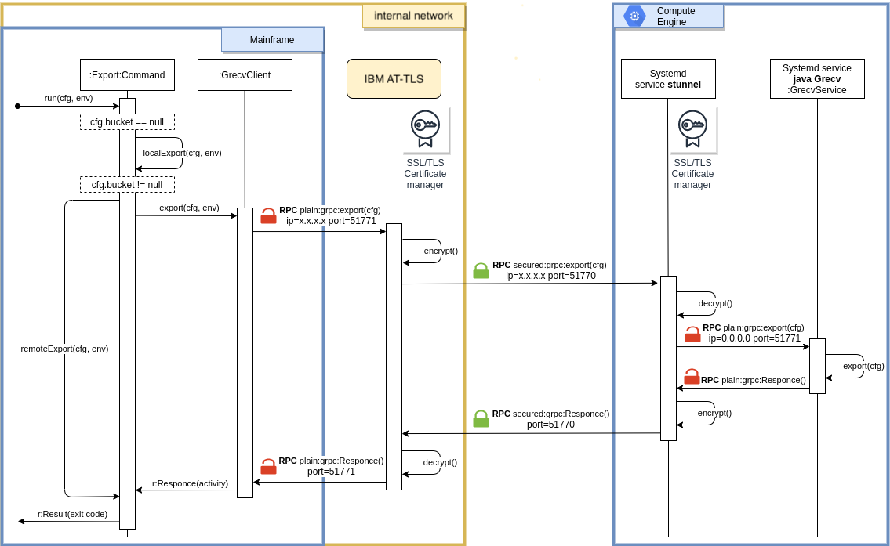

# Running on GCE

To reduce MIPs usage the Mainframe Connector provides funtionalitites to use an intermediate GCE VM Instance to transcode COBOL binary, packed decimal and EBCDIC to partitioned ORC files in a streaming fashion and maximize computation offload from the mainframe.

The gszutil provides a gRPC server and client in order to delegate execution to remote server.


# Architecture
Commands are using a GRPC protocol to delegate execution to remote server. TLS/SSL encryption is provided by separate tools, AT-TLS from mainframe side and stunnel at Grecv server side.

Here is highlevel diagram how RPC call is performed for Export command.



## Authentication
Mainframe Connector relies on TLS for security at two levels. Both the Stunnel and the Grcp connection are secured using TLS.

We recommend creating two separate sets of certificate files:
- To create TLS certificate files for the Stunnel you can follow [these steps](environment/create-server-cert.sh)
- To create TLS certificate files for the gRPC connection you can follow [these steps](https://github.com/grpc/grpc-java/blob/master/testing/src/main/resources/certs/README)

For more info on Authentication at Grpc level please refer to [this page](https://github.com/grpc/grpc-java/tree/master/examples/example-tls)

# Creating server instance (Grecv)


This section briefly describes how BMLU server (Grecv) instance template is created and what components it has.

## Instance Startup Script inside Instance Template

To build the server instance use the followinfg tempalte: [instance-template-init.sh](environment/instance-template-init.sh).

Once created, the new instance will run [startup-script.sh](environment/startup-script.sh) to install additional software and configuration.


## Steps to create instance template

- Run script for creating TLS certificate files [create-server-cert.sh](environment/create-server-cert.sh) and pass the flow

Configuration example:
```
Country Name (2 letter code) []:US
State or Province Name (full name) []:California
Locality Name (eg, city) []:Sacramento
Organization Name (eg, company) []:TestInc
Organizational Unit Name (eg, section) []:Development
Common Name (e.g. server FQDN or YOUR name) []:John Doe
Email Address []:john@testinc.com
```
- Upload TLS certificate files (*.cert & *.key) and application jar files to the Google Cloud Storage
- Update variables in the header block of [instance-template-init.sh](environment/instance-template-init.sh) file with your project settings & file URLs from previous step
- Run [instance-template-init.sh](environment/instance-template-init.sh)

Most of the environment variables in script are self-explanatory, but few are custom:

|Name|Description|
|---|---|
|_MACHINE_TYPE| Specifies the machine type used for the instances. To get a list of available machine types, run `gcloud compute machine-types list`. |
|_JAVA_XMS_GB| Is used to pass java `-Xms` to [startup-script.sh](environment/startup-script.sh). Should be less than total VM memory. See `_MACHINE_TYPE` to detect total VM size. |
|_JAVA_XMX_GB| Is used to pass java `-Xmx` to [startup-script.sh](environment/startup-script.sh). Should be less than total VM memory. See `_MACHINE_TYPE` to detect total VM size. |
|_APP_STORAGE_PATH| Is used to pass BMLU `app.jar` Cloud Storage path to [startup-script.sh](environment/startup-script.sh) |
|_DEPS_STORAGE_PATH| Is used to pass BMLU `dependencies.jar` Cloud Storage path to [startup-script.sh](environment/startup-script.sh) |
|_TLS_CERT_STORAGE_PATH| Is used to pass certificate/public key Cloud Storage path to [startup-script.sh](environment/startup-script.sh). Following [script](../certs/create-server-cert.sh) is used to create self-signed keypair.|
|_TLS_PKEY_STORAGE_PATH| Is used to pass private key Cloud Storage path to [startup-script.sh](environment/startup-script.sh). Following [script](../certs/create-server-cert.sh) is used to create self-signed keypair.|

To remove created template [instance-template-destroy.sh](./instance-template-destroy.sh) could be used.


## Startup script init steps

This sectione decribes at high level the steps executed by the [startup script](environment/startup-script.sh).

1. Update debian software repository and install [cURL](https://ru.wikipedia.org/wiki/CURL). To be able to download
   resources.
2. Install Google Cloud Monitoring agent to collect more metrics from VM (cpu,memory,network,disk I/O)
   . [Details here .](https://cloud.google.com/monitoring/agent/monitoring/installation#agent-install-latest-linux)
3. Add [AdoptOpenJDK](https://adoptopenjdk.net/) debian repository to be able to install java 8. Debian 10 has
   only `openjdk-11`, that is why this extra step is needed.
4. Install Java 8 from debian repository
5. Download BMLU `apt.jar` and `deps.jar` from paths that are mentioned
   inside [instance-template-init.sh](environment/instance-template-init.sh)
6. Create and start BMLU server systemd service
7. Install [stunnel](https://www.stunnel.org/) from debian repository
8. Download certificate and private key from paths that are mentioned
   inside  [instance-template-init.sh](environment/instance-template-init.sh)
9. Create and start `stunnel` systemd service


After init script run new instance will have new running 3 services on top of clean Debian 10 OS:

- Cloud Monitoring service
- gszutil server service (default port is 51771)
- stunnel service (default port is 52701)