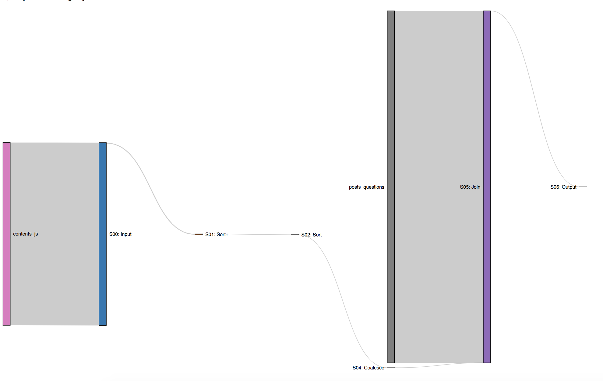

# Sankey visualization for BigQuery query plan

## Overview
[BigQuery](https://cloud.google.com/bigquery/) embeds diagnostic query plan information within its query jobs. This utility provides [Sankey diagram](https://en.wikipedia.org/wiki/Sankey_diagram) visualization for various stages in the query plan. The tool is based on [Sankey library](https://github.com/d3/d3-sankey) from [d3js](https://d3js.org/).

## Setup
Download or clone this repo into a workspace directory.

```bash
git clone [repo url]
cd [workspace dir]/bq-queryplan-sankey
```

Next, to see the query plan in a Sankey digram, we need to download a job information file. You can use below command to get the query plan file for a given job id from BigQuery.  The file needs to be copied into `bqshow` directory.

Or, you  can try a sample bigquery plan, `sample.json` provided in `bqshow` directory.

```bash
cd [workspace dir]/bq-queryplan-sankey/bqshow
bq ls --jobs [project id] // list jobs in a project
bq show --format=prettyjson --job [job id] > sample.json	// sample.json file has query plan information
```

Start the server to visualize query plan as Sankey diagrams. You'll need a web server to run this utility. Any number of options are good as this tool is currently serving static content only. 

### Using Python
With Python `3.x` to run the server on port `9090`:
```bash
cd [workspace dir]/bq-queryplan-sankey
python3 -m http.server 9090
```

With Python `2.x` to run the server on port `9090`:
```bash
cd [workspace dir]/bq-queryplan-sankey
python -m http.server 9090
```

### Using NodeJS
For NodeJS, we can use [http-server](https://www.npmjs.com/package/http-server). First install the package using `npm install http-server -g` and to run it on port `9090`:

```bash
cd [workspace dir]/bq-queryplan-sankey
http-server . -p 9090
```

Next, open URL in a browser `http://localhost:9090?bqshow=bq-job.json`

By default the Sankey diagram is aligned to the right. To change alignment to left, add a query parameter `align` with value `left` i.e. `http://localhost:9090?bqshow=bq-job.json&align=left`

## Usage

A sample Sankey diagram for a query on public dataset is included here.

### Sample query

```sql
#standardSQL
SELECT
  a.id,
  title,
  c files,
  answer_count answers,
  favorite_count favs,
  view_count views,
  score
FROM
  `bigquery-public-data.stackoverflow.posts_questions` a
JOIN (
  SELECT
    CAST(REGEXP_EXTRACT(content, r'stackoverflow.com/questions/([0-9]+)/') AS INT64) id,
    COUNT(*) c,
    MIN(sample_path) sample_path
  FROM
    `fh-bigquery.github_extracts.contents_js`
  WHERE
    content LIKE '%stackoverflow.com/questions/%'
  GROUP BY
    1
  HAVING
    id>0
  ORDER BY
    2 DESC
  LIMIT
    10 ) b
ON
  a.id=b.id
ORDER BY
  c DESC
```

### Sample Sankey diagram



### BigQuery stages

For details on various stages in the query plan, see the documentation for [query plan explanation](https://cloud.google.com/bigquery/query-plan-explanation). You can also watch this [video](https://youtu.be/UueWySREWvk) on analysing BigQuery queries.
