# BigQuery Visualiser

This utility provides a web application which can be used to visualise the flow of execution stages within a BigQuery job. This may be useful in identifying problematic stages and provides greater usability for large query plans than the default query plan explanation in the Google Cloud Console.

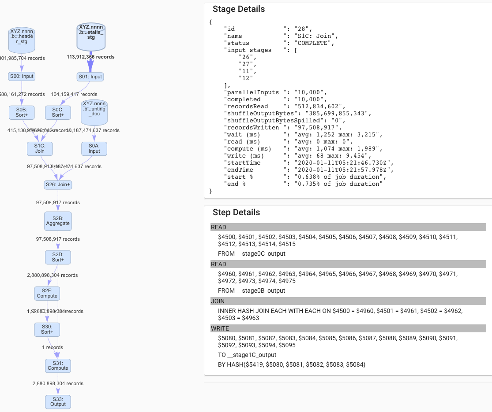 

--- 

## Release Notes
**June 2023**
* Upgrade to Node 18
* UI improvements
* login issue remains
* Stages with performance issue:
   * Tree display will highlight nodes in red 
   * Stage Details will list cause of performance issue
* Progress tab now shows `Estimated Runnable Units` metric
* bottom tabs
  * Query tab now wraps long SQL
  * list referenced tables
  * lists reservation details and slot usage by reservation
  * optional error tab if query has errors

**11 Nov 2021**

Upgraded to Node V 12

**14 January 2020**

* Add ability to retrieve query by query id
* Added option 'AllUsers' to let user choose between listing their own queries or queries for all users in project
* tightened layouts
* improved display of failed queries

**6 October 2019**

* Added Progress View. See graphic display of work units comnpleted over time
* Highlight nodes that are still running. Useful for jobs that die
* Fix Stage display bug - when job was cancelled stage status was not displayed

**15 July 2019**

in order to have the application whitelisted on appspot.com, the automatic login
had to be disabled to allow users to access the Terms and Privacy page prior to logging in.

Treeview will by default hide reparttions.

Added a Display Options card at the bottom where this can be changed.

---
# Manual

## Overview
BigQuery Visualiser displays a Bigquery Queryplan document. It has two displays:

* Query Tree
* Task Gantt Chart

## Hosting BqVisualiser
BqVisualiser is a single page web app written in angular. 
Simply copy the compiled output to a webserver and you are good to go.

### Authentication
On opening the page, the app will attempt to authenticate you with your Google account. Once done you will be able to access
your projects.

## Downloading Query Plans
On the 'Select Job' tab there are three options:

* Download from Google Cloud
* Retrieve by job id
* Upload from Computer

Under the card with this title:

1. Select a project from the listbox
2. Click on 'List Jobs'
3. Scroll through the list of jobs and click on the Get button of the job you are interested in

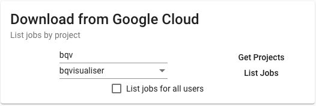

If you select the option `list jobs for all users` then you must have owner permission for the selected project.

Enter a job id in the field. The format of the job id must be:
    <projectname>:<location>.<queryid>

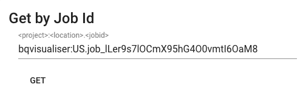

Assuming you have previously downloaded the query plan using the `bq show -j --format=prettyjson <job-id>` command to a local file,
click on this card the 'Select File to upload' button, navigate to the file and select it. To start uploading click the
Upload button.

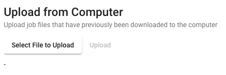

## The Tree Tab

The Tree tab shows the query plan as a directed graph.

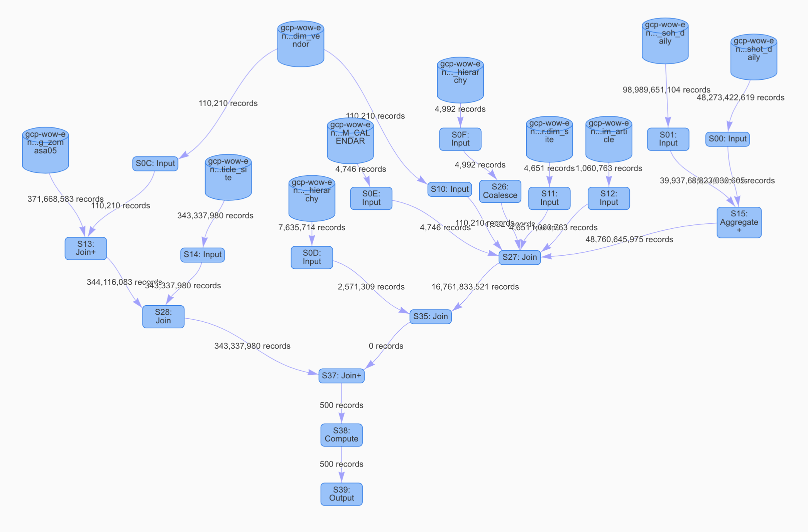

* DB icons represent BQ tables
* all other icons represent actual query stages (input, compute, aggregate, etc.)
* clicking on a node displays the stage and step details on the right

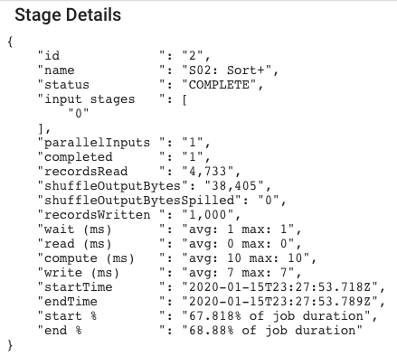

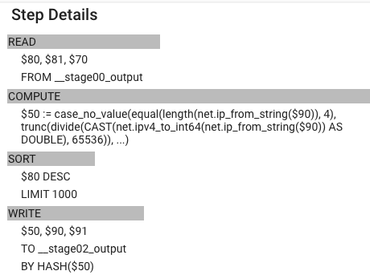

All nodes can be selected. On selection the right hand side tabs called 'Stage Details' and 'Step Details' provide in depth information.

At the bottom a number of tabs show overall plan information:

* Overview (jobId etc)
* Status (running, completed)
* SQL used
* Timings
* Statistics
* Settings

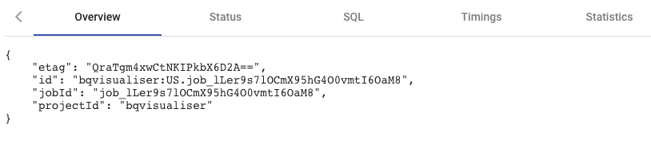

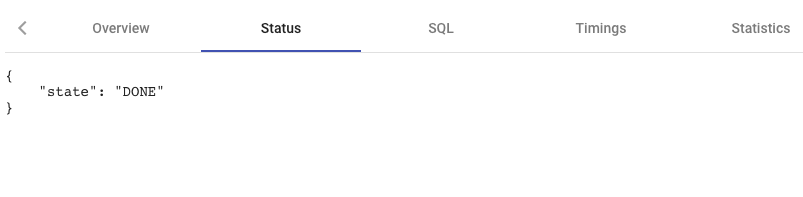

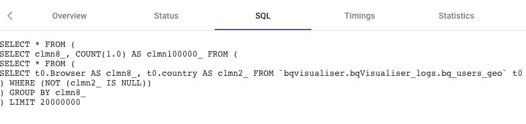

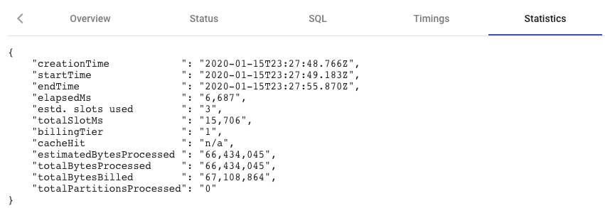

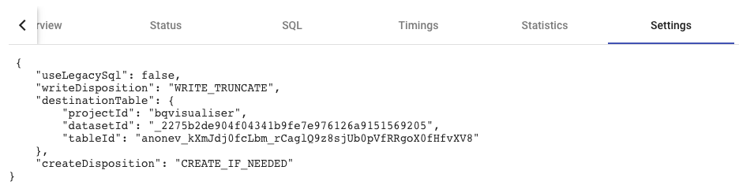

## The Timing Tab
The timing Tab displays a Gantt style view to quickly show how long the individual stages take.

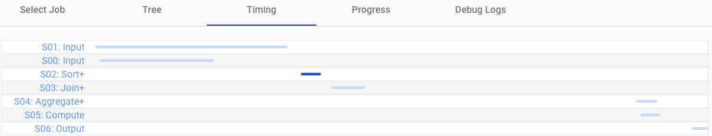

## The Progress Tab
Shows the progress of work over time with details of 

* work completed
* work active
* work outstanding
* slots

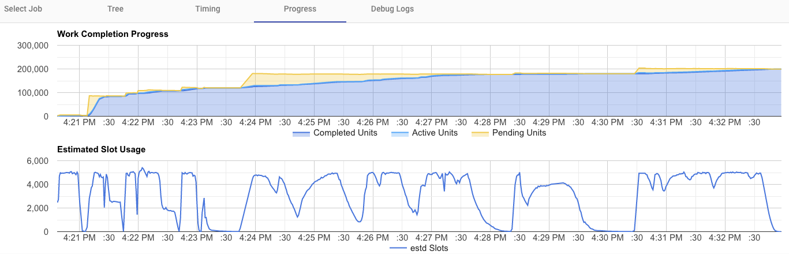

This is useful to see when the query stalls for any reason, i.e. when stages do not progress 

---
# Known Limits

The application will only display graphs for queries. Load jobs etc do not result in query stages being output.

The Timing Page will not load if the execution times of jobs are less than 1 second. This is a limitation of the graphing 
package.

Clicking the get projects when you are not yet logged in will result in a login process being started instead. Users need to
click on get projects button again after login was successful.

The Number of records transferred displayed for reads from tables can be incorrect if the stage reads from more than one table.
This is a limitation in the Job Details providewd by BQ.

---

# Building and Deploying
The application is a Single Page Application without a backend. It can be built and deployed to any webserver that is capable of serving static pages,
such as:

* Apache
* Tomcat
* IIS

## Client ID

To be able to access the BigQuery REST API you need to have create an OAuth client. Create this in the Google Cloud
Console under APIs & Services > Credentials.
When setting up the Client ID the Authorized JavaScript origins
needs to be set to the URL from where the app is downloaded.

And Authorized redirect URIs need to be set to:

*  [download URL] 
*  [download URL]/ 
*  [download URL]/jobs

Once Done, set the value for *clientId* in the file ./envirnments/environment.prod.ts to 
the *ClientId* value in the console's Credential page

## Building
The Angular UI needs to be installed.
The compile with
  *ng build --prod*

The output will be in the dist package. Deploy its contents to the web server  

# Known Bugs

On clicking the Login button, the login dialog appears. After completing 
the dialog successfully, the login button is still highlighted.
The user needs to click the button again so that the logout button is highlighted,
before being able to download query plans.

Download from Google Cloud => Get Projects function is very slow.
