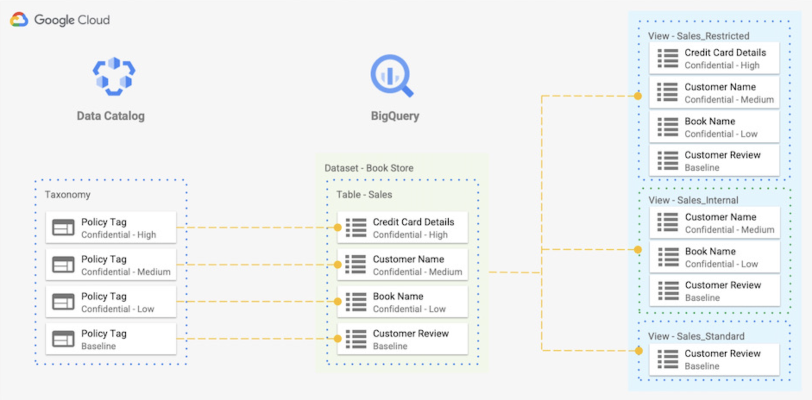

# BQTag

Utility class for tagging BQ Table Schemas with Data Catalog Taxonomy Policy Tags. Create BQ Authorized Views using Policy Tags. Helper utility to provision Data Catalog Taxonomy and Policy Tags.

## Table of Contents

- [Data Catalog Policy Tags and Big Query Overview](#data-catalog-policy-tags-and-big-query-overview)
- [Using BQTAG](#using-bqtag)
  - [Initialize Object](#initialize-object)
  - [Create Taxonomy and Policy Tags](#create-taxonomy-and-policy-tags)
  - [Fetch Policy Tags](#fetch-policy-tags)
  - [Create a Tagged Table](#create-a-tagged-table)
  - [Create an Authorized View using Tags](#create-an-authorized-view-using-tags)
- [Installation](#installation)
  - [Requirements](#requirements)
  - [Installing BQTag](#installing-bqtag)
  - [Optional: Install in virtualenv](#optional-install-in-virtualenv)
- [Disclaimer](#disclaimer)

# Data Catalog Policy Tags and Big Query Overview

Many organisations need a way to restrict access of particular columns in BigQuery Table to a few set of users. They need to have different views for different personas in their organisation and they also like some sort of automation to manage the scale.

This is possible in GCP to use Cloud Data Catalog to create a Taxonomy and policy tags. Policy tags can be assigned permissions for certain users and then these tags can be mapped to BigQuery Table Columns. Only users who have relevant  permission for a tag can work with a column mapped with that tag. Sometimes, organisations also need to create views based on tags assigned to columns and this is done by creating Authorised BQ views but needs considerable effort in creating the exact SQL Queries for these views. Issue is amplified if BigQuery Table has nested and repeated columns and there is a need to retain the original table structure. Most of these issues can be addressed by automation. The code present in this module is a sample automation for the same. To understand the concept in a details, let us look at a sample use case.

Let us consider an example of online book store which sells books. They have a requirement to have data categorised in 4 categories: **High, Medium, Low and Baseline**. This is accomplished by creating 4 policy tags in Data Catalog under bookstore-taxonomy.  They have a sales table which has 4 columns: Reviews which should be visible to everyone, Book Name which has Low Confidentiality, Customer Name has medium confidentiality while credit card number has high confidentiality. 



Policy-tags can be associated with the respective columns to have the desired functionality. This will restrict, for example anyone who does not have access to high confidentiality policy tag to read Credit Card numbers.

Business requirement is to create 3 views:

- **Standard** which has data tagged with baseline
- **Internal** which has data tagged with baseline as well as low and medium confidentiality
- **Restricted** which has all the data.

There is no direct way to create views based on policy tags. The way to accomplish is to manually select columns which have particular tags associated with them and then write SQL queries. SQL queries can get really complex if the table has nested and repeated columns. 

BQTag automates not only creation of queries but also helps in associating the right policy tag to the table columns in a standard way. BQtag removes the complexity by providing a simple and intuitive python functions.

# Using BQTag

## Initialize Object

Create an instance of bqtag.BQTableView. 

```python
bqtv = BQTableView(bq_dataset = BQ_DATASET,
                 catalog_taxonomy = TAXONOMY_DISPLAY_NAME,
                 location = LOCATION,
                 bq_project = BQ_PROJECT,
                 catalog_project = CATALOG_PROJECT,
                 json_credentials_path = JSON_CREDENTIALS_FILE)
```

`bq_dataset` (required) is the BigQuery Dataset where Table and Authorized Views have to be created. 

`catalog_taxonomy` (required) is the Data Catalog taxonomy name which holds the Policy Tags. Taxonomy may not be present and can be created using the create_taxonomy() function.

`location` (required) is the location where BigQuery and DataCatalog resources are present or would be created.

`bq_project` (optional - can be derived from authenticated service account) is the project where BigQuery resources are present or would be created.

`catalog_project` (optional - can be derived from authenticated service account) is the project where Data Catalog resources are present or would be created.

`json_credentials_path` (optional) path to service account credentials file. 


## Create Taxonomy and Policy Tags

Data Catalog Taxonomy and Policy Tags can be created if not already present. If Taxonomy and Policy Tags are already present then just specify the display name of Taxonomy in `catalog_taxonomy` variable and relevant policy tags would be downloaded from the Taxonomy. If, however, Taxonomy and Policy Tags are not present then `create_taxonomy()` function can be used to provision the same. Taxonomy name provisioned would be taken from the `catalog_taxonomy` variable. `create_taxonomy()` takes the following parameters:

`tags` list of dictionaries where each dictionary describes a Policy Tag to be created. Each tag can have following attributes:

- `name` (required) is the name of the Policy Tag to create
- `description` (optional) is the description of the Policy Tags
- `parent_policy_tag` (optional) is the link to the parent policy tag

```python
bqtv.create_taxonomy([
                      {"name": "low", "description": "Low tag"}, 
                      {"name": "medium", "description": "Medium tag"}, 
                      {"name": "high", "description": "High tag"}
                    ])
```

The function returns `True` if Taxonomy and Policy Tags are created successfully. If any error or exception is encountered, function will return `False`.
## Fetch Policy Tags

Before any Table or View can be created, Policy Tags have to be fetched from Data Catalog so that the complete Policy Tag name can be mapped to friendly names of policy tags. This can be done by calling the `fetch_policy_tags()` function. This function does not take any parameters.

The function returns `True` if Policy Tags are fetched successfully. If any error or exception is encountered, function will return `False`.

```python
status = bqtv.fetch_policy_tags()
if status:
    # Rest of the code
    # Rest of the code
```

## Create a Tagged Table

The `create_table()` function can create tagged tables inside a dataset in BigQuery. Dataset and BigQuery Project, defined at the time of initialization of the object is used as the dataset and project for the new table. This function takes the following attributes:

`table_name` is the name of the table to create.

`table_schema` is the schema of the table to provision. This is the standard [BQ Schema](https://cloud.google.com/bigquery/docs/schemas#specifying_a_json_schema_file) file. This schema file does not need to have any policy tags defined.

`table_tag_map` is a dictionary containing the map of column to a particular tag. The key of the dictionary specifies the column name and value is the friendly name of the tag. These are the possible values for the key of the dictionary:

- **"column_name":** if the column is a standard BQ column and is not nested or repeated.
- **"parent_column.nested_column_level_1.nested_column_level_1....":** . notation can be used to specify a nested column. Please note you cannot tag a parent column. Only columns at the leaf level can be tagged. 
- **"default_column_tag":** Special key that can be used to tag all the columns that do not have a tag specified explicitly.

```python
TABLE_TO_CREATE = "table1"
TABLE_SCHEMA = """[
                    {
                        "description": "Customer ID",
                        "mode": "REQUIRED",
                        "name": "customer_id",
                        "type": "STRING"
                    },
                    {
                        "description": "Customer Name",
                        "mode": "REQUIRED",
                        "name": "customer_name",
                        "type": "STRING"
                    },
                    {
                        "description": "Email",
                        "mode": "REQUIRED",
                        "name": "email_address",
                        "type": "STRING"
                    },
                    {
                        "description": "Phone Number",
                        "mode": "NULLABLE",
                        "name": "phone",
                        "type": "STRING"
                    },
                    {
                        "fields": [
                        {
                            "mode": "NULLABLE",
                            "name": "street",
                            "type": "STRING"
                        },
                        {
                            "mode": "NULLABLE",
                            "name": "city",
                            "type": "STRING"
                        },
                        {
                            "mode": "NULLABLE",
                            "name": "state",
                            "type": "STRING"
                        },
                        {
                            "mode": "NULLABLE",
                            "name": "pincode",
                            "type": "STRING"
                        }
                        ],
                        "mode": "NULLABLE",
                        "name": "address",
                        "type": "RECORD"
                    }
                    ]"""

TAG_MAP = dict()
TAG_MAP["default_column_tag"] = "low"
TAG_MAP["customer_name"] = "medium"
TAG_MAP["email_address"] = "medium"
TAG_MAP["phone"] = "high"
TAG_MAP["address.street"] = "high"
TAG_MAP["address.pincode"] = "medium"

bqtv.create_table(TABLE_TO_CREATE, TABLE_SCHEMA, TAG_MAP)
```

The above code would result in the following Tagged BQ Table schema:

```json
[
    {
    "description": "Customer ID",
    "mode": "REQUIRED",
    "name": "customer_id",
    "policyTags": {
        "names": [
        "projects/<project_id>/locations/us/taxonomies/355XXXXXXXXXXX5604/policyTags/4808767303335996791"
        ]
    },
    "type": "STRING"
    },
    {
    "description": "Customer Name",
    "mode": "REQUIRED",
    "name": "customer_name",
    "policyTags": {
        "names": [
        "projects/<project_id>/locations/us/taxonomies/355XXXXXXXXXXX5604/policyTags/7755219766687077882"
        ]
    },
    "type": "STRING"
    },
    {
    "description": "Email",
    "mode": "REQUIRED",
    "name": "email_address",
    "policyTags": {
        "names": [
        "projects/<project_id>/locations/us/taxonomies/355XXXXXXXXXXX5604/policyTags/7755219766687077882"
        ]
    },
    "type": "STRING"
    },
    {
    "description": "Phone Number",
    "mode": "NULLABLE",
    "name": "phone",
    "policyTags": {
        "names": [
        "projects/<project_id>/locations/us/taxonomies/355XXXXXXXXXXX5604/policyTags/461212619990859315"
        ]
    },
    "type": "STRING"
    },
    {
    "fields": [
        {
        "mode": "NULLABLE",
        "name": "street",
        "policyTags": {
            "names": [
            "projects/<project_id>/locations/us/taxonomies/355XXXXXXXXXXX5604/policyTags/461212619990859315"
            ]
        },
        "type": "STRING"
        },
        {
        "mode": "NULLABLE",
        "name": "city",
        "policyTags": {
            "names": [
            "projects/<project_id>/locations/us/taxonomies/355XXXXXXXXXXX5604/policyTags/4808767303335996791"
            ]
        },
        "type": "STRING"
        },
        {
        "mode": "NULLABLE",
        "name": "state",
        "policyTags": {
            "names": [
            "projects/<project_id>/locations/us/taxonomies/355XXXXXXXXXXX5604/policyTags/4808767303335996791"
            ]
        },
        "type": "STRING"
        },
        {
        "mode": "NULLABLE",
        "name": "pincode",
        "policyTags": {
            "names": [
            "projects/<project_id>/locations/us/taxonomies/355XXXXXXXXXXX5604/policyTags/7755219766687077882"
            ]
        },
        "type": "STRING"
        }
    ],
    "mode": "NULLABLE",
    "name": "address",
    "type": "RECORD"
    }
]
```

This function returns the schema of the table created as a dictionary. If there was an error or exception, a `{}` is returned. 

## Create an Authorized View using Tags

The `create_view()` function can create the authorized BQ view by only including columns that are tagged with a particular value. While creating the view, this function takes care of the format of original table structure meaning if original table has nested and repeated columns then the created view would also have nested and repeated columns. Dataset and BigQuery Project, defined at the time of initialization of the object is used as the dataset and project for the new view. This function takes the following attributes:

`table_name` is the name of the source table on which the view would be based.

`view_name` is the name of the new view to be created.

`tags` is the list of the tags which are to be included in the view.

This function return the SQL query which is used to create the view. If there is an error or exception then an empty string is returned.

```python
VIEW1 = "view_medium"
VIEW1_TAGS = ["medium", "low"]
bqtv.create_view(TABLE_TO_CREATE, VIEW1, VIEW1_TAGS)
```

This would result in a new view named "view_medium" and the schema of the new view would be:

```json
[
    {
    "mode": "NULLABLE",
    "name": "customer_name",
    "type": "STRING"
    },
    {
    "mode": "NULLABLE",
    "name": "email_address",
    "type": "STRING"
    },
    {
    "fields": [
        {
        "mode": "NULLABLE",
        "name": "pincode",
        "type": "STRING"
        },
        {
        "mode": "NULLABLE",
        "name": "city",
        "type": "STRING"
        },
        {
        "mode": "NULLABLE",
        "name": "state",
        "type": "STRING"
        }
    ],
    "mode": "NULLABLE",
    "name": "address",
    "type": "RECORD"
    },
    {
    "mode": "NULLABLE",
    "name": "customer_id",
    "type": "STRING"
    }
]
```

# Installation

## Requirements

- You'll need to [download Python 3.6 or later](https://www.python.org/downloads/)
- You'll need to [download pip (version >=21.0.0)](https://pip.pypa.io/en/stable/installing/)

## Installing BQTag

```
git clone https://github.com/GoogleCloudPlatform/professional-services.git
cd professional-services/tools/bqtag
python3 -m pip install .
```

### Optional: Install in virtualenv

```
python3 -m pip install --user virtualenv
python3 -m virtualenv venv
source venv/bin/activate
git clone https://github.com/GoogleCloudPlatform/professional-services.git
cd professional-services/tools/bqtag
python3 -m pip install .
```

## Disclaimer

This is not an official Google product.